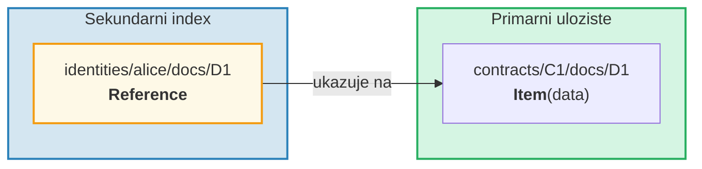
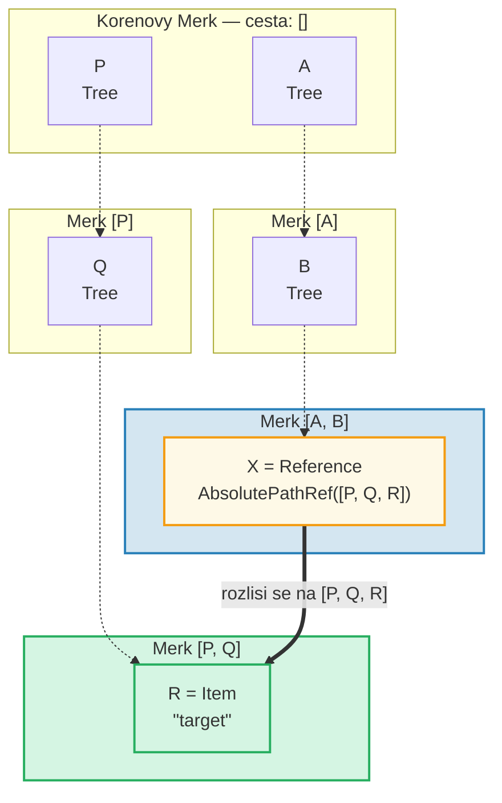
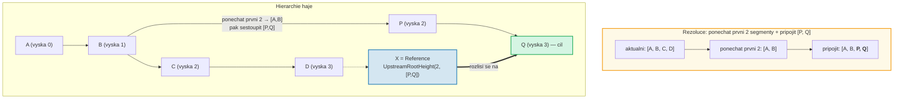
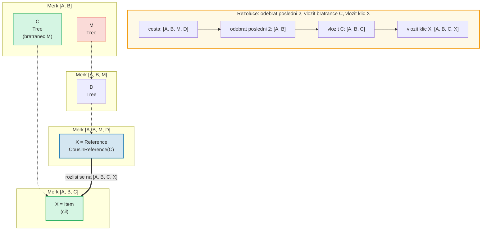
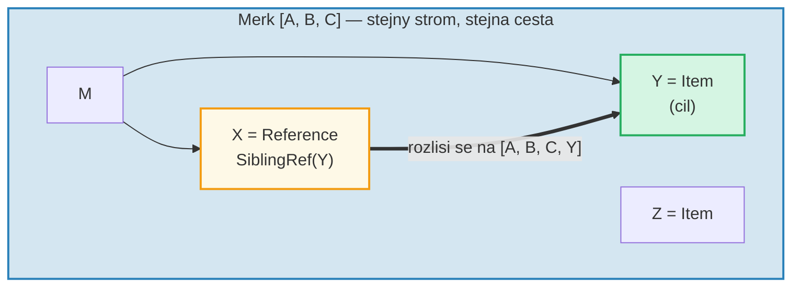
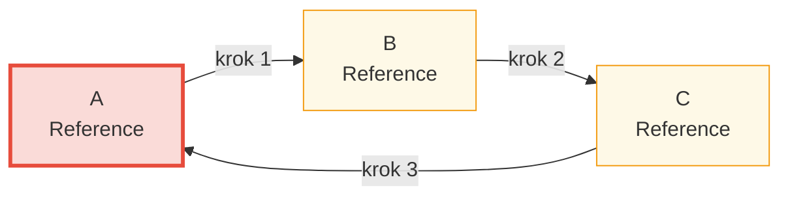

# System referenci

## Proc reference existuji

V hierarchicke databazi casto potrebujete stejna data pristupna z vice cest.
Napriklad dokumenty mohou byt ulozeny pod svym kontraktem, ale take
dotazovatelne podle identity vlastnika. **Reference** jsou odpovedi GroveDB --
jsou to ukazatele z jednoho mista na druhe, podobne symbolicnym odkazu
v souborovem systemu.



Klicove vlastnosti:
- Reference jsou **autentizovane** -- value_hash reference zahrnuje jak
  samotnou referenci, tak referencovany element
- Reference mohou byt **retezene** -- reference muze ukazovat na dalsi referenci
- Detekce cyklu zabranuje nekonecnym smyckam
- Konfigurovatelny limit skoku (hop) zabranuje vycerpani zdroju

## Sedm typu referenci

```rust
// grovedb-element/src/reference_path/mod.rs
pub enum ReferencePathType {
    AbsolutePathReference(Vec<Vec<u8>>),
    UpstreamRootHeightReference(u8, Vec<Vec<u8>>),
    UpstreamRootHeightWithParentPathAdditionReference(u8, Vec<Vec<u8>>),
    UpstreamFromElementHeightReference(u8, Vec<Vec<u8>>),
    CousinReference(Vec<u8>),
    RemovedCousinReference(Vec<Vec<u8>>),
    SiblingReference(Vec<u8>),
}
```

Projdeme si kazdy s diagramy.

### AbsolutePathReference

Nejjednodussi typ. Uklada plnou cestu k cili:



> X uklada uplnou absolutni cestu `[P, Q, R]`. Bez ohledu na to, kde se X nachazi, vzdy se rozlisi na stejny cil.

### UpstreamRootHeightReference

Ponechava prvnich N segmentu aktualni cesty, pote pripoji novou cestu:



### UpstreamRootHeightWithParentPathAdditionReference

Podobne jako UpstreamRootHeight, ale znovu pripoji posledni segment aktualni cesty:

```text
    Reference na ceste [A, B, C, D, E] klic=X
    UpstreamRootHeightWithParentPathAdditionReference(2, [P, Q])

    Aktualni cesta:    [A, B, C, D, E]
    Ponechat prvni 2:  [A, B]
    Pripojit [P, Q]:   [A, B, P, Q]
    Znovu pripojit posledni: [A, B, P, Q, E]   ← "E" z puvodni cesty pridano zpet

    Uzitecne pro: indexy, kde se ma zachovat rodicovsky klic
```

### UpstreamFromElementHeightReference

Zahodí poslednich N segmentu, pote pripoji:

```text
    Reference na ceste [A, B, C, D] klic=X
    UpstreamFromElementHeightReference(1, [P, Q])

    Aktualni cesta:     [A, B, C, D]
    Zahodit posledni 1: [A, B, C]
    Pripojit [P, Q]:    [A, B, C, P, Q]
```

### CousinReference

Nahradi pouze bezprostredniho rodice novym klicem:



> "Bratranec" (cousin) je sourozenecky podstrom prarodice reference. Reference naviguje o dve urovne nahoru, pote sestoupi do bratrancova podstromu.

### RemovedCousinReference

Jako CousinReference, ale nahradi rodice vicesegmentovou cestou:

```text
    Reference na ceste [A, B, C, D] klic=X
    RemovedCousinReference([M, N])

    Aktualni cesta:   [A, B, C, D]
    Odebrat rodice C: [A, B]
    Pripojit [M, N]:  [A, B, M, N]
    Vlozit klic X:    [A, B, M, N, X]
```

### SiblingReference

Nejjednodussi relativni reference -- pouze zmeni klic v ramci stejneho rodice:



> Nejjednodussi typ reference. X a Y jsou sourozenci ve stejnem stromu Merk -- rezoluce pouze zmeni klic pri zachovani stejne cesty.

## Nasledovani referenci a limit skoku

Kdyz GroveDB narazi na element Reference, musi ho **nasledovat** pro nalezeni
skutecne hodnoty. Protoze reference mohou ukazovat na dalsi reference, zahrnuje
to smycku:

```rust
// grovedb/src/reference_path.rs
pub const MAX_REFERENCE_HOPS: usize = 10;

pub fn follow_reference(...) -> CostResult<ResolvedReference, Error> {
    let mut hops_left = MAX_REFERENCE_HOPS;
    let mut visited = HashSet::new();

    while hops_left > 0 {
        // Rezoluce cesty reference na absolutni cestu
        let target_path = current_ref.absolute_qualified_path(...);

        // Kontrola cyklu
        if !visited.insert(target_path.clone()) {
            return Err(Error::CyclicReference);
        }

        // Nacteni elementu na cili
        let element = Element::get(target_path);

        match element {
            Element::Reference(next_ref, ..) => {
                // Stale reference — pokracovat v nasledovani
                current_ref = next_ref;
                hops_left -= 1;
            }
            other => {
                // Nalezen skutecny element!
                return Ok(ResolvedReference { element: other, ... });
            }
        }
    }

    Err(Error::ReferenceLimit)  // Prekroceno 10 skoku
}
```

## Detekce cyklu

`HashSet` `visited` sleduje vsechny cesty, ktere jsme videli. Pokud narazime
na cestu, kterou jsme jiz navstivili, mame cyklus:



> **Sledovani detekce cyklu:**
>
> | Krok | Nasledovat | mnozina visited | Vysledek |
> |------|-----------|-----------------|----------|
> | 1 | Zacatek v A | { A } | A je Ref → nasledovat |
> | 2 | A → B | { A, B } | B je Ref → nasledovat |
> | 3 | B → C | { A, B, C } | C je Ref → nasledovat |
> | 4 | C → A | A jiz v visited! | **Error::CyclicRef** |
>
> Bez detekce cyklu by se to opetovalo donekonecna. `MAX_REFERENCE_HOPS = 10` take omezuje hloubku pruchodu pro dlouhe retezce.

## Reference v Merk -- Kombinovane hashe hodnot

Kdyz je Reference ulozen ve stromu Merk, jeho `value_hash` musi autentizovat
jak strukturu reference, tak referencovana data:

```rust
// merk/src/tree/kv.rs
pub fn update_hashes_using_reference_value_hash(
    mut self,
    reference_value_hash: CryptoHash,
) -> CostContext<Self> {
    // Hash bajtu samotneho elementu reference
    let actual_value_hash = value_hash(self.value_as_slice());

    // Kombinace: H(bajty_reference) ⊕ H(referencovana_data)
    let combined = combine_hash(&actual_value_hash, &reference_value_hash);

    self.value_hash = combined;
    self.hash = kv_digest_to_kv_hash(self.key(), self.value_hash());
    // ...
}
```

To znamena, ze zmena samotne reference NEBO dat, na ktera ukazuje,
zmeni korenovy hash -- obe jsou kryptograficky svazany.

---
