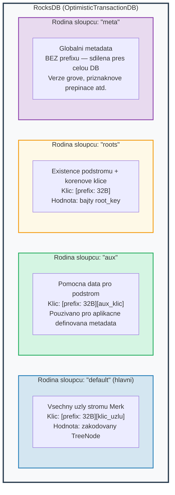
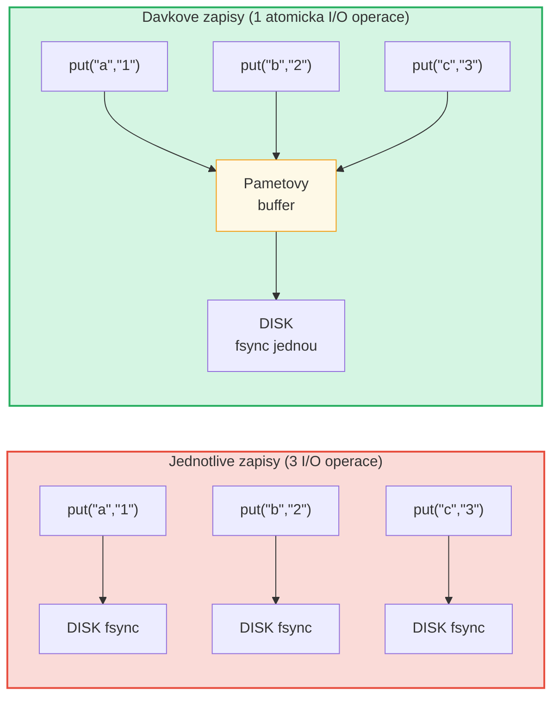

# Vrstva uloziste

## RocksDB s OptimisticTransactionDB

GroveDB pouziva **RocksDB** jako svuj backend uloziste, konkretne variantu
`OptimisticTransactionDB`, ktera podporuje transakce:

```rust
// storage/src/rocksdb_storage/storage.rs
pub(crate) type Db = OptimisticTransactionDB;
pub(crate) type Tx<'db> = Transaction<'db, Db>;

pub struct RocksDbStorage {
    db: OptimisticTransactionDB,
}
```

**Optimisticke transakce** funguji tak, ze predpokladaji, ze k zadnym konfliktum
nedojde. Pokud dve transakce modifikuji stejna data, druha, ktera bude
commitovana, selze a muze byt opakovana. To je efektivnejsi nez pesimisticke
zamykani pro zateze, kde jsou konflikty vzacne.

Nastaveni RocksDB jsou prizpusobena pro zatez GroveDB:

```rust
lazy_static! {
    static ref DEFAULT_OPTS: rocksdb::Options = {
        let mut opts = rocksdb::Options::default();
        opts.create_if_missing(true);
        opts.increase_parallelism(num_cpus::get() as i32);
        opts.set_allow_mmap_writes(true);
        opts.set_allow_mmap_reads(true);
        opts.create_missing_column_families(true);
        opts.set_atomic_flush(true);
        opts
    };
}
```

## Ctyri rodiny sloupcu

Rodiny sloupcu RocksDB funguji jako samostatne jmenne prostory klicu a hodnot
v ramci jedine databaze. GroveDB pouziva ctyri:



> **Priklad:** Klic `[ab3fc2...][6e616d65]` ve vychozi rodine sloupcu mapuje na `TreeNode{key:"name", val:"Al"}`, kde `ab3fc2...` je `Blake3(cesta)` a `6e616d65` je `"name"` v bajtech.

```rust
pub(crate) const AUX_CF_NAME: &str = "aux";
pub(crate) const ROOTS_CF_NAME: &str = "roots";
pub(crate) const META_CF_NAME: &str = "meta";
// Hlavni data pouzivaji vychozi rodinu sloupcu
```

## Prefixovane kontexty uloziste

Kazdy podstrom dostava svuj vlastni **prefixovany kontext uloziste** -- obalovac,
ktery automaticky predrazuje 32-bajtovy prefix Blake3 ke vsem klicum:

```text
    Cesta podstromu: ["identities", "alice"]
    Prefix: Blake3(cesta) = [0xab, 0x3f, 0xc2, ...]  (32 bajtu)

    Kdyz podstrom uklada klic "name" s hodnotou "Alice":

    Klic RocksDB:   [0xab 0x3f 0xc2 ... (32 bajtu) | 0x6e 0x61 0x6d 0x65]
                    \_________prefix________/       \_____"name"_____/

    Hodnota RocksDB: [zakodovany TreeNode s hodnotou "Alice"]
```

Typy kontextu:

```text
    Bez transakce:
    PrefixedRocksDbImmediateStorageContext
    └── Cteni/zapisy primo do DB s prefixem

    S transakcí:
    PrefixedRocksDbTransactionContext
    └── Cteni/zapisy prostrednictvim transakce s prefixem
```

Oba implementuji trait `StorageContext`:

```rust
pub trait StorageContext<'db> {
    fn get(&self, key: &[u8]) -> CostResult<Option<Vec<u8>>, Error>;
    fn get_aux(&self, key: &[u8]) -> CostResult<Option<Vec<u8>>, Error>;
    fn get_root(&self, key: &[u8]) -> CostResult<Option<Vec<u8>>, Error>;
    fn get_meta(&self, key: &[u8]) -> CostResult<Option<Vec<u8>>, Error>;
    fn put(&self, key: &[u8], value: &[u8], ...) -> CostResult<(), Error>;
    fn put_aux(&self, key: &[u8], value: &[u8], ...) -> CostResult<(), Error>;
    fn put_root(&self, key: &[u8], value: &[u8], ...) -> CostResult<(), Error>;
    fn put_meta(&self, key: &[u8], value: &[u8], ...) -> CostResult<(), Error>;
    fn delete(&self, key: &[u8], ...) -> CostResult<(), Error>;
    // ...
}
```

## Davky zapisu a model transakci

Pro vykon GroveDB akumuluje zapisy do davek:



> 3 synchronizace disku vs. 1 synchronizace disku = priblizne 3x rychlejsi. Davkove zapisy jsou take **atomicke** (vse nebo nic).

`StorageBatch` akumuluje operace, ktere se provadi spolecne:

```rust
pub struct StorageBatch {
    operations: RefCell<Vec<AbstractBatchOperation>>,
}
```

## Kriticky vzor commit_local()

Pri pouzivani transakci existuje kriticky vzor, ktery musi byt dodrzovan. Zapisy
v ramci transakce jsou bufferovany -- nejsou viditelne, dokud nejsou commitovany:

```rust
// SPRAVNY vzor:
{
    let tx = db.start_transaction();
    let storage_ctx = db.get_transactional_storage_context(path, &tx);

    storage_ctx.put(key, value);  // Zapisy do bufferu transakce

    drop(storage_ctx);            // Uvolneni vypujcky na tx
    tx.commit_local();            // Proplaveni transakce do DB
}

// NESPRAVNE — data jsou ztracena:
{
    let tx = db.start_transaction();
    let storage_ctx = db.get_transactional_storage_context(path, &tx);

    storage_ctx.put(key, value);  // Zapisy do bufferu transakce

    // tx je zde zahozen bez commit_local()!
    // Vsechny zapisy jsou ZRUSENY!
}
```

To je obzvlaste dulezite, protoze `storage_ctx` si vypujcuje transakci.
Musite zavolat `drop(storage_ctx)` pred tim, nez muzete zavolat `tx.commit_local()`.

---
