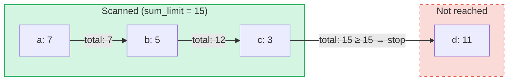

# Aggregierte Summenabfragen

## Uebersicht

Aggregierte Summenabfragen sind ein spezialisierter Abfragetyp, der fuer **SumTrees** in GroveDB entwickelt wurde.
Waehrend regulaere Abfragen Elemente nach Schluessel oder Bereich abrufen, iterieren aggregierte Summenabfragen
ueber Elemente und akkumulieren deren Summenwerte, bis ein **Summenlimit** erreicht ist.

Dies ist nuetzlich fuer Fragen wie:
- "Gib mir Transaktionen, bis die laufende Summe 1000 ueberschreitet"
- "Welche Elemente tragen zu den ersten 500 Werteinheiten in diesem Baum bei?"
- "Sammle Summenelemente bis zu einem Budget von N"

## Kernkonzepte

### Unterschied zu regulaeren Abfragen

| Merkmal | PathQuery | AggregateSumPathQuery |
|---------|-----------|----------------------|
| **Ziel** | Jeder Elementtyp | SumItem / ItemWithSumItem-Elemente |
| **Abbruchbedingung** | Limit (Anzahl) oder Ende des Bereichs | Summenlimit (laufende Summe) **und/oder** Elementlimit |
| **Rueckgabe** | Elemente oder Schluessel | Schluessel-Summenwert-Paare |
| **Unterabfragen** | Ja (Abstieg in Unterbaeume) | Nein (einzelne Baumebene) |
| **Referenzen** | Aufgeloest durch GroveDB-Schicht | Optional verfolgt oder ignoriert |

### Die AggregateSumQuery-Struktur

```rust
pub struct AggregateSumQuery {
    pub items: Vec<QueryItem>,              // Keys or ranges to scan
    pub left_to_right: bool,                // Iteration direction
    pub sum_limit: u64,                     // Stop when running total reaches this
    pub limit_of_items_to_check: Option<u16>, // Max number of matching items to return
}
```

Die Abfrage wird in eine `AggregateSumPathQuery` eingebettet, um anzugeben, wo im Hain gesucht werden soll:

```rust
pub struct AggregateSumPathQuery {
    pub path: Vec<Vec<u8>>,                 // Path to the SumTree
    pub aggregate_sum_query: AggregateSumQuery,
}
```

### Summenlimit — Die laufende Summe

Das `sum_limit` ist das zentrale Konzept. Waehrend Elemente gescannt werden, werden deren Summenwerte
akkumuliert. Sobald die laufende Summe das Summenlimit erreicht oder ueberschreitet, stoppt die Iteration:



> **Ergebnis:** `[(a, 7), (b, 5), (c, 3)]` — die Iteration stoppt, weil 7 + 5 + 3 = 15 >= sum_limit

Negative Summenwerte werden unterstuetzt. Ein negativer Wert erhoeht das verbleibende Budget:

```text
sum_limit = 12, elements: a(10), b(-3), c(5)

a: total = 10, remaining = 2
b: total =  7, remaining = 5  ← negative value gave us more room
c: total = 12, remaining = 0  ← stop

Result: [(a, 10), (b, -3), (c, 5)]
```

## Abfrageoptionen

Die Struktur `AggregateSumQueryOptions` steuert das Abfrageverhalten:

```rust
pub struct AggregateSumQueryOptions {
    pub allow_cache: bool,                              // Use cached reads (default: true)
    pub error_if_intermediate_path_tree_not_present: bool, // Error on missing path (default: true)
    pub error_if_non_sum_item_found: bool,              // Error on non-sum elements (default: true)
    pub ignore_references: bool,                        // Skip references (default: false)
}
```

### Umgang mit Nicht-Summen-Elementen

SumTrees koennen eine Mischung verschiedener Elementtypen enthalten: `SumItem`, `Item`, `Reference`, `ItemWithSumItem`
und andere. Standardmaessig fuehrt das Antreffen eines Nicht-Summen-, Nicht-Referenz-Elements zu einem Fehler.

Wenn `error_if_non_sum_item_found` auf `false` gesetzt ist, werden Nicht-Summen-Elemente **stillschweigend uebersprungen**,
ohne einen Platz im Benutzerlimit zu verbrauchen:

```text
Tree contents: a(SumItem=7), b(Item), c(SumItem=3)
Query: sum_limit=100, limit_of_items_to_check=2, error_if_non_sum_item_found=false

Scan: a(7) → returned, limit=1
      b(Item) → skipped, limit still 1
      c(3) → returned, limit=0 → stop

Result: [(a, 7), (c, 3)]
```

Hinweis: `ItemWithSumItem`-Elemente werden **immer** verarbeitet (nie uebersprungen), da sie einen
Summenwert tragen.

### Referenzbehandlung

Standardmaessig werden `Reference`-Elemente **verfolgt** — die Abfrage loest die Referenzkette
(bis zu 3 Zwischenschritte) auf, um den Summenwert des Zielelements zu finden:

```text
Tree contents: a(SumItem=7), ref_b(Reference → a)
Query: sum_limit=100

ref_b is followed → resolves to a(SumItem=7)

Result: [(a, 7), (ref_b, 7)]
```

Wenn `ignore_references` auf `true` gesetzt ist, werden Referenzen stillschweigend uebersprungen,
ohne einen Limitplatz zu verbrauchen, aehnlich wie Nicht-Summen-Elemente uebersprungen werden.

Referenzketten mit mehr als 3 Zwischenschritten erzeugen einen `ReferenceLimit`-Fehler.

## Der Ergebnistyp

Abfragen geben ein `AggregateSumQueryResult` zurueck:

```rust
pub struct AggregateSumQueryResult {
    pub results: Vec<(Vec<u8>, i64)>,       // Key-sum value pairs
    pub hard_limit_reached: bool,           // True if system limit truncated results
}
```

Das Flag `hard_limit_reached` zeigt an, ob das harte Scan-Limit des Systems (Standard: 1024
Elemente) erreicht wurde, bevor die Abfrage natuerlich abgeschlossen wurde. Wenn `true`, koennen
weitere Ergebnisse ueber das Zurueckgegebene hinaus existieren.

## Zwei Limitsysteme

Aggregierte Summenabfragen haben **drei** Abbruchbedingungen:

| Limit | Quelle | Was gezaehlt wird | Auswirkung bei Erreichen |
|-------|--------|-------------------|--------------------------|
| **sum_limit** | Benutzer (Abfrage) | Laufende Summe der Summenwerte | Stoppt die Iteration |
| **limit_of_items_to_check** | Benutzer (Abfrage) | Zurueckgegebene uebereinstimmende Elemente | Stoppt die Iteration |
| **Hartes Scan-Limit** | System (GroveVersion, Standard 1024) | Alle gescannten Elemente (einschliesslich uebersprungener) | Stoppt die Iteration, setzt `hard_limit_reached` |

Das harte Scan-Limit verhindert eine unbegrenzte Iteration, wenn kein Benutzerlimit gesetzt ist.
Uebersprungene Elemente (Nicht-Summen-Elemente mit `error_if_non_sum_item_found=false` oder Referenzen
mit `ignore_references=true`) zaehlen gegen das harte Scan-Limit, aber **nicht** gegen das
`limit_of_items_to_check` des Benutzers.

## API-Verwendung

### Einfache Abfrage

```rust
use grovedb::AggregateSumPathQuery;
use grovedb_merk::proofs::query::AggregateSumQuery;

// "Give me items from this SumTree until the total reaches 1000"
let query = AggregateSumQuery::new(1000, None);
let path_query = AggregateSumPathQuery {
    path: vec![b"my_tree".to_vec()],
    aggregate_sum_query: query,
};

let result = db.query_aggregate_sums(
    &path_query,
    true,   // allow_cache
    true,   // error_if_intermediate_path_tree_not_present
    None,   // transaction
    grove_version,
).unwrap().expect("query failed");

for (key, sum_value) in &result.results {
    println!("{}: {}", String::from_utf8_lossy(key), sum_value);
}
```

### Abfrage mit Optionen

```rust
use grovedb::{AggregateSumPathQuery, AggregateSumQueryOptions};
use grovedb_merk::proofs::query::AggregateSumQuery;

// Skip non-sum items and ignore references
let query = AggregateSumQuery::new(1000, Some(50));
let path_query = AggregateSumPathQuery {
    path: vec![b"mixed_tree".to_vec()],
    aggregate_sum_query: query,
};

let result = db.query_aggregate_sums_with_options(
    &path_query,
    AggregateSumQueryOptions {
        error_if_non_sum_item_found: false,  // skip Items, Trees, etc.
        ignore_references: true,              // skip References
        ..AggregateSumQueryOptions::default()
    },
    None,
    grove_version,
).unwrap().expect("query failed");

if result.hard_limit_reached {
    println!("Warning: results may be incomplete (hard limit reached)");
}
```

### Schluesselbasierte Abfragen

Anstatt einen Bereich zu scannen, koennen Sie bestimmte Schluessel abfragen:

```rust
// Check the sum value of specific keys
let query = AggregateSumQuery::new_with_keys(
    vec![b"alice".to_vec(), b"bob".to_vec(), b"carol".to_vec()],
    u64::MAX,  // no sum limit
    None,      // no item limit
);
```

### Absteigende Abfragen

Iterieren vom hoechsten Schluessel zum niedrigsten:

```rust
let query = AggregateSumQuery::new_descending(500, Some(10));
// Or: query.left_to_right = false;
```

## Konstruktorreferenz

| Konstruktor | Beschreibung |
|-------------|-------------|
| `new(sum_limit, limit)` | Vollstaendiger Bereich, aufsteigend |
| `new_descending(sum_limit, limit)` | Vollstaendiger Bereich, absteigend |
| `new_single_key(key, sum_limit)` | Einzelschluesselabfrage |
| `new_with_keys(keys, sum_limit, limit)` | Mehrere bestimmte Schluessel |
| `new_with_keys_reversed(keys, sum_limit, limit)` | Mehrere Schluessel, absteigend |
| `new_single_query_item(item, sum_limit, limit)` | Einzelnes QueryItem (Schluessel oder Bereich) |
| `new_with_query_items(items, sum_limit, limit)` | Mehrere QueryItems |

---
