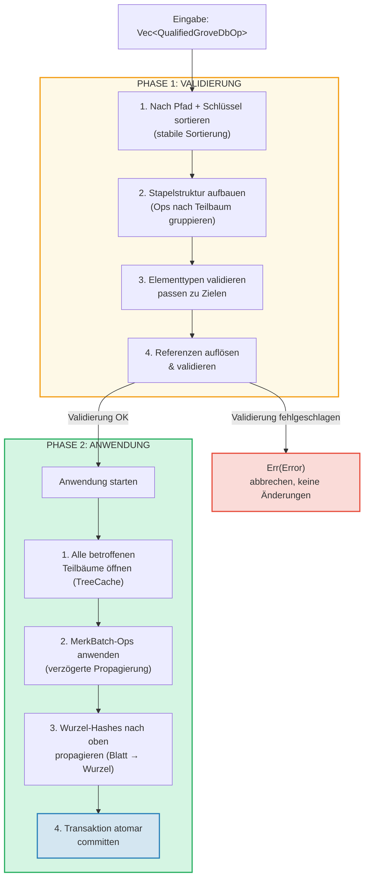
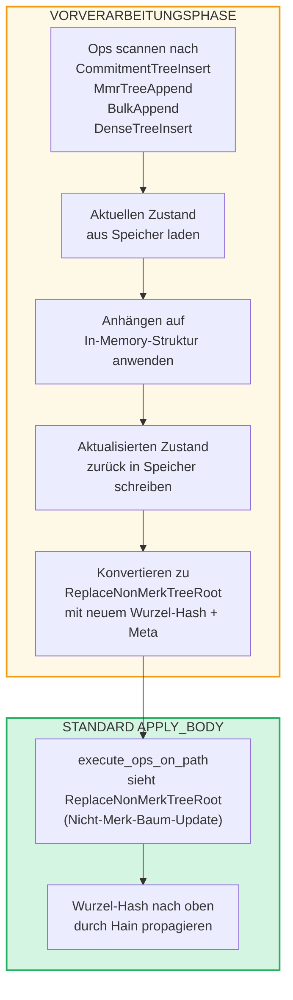

# Stapeloperationen auf Hain-Ebene

## GroveOp-Varianten

Auf GroveDB-Ebene werden Operationen als `GroveOp` dargestellt:

```rust
pub enum GroveOp {
    // Benutzerseitige Operationen:
    InsertOnly { element: Element },
    InsertOrReplace { element: Element },
    Replace { element: Element },
    Patch { element: Element, change_in_bytes: i32 },
    RefreshReference { reference_path_type, max_reference_hop, flags, trust_refresh_reference },
    Delete,
    DeleteTree(TreeType),                          // Parametrisiert nach Baumtyp

    // Nicht-Merk-Baum-Anhängeoperationen (benutzerseitig):
    CommitmentTreeInsert { cmx: [u8; 32], payload: Vec<u8> },
    MmrTreeAppend { value: Vec<u8> },
    BulkAppend { value: Vec<u8> },
    DenseTreeInsert { value: Vec<u8> },

    // Interne Operationen (erzeugt durch Vorverarbeitung/Propagierung, von from_ops abgelehnt):
    ReplaceTreeRootKey { hash, root_key, aggregate_data },
    InsertTreeWithRootHash { hash, root_key, flags, aggregate_data },
    ReplaceNonMerkTreeRoot { hash: [u8; 32], meta: NonMerkTreeMeta },
    InsertNonMerkTree { hash, root_key, flags, aggregate_data, meta: NonMerkTreeMeta },
}
```

**NonMerkTreeMeta** transportiert baumtypspezifischen Zustand durch die Stapelverarbeitung:

```rust
pub enum NonMerkTreeMeta {
    CommitmentTree { total_count: u64, chunk_power: u8 },
    MmrTree { mmr_size: u64 },
    BulkAppendTree { total_count: u64, chunk_power: u8 },
    DenseTree { count: u16, height: u8 },
}
```

Jede Operation wird in ein `QualifiedGroveDbOp` verpackt, das den Pfad enthält:

```rust
pub struct QualifiedGroveDbOp {
    pub path: KeyInfoPath,           // Wo im Hain
    pub key: Option<KeyInfo>,        // Welcher Schlüssel (None für Append-Only-Baum-Ops)
    pub op: GroveOp,                 // Was zu tun ist
}
```

> **Hinweis:** Das `key`-Feld ist `Option<KeyInfo>` — es ist `None` für Append-Only-Baum-
> Operationen (`CommitmentTreeInsert`, `MmrTreeAppend`, `BulkAppend`, `DenseTreeInsert`),
> bei denen der Baumschlüssel stattdessen das letzte Segment von `path` ist.

## Zweiphasen-Verarbeitung

Stapeloperationen werden in zwei Phasen verarbeitet:



## TreeCache und verzögerte Propagierung

Während der Stapelanwendung verwendet GroveDB einen **TreeCache**, um die Wurzel-Hash-
Propagierung aufzuschieben, bis alle Operationen in einem Teilbaum abgeschlossen sind:

```mermaid
graph TD
    subgraph without["OHNE TreeCache (naiv)"]
        w1["Op 1: A in X einfügen"]
        w1p["Propagieren X → Eltern → Wurzel"]
        w2["Op 2: B in X einfügen"]
        w2p["Propagieren X → Eltern → Wurzel"]
        w3["Op 3: C in X einfügen"]
        w3p["Propagieren X → Eltern → Wurzel"]
        w1 --> w1p --> w2 --> w2p --> w3 --> w3p
    end

    subgraph with_tc["MIT TreeCache (verzögert)"]
        t1["Op 1: A in X einfügen<br/>→ gepuffert"]
        t2["Op 2: B in X einfügen<br/>→ gepuffert"]
        t3["Op 3: C in X einfügen<br/>→ gepuffert"]
        tp["Propagieren X → Eltern → Wurzel<br/>(EINMAL nach oben gehen)"]
        t1 --> t2 --> t3 --> tp
    end

    style without fill:#fadbd8,stroke:#e74c3c,stroke-width:2px
    style with_tc fill:#d5f5e3,stroke:#27ae60,stroke-width:2px
    style w1p fill:#fadbd8,stroke:#e74c3c
    style w2p fill:#fadbd8,stroke:#e74c3c
    style w3p fill:#fadbd8,stroke:#e74c3c
    style tp fill:#d5f5e3,stroke:#27ae60,stroke-width:2px
```



> **3 Propagierungen × O(Tiefe)** vs. **1 Propagierung × O(Tiefe)** = 3x schneller für diesen Teilbaum.

Dies ist eine signifikante Optimierung, wenn viele Operationen denselben Teilbaum betreffen.

## Atomare teilbaumübergreifende Operationen

Eine Schlüsseleigenschaft von GroveDB-Stapeln ist **Atomarität über Teilbäume hinweg**. Ein einzelner Stapel
kann Elemente in mehreren Teilbäumen modifizieren, und entweder werden alle Änderungen committed oder keine:

```text
    Stapel:
    1. Delete ["balances", "alice"]       (Saldo entfernen)
    2. Insert ["balances", "bob"] = 100   (Saldo hinzufügen)
    3. Update ["identities", "bob", "rev"] = 2  (Revision aktualisieren)

    Drei betroffene Teilbäume: balances, identities, identities/bob

    Wenn EINE Operation fehlschlägt → ALLE Operationen werden zurückgerollt
    Wenn ALLE erfolgreich → ALLE werden atomar committed
```

Der Stapelprozessor handhabt dies durch:
1. Sammeln aller betroffenen Pfade
2. Öffnen aller benötigten Teilbäume
3. Anwenden aller Operationen
4. Propagieren aller Wurzel-Hashes in Abhängigkeitsreihenfolge
5. Committen der gesamten Transaktion

## Stapelvorverarbeitung für Nicht-Merk-Bäume

CommitmentTree-, MmrTree-, BulkAppendTree- und DenseAppendOnlyFixedSizeTree-Operationen
erfordern Zugriff auf Speicherkontexte außerhalb des Merk, der innerhalb der
Standard-Methode `execute_ops_on_path` nicht verfügbar ist (sie hat nur Zugriff auf den Merk). Diese Operationen
verwenden ein **Vorverarbeitungsmuster**: Vor der Haupt-`apply_body`-Phase scannen die Einstiegspunkte
nach Nicht-Merk-Baum-Ops und konvertieren sie in Standard-interne Ops.

```rust
pub enum GroveOp {
    // ... Standard-Ops ...

    // Nicht-Merk-Baum-Operationen (benutzerseitig):
    CommitmentTreeInsert { cmx: [u8; 32], payload: Vec<u8> },
    MmrTreeAppend { value: Vec<u8> },
    BulkAppend { value: Vec<u8> },
    DenseTreeInsert { value: Vec<u8> },

    // Interne Ops (durch Vorverarbeitung erzeugt):
    ReplaceNonMerkTreeRoot { hash: [u8; 32], meta: NonMerkTreeMeta },
}
```



**Warum Vorverarbeitung?** Die `execute_ops_on_path`-Funktion operiert auf einem einzelnen
Merk-Teilbaum und hat keinen Zugriff auf `self.db` oder breitere Speicherkontexte.
Die Vorverarbeitung in den Einstiegspunkten (`apply_batch_with_element_flags_update`,
`apply_partial_batch_with_element_flags_update`) hat vollen Zugriff auf die Datenbank,
kann also Daten laden/speichern und dann ein einfaches `ReplaceNonMerkTreeRoot`
an die Standard-Stapelmaschinerie übergeben.

Jede Vorverarbeitungsmethode folgt dem gleichen Muster:
1. **`preprocess_commitment_tree_ops`** — Lädt Frontier und BulkAppendTree aus dem
   Datenspeicher, hängt an beide an, speichert zurück, konvertiert zu `ReplaceNonMerkTreeRoot`
   mit aktualisierter kombinierter Wurzel und `CommitmentTree { total_count, chunk_power }`-Meta
2. **`preprocess_mmr_tree_ops`** — Lädt MMR aus dem Datenspeicher, hängt Werte an,
   speichert zurück, konvertiert zu `ReplaceNonMerkTreeRoot` mit aktualisierter MMR-Wurzel
   und `MmrTree { mmr_size }`-Meta
3. **`preprocess_bulk_append_ops`** — Lädt BulkAppendTree aus dem Datenspeicher,
   hängt Werte an (kann Chunk-Kompaktierung auslösen), speichert zurück, konvertiert zu
   `ReplaceNonMerkTreeRoot` mit aktualisierter Zustandswurzel und `BulkAppendTree { total_count, chunk_power }`-Meta
4. **`preprocess_dense_tree_ops`** — Lädt DenseFixedSizedMerkleTree aus dem Datenspeicher,
   fügt Werte sequentiell ein, berechnet Wurzel-Hash neu, speichert zurück,
   konvertiert zu `ReplaceNonMerkTreeRoot` mit aktualisiertem Wurzel-Hash und `DenseTree { count, height }`-Meta

Die `ReplaceNonMerkTreeRoot`-Op transportiert den neuen Wurzel-Hash und eine `NonMerkTreeMeta`-Aufzählung,
sodass das Element nach der Verarbeitung vollständig rekonstruiert werden kann.

---
