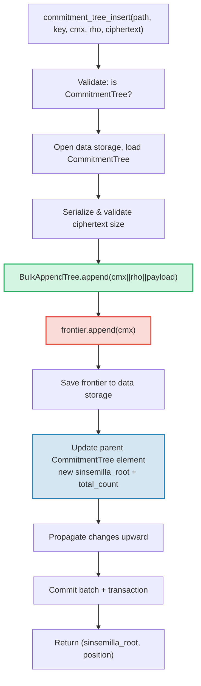

# Der CommitmentTree — Sinsemilla-Verpflichtungsanker

Der **CommitmentTree** ist GroveDBs Brücke zwischen authentifiziertem Speicher und
Zero-Knowledge-Beweissystemen. Er kombiniert einen **BulkAppendTree** (Kapitel 14)
für effiziente chunk-kompaktierte Datenspeicherung mit einer **Sinsemilla-Frontier**
im Daten-Namensraum für ZK-kompatible Anker. Wie MmrTree und BulkAppendTree hat er
**keinen Kind-Merk** — der kombinierte Wurzel-Hash fließt als Merk-Kind-Hash.
Sowohl die BulkAppendTree-Einträge als auch die Sinsemilla-Frontier befinden sich
im **Daten-Namensraum**.

Dieses Kapitel behandelt die Sinsemilla-Hash-Funktion und warum sie für
Zero-Knowledge-Schaltkreise wichtig ist, die Frontier-Datenstruktur und ihre kompakte
Serialisierung, die Dual-Namensraum-Speicherarchitektur, die GroveDB-Operationen,
die Stapelvorverarbeitung, die clientseitige Zeugenerzeugung und wie Beweise funktionieren.

## Warum ein ZK-freundlicher Baum?

GroveDBs Standardbäume verwenden Blake3-Hashing. Blake3 ist schnell in Software, aber
**teuer innerhalb von Zero-Knowledge-Schaltkreisen**. Wenn ein Ausgeber beweisen muss,
dass „ich eine Note an Position P im Commitment-Baum kenne", ohne P zu offenbaren, muss
er die Merkle-Hash-Funktion 32 Mal (einmal pro Baumebene) innerhalb eines ZK-Schaltkreises
auswerten.

Sinsemilla (spezifiziert in ZIP-244 für das Zcash-Orchard-Protokoll) ist genau für
diesen Anwendungsfall konzipiert — es bietet **effizientes In-Circuit-Hashing** über
der Pallas-Elliptischen-Kurve, einer Hälfte des Pasta-Kurvenzyklus, der vom Halo-2-
Beweissystem verwendet wird.

| Eigenschaft | Blake3 | Sinsemilla |
|----------|--------|------------|
| **Schaltkreis-Kosten** | ~25.000 Beschränkungen pro Hash | ~800 Beschränkungen pro Hash |
| **Software-Geschwindigkeit** | Sehr schnell (~2 GB/s) | Langsam (~10.000 Hashes/s) |
| **Algebraische Struktur** | Keine (bitweise) | Pallas-Kurven-Punktoperationen |
| **Primärer Zweck** | Allgemeines Hashing, Merkle-Bäume | In-Circuit-Merkle-Beweise |
| **Verwendet von** | GroveDB-Merk-Bäume, MMR, Bulk | Orchard-Shielded-Protokoll |
| **Ausgabegröße** | 32 Bytes | 32 Bytes (Pallas-Feldelement) |

Der CommitmentTree verwendet Sinsemilla für den Merkle-Baum, über den ZK-Schaltkreise
argumentieren, während er weiterhin Blake3 für die darüberliegende GroveDB-Merk-Hierarchie
verwendet. Elemente, die in den Baum eingefügt werden, werden über einen BulkAppendTree
im Daten-Namensraum gespeichert (chunk-kompaktiert, per Position abrufbar) und gleichzeitig
an die Sinsemilla-Frontier angehängt (wodurch ein ZK-beweisbarer Anker erzeugt wird).

## Die Daten-Namensraum-Architektur

Der CommitmentTree speichert **alle Daten im Daten-Namensraum** unter demselben
Teilbaum-Pfad. Wie MmrTree und BulkAppendTree hat er **keinen Kind-Merk** (kein
`root_key`-Feld — die typspezifische Wurzel fließt als Merk-Kind-Hash). Die
BulkAppendTree-Einträge und die Sinsemilla-Frontier koexistieren im Daten-Namensraum
mit unterschiedlichen Schlüsselpräfixen:

```text
┌──────────────────────────────────────────────────────────────┐
│                       CommitmentTree                          │
│                                                               │
│  ┌─────────────────────────────────────────────────────────┐  │
│  │  Data Namespace                                         │  │
│  │                                                         │  │
│  │  BulkAppendTree storage (Chapter 14):                   │  │
│  │    Buffer entries → chunk blobs → chunk MMR             │  │
│  │    value = cmx (32) || rho (32) || ciphertext (216)     │  │
│  │                                                         │  │
│  │  Sinsemilla Frontier (~1KB):                            │  │
│  │    key: b"__ct_data__" (COMMITMENT_TREE_DATA_KEY)       │  │
│  │    Depth-32 incremental Merkle tree                     │  │
│  │    Stores only the rightmost path (leaf + ommers)       │  │
│  │    O(1) append, O(1) root computation                   │  │
│  │    Produces Orchard-compatible Anchor for ZK proofs     │  │
│  └─────────────────────────────────────────────────────────┘  │
│                                                               │
│  sinsemilla_root embedded in Element bytes                    │
│    → flows through Merk value_hash → GroveDB state root      │
└──────────────────────────────────────────────────────────────┘
```

**Warum zwei Strukturen?** Der BulkAppendTree bietet effiziente, chunk-kompaktierte
Speicherung und Abruf für potenziell Millionen verschlüsselter Noten. Die
Sinsemilla-Frontier liefert ZK-kompatible Anker, die innerhalb eines Halo-2-Schaltkreises
bewiesen werden können. Beide werden bei jedem Anhängen synchron aktualisiert.

Vergleich mit den anderen nicht-standardmäßigen Baumtypen:

| | CommitmentTree | MmrTree | BulkAppendTree |
|---|---|---|---|
| **Kind-Merk** | Nein | Nein | Nein |
| **Daten-Namensraum** | BulkAppendTree-Einträge + Frontier | MMR-Knoten | Puffer + Chunks + MMR |
| **Aux-Namensraum** | — | — | — |
| **Elemente abfragbar** | Über V1-Beweise | Über V1-Beweise | Über V1-Beweise |
| **Hash-Funktion** | Sinsemilla + Blake3 | Blake3 | Blake3 |

## Die Sinsemilla-Frontier

Die Frontier ist ein inkrementeller Merkle-Baum der Tiefe 32, implementiert durch den
`Frontier<MerkleHashOrchard, 32>`-Typ des `incrementalmerkletree`-Crates. Statt alle
2^32 möglichen Blätter zu speichern, speichert sie nur die Information, die benötigt wird,
um **das nächste Blatt anzuhängen und die aktuelle Wurzel zu berechnen**: das rechteste
Blatt und seine Ommers (Geschwister-Hashes, die für die Wurzelberechnung benötigt werden).

```text
                         root (level 32)
                        /               \
                      ...               ...
                     /                     \
                  (level 2)             (level 2)
                  /     \               /     \
              (level 1) (level 1)   (level 1)  ?
              /    \    /    \      /    \
             L0    L1  L2    L3   L4    ?     ← frontier stores L4
                                              + ommers at levels
                                              where left sibling exists
```

Die Frontier speichert:
- **leaf**: den zuletzt angehängten Wert (ein Pallas-Feldelement)
- **ommers**: die linken Geschwister-Hashes auf jeder Ebene, wo der Frontier-Pfad
  nach rechts geht (höchstens 32 Ommers für einen Baum der Tiefe 32)
- **position**: die 0-indexierte Position des Blatts

Schlüsseleigenschaften:
- **O(1) Anhängen**: neues Blatt einfügen, Ommers aktualisieren, Wurzel neu berechnen
- **O(1) Wurzel**: die gespeicherten Ommers vom Blatt zur Wurzel durchlaufen
- **~1KB konstante Größe**: unabhängig davon, wie viele Blätter angehängt wurden
- **Deterministisch**: zwei Frontiers mit derselben Sequenz von Anhängen erzeugen
  dieselbe Wurzel

Die Konstante `EMPTY_SINSEMILLA_ROOT` ist die Wurzel eines leeren Tiefe-32-Baums,
vorberechnet als `MerkleHashOrchard::empty_root(Level::from(32)).to_bytes()`:

```text
0xae2935f1dfd8a24aed7c70df7de3a668eb7a49b1319880dde2bbd9031ae5d82f
```

## Wie das Anhängen funktioniert — Die Ommer-Kaskade

Wenn eine neue Verpflichtung an Position N angehängt wird, entspricht die Anzahl der
zu aktualisierenden Ommers `trailing_ones(N)` — der Anzahl der nachfolgenden 1-Bits
in der Binärdarstellung von N. Dies ist dasselbe Muster wie die MMR-Verschmelzungskaskade
(§13.4), arbeitet aber auf Ommers statt auf Spitzen.

**Durchgerechnetes Beispiel — Anhängen von 4 Blättern:**

```text
Position 0 (binary: 0, trailing_ones: 0):
  frontier = { leaf: L0, ommers: [], position: 0 }
  Sinsemilla hashes: 32 (root computation) + 0 (no ommer merges) = 32

Position 1 (binary: 1, trailing_ones: 0 of PREVIOUS position 0):
  Before: position 0 has trailing_ones = 0
  frontier = { leaf: L1, ommers: [H(L0,L1) at level 1], position: 1 }
  Sinsemilla hashes: 32 + 0 = 32

Position 2 (binary: 10, trailing_ones: 0 of PREVIOUS position 1):
  Before: position 1 has trailing_ones = 1
  frontier = { leaf: L2, ommers: [level1_hash], position: 2 }
  Sinsemilla hashes: 32 + 1 = 33

Position 3 (binary: 11, trailing_ones: 0 of PREVIOUS position 2):
  Before: position 2 has trailing_ones = 0
  frontier = { leaf: L3, ommers: [level1_hash, level2_hash], position: 3 }
  Sinsemilla hashes: 32 + 0 = 32
```

Die **gesamten Sinsemilla-Hashes** pro Anhängen betragen:

```text
32 (root computation always traverses all 32 levels)
+ trailing_ones(current_position)  (ommer cascade)
```

Im Durchschnitt beträgt `trailing_ones` ~1 (geometrische Verteilung), sodass die
durchschnittlichen Kosten **~33 Sinsemilla-Hashes pro Anhängen** betragen. Der schlimmste
Fall (an Position 2^32 - 1, wo alle Bits 1 sind) beträgt **64 Hashes**.

## Das Frontier-Serialisierungsformat

Die Frontier wird im Datenspeicher unter dem Schlüssel `b"__ct_data__"` gespeichert.
Das Drahtformat ist:

```text
┌──────────────────────────────────────────────────────────────────┐
│ has_frontier: u8                                                  │
│   0x00 → empty tree (no more fields)                             │
│   0x01 → non-empty (fields follow)                               │
├──────────────────────────────────────────────────────────────────┤
│ position: u64 BE (8 bytes)      — 0-indexed leaf position        │
├──────────────────────────────────────────────────────────────────┤
│ leaf: [u8; 32]                  — Pallas field element bytes     │
├──────────────────────────────────────────────────────────────────┤
│ ommer_count: u8                 — number of ommers (0..=32)      │
├──────────────────────────────────────────────────────────────────┤
│ ommers: [ommer_count × 32 bytes] — Pallas field elements        │
└──────────────────────────────────────────────────────────────────┘
```

**Größenanalyse:**

| Zustand | Größe | Aufschlüsselung |
|-------|------|-----------|
| Leer | 1 Byte | Nur `0x00`-Flag |
| 1 Blatt, 0 Ommers | 42 Bytes | 1 + 8 + 32 + 1 |
| ~16 Ommers (Durchschnitt) | 554 Bytes | 1 + 8 + 32 + 1 + 16×32 |
| 32 Ommers (Maximum) | 1.066 Bytes | 1 + 8 + 32 + 1 + 32×32 |

Die Frontier-Größe ist unabhängig davon, wie viele Millionen Verpflichtungen angehängt
wurden, auf ~1,1KB begrenzt. Dies macht den Lade-Ändern-Speichern-Zyklus sehr
günstig (1 Zugriff zum Lesen, 1 Zugriff zum Schreiben).

## Element-Darstellung

```rust
CommitmentTree(
    u64,                  // total_count: number of appended items
    u8,                   // chunk_power: dense tree height for BulkAppendTree buffer
    Option<ElementFlags>, // flags: optional metadata
)
```

Der `chunk_power`-Parameter steuert die Höhe des dichten Baums im BulkAppendTree-Puffer;
`chunk_power` muss im Bereich 1..=16 liegen (siehe §14.1 und §16).

**Typkennungen:**

| Kennung | Wert |
|---|---|
| Element-Diskriminante | 11 |
| `TreeType` | `CommitmentTree = 7` |
| `ElementType` | 11 |
| `COMMITMENT_TREE_COST_SIZE` | 12 Bytes (8 total_count + 1 chunk_power + 1 Diskriminante + 2 Overhead) |

Die Sinsemilla-Wurzel wird NICHT im Element gespeichert. Sie fließt als Merk-Kind-Hash
durch den `insert_subtree`-Mechanismus. Wenn der übergeordnete Merk seinen
`combined_value_hash` berechnet, wird die Sinsemilla-abgeleitete Wurzel als Kind-Hash
einbezogen:

```text
combined_value_hash = blake3(value_hash || child_hash)
                                           ↑ sinsemilla/BulkAppendTree combined root
```

Das bedeutet, dass jede Änderung an der Sinsemilla-Frontier automatisch durch die
GroveDB-Merk-Hierarchie zur Zustandswurzel propagiert.

**Konstruktor-Methoden:**

| Methode | Erstellt |
|---|---|
| `Element::empty_commitment_tree(chunk_power)` | Leerer Baum, count=0, keine Flags |
| `Element::empty_commitment_tree_with_flags(chunk_power, flags)` | Leerer Baum mit Flags |
| `Element::new_commitment_tree(total_count, chunk_power, flags)` | Alle Felder explizit |

## Speicherarchitektur

Der CommitmentTree speichert alle seine Daten in einem einzelnen **Daten-Namensraum**
am Teilbaum-Pfad. BulkAppendTree-Einträge und die Sinsemilla-Frontier koexistieren
in derselben Spalte mit unterschiedlichen Schlüsselpräfixen. Kein Aux-Namensraum wird
verwendet.

```text
┌──────────────────────────────────────────────────────────────────┐
│  Data Namespace (all CommitmentTree storage)                      │
│                                                                   │
│  BulkAppendTree storage keys (see §14.7):                         │
│    b"m" || pos (u64 BE)  → MMR node blobs                        │
│    b"b" || index (u64 BE)→ buffer entries (cmx || rho || ciphertext) │
│    b"e" || chunk (u64 BE)→ chunk blobs (compacted buffer)         │
│    b"M"                  → BulkAppendTree metadata                │
│                                                                   │
│  Sinsemilla frontier:                                             │
│    b"__ct_data__"        → serialized CommitmentFrontier (~1KB)   │
│                                                                   │
│  No Merk nodes — this is a non-Merk tree.                         │
│  Data authenticated via BulkAppendTree state_root (Blake3).       │
│  Sinsemilla root authenticates all cmx values via Pallas curve.   │
└──────────────────────────────────────────────────────────────────┘
```

**Das Lade-Ändern-Speichern-Muster**: Jede mutierende Operation lädt die Frontier
aus dem Datenspeicher, modifiziert sie im Speicher und schreibt sie zurück. Da die
Frontier höchstens ~1KB groß ist, handelt es sich um ein günstiges Paar von I/O-Operationen
(1 Zugriff zum Lesen, 1 Zugriff zum Schreiben). Gleichzeitig wird der BulkAppendTree
geladen, angehängt und gespeichert.

**Wurzel-Hash-Propagierung**: Wenn ein Element eingefügt wird, ändern sich zwei Dinge:
1. Der BulkAppendTree-Zustand ändert sich (neuer Eintrag im Puffer oder Chunk-Kompaktierung)
2. Die Sinsemilla-Wurzel ändert sich (neue Verpflichtung in der Frontier)

Beides wird im aktualisierten `CommitmentTree`-Element erfasst. Der Hash des
übergeordneten Merk-Knotens wird:

```text
combined_hash = combine_hash(
    value_hash(element_bytes),    ← includes total_count + chunk_power
    child_hash(combined_root)     ← sinsemilla/BulkAppendTree combined root
)
```

Wie bei MmrTree und BulkAppendTree fließt die typspezifische Wurzel als Merk-Kind-Hash.
Alle Datenauthentifizierung läuft über diese Kind-Hash-Bindung.

**Nicht-Merk-Datenspeicher-Implikationen**: Da der Daten-Namensraum BulkAppendTree-Schlüssel
enthält (keine Merk-Knoten), müssen Operationen, die den Speicher als Merk-Elemente
durchlaufen — wie `find_subtrees`, `is_empty_tree` und `verify_merk_and_submerks` — den
CommitmentTree (und andere Nicht-Merk-Baumtypen) als Sonderfall behandeln. Der
`uses_non_merk_data_storage()`-Helfer auf sowohl `Element` als auch `TreeType` identifiziert
diese Baumtypen. Löschoperationen leeren den Daten-Namensraum direkt, anstatt ihn zu
durchlaufen, und verify_grovedb überspringt die Sub-Merk-Rekursion für diese Typen.

## GroveDB-Operationen

Der CommitmentTree bietet vier Operationen. Die Einfüge-Operation ist generisch über
`M: MemoSize` (aus dem `orchard`-Crate), das die Validierung der Chiffretext-Nutzlastgröße
steuert. Der Standard `M = DashMemo` ergibt eine 216-Byte-Nutzlast
(32 epk + 104 enc + 80 out).

```rust
// Insert a commitment (typed) — returns (sinsemilla_root, position)
// M controls ciphertext size validation
db.commitment_tree_insert::<_, _, M>(path, key, cmx, rho, ciphertext, tx, version)

// Insert a commitment (raw bytes) — validates payload.len() == ciphertext_payload_size::<DashMemo>()
db.commitment_tree_insert_raw(path, key, cmx, rho, payload_vec, tx, version)

// Get the current Orchard Anchor
db.commitment_tree_anchor(path, key, tx, version)

// Retrieve a value by global position
db.commitment_tree_get_value(path, key, position, tx, version)

// Get the current item count
db.commitment_tree_count(path, key, tx, version)
```

Die typisierte `commitment_tree_insert` akzeptiert einen `TransmittedNoteCiphertext<M>` und
serialisiert ihn intern. Die rohe `commitment_tree_insert_raw` (pub(crate)) akzeptiert
`Vec<u8>` und wird von der Stapelvorverarbeitung verwendet, wo Nutzlasten bereits
serialisiert sind.

### commitment_tree_insert

Die Einfüge-Operation aktualisiert sowohl den BulkAppendTree als auch die
Sinsemilla-Frontier in einer einzigen atomaren Operation:

```text
Step 1: Validate element at path/key is a CommitmentTree
        → extract total_count, chunk_power, flags

Step 2: Build ct_path = path ++ [key]

Step 3: Open data storage context at ct_path
        Load CommitmentTree (frontier + BulkAppendTree)
        Serialize ciphertext → validate payload size matches M
        Append cmx||rho||ciphertext to BulkAppendTree
        Append cmx to Sinsemilla frontier → get new sinsemilla_root
        Track Blake3 + Sinsemilla hash costs

Step 4: Save updated frontier to data storage

Step 5: Open parent Merk at path
        Write updated CommitmentTree element:
          new total_count, same chunk_power, same flags
        Child hash = combined_root (sinsemilla + bulk state)

Step 6: Propagate changes from parent upward through Merk hierarchy

Step 7: Commit storage batch and local transaction
        Return (sinsemilla_root, position)
```



> **Rot** = Sinsemilla-Operationen. **Grün** = BulkAppendTree-Operationen.
> **Blau** = Element-Update, das beide verbindet.

### commitment_tree_anchor

Die Anker-Operation ist eine reine Leseabfrage:

```text
Step 1: Validate element at path/key is a CommitmentTree
Step 2: Build ct_path = path ++ [key]
Step 3: Load frontier from data storage
Step 4: Return frontier.anchor() as orchard::tree::Anchor
```

Der `Anchor`-Typ ist die Orchard-native Darstellung der Sinsemilla-Wurzel,
die direkt an `orchard::builder::Builder` übergeben werden kann, wenn
Ausgabe-Autorisierungsbeweise erstellt werden.

### commitment_tree_get_value

Ruft einen gespeicherten Wert (cmx || rho || Nutzlast) über seine globale Position ab:

```text
Step 1: Validate element at path/key is a CommitmentTree
        → extract total_count, chunk_power
Step 2: Build ct_path = path ++ [key]
Step 3: Open data storage context, wrap in CachedBulkStore
Step 4: Load BulkAppendTree, call get_value(position)
Step 5: Return Option<Vec<u8>>
```

Dies folgt demselben Muster wie `bulk_get_value` (§14.9) — der BulkAppendTree
ruft transparent aus dem Puffer oder einem kompaktierten Chunk-Blob ab, je nachdem,
wo die Position liegt.

### commitment_tree_count

Gibt die Gesamtanzahl der an den Baum angehängten Elemente zurück:

```text
Step 1: Read element at path/key
Step 2: Verify it is a CommitmentTree
Step 3: Return total_count from element fields
```

Dies ist ein einfaches Lesen eines Element-Felds — kein Speicherzugriff über den
übergeordneten Merk hinaus.

## Stapeloperationen

Der CommitmentTree unterstützt Stapeleinfügungen über die
`GroveOp::CommitmentTreeInsert`-Variante:

```rust
GroveOp::CommitmentTreeInsert {
    cmx: [u8; 32],      // extracted note commitment
    rho: [u8; 32],      // nullifier of the spent note
    payload: Vec<u8>,    // serialized ciphertext (216 bytes for DashMemo)
}
```

Zwei Konstruktoren erstellen diese Op:

```rust
// Raw constructor — caller serializes payload manually
QualifiedGroveDbOp::commitment_tree_insert_op(path, cmx, rho, payload_vec)

// Typed constructor — serializes TransmittedNoteCiphertext<M> internally
QualifiedGroveDbOp::commitment_tree_insert_op_typed::<M>(path, cmx, rho, &ciphertext)
```

Mehrere Einfügungen, die denselben Baum betreffen, sind in einem einzelnen Stapel erlaubt.
Da `execute_ops_on_path` keinen Zugriff auf den Datenspeicher hat, müssen alle
CommitmentTree-Ops vor `apply_body` vorverarbeitet werden.

**Die Vorverarbeitungspipeline** (`preprocess_commitment_tree_ops`):

```text
Input: [CTInsert{cmx1}, Insert{...}, CTInsert{cmx2}, CTInsert{cmx3}]
                                       ↑ same (path,key) as cmx1

Step 1: Group CommitmentTreeInsert ops by (path, key)
        group_1: [cmx1, cmx2, cmx3]

Step 2: For each group:
        a. Read existing element → verify CommitmentTree, extract chunk_power
        b. Open transactional storage context at ct_path
        c. Load CommitmentTree from data storage (frontier + BulkAppendTree)
        d. For each (cmx, rho, payload):
           - ct.append_raw(cmx, rho, payload) — validates size, appends to both
        e. Save updated frontier to data storage

Step 3: Replace all CTInsert ops with one ReplaceNonMerkTreeRoot per group
        carrying: hash=bulk_state_root (combined root),
                  meta=NonMerkTreeMeta::CommitmentTree {
                      total_count: new_count,
                      chunk_power,
                  }

Output: [ReplaceNonMerkTreeRoot{...}, Insert{...}]
```

Die erste CommitmentTreeInsert-Op in jeder Gruppe wird durch
`ReplaceNonMerkTreeRoot` ersetzt; nachfolgende Ops für denselben (path, key) werden
verworfen. Die Standard-Stapelmaschinerie übernimmt dann die Element-Aktualisierung
und Wurzel-Hash-Propagierung.

## MemoSize-Generik und Chiffretext-Verarbeitung

Die `CommitmentTree<S, M>`-Struktur ist generisch über `M: MemoSize` (aus dem
`orchard`-Crate). Dies steuert die Größe der verschlüsselten Noten-Chiffretexte,
die neben jeder Verpflichtung gespeichert werden.

```rust
pub struct CommitmentTree<S, M: MemoSize = DashMemo> {
    frontier: CommitmentFrontier,
    pub bulk_tree: BulkAppendTree<S>,
    _memo: PhantomData<M>,
}
```

Der Standard `M = DashMemo` bedeutet, dass bestehender Code, der sich nicht für die
Memo-Größe interessiert (wie `verify_grovedb`, `commitment_tree_anchor`,
`commitment_tree_count`), ohne Angabe von `M` funktioniert.

**Serialisierungshelfer** (öffentliche freie Funktionen):

| Funktion | Beschreibung |
|----------|-------------|
| `ciphertext_payload_size::<M>()` | Erwartete Nutzlastgröße für eine gegebene `MemoSize` |
| `serialize_ciphertext::<M>(ct)` | `TransmittedNoteCiphertext<M>` in Bytes serialisieren |
| `deserialize_ciphertext::<M>(data)` | Bytes zurück in `TransmittedNoteCiphertext<M>` deserialisieren |

**Nutzlast-Validierung**: Die `append_raw()`-Methode validiert, dass
`payload.len() == ciphertext_payload_size::<M>()` gilt und gibt bei Nichtübereinstimmung
`CommitmentTreeError::InvalidPayloadSize` zurück. Die typisierte `append()`-Methode
serialisiert intern, sodass die Größe konstruktionsbedingt immer korrekt ist.

### Gespeichertes Datensatz-Layout (280 Bytes für DashMemo)

Jeder Eintrag im BulkAppendTree speichert den vollständigen verschlüsselten Notendatensatz.
Das vollständige Layout, Byte für Byte:

```text
┌─────────────────────────────────────────────────────────────────────┐
│  Offset   Size   Field                                              │
├─────────────────────────────────────────────────────────────────────┤
│  0        32     cmx — extracted note commitment (Pallas base field)│
│  32       32     rho — nullifier of the spent note                  │
│  64       32     epk_bytes — ephemeral public key (Pallas point)    │
│  96       104    enc_ciphertext — encrypted note plaintext + MAC    │
│  200      80     out_ciphertext — encrypted outgoing data + MAC     │
├─────────────────────────────────────────────────────────────────────┤
│  Total:   280 bytes                                                 │
└─────────────────────────────────────────────────────────────────────┘
```

Die ersten beiden Felder (`cmx` und `rho`) sind **unverschlüsselte Protokollfelder** —
sie sind konstruktionsbedingt öffentlich. Die verbleibenden drei Felder (`epk_bytes`,
`enc_ciphertext`, `out_ciphertext`) bilden den `TransmittedNoteCiphertext` und
sind die verschlüsselte Nutzlast.

### Feld-für-Feld-Aufschlüsselung

**cmx (32 Bytes)** — Das extrahierte Noten-Commitment, ein Pallas-Basiskörperelement.
Dies ist der Blattwert, der an die Sinsemilla-Frontier angehängt wird. Er bindet sich
an alle Notenfelder (Empfänger, Wert, Zufälligkeit), ohne sie zu offenbaren.
Das cmx ist das, was die Note im Commitment-Baum „auffindbar" macht.

**rho (32 Bytes)** — Der Nullifier der Note, die in dieser Aktion ausgegeben wird.
Nullifier sind bereits öffentlich auf der Blockchain (sie müssen es sein, um
Doppelausgaben zu verhindern). Das Speichern von `rho` neben dem Commitment ermöglicht
es Light Clients bei der Probeentschlüsselung, `esk = PRF(rseed, rho)` zu verifizieren
und `epk' == epk` zu bestätigen, ohne eine separate Nullifier-Suche. Dieses Feld sitzt
zwischen `cmx` und dem Chiffretext als unverschlüsselte Protokollebenen-Assoziation.

**epk_bytes (32 Bytes)** — Der ephemere öffentliche Schlüssel, ein serialisierter
Pallas-Kurvenpunkt. Deterministisch aus dem `rseed` der Note abgeleitet über:

```text
rseed → esk = ToScalar(PRF^expand(rseed, [4] || rho))
esk   → epk = [esk] * g_d     (scalar multiplication on Pallas)
epk   → epk_bytes = Serialize(epk)
```

wobei `g_d = DiversifyHash(d)` der diversifizierte Basispunkt für den Diversifier
des Empfängers ist. Der `epk` ermöglicht es dem Empfänger, das gemeinsame Geheimnis
für die Entschlüsselung zu berechnen: `shared_secret = [ivk] * epk`. Er wird im
Klartext übertragen, da er ohne Kenntnis von `esk` oder `ivk` nichts über Sender
oder Empfänger verrät.

**enc_ciphertext (104 Bytes für DashMemo)** — Der verschlüsselte Noten-Klartext,
erzeugt durch ChaCha20-Poly1305-AEAD-Verschlüsselung:

```text
enc_ciphertext = ChaCha20-Poly1305.Encrypt(key, nonce=[0;12], aad=[], plaintext)
               = ciphertext (88 bytes) || MAC tag (16 bytes) = 104 bytes
```

Der symmetrische Schlüssel wird über ECDH abgeleitet:
`key = BLAKE2b-256("Zcash_OrchardKDF", shared_secret || epk_bytes)`.

Wenn der Empfänger entschlüsselt (mit `ivk`), enthält der **Noten-Klartext**
(88 Bytes für DashMemo):

| Offset | Size | Feld | Beschreibung |
|--------|------|------|-------------|
| 0 | 1 | version | Immer `0x02` (Orchard, post-ZIP-212) |
| 1 | 11 | diversifier (d) | Diversifier des Empfängers, leitet den Basispunkt `g_d` ab |
| 12 | 8 | value (v) | 64-Bit-Little-Endian-Notenwert in Duffs |
| 20 | 32 | rseed | Zufallssamen für deterministische Ableitung von `rcm`, `psi`, `esk` |
| 52 | 36 | memo | Anwendungsschicht-Memo-Daten (DashMemo: 36 Bytes) |
| **Total** | **88** | | |

Die ersten 52 Bytes (version + diversifier + value + rseed) sind die **kompakte
Note** — Light Clients können nur diesen Teil mit dem ChaCha20-Stromchiffre
probeentschlüsseln (ohne den MAC zu verifizieren), um zu prüfen, ob die Note
ihnen gehört. Falls ja, entschlüsseln sie die vollständigen 88 Bytes und
verifizieren den MAC.

**out_ciphertext (80 Bytes)** — Die verschlüsselten ausgehenden Daten, die es dem
**Sender** ermöglichen, die Note nachträglich wiederherzustellen. Verschlüsselt mit
dem Outgoing Cipher Key:

```text
ock = BLAKE2b-256("Zcash_Orchardock", ovk || cv_net || cmx || epk)
out_ciphertext = ChaCha20-Poly1305.Encrypt(ock, nonce=[0;12], aad=[], plaintext)
               = ciphertext (64 bytes) || MAC tag (16 bytes) = 80 bytes
```

Wenn der Sender entschlüsselt (mit `ovk`), enthält der **ausgehende Klartext**
(64 Bytes):

| Offset | Size | Feld | Beschreibung |
|--------|------|------|-------------|
| 0 | 32 | pk_d | Diversifizierter Übertragungsschlüssel (öffentlicher Schlüssel des Empfängers) |
| 32 | 32 | esk | Ephemerer geheimer Schlüssel (Pallas-Skalar) |
| **Total** | **64** | | |

Mit `pk_d` und `esk` kann der Sender das gemeinsame Geheimnis rekonstruieren,
`enc_ciphertext` entschlüsseln und die vollständige Note wiederherstellen. Wenn der
Sender `ovk = null` setzt, wird der ausgehende Klartext vor der Verschlüsselung mit
Zufallsbytes gefüllt, was eine Wiederherstellung selbst für den Sender unmöglich macht
(nicht-wiederherstellbare Ausgabe).

### Verschlüsselungsschema: ChaCha20-Poly1305

Sowohl `enc_ciphertext` als auch `out_ciphertext` verwenden ChaCha20-Poly1305 AEAD (RFC 8439):

| Parameter | Wert |
|-----------|-------|
| Schlüsselgröße | 256 Bits (32 Bytes) |
| Nonce | `[0u8; 12]` (sicher, da jeder Schlüssel genau einmal verwendet wird) |
| AAD | Leer |
| MAC-Tag | 16 Bytes (Poly1305) |

Der Null-Nonce ist sicher, da der symmetrische Schlüssel aus einem frischen
Diffie-Hellman-Austausch pro Note abgeleitet wird — jeder Schlüssel verschlüsselt
genau eine Nachricht.

### DashMemo vs. ZcashMemo Größenvergleich

| Komponente | DashMemo | ZcashMemo | Hinweise |
|-----------|----------|-----------|-------|
| Memo-Feld | 36 Bytes | 512 Bytes | Anwendungsdaten |
| Noten-Klartext | 88 Bytes | 564 Bytes | 52 fest + Memo |
| enc_ciphertext | 104 Bytes | 580 Bytes | Klartext + 16 MAC |
| Chiffretext-Nutzlast (epk+enc+out) | 216 Bytes | 692 Bytes | Übertragen pro Note |
| Vollständiger gespeicherter Datensatz (cmx+rho+payload) | **280 Bytes** | **756 Bytes** | BulkAppendTree-Eintrag |

DashMemos kleineres Memo (36 vs. 512 Bytes) reduziert jeden gespeicherten Datensatz um
476 Bytes — signifikant bei der Speicherung von Millionen von Noten.

### Probeentschlüsselungsfluss (Light Client)

Ein Light Client, der nach seinen eigenen Noten scannt, führt diese Sequenz für jeden
gespeicherten Datensatz durch:

```text
1. Read record: cmx (32) || rho (32) || epk (32) || enc_ciphertext (104) || out_ciphertext (80)

2. Compute shared_secret = [ivk] * epk     (ECDH with incoming viewing key)

3. Derive key = BLAKE2b-256("Zcash_OrchardKDF", shared_secret || epk)

4. Trial-decrypt compact note (first 52 bytes of enc_ciphertext):
   → version (1) || diversifier (11) || value (8) || rseed (32)

5. Reconstruct esk = PRF(rseed, rho)    ← rho is needed here!
   Verify: [esk] * g_d == epk           ← confirms this is our note

6. If match: decrypt full enc_ciphertext (88 bytes + 16 MAC):
   → compact_note (52) || memo (36)
   Verify MAC tag for authenticity

7. Reconstruct full Note from (diversifier, value, rseed, rho)
   This note can later be spent by proving knowledge of it in ZK
```

Schritt 5 erklärt, warum `rho` neben dem Chiffretext gespeichert werden muss — ohne ihn
kann der Light Client die ephemere Schlüsselbindung während der Probeentschlüsselung
nicht verifizieren.

## Clientseitige Zeugenerzeugung

Das `grovedb-commitment-tree`-Crate bietet einen **clientseitigen** Baum für Wallets
und Test-Harnesses, die Merkle-Zeugenpfade für das Ausgeben von Noten erzeugen müssen.
Aktivieren Sie das `client`-Feature, um es zu verwenden:

```toml
grovedb-commitment-tree = { version = "4", features = ["client"] }
```

```rust
pub struct ClientMemoryCommitmentTree {
    inner: ShardTree<MemoryShardStore<MerkleHashOrchard, u32>, 32, 4>,
}
```

Der `ClientMemoryCommitmentTree` umhüllt `ShardTree` — einen vollständigen
Commitment-Baum (nicht nur eine Frontier), der die gesamte Historie im Speicher hält.
Dies ermöglicht die Erzeugung von Authentifizierungspfaden für jedes markierte Blatt,
was die Frontier allein nicht kann.

**API:**

| Methode | Beschreibung |
|---|---|
| `new(max_checkpoints)` | Leeren Baum mit Checkpoint-Aufbewahrungslimit erstellen |
| `append(cmx, retention)` | Verpflichtung mit Aufbewahrungsrichtlinie anhängen |
| `checkpoint(id)` | Checkpoint am aktuellen Zustand erstellen |
| `max_leaf_position()` | Position des zuletzt angehängten Blatts |
| `witness(position, depth)` | `MerklePath` für das Ausgeben einer Note erzeugen |
| `anchor()` | Aktuelle Wurzel als `orchard::tree::Anchor` |

**Aufbewahrungsrichtlinien** steuern, welche Blätter später bezeugt werden können:

| Aufbewahrung | Bedeutung |
|---|---|
| `Retention::Ephemeral` | Blatt kann nicht bezeugt werden (Noten anderer Personen) |
| `Retention::Marked` | Blatt kann bezeugt werden (eigene Noten) |
| `Retention::Checkpoint { id, marking }` | Checkpoint erstellen, optional markieren |

**Server- vs. Client-Vergleich:**

| | `CommitmentFrontier` (Server) | `ClientMemoryCommitmentTree` (Client) | `ClientPersistentCommitmentTree` (SQLite) |
|---|---|---|---|
| **Speicher** | ~1KB Frontier im Datenspeicher | Vollständiger Baum im Speicher | Vollständiger Baum in SQLite |
| **Kann bezeugen** | Nein | Ja (nur markierte Blätter) | Ja (nur markierte Blätter) |
| **Kann Anker berechnen** | Ja | Ja | Ja |
| **Anker stimmen überein** | Gleiche Sequenz → gleicher Anker | Gleiche Sequenz → gleicher Anker | Gleiche Sequenz → gleicher Anker |
| **Überlebt Neustart** | Ja (GroveDB-Datenspeicher) | Nein (verloren bei Drop) | Ja (SQLite-Datenbank) |
| **Anwendungsfall** | GroveDB serverseitige Ankerverfolgung | Testen, ephemere Wallets | Produktions-Wallets |
| **Feature-Flag** | `server` | `client` | `sqlite` |

Alle drei erzeugen **identische Anker** für dieselbe Sequenz von Anhängen. Dies wird
durch den `test_frontier_and_client_same_root`-Test verifiziert.

### Persistenter Client — SQLite-gestützte Zeugenerzeugung

Der In-Memory-`ClientMemoryCommitmentTree` verliert allen Zustand bei Drop. Für
Produktions-Wallets, die Neustarts überleben müssen, ohne die gesamte Blockchain
erneut zu scannen, bietet das Crate `ClientPersistentCommitmentTree`, gestützt auf
SQLite. Aktivieren Sie das `sqlite`-Feature:

```toml
grovedb-commitment-tree = { version = "4", features = ["sqlite"] }
```

```rust
pub struct ClientPersistentCommitmentTree {
    inner: ShardTree<SqliteShardStore, 32, 4>,
}
```

**Drei Konstruktor-Modi:**

| Konstruktor | Beschreibung |
|---|---|
| `open(conn, max_checkpoints)` | Übernimmt Besitz einer bestehenden `rusqlite::Connection` |
| `open_on_shared_connection(arc, max_checkpoints)` | Teilt einen `Arc<Mutex<Connection>>` mit anderen Komponenten |
| `open_path(path, max_checkpoints)` | Komfortfunktion — öffnet/erstellt eine SQLite-DB am angegebenen Dateipfad |

Die Bring-Your-Own-Connection-Konstruktoren (`open`, `open_on_shared_connection`)
erlauben dem Wallet, seine **bestehende Datenbank** für die Commitment-Tree-Speicherung
zu verwenden. Der `SqliteShardStore` erstellt seine Tabellen mit einem
`commitment_tree_`-Präfix, sodass er sicher neben anderen Anwendungstabellen koexistiert.

**API** ist identisch mit `ClientMemoryCommitmentTree`:

| Methode | Beschreibung |
|---|---|
| `append(cmx, retention)` | Verpflichtung mit Aufbewahrungsrichtlinie anhängen |
| `checkpoint(id)` | Checkpoint am aktuellen Zustand erstellen |
| `max_leaf_position()` | Position des zuletzt angehängten Blatts |
| `witness(position, depth)` | `MerklePath` für das Ausgeben einer Note erzeugen |
| `anchor()` | Aktuelle Wurzel als `orchard::tree::Anchor` |

**SQLite-Schema** (4 Tabellen, automatisch erstellt):

```sql
commitment_tree_shards                -- Shard data (serialized prunable trees)
commitment_tree_cap                   -- Tree cap (single-row, top of shard tree)
commitment_tree_checkpoints           -- Checkpoint metadata (position or empty)
commitment_tree_checkpoint_marks_removed  -- Marks removed per checkpoint
```

**Persistenz-Beispiel:**

```rust
use grovedb_commitment_tree::{ClientPersistentCommitmentTree, Retention, Position};

// First session: append notes and close
let mut tree = ClientPersistentCommitmentTree::open_path("wallet.db", 100)?;
tree.append(cmx_0, Retention::Marked)?;
tree.append(cmx_1, Retention::Ephemeral)?;
let anchor_before = tree.anchor()?;
drop(tree);

// Second session: reopen, state is preserved
let tree = ClientPersistentCommitmentTree::open_path("wallet.db", 100)?;
let anchor_after = tree.anchor()?;
assert_eq!(anchor_before, anchor_after);  // same anchor, no re-scan needed
```

**Shared-Connection-Beispiel** (für Wallets mit einer bestehenden SQLite-Datenbank):

```rust
use std::sync::{Arc, Mutex};
use grovedb_commitment_tree::rusqlite::Connection;

let conn = Arc::new(Mutex::new(Connection::open("wallet.db")?));
// conn is also used by other wallet components...
let mut tree = ClientPersistentCommitmentTree::open_on_shared_connection(
    conn.clone(), 100
)?;
```

Das `grovedb-commitment-tree`-Crate re-exportiert `rusqlite` unter dem `sqlite`-
Feature-Flag, sodass nachgelagerte Verbraucher `rusqlite` nicht als separate
Abhängigkeit hinzufügen müssen.

**SqliteShardStore-Interna:**

Der `SqliteShardStore` implementiert alle 18 Methoden des `ShardStore`-Traits.
Shard-Bäume werden mit einem kompakten Binärformat serialisiert:

```text
Nil:    [0x00]                                     — 1 byte
Leaf:   [0x01][hash: 32][flags: 1]                 — 34 bytes
Parent: [0x02][has_ann: 1][ann?: 32][left][right]  — recursive
```

`LocatedPrunableTree` fügt ein Adresspräfix hinzu: `[level: 1][index: 8][tree_bytes]`.

Die `ConnectionHolder`-Aufzählung abstrahiert über eigene vs. geteilte Verbindungen:

```rust
enum ConnectionHolder {
    Owned(Connection),                    // exclusive access
    Shared(Arc<Mutex<Connection>>),       // shared with other components
}
```

Alle Datenbankoperationen erwerben die Verbindung über einen `with_conn`-Helfer, der
beide Modi transparent behandelt und den Mutex nur bei geteilter Nutzung sperrt.

## Beweis-Integration

Der CommitmentTree unterstützt zwei Beweispfade:

**1. Sinsemilla-Ankerbeweis (ZK-Pfad):**

```text
GroveDB root hash
  ↓ Merk proof (V0, standard)
Parent Merk node
  ↓ value_hash includes CommitmentTree element bytes
CommitmentTree element bytes
  ↓ contains sinsemilla_root field
Sinsemilla root (Orchard Anchor)
  ↓ ZK proof (Halo 2 circuit, off-chain)
Note commitment at position P
```

1. Der übergeordnete Merk-Beweis demonstriert, dass das `CommitmentTree`-Element am
   behaupteten Pfad/Schlüssel existiert, mit spezifischen Bytes.
2. Diese Bytes enthalten das `sinsemilla_root`-Feld.
3. Der Client (Wallet) konstruiert unabhängig einen Merkle-Zeugen im
   Sinsemilla-Baum unter Verwendung von `ClientMemoryCommitmentTree::witness()` (Testen)
   oder `ClientPersistentCommitmentTree::witness()` (Produktion, SQLite-gestützt).
4. Der ZK-Schaltkreis verifiziert den Zeugen gegen den Anker (sinsemilla_root).

**2. Element-Abruf-Beweis (V1-Pfad):**

Einzelne Elemente (cmx || rho || Nutzlast) können per Position abgefragt und mittels V1-Beweisen
(§9.6) bewiesen werden — derselbe Mechanismus, der vom eigenständigen BulkAppendTree
verwendet wird. Der V1-Beweis enthält den BulkAppendTree-Authentifizierungspfad für die
angeforderte Position, verkettet mit dem übergeordneten Merk-Beweis für das
CommitmentTree-Element.

## Kostenverfolgung

Der CommitmentTree führt ein dediziertes Kostenfeld für Sinsemilla-Operationen ein:

```rust
pub struct OperationCost {
    pub seek_count: u32,
    pub storage_cost: StorageCost,
    pub storage_loaded_bytes: u64,
    pub hash_node_calls: u32,
    pub sinsemilla_hash_calls: u32,   // ← new field for CommitmentTree
}
```

Das `sinsemilla_hash_calls`-Feld ist von `hash_node_calls` getrennt, weil
Sinsemilla-Hashes sowohl in CPU-Zeit als auch in ZK-Schaltkreiskosten dramatisch
teurer sind als Blake3.

**Kostenaufschlüsselung pro Anhängen:**

| Komponente | Durchschnittlicher Fall | Schlimmster Fall |
|---|---|---|
| Sinsemilla-Hashes | 33 (32 Wurzel + 1 Ommer Durchschn.) | 64 (32 Wurzel + 32 Ommers) |
| Frontier-I/O-Zugriffe | 2 (Get + Put) | 2 |
| Frontier geladene Bytes | 554 (~16 Ommers) | 1.066 (32 Ommers) |
| Frontier geschriebene Bytes | 554 | 1.066 |
| BulkAppendTree-Hashes | ~5 Blake3 (amortisiert, siehe §14.15) | O(chunk_size) bei Kompaktierung |
| BulkAppendTree-I/O | 2-3 Zugriffe (Metadaten + Puffer) | +2 bei Chunk-Kompaktierung |

**Kostenschätzungskonstanten** (aus `average_case_costs.rs` und
`worst_case_costs.rs`):

```rust
// Average case
const AVG_FRONTIER_SIZE: u32 = 554;    // ~16 ommers
const AVG_SINSEMILLA_HASHES: u32 = 33; // 32 root levels + 1 avg ommer

// Worst case
const MAX_FRONTIER_SIZE: u32 = 1066;   // 32 ommers (max depth)
const MAX_SINSEMILLA_HASHES: u32 = 64; // 32 root levels + 32 ommers
```

Die BulkAppendTree-Komponentenkosten werden neben den Sinsemilla-Kosten verfolgt,
wobei sowohl Blake3-Hashes (aus BulkAppendTree-Puffer-/Chunk-Operationen) als auch
Sinsemilla-Hashes (aus Frontier-Anhängen) in einem einzigen `OperationCost` kombiniert
werden.

## Die Orchard-Schlüsselhierarchie und Re-Exports

Das `grovedb-commitment-tree`-Crate re-exportiert die vollständige Orchard-API, die zur
Konstruktion und Verifikation abgeschirmter Transaktionen benötigt wird. Dies ermöglicht
es Platform-Code, alles aus einem einzigen Crate zu importieren.

**Schlüsselverwaltungstypen:**

```text
SpendingKey
  ├── SpendAuthorizingKey → SpendValidatingKey
  └── FullViewingKey
        ├── IncomingViewingKey (decrypt received notes)
        ├── OutgoingViewingKey (decrypt sent notes)
        └── Address (= PaymentAddress, derive recipient addresses)
```

**Noten-Typen:**

| Typ | Zweck |
|---|---|
| `Note` | Vollständige Note mit Wert, Empfänger, Zufälligkeit |
| `ExtractedNoteCommitment` | Das aus einer Note extrahierte `cmx` (32 Bytes) |
| `Nullifier` | Eindeutiger Tag, der eine Note als ausgegeben markiert |
| `Rho` | Nullifier-Ableitungseingabe (verknüpft Ausgabe mit vorheriger Note) |
| `NoteValue` | 64-Bit-Notenwert |
| `ValueCommitment` | Pedersen-Verpflichtung auf einen Notenwert |

**Beweis- und Bundle-Typen:**

| Typ | Zweck |
|---|---|
| `ProvingKey` | Halo-2-Beweisschlüssel für Orchard-Schaltkreise |
| `VerifyingKey` | Halo-2-Verifikationsschlüssel für Orchard-Schaltkreise |
| `BatchValidator` | Stapelverifikation mehrerer Orchard-Bundles |
| `Bundle<T, V>` | Sammlung von Actions, die eine abgeschirmte Übertragung bilden |
| `Action` | Einzelnes Ausgabe-/Empfangspaar innerhalb eines Bundles |
| `Authorized` | Bundle-Autorisierungszustand (Signaturen + ZK-Beweis) |
| `Flags` | Bundle-Flags (Ausgaben aktiviert, Empfang aktiviert) |
| `Proof` | Der Halo-2-Beweis innerhalb eines autorisierten Bundles |

**Builder-Typen:**

| Typ | Zweck |
|---|---|
| `Builder` | Konstruiert ein Orchard-Bundle aus Ausgaben und Empfängen |
| `BundleType` | Konfiguriert die Padding-Strategie für das Bundle |

**Baum-Typen:**

| Typ | Zweck |
|---|---|
| `Anchor` | Sinsemilla-Wurzel als Orchard-nativer Typ |
| `MerkleHashOrchard` | Sinsemilla-Hash-Knoten im Commitment-Baum |
| `MerklePath` | 32-Ebenen-Authentifizierungspfad für Zeugenerzeugung |

## Implementierungsdateien

| Datei | Zweck |
|------|---------|
| `grovedb-commitment-tree/src/lib.rs` | `CommitmentFrontier`-Struktur, Serialisierung, `EMPTY_SINSEMILLA_ROOT`, Re-Exports |
| `grovedb-commitment-tree/src/commitment_tree/mod.rs` | `CommitmentTree<S, M>`-Struktur, typisiertes/rohes Anhängen, Chiffretext-Ser/De-Helfer |
| `grovedb-commitment-tree/src/commitment_frontier/mod.rs` | `CommitmentFrontier` (Sinsemilla-Frontier, die `Frontier` umhüllt) |
| `grovedb-commitment-tree/src/error.rs` | `CommitmentTreeError` (einschließlich `InvalidPayloadSize`) |
| `grovedb-commitment-tree/src/client/mod.rs` | `ClientMemoryCommitmentTree`, In-Memory-Zeugenerzeugung |
| `grovedb-commitment-tree/src/client/sqlite_store.rs` | `SqliteShardStore`, `ShardStore`-Implementierung über SQLite, Baumserialisierung |
| `grovedb-commitment-tree/src/client/client_persistent_commitment_tree.rs` | `ClientPersistentCommitmentTree`, SQLite-gestützte Zeugenerzeugung |
| `grovedb-commitment-tree/Cargo.toml` | Feature-Flags: `server`, `client`, `sqlite` |
| `grovedb-element/src/element/mod.rs` | `Element::CommitmentTree`-Variante (3 Felder: `u64, u8, Option<ElementFlags>`) |
| `grovedb-element/src/element/constructor.rs` | `empty_commitment_tree(chunk_power)`, `new_commitment_tree_with_all()` |
| `grovedb-element/src/element/helpers.rs` | `uses_non_merk_data_storage()`-Helfer |
| `merk/src/tree_type/costs.rs` | `COMMITMENT_TREE_COST_SIZE = 12` |
| `merk/src/tree_type/mod.rs` | `TreeType::CommitmentTree = 7`, `uses_non_merk_data_storage()` |
| `grovedb/src/operations/commitment_tree.rs` | GroveDB-Operationen: typisiertes Einfügen, rohes Einfügen, Anker, Wertabruf, Zählung, Stapelvorverarbeitung |
| `grovedb/src/operations/delete/mod.rs` | Nicht-Merk-Baumtyp-Löschbehandlung |
| `grovedb/src/batch/mod.rs` | `GroveOp::CommitmentTreeInsert`, `commitment_tree_insert_op_typed`-Konstruktor |
| `grovedb/src/batch/estimated_costs/average_case_costs.rs` | Durchschnittliches Kostenmodell |
| `grovedb/src/batch/estimated_costs/worst_case_costs.rs` | Worst-Case-Kostenmodell |
| `grovedb/src/tests/commitment_tree_tests.rs` | 32 Integrationstests |

## Vergleich mit anderen Baumtypen

| | CommitmentTree | MmrTree | BulkAppendTree | DenseTree |
|---|---|---|---|---|
| **Element-Diskriminante** | 11 | 12 | 13 | 14 |
| **TreeType** | 7 | 8 | 9 | 10 |
| **Hat Kind-Merk** | Nein | Nein | Nein | Nein |
| **Daten-Namensraum** | BulkAppendTree-Einträge + Sinsemilla-Frontier | MMR-Knoten | Puffer + Chunks + MMR | Werte nach Position |
| **Hash-Funktion** | Sinsemilla + Blake3 | Blake3 | Blake3 | Blake3 |
| **Beweistyp** | V1 (Bulk) + ZK (Sinsemilla) | V1 (MMR-Beweis) | V1 (Bulk-Beweis) | V1 (DenseTree-Beweis) |
| **Hashes pro Anhängen** | ~33 Sinsemilla + ~5 Blake3 | ~2 Blake3 | ~5 Blake3 (amortisiert) | O(n) Blake3 |
| **Kostengröße** | 12 Bytes | 11 Bytes | 12 Bytes | 6 Bytes |
| **Kapazität** | Unbegrenzt | Unbegrenzt | Unbegrenzt | Fest (2^h - 1) |
| **ZK-freundlich** | Ja (Halo 2) | Nein | Nein | Nein |
| **Chunk-Kompaktierung** | Ja (konfigurierbares chunk_power) | Nein | Ja | Nein |
| **Anwendungsfall** | Abgeschirmte Noten-Verpflichtungen | Ereignis-/Transaktions-Logs | Hochdurchsatz-Massen-Logs | Kleine begrenzte Strukturen |

Wählen Sie CommitmentTree, wenn Sie ZK-beweisbare Anker für abgeschirmte Protokolle
mit effizienter chunk-kompaktierter Speicherung benötigen. Wählen Sie MmrTree, wenn Sie
ein einfaches Append-Only-Log mit individuellen Blattbeweisen benötigen. Wählen Sie
BulkAppendTree, wenn Sie Hochdurchsatz-Bereichsabfragen mit chunk-basierten Snapshots
benötigen. Wählen Sie DenseAppendOnlyFixedSizeTree, wenn Sie eine kompakte Struktur
mit fester Kapazität benötigen, bei der jede Position einen Wert speichert und der
Wurzel-Hash immer spontan neu berechnet wird.

---
