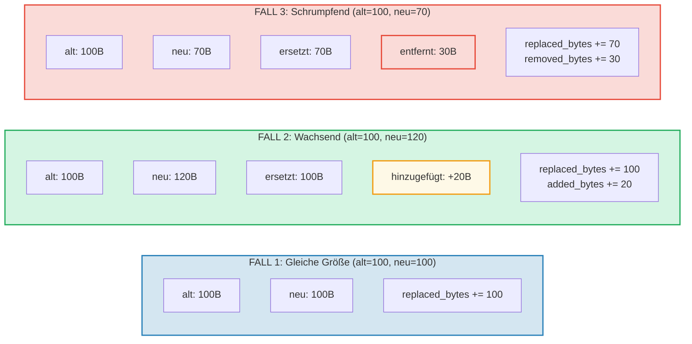

# Kostenerfassung

## Die OperationCost-Struktur

Jede Operation in GroveDB akkumuliert Kosten, gemessen in Rechenressourcen:

```rust
// costs/src/lib.rs
pub struct OperationCost {
    pub seek_count: u32,              // Anzahl der Speicherzugriffe
    pub storage_cost: StorageCost,    // Hinzugefügte/ersetzte/entfernte Bytes
    pub storage_loaded_bytes: u64,    // Von der Festplatte gelesene Bytes
    pub hash_node_calls: u32,         // Anzahl der Blake3-Hash-Operationen
    pub sinsemilla_hash_calls: u32,   // Anzahl der Sinsemilla-Hash-Operationen (EC-Ops)
}
```

> **Sinsemilla-Hash-Aufrufe** verfolgen elliptische-Kurven-Hash-Operationen für CommitmentTree-
> Anker. Diese sind deutlich teurer als Blake3-Knoten-Hashes.

Die Speicherkosten sind weiter aufgeschlüsselt:

```rust
// costs/src/storage_cost/mod.rs
pub struct StorageCost {
    pub added_bytes: u32,                   // Neu geschriebene Daten
    pub replaced_bytes: u32,                // Überschriebene vorhandene Daten
    pub removed_bytes: StorageRemovedBytes, // Freigegebene Daten
}
```

## Das CostContext-Muster

Alle Operationen geben ihr Ergebnis verpackt in einem `CostContext` zurück:

```rust
pub struct CostContext<T> {
    pub value: T,               // Das Operationsergebnis
    pub cost: OperationCost,    // Verbrauchte Ressourcen
}

pub type CostResult<T, E> = CostContext<Result<T, E>>;
```

Dies erzeugt ein **monadisches** Kostenerfassungsmuster — Kosten fließen automatisch
durch Ketten von Operationen:

```rust
// Ein Ergebnis entpacken und seine Kosten zu einem Akkumulator addieren
let result = expensive_operation().unwrap_add_cost(&mut total_cost);

// Operationen verketten und Kosten akkumulieren
let final_result = op1()
    .flat_map(|x| op2(x))      // Kosten von op1 + op2
    .flat_map(|y| op3(y));      // + Kosten von op3
```

## Das cost_return_on_error!-Makro

Das häufigste Muster im GroveDB-Code ist das `cost_return_on_error!`-Makro,
das wie `?` wirkt, aber Kosten bei vorzeitiger Rückkehr bewahrt:

```rust
macro_rules! cost_return_on_error {
    ( &mut $cost:ident, $($body:tt)+ ) => {
        {
            let result_with_cost = { $($body)+ };
            let result = result_with_cost.unwrap_add_cost(&mut $cost);
            match result {
                Ok(x) => x,
                Err(e) => return Err(e).wrap_with_cost($cost),
            }
        }
    };
}
```

In der Praxis:

```rust
fn insert_element(&self, path: &[&[u8]], key: &[u8], element: Element) -> CostResult<(), Error> {
    let mut cost = OperationCost::default();

    // Jeder Makroaufruf addiert die Kosten der Operation zu `cost`
    // und gibt den Ok-Wert zurück (oder kehrt vorzeitig mit akkumulierten Kosten bei Err zurück)
    let merk = cost_return_on_error!(&mut cost, self.open_merk(path));
    cost_return_on_error!(&mut cost, merk.insert(key, element));
    cost_return_on_error!(&mut cost, self.propagate_changes(path));

    Ok(()).wrap_with_cost(cost)
    // `cost` enthält nun die Summe der Kosten aller drei Operationen
}
```

## Speicherkosten-Aufschlüsselung

Wenn ein Wert aktualisiert wird, hängen die Kosten davon ab, ob der neue Wert größer,
kleiner oder gleich groß ist:



## Hash-Operationskosten

Hash-Kosten werden in "Hash-Knoten-Aufrufen" gemessen — der Anzahl der Blake3-Block-
Kompressionen:

| Operation | Eingabegröße | Hash-Aufrufe |
|-----------|-------------|--------------|
| `value_hash(klein)` | < 64 Bytes | 1 |
| `value_hash(mittel)` | 64-127 Bytes | 2 |
| `kv_hash` | Schlüssel + value_hash | variiert |
| `node_hash` | 96 Bytes (3 × 32) | 2 (immer) |
| `combine_hash` | 64 Bytes (2 × 32) | 1 (immer) |
| `node_hash_with_count` | 104 Bytes (3 × 32 + 8) | 2 (immer) |
| Sinsemilla (CommitmentTree) | Pallas-Kurven-EC-Op | separat erfasst über `sinsemilla_hash_calls` |

Die allgemeine Formel für Blake3:

```text
hash_aufrufe = 1 + (eingabe_bytes - 1) / 64
```

## Worst-Case- und Average-Case-Schätzung

GroveDB stellt Funktionen bereit, um Operationskosten **vor der Ausführung** zu schätzen.
Dies ist entscheidend für die Blockchain-Gebührenberechnung — man muss die Kosten kennen, bevor
man sich zur Zahlung verpflichtet.

```rust
// Worst-Case-Kosten für das Lesen eines Knotens
pub fn add_worst_case_get_merk_node(
    cost: &mut OperationCost,
    not_prefixed_key_len: u32,
    max_element_size: u32,
    node_type: NodeType,
) {
    cost.seek_count += 1;  // Ein Festplattenzugriff
    cost.storage_loaded_bytes +=
        TreeNode::worst_case_encoded_tree_size(
            not_prefixed_key_len, max_element_size, node_type
        ) as u64;
}

// Worst-Case-Propagierungskosten
pub fn add_worst_case_merk_propagate(
    cost: &mut OperationCost,
    input: &WorstCaseLayerInformation,
) {
    let levels = match input {
        MaxElementsNumber(n) => ((*n + 1) as f32).log2().ceil() as u32,
        NumberOfLevels(n) => *n,
    };
    let mut nodes_updated = levels;

    // AVL-Rotationen können zusätzliche Knoten aktualisieren
    if levels > 2 {
        nodes_updated += 2;  // Höchstens 2 zusätzliche Knoten für Rotationen
    }

    cost.storage_cost.replaced_bytes += nodes_updated * MERK_BIGGEST_VALUE_SIZE;
    cost.storage_loaded_bytes +=
        nodes_updated as u64 * (MERK_BIGGEST_VALUE_SIZE + MERK_BIGGEST_KEY_SIZE) as u64;
    cost.seek_count += nodes_updated;
    cost.hash_node_calls += nodes_updated * 2;
}
```

Verwendete Konstanten:

```rust
pub const MERK_BIGGEST_VALUE_SIZE: u32 = u16::MAX as u32;  // 65535
pub const MERK_BIGGEST_KEY_SIZE: u32 = 256;
```

---
