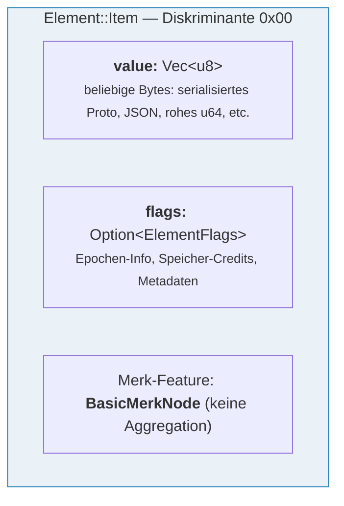
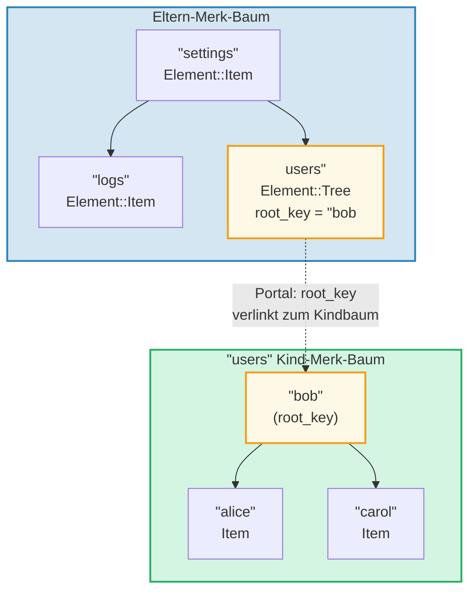
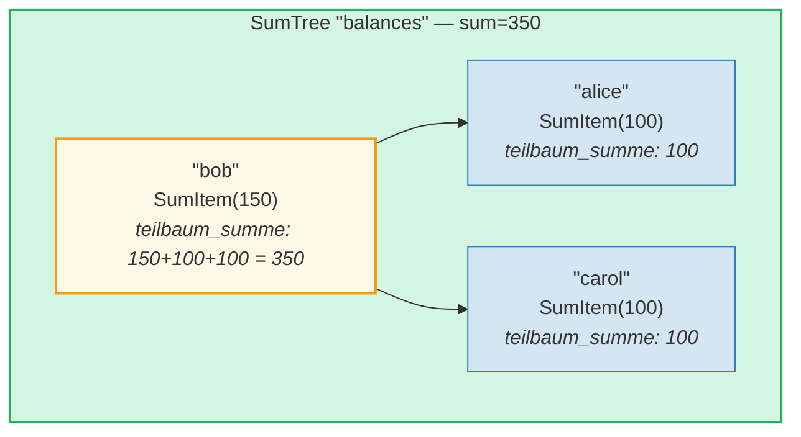
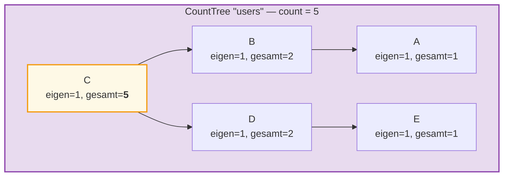
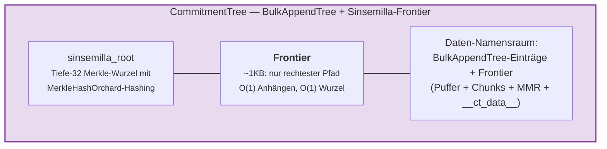

# Das Element-System

Während Merk mit rohen Schlüssel-Wert-Paaren arbeitet, operiert GroveDB auf einer höheren Ebene
mit **Elementen** — typisierten Werten, die semantische Bedeutung tragen. Jeder in
GroveDB gespeicherte Wert ist ein Element.

## Die Element-Aufzählung

```rust
// grovedb-element/src/element/mod.rs
pub enum Element {
    Item(Vec<u8>, Option<ElementFlags>),                                    // [0]
    Reference(ReferencePathType, MaxReferenceHop, Option<ElementFlags>),    // [1]
    Tree(Option<Vec<u8>>, Option<ElementFlags>),                           // [2]
    SumItem(SumValue, Option<ElementFlags>),                               // [3]
    SumTree(Option<Vec<u8>>, SumValue, Option<ElementFlags>),              // [4]
    BigSumTree(Option<Vec<u8>>, BigSumValue, Option<ElementFlags>),        // [5]
    CountTree(Option<Vec<u8>>, CountValue, Option<ElementFlags>),          // [6]
    CountSumTree(Option<Vec<u8>>, CountValue, SumValue, Option<ElementFlags>), // [7]
    ProvableCountTree(Option<Vec<u8>>, CountValue, Option<ElementFlags>),  // [8]
    ItemWithSumItem(Vec<u8>, SumValue, Option<ElementFlags>),              // [9]
    ProvableCountSumTree(Option<Vec<u8>>, CountValue, SumValue,
                         Option<ElementFlags>),                            // [10]
    CommitmentTree(u64, u8, Option<ElementFlags>),                         // [11]
    MmrTree(u64, Option<ElementFlags>),                                    // [12]
    BulkAppendTree(u64, u8, Option<ElementFlags>),                         // [13]
    DenseAppendOnlyFixedSizeTree(u16, u8, Option<ElementFlags>),           // [14]
}
```

Die Diskriminanten-Nummern (in Klammern dargestellt) werden bei der Serialisierung verwendet.

Im gesamten Code verwendete Typaliase:

```rust
pub type ElementFlags = Vec<u8>;        // Beliebige Metadaten pro Element
pub type MaxReferenceHop = Option<u8>;  // Optionales Hop-Limit für Referenzen
pub type SumValue = i64;                // 64-Bit-Vorzeichen-Summe
pub type BigSumValue = i128;            // 128-Bit-Vorzeichen-Summe
pub type CountValue = u64;              // 64-Bit-vorzeichenloser Zähler
```

## Item — Grundlegender Schlüssel-Wert-Speicher

Das einfachste Element. Speichert beliebige Bytes:

```rust
Element::Item(value: Vec<u8>, flags: Option<ElementFlags>)
```



Konstruktoren:

```rust
Element::new_item(b"hello world".to_vec())
Element::new_item_with_flags(b"data".to_vec(), Some(vec![0x01, 0x02]))
```

Items nehmen an der Summenaggregation teil: Innerhalb eines SumTree trägt ein Item einen
Standard-Summenwert von 0 bei. Ein SumItem trägt seinen expliziten Wert bei.

## Tree — Container für Teilbäume

Ein Tree-Element ist ein **Portal** zu einem anderen Merk-Baum. Es speichert den Wurzelschlüssel
des Kindbaums (falls vorhanden):

```rust
Element::Tree(root_key: Option<Vec<u8>>, flags: Option<ElementFlags>)
```



> Das Tree-Element im Eltern-Merk speichert den `root_key` des Kind-Merk-Baums. Dies erzeugt ein **Portal** — eine Verbindung von einem Merk-Baum in einen anderen.

Wenn ein Baum leer ist, ist `root_key` `None`. Der Konstruktor `Element::empty_tree()`
erzeugt `Element::Tree(None, None)`.

## SumItem / SumTree — Aggregierte Summen

Ein **SumTree** (Summenbaum) pflegt automatisch die Summe aller Summenbeiträge seiner
direkten Kinder:

```rust
Element::SumTree(root_key: Option<Vec<u8>>, sum: SumValue, flags: Option<ElementFlags>)
Element::SumItem(value: SumValue, flags: Option<ElementFlags>)
```



> **Aggregationsformel:** `knoten_summe = eigener_wert + linke_kind_summe + rechte_kind_summe`
> Bob: 150 + 100 (alice) + 100 (carol) = **350**. Die Wurzelsumme (350) wird im SumTree-Element des Elternknotens gespeichert.

Die Summe wird auf Merk-Ebene durch den `TreeFeatureType::SummedMerkNode(i64)`-Feature-Typ
gepflegt. Während der Baumpropagierung werden die Aggregatdaten jedes Knotens neu berechnet:

```text
aggregat_summe = eigene_summe + linke_kind_summe + rechte_kind_summe
```

## CountTree, CountSumTree, BigSumTree

Zusätzliche Aggregat-Baumtypen:

| Element-Typ | Merk-Feature-Typ | Aggregiert |
|---|---|---|
| `CountTree` | `CountedMerkNode(u64)` | Anzahl der Elemente |
| `CountSumTree` | `CountedSummedMerkNode(u64, i64)` | Sowohl Anzahl als auch Summe |
| `BigSumTree` | `BigSummedMerkNode(i128)` | 128-Bit-Summe für große Werte |
| `ProvableCountTree` | `ProvableCountedMerkNode(u64)` | Zähler in den Hash eingebettet |
| `ProvableCountSumTree` | `ProvableCountedSummedMerkNode(u64, i64)` | Zähler im Hash + Summe |

**ProvableCountTree** ist besonders: Sein Zähler wird in die `node_hash`-Berechnung
einbezogen (über `node_hash_with_count`), sodass ein Beweis den Zähler verifizieren kann,
ohne Werte offenzulegen.

## Element-Serialisierung

Elemente werden mittels **bincode** mit Big-Endian-Byte-Reihenfolge serialisiert:

```rust
pub fn serialize(&self, grove_version: &GroveVersion) -> Result<Vec<u8>, ElementError> {
    let config = config::standard().with_big_endian().with_no_limit();
    bincode::encode_to_vec(self, config)
}
```

Das erste Byte ist die **Diskriminante**, die eine O(1)-Typerkennung ermöglicht:

```rust
pub fn from_serialized_value(value: &[u8]) -> Option<ElementType> {
    match value.first()? {
        0 => Some(ElementType::Item),
        1 => Some(ElementType::Reference),
        2 => Some(ElementType::Tree),
        3 => Some(ElementType::SumItem),
        // ... etc
    }
}
```

## TreeFeatureType und Aggregatdatenfluss

Die `TreeFeatureType`-Aufzählung überbrückt die Lücke zwischen GroveDB-Elementen und Merk-Knoten:

```rust
pub enum TreeFeatureType {
    BasicMerkNode,                              // Keine Aggregation
    SummedMerkNode(i64),                       // Summenaggregation
    BigSummedMerkNode(i128),                   // Große Summe
    CountedMerkNode(u64),                      // Zähler
    CountedSummedMerkNode(u64, i64),           // Zähler + Summe
    ProvableCountedMerkNode(u64),              // Zähler im Hash
    ProvableCountedSummedMerkNode(u64, i64),   // Zähler im Hash + Summe
}
```

Aggregatdaten fließen **aufwärts** durch den Baum:



> **Aggregationstabelle:** Das Aggregat jedes Knotens = eigen(1) + linkes_aggregat + rechtes_aggregat
>
> | Knoten | eigen | linkes_agg | rechtes_agg | gesamt |
> |--------|-------|------------|-------------|--------|
> | A | 1 | 0 | 0 | 1 |
> | B | 1 | 1 (A) | 0 | 2 |
> | E | 1 | 0 | 0 | 1 |
> | D | 1 | 0 | 1 (E) | 2 |
> | C | 1 | 2 (B) | 2 (D) | **5** (Wurzel) |

Der an jedem Knoten gespeicherte Zähler repräsentiert den Gesamtzähler im
bei diesem Knoten gewurzelten Teilbaum, einschließlich seiner selbst. Der Zähler des
Wurzelknotens ist die Gesamtanzahl für den gesamten Baum.

Die `AggregateData`-Aufzählung transportiert diese durch das Link-System:

```rust
pub enum AggregateData {
    NoAggregateData,
    Sum(i64),
    BigSum(i128),
    Count(u64),
    CountAndSum(u64, i64),
    ProvableCount(u64),
    ProvableCountAndSum(u64, i64),
}
```

## CommitmentTree — Sinsemilla-Verpflichtungsbaum

Ein **CommitmentTree** (Verpflichtungsbaum) bietet einen Sinsemilla-Merkle-Baum der Tiefe 32
für die Verfolgung von Note-Commitment-Ankern, wie sie im Orchard Shielded Protocol von
Zcash verwendet werden. Er umhüllt `incrementalmerkletree::Frontier<MerkleHashOrchard, 32>`
für O(1)-Anhänge- und Wurzelberechnung:

```rust
Element::CommitmentTree(
    total_count: u64,               // Anzahl der angehängten Commitments
    chunk_power: u8,                // BulkAppendTree-Kompaktierungsgröße (chunk_size = 2^chunk_power)
    flags: Option<ElementFlags>,
)                                   // Diskriminante [11]
```

> **Hinweis:** Der Sinsemilla-Frontier-Wurzel-Hash wird NICHT im Element gespeichert.
> Er wird im Datenspeicher persistiert und fließt durch den Merk-Kind-Hash-Mechanismus
> (`insert_subtree`'s `subtree_root_hash`-Parameter). Jede Änderung an der Frontier
> propagiert automatisch aufwärts durch die GroveDB-Merk-Hierarchie.



**Architektur:**
- Die *Frontier* (rechtester Pfad des Merkle-Baums, ~1KB konstante Größe) wird
  im **Daten-Namensraum** gespeichert, mit dem Schlüssel `COMMITMENT_TREE_DATA_KEY`
- Die eigentlichen Notendaten (`cmx || ciphertext`) werden über einen **BulkAppendTree**
  im **Daten-Namensraum** gespeichert — chunk-kompaktiert, nach Position abrufbar
- Historische Anker werden von der Platform in einem separaten beweisbaren Baum verfolgt
- Die Sinsemilla-Wurzel wird NICHT im Element gespeichert — sie fließt als Merk-Kind-Hash
  durch die GroveDB-Hash-Hierarchie

**Operationen:**
- `commitment_tree_insert(path, key, cmx, ciphertext, tx)` — Typisiertes Anhängen,
  akzeptiert `TransmittedNoteCiphertext<M>`; gibt `(new_root, position)` zurück
- `commitment_tree_anchor(path, key, tx)` — Aktuellen Orchard-Anker abrufen
- `commitment_tree_get_value(path, key, position, tx)` — Wert nach Position abrufen
- `commitment_tree_count(path, key, tx)` — Gesamtanzahl der Einträge abrufen

**MemoSize-Generik:** `CommitmentTree<S, M: MemoSize = DashMemo>` validiert, dass
Ciphertext-Payloads der erwarteten Größe für `M` entsprechen. Für Dash (36-Byte-Memos):
`epk_bytes (32) + enc_ciphertext (104) + out_ciphertext (80) = 216 Bytes`.

**Kostenerfassung:** Sinsemilla-Hash-Operationen werden über
`cost.sinsemilla_hash_calls` verfolgt. Die Wurzelberechnung durchläuft immer 32 Ebenen.
Ommer-Zusammenführungen kaskadieren durch `trailing_ones()` der vorherigen Position.
BulkAppendTree-Operationen fügen Blake3-Hash-Kosten hinzu.

## MmrTree — Merkle Mountain Range

Ein **MmrTree** speichert Daten in einer Append-Only Merkle Mountain Range (MMR) mit
Blake3-Hashing. MMR-Knoten werden in der **Daten**-Spalte gespeichert (derselben Spaltenfamilie
wie Merk-Knoten), nicht in einem Kind-Merk-Teilbaum. Siehe **[Kapitel 13](#chapter-13-the-mmr-tree--append-only-authenticated-logs)**
für einen umfassenden Tiefgang dazu, wie MMRs funktionieren, wie sie sich füllen, wie Beweise
erzeugt und verifiziert werden und wie MmrTree in GroveDB integriert ist.

```rust
Element::MmrTree(
    mmr_size: u64,                  // Interne MMR-Größe (Knoten, nicht Blätter)
    flags: Option<ElementFlags>,
)                                   // Diskriminante [12]
```

> **Hinweis:** Der MMR-Wurzel-Hash wird NICHT im Element gespeichert. Er fließt als Merk-
> Kind-Hash über den `subtree_root_hash`-Parameter von `insert_subtree`.

**Operationen:** `mmr_tree_append`, `mmr_tree_root_hash`, `mmr_tree_get_value`,
`mmr_tree_leaf_count`. **Beweise:** V1-Beweise (siehe §9.6 und §13.9).

## BulkAppendTree — Zweistufige Append-Only-Struktur

Ein **BulkAppendTree** kombiniert einen dichten Merkle-Baum-Puffer mit einer Chunk-Level-MMR
für effiziente Hochdurchsatz-Anhängeoperationen mit beweisbaren Bereichsabfragen. Er ist ein
Nicht-Merk-Baum — die Daten befinden sich im **Daten**-Namensraum, nicht in einem Kind-Merk-Teilbaum.
Siehe **[Kapitel 14](#chapter-14-the-bulkappendtree--high-throughput-append-only-storage)**
für einen umfassenden Tiefgang in die zweistufige Architektur, Chunk-Kompaktierung,
Beweiserzeugung, Verifikation und GroveDB-Integration.

```rust
Element::BulkAppendTree(
    total_count: u64,               // Gesamtanzahl angehängter Werte
    chunk_power: u8,                // Höhe des dichten Baums (Pufferkapazität = 2^chunk_power - 1)
    flags: Option<ElementFlags>,
)                                   // Diskriminante [13]
```

> **Hinweis:** Die Zustandswurzel (`blake3("bulk_state" || mmr_root || dense_tree_root)`)
> wird NICHT im Element gespeichert. Sie fließt als Merk-Kind-Hash über den
> `subtree_root_hash`-Parameter von `insert_subtree`.

**Operationen:** `bulk_append`, `bulk_get_value`, `bulk_get_chunk`,
`bulk_get_buffer`, `bulk_count`, `bulk_chunk_count`.
**Beweise:** V1-Bereichsbeweise (siehe §9.6 und §14.10).

## DenseAppendOnlyFixedSizeTree — Dichter Speicher mit fester Kapazität

Ein **DenseAppendOnlyFixedSizeTree** ist ein vollständiger Binärbaum fester Höhe *h*,
bei dem jeder Knoten (intern und Blatt) einen Datenwert speichert. Positionen werden
in Ebenenreihenfolge (BFS) gefüllt. Der Wurzel-Hash wird spontan neu berechnet — es werden keine
Zwischen-Hashes persistiert. Siehe **[Kapitel 16](#chapter-16-the-denseappendonlyfixedsizetree--dense-fixed-capacity-merkle-storage)**
für den vollständigen Tiefgang.

```rust
Element::DenseAppendOnlyFixedSizeTree(
    count: u16,                     // Anzahl gespeicherter Werte (max 65.535)
    height: u8,                     // Baumhöhe (1..=16, unveränderlich), Kapazität = 2^h - 1
    flags: Option<ElementFlags>,
)                                   // Diskriminante [14]
```

> **Hinweis:** Der Wurzel-Hash wird NICHT im Element gespeichert — er wird spontan
> neu berechnet und fließt als Merk-Kind-Hash. Das `count`-Feld ist `u16` (nicht u64),
> was Bäume auf 65.535 Positionen beschränkt. Höhen sind auf 1..=16 beschränkt.

**Operationen:** `dense_tree_insert`, `dense_tree_get`, `dense_tree_root_hash`,
`dense_tree_count`.
**Beweise:** Nur auf Element-Ebene (noch keine Subquery-Beweise).

## Nicht-Merk-Bäume — Gemeinsame Muster

CommitmentTree, MmrTree, BulkAppendTree und DenseAppendOnlyFixedSizeTree teilen ein
gemeinsames architektonisches Muster, das sie von den Merk-basierten Baumtypen (Tree, SumTree,
CountTree, etc.) unterscheidet:

| Eigenschaft | Merk-basierte Bäume | Nicht-Merk-Bäume |
|-------------|---------------------|-------------------|
| Kind-Merk-Teilbaum | Ja (`root_key = Some(...)`) | Nein (kein root_key-Feld) |
| Datenspeicher | Merk-Schlüssel-Wert-Paare | Daten-Spalten-Blobs (Nicht-Merk-Schlüssel) |
| Wurzel-Hash-Bindung | `combine_hash(elem_hash, child_root_hash)` | `combine_hash(elem_hash, typspezifische_wurzel)` |
| Typspezifische Wurzel | Von Merk-AVL gepflegt | Fließt als Merk-Kind-Hash (NICHT in Element-Bytes) |
| Beweisformat | V0 (schichtweiser Merk) | V1 (typspezifischer Beweis) |
| TreeFeatureType | BasicMerkNode (keine Aggregation) | BasicMerkNode |

> **Speicherspalten-Hinweis:** Alle vier Nicht-Merk-Baumtypen (MmrTree,
> CommitmentTree, BulkAppendTree, DenseAppendOnlyFixedSizeTree) speichern ihre
> Daten in der **Daten**-Spalte mit Nicht-Merk-Schlüsseln. CommitmentTree speichert seine
> Sinsemilla-Frontier neben BulkAppendTree-Einträgen in derselben **Daten**-Spalte
> (Schlüssel `b"__ct_data__"`).

Die typspezifische Wurzel (Sinsemilla-Wurzel, MMR-Wurzel, Zustandswurzel oder dichter Baum-Wurzel-Hash) wird
NICHT im Element gespeichert. Stattdessen fließt sie als Merk-**Kind-Hash** über den
`subtree_root_hash`-Parameter von `insert_subtree`. Der Merk-combined_value_hash
wird zu `combine_hash(value_hash(element_bytes), typspezifische_wurzel)`.
Jede Änderung an der typspezifischen Wurzel ändert den Kind-Hash, was den
combined_value_hash ändert, was durch die GroveDB-Hash-Hierarchie nach oben
propagiert — und die kryptographische Integrität aufrechterhält.

---
