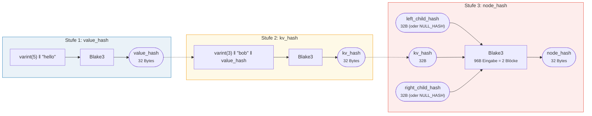
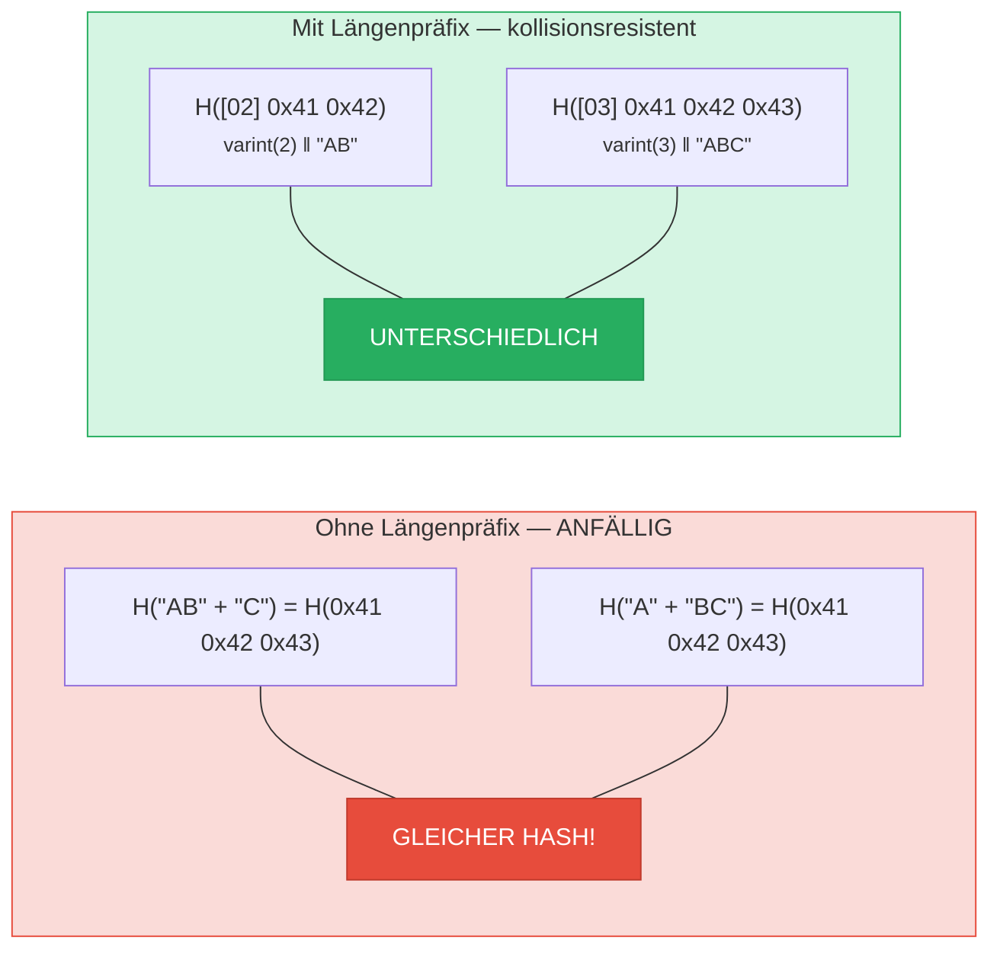
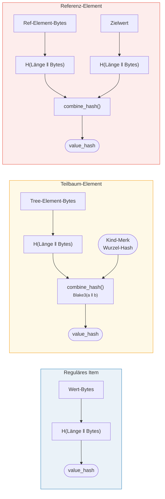

# Hashing — Kryptographische Integrität

Jeder Knoten in einem Merk-Baum wird gehasht, um einen **Wurzel-Hash** zu erzeugen — einen einzelnen
32-Byte-Wert, der den gesamten Baum authentifiziert. Jede Änderung an einem Schlüssel, Wert oder
einer strukturellen Beziehung erzeugt einen anderen Wurzel-Hash.

## Dreistufige Hash-Hierarchie

Merk verwendet ein dreistufiges Hash-Schema, von innen nach außen:

Beispiel: key = `"bob"` (3 Bytes), value = `"hello"` (5 Bytes):



> Die WURZEL des Baumes = `node_hash` des Wurzelknotens — authentifiziert **jeden** Schlüssel, Wert und jede strukturelle Beziehung. Fehlende Kinder verwenden `NULL_HASH = [0x00; 32]`.

### Stufe 1: value_hash

```rust
// merk/src/tree/hash.rs
pub fn value_hash(value: &[u8]) -> CostContext<CryptoHash> {
    let mut hasher = blake3::Hasher::new();
    let val_length = value.len().encode_var_vec();  // Varint-Kodierung
    hasher.update(val_length.as_slice());
    hasher.update(value);
    // ...
}
```

Die Länge des Werts wird **varint-kodiert** und vorangestellt. Dies ist entscheidend für
Kollisionsresistenz — ohne dies wäre `H("AB" ‖ "C")` gleich `H("A" ‖ "BC")`.

### Stufe 2: kv_hash

```rust
pub fn kv_hash(key: &[u8], value: &[u8]) -> CostContext<CryptoHash> {
    let mut hasher = blake3::Hasher::new();
    let key_length = key.len().encode_var_vec();
    hasher.update(key_length.as_slice());
    hasher.update(key);
    let vh = value_hash(value);
    hasher.update(vh.as_slice());  // Verschachtelter Hash
    // ...
}
```

Dies bindet den Schlüssel an den Wert. Für die Beweisverifikation gibt es auch eine Variante,
die einen vorberechneten value_hash übernimmt:

```rust
pub fn kv_digest_to_kv_hash(key: &[u8], value_hash: &CryptoHash) -> CostContext<CryptoHash>
```

Diese wird verwendet, wenn der Verifizierer bereits den value_hash hat (z.B. für Teilbäume,
bei denen value_hash ein kombinierter Hash ist).

### Stufe 3: node_hash

```rust
pub fn node_hash(
    kv: &CryptoHash,
    left: &CryptoHash,
    right: &CryptoHash,
) -> CostContext<CryptoHash> {
    let mut hasher = blake3::Hasher::new();
    hasher.update(kv);       // 32 Bytes
    hasher.update(left);     // 32 Bytes
    hasher.update(right);    // 32 Bytes — insgesamt 96 Bytes
    // Immer genau 2 Hash-Operationen (96 Bytes / 64-Byte-Block = 2)
}
```

Wenn ein Kind fehlt, ist sein Hash der **NULL_HASH** — 32 Null-Bytes:

```rust
pub const NULL_HASH: CryptoHash = [0; HASH_LENGTH];  // [0u8; 32]
```

## Blake3 als Hash-Funktion

GroveDB verwendet **Blake3** für sämtliches Hashing. Wichtige Eigenschaften:

- **256-Bit-Ausgabe** (32 Bytes)
- **Blockgröße**: 64 Bytes
- **Geschwindigkeit**: ~3x schneller als SHA-256 auf moderner Hardware
- **Streaming**: Kann inkrementell Daten verarbeiten

Die Kosten der Hash-Operation werden basierend darauf berechnet, wie viele 64-Byte-Blöcke
verarbeitet werden:

```rust
let hashes = 1 + (hasher.count() - 1) / 64;  // Anzahl der Hash-Operationen
```

## Längenpräfix-Kodierung für Kollisionsresistenz

Jede Eingabe variabler Länge wird mit ihrer Länge mittels **Varint-Kodierung** präfixiert:



> **value_hash Eingabe**: `[varint(value.len)] [Wert-Bytes]`
> **kv_hash Eingabe**: `[varint(key.len)] [Schlüssel-Bytes] [value_hash: 32 Bytes]`

Ohne Längenpräfixe könnte ein Angreifer verschiedene Schlüssel-Wert-Paare erstellen, die
denselben Digest erzeugen. Das Längenpräfix macht dies kryptographisch
undurchführbar.

## Kombiniertes Hashing für spezielle Elemente

Für **Teilbäume** und **Referenzen** ist der `value_hash` nicht einfach `H(value)`.
Stattdessen ist es ein **kombinierter Hash**, der das Element an sein Ziel bindet:



> **Teilbaum:** bindet den Wurzel-Hash des Kind-Merk-Baums in den Elternbaum ein. **Referenz:** bindet sowohl den Referenzpfad ALS AUCH den Zielwert. Eine Änderung von beidem ändert den Wurzel-Hash.

Die `combine_hash`-Funktion:

```rust
pub fn combine_hash(hash_one: &CryptoHash, hash_two: &CryptoHash) -> CostContext<CryptoHash> {
    let mut hasher = blake3::Hasher::new();
    hasher.update(hash_one);   // 32 Bytes
    hasher.update(hash_two);   // 32 Bytes — insgesamt 64 Bytes, genau 1 Hash-Op
    // ...
}
```

Dies ermöglicht es GroveDB, die gesamte Hierarchie durch einen einzigen Wurzel-Hash zu
authentifizieren — der value_hash des Elternbaums für ein Teilbaum-Element enthält den
Wurzel-Hash des Kindbaums.

## Aggregat-Hashing für ProvableCountTree

`ProvableCountTree`-Knoten schließen den Aggregatzähler in den Knoten-Hash ein:

```rust
pub fn node_hash_with_count(
    kv: &CryptoHash,
    left: &CryptoHash,
    right: &CryptoHash,
    count: u64,
) -> CostContext<CryptoHash> {
    let mut hasher = blake3::Hasher::new();
    hasher.update(kv);                        // 32 Bytes
    hasher.update(left);                      // 32 Bytes
    hasher.update(right);                     // 32 Bytes
    hasher.update(&count.to_be_bytes());      // 8 Bytes — insgesamt 104 Bytes
    // Immer noch genau 2 Hash-Ops (104 < 128 = 2 × 64)
}
```

Das bedeutet, ein Beweis des Zählwerts erfordert nicht die Offenlegung der tatsächlichen Daten — der Zähler
ist in die kryptographische Verpflichtung eingebettet.

---
