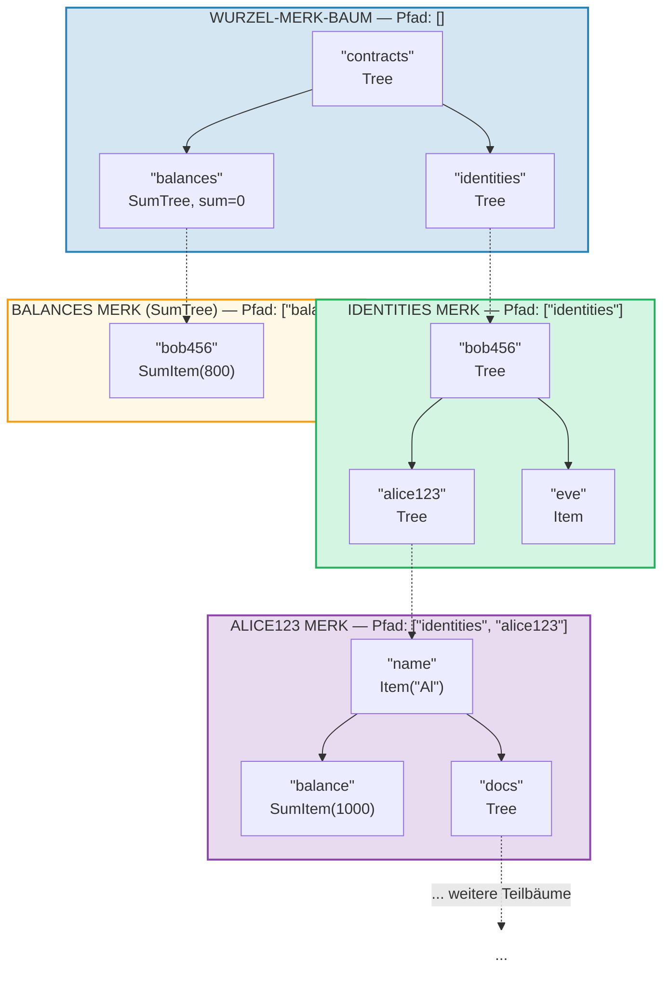
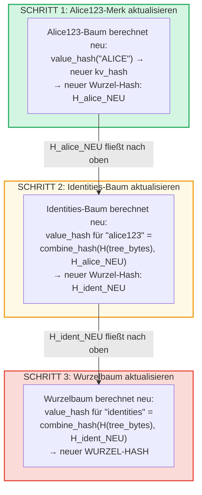
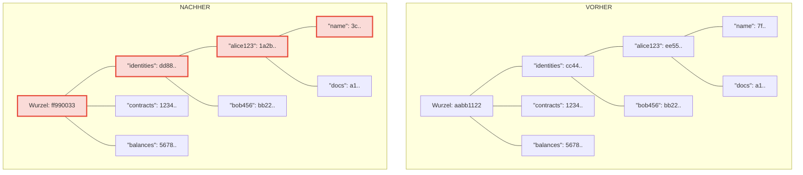
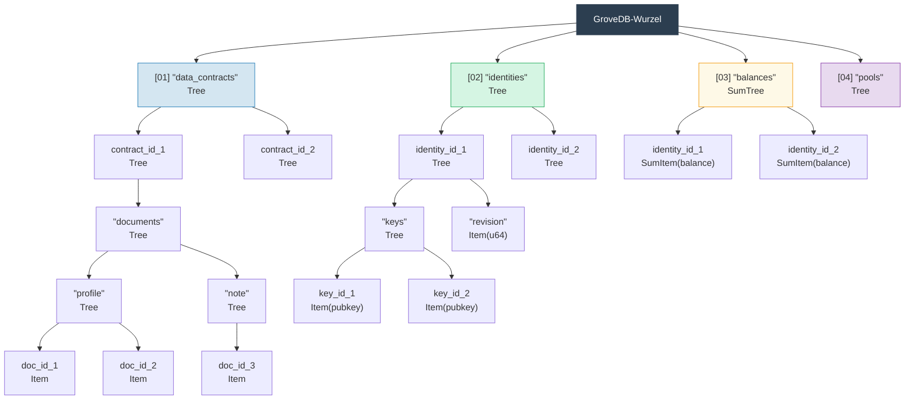

# Der hierarchische Hain — Baum von Bäumen

## Wie Teilbäume in Elternbäumen verschachtelt werden

Das definierende Merkmal von GroveDB ist, dass ein Merk-Baum Elemente enthalten kann, die
selbst Merk-Bäume sind. Dies erzeugt einen **hierarchischen Namensraum**:



> Jeder farbige Kasten ist ein separater Merk-Baum. Gestrichelte Pfeile repräsentieren die Portal-Links von Tree-Elementen zu ihren Kind-Merk-Bäumen. Der Pfad zu jedem Merk-Baum wird in seinem Label angezeigt.

## Pfad-Adressierungssystem

Jedes Element in GroveDB wird über einen **Pfad** adressiert — eine Folge von Byte-Strings,
die vom Wurzelverzeichnis durch Teilbäume zum Zielschlüssel navigieren:

```text
    Pfad: ["identities", "alice123", "name"]

    Schritt 1: Im Wurzelbaum "identities" nachschlagen → Tree-Element
    Schritt 2: Identities-Teilbaum öffnen, "alice123" nachschlagen → Tree-Element
    Schritt 3: Alice123-Teilbaum öffnen, "name" nachschlagen → Item("Alice")
```

Pfade werden als `Vec<Vec<u8>>` oder mittels des `SubtreePath`-Typs für
effiziente Manipulation ohne Allokation dargestellt:

```rust
// Der Pfad zum Element (alle Segmente außer dem letzten)
let path: &[&[u8]] = &[b"identities", b"alice123"];
// Der Schlüssel innerhalb des endgültigen Teilbaums
let key: &[u8] = b"name";
```

## Blake3-Präfixgenerierung für Speicherisolation

Jeder Teilbaum in GroveDB erhält seinen eigenen **isolierten Speicher-Namensraum** in RocksDB.
Der Namensraum wird durch Hashing des Pfads mit Blake3 bestimmt:

```rust
pub type SubtreePrefix = [u8; 32];

// Das Präfix wird durch Hashing der Pfadsegmente berechnet
// storage/src/rocksdb_storage/storage.rs
```

Zum Beispiel:

```text
    Pfad: ["identities", "alice123"]
    Präfix: Blake3(["identities", "alice123"]) = [0xab, 0x3f, ...]  (32 Bytes)

    In RocksDB werden Schlüssel für diesen Teilbaum wie folgt gespeichert:
    [Präfix: 32 Bytes][originaler_schlüssel]

    Also wird "name" in diesem Teilbaum zu:
    [0xab, 0x3f, ...][0x6e, 0x61, 0x6d, 0x65]  ("name")
```

Das stellt sicher:
- Keine Schlüsselkollisionen zwischen Teilbäumen (32-Byte-Präfix = 256-Bit-Isolation)
- Effiziente Präfixberechnung (ein einzelner Blake3-Hash über die Pfad-Bytes)
- Teilbaumdaten sind in RocksDB für Cache-Effizienz zusammen gruppiert

## Wurzel-Hash-Propagierung durch die Hierarchie

Wenn sich ein Wert tief im Hain ändert, muss die Änderung **nach oben propagieren**, um
den Wurzel-Hash zu aktualisieren:

```text
    Änderung: "name" auf "ALICE" aktualisieren in identities/alice123/

    Schritt 1: Wert im Merk-Baum von alice123 aktualisieren
               → alice123-Baum bekommt neuen Wurzel-Hash: H_alice_neu

    Schritt 2: "alice123"-Element im Identities-Baum aktualisieren
               → value_hash des Identities-Baums für "alice123" =
                 combine_hash(H(tree_element_bytes), H_alice_neu)
               → Identities-Baum bekommt neuen Wurzel-Hash: H_ident_neu

    Schritt 3: "identities"-Element im Wurzelbaum aktualisieren
               → value_hash des Wurzelbaums für "identities" =
                 combine_hash(H(tree_element_bytes), H_ident_neu)
               → WURZEL-HASH ändert sich
```



**Vorher vs. Nachher** — geänderte Knoten rot markiert:



> Nur die Knoten auf dem Pfad vom geänderten Wert bis zur Wurzel werden neu berechnet. Geschwister und andere Zweige bleiben unverändert.

Die Propagierung wird durch `propagate_changes_with_transaction` implementiert, welches
vom modifizierten Teilbaum zur Wurzel aufsteigt und den Element-Hash jedes Elternknotens
auf dem Weg aktualisiert.

## Mehrstufige Hain-Struktur — Beispiel

Hier ein vollständiges Beispiel, das zeigt, wie Dash Platform seinen Zustand strukturiert:



Jeder Kasten ist ein separater Merk-Baum, authentifiziert bis hin zu einem einzigen
Wurzel-Hash, auf den sich die Validatoren einigen.

---
