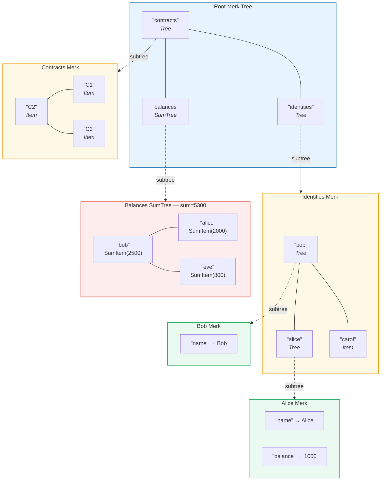
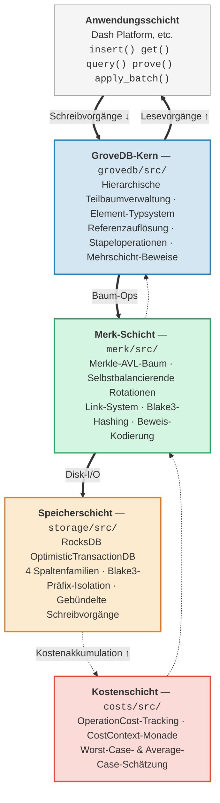

# Einführung — Was ist GroveDB?

## Die Kernidee

GroveDB ist eine **hierarchische authentifizierte Datenstruktur** — im Wesentlichen ein *Hain*
(Baum von Bäumen), der auf Merkle-AVL-Bäumen aufgebaut ist. Jeder Knoten in der Datenbank ist
Teil eines kryptographisch authentifizierten Baumes, und jeder Baum kann andere Bäume als
Kinder enthalten, wodurch eine tiefe Hierarchie verifizierbarer Zustände entsteht.

> Jeder farbige Kasten ist ein **separater Merk-Baum**. Gestrichelte Pfeile zeigen die Teilbaum-Beziehung — ein Tree-Element im Elternbaum enthält den Wurzelschlüssel des Kind-Merk-Baums.

In einer herkömmlichen Datenbank würde man Daten in einem flachen Schlüssel-Wert-Speicher
mit einem einzelnen Merkle-Baum darüber zur Authentifizierung ablegen. GroveDB verfolgt
einen anderen Ansatz: es verschachtelt Merkle-Bäume innerhalb von Merkle-Bäumen.
Das bietet folgende Vorteile:

1. **Effiziente Sekundärindizes** — Abfrage über beliebige Pfade, nicht nur über Primärschlüssel
2. **Kompakte kryptographische Beweise** — Nachweis der Existenz (oder Abwesenheit) beliebiger Daten
3. **Aggregierte Daten** — Bäume können ihre Kinder automatisch summieren, zählen oder anderweitig aggregieren
4. **Atomare baumübergreifende Operationen** — Stapeloperationen erstrecken sich über mehrere Teilbäume

## Warum GroveDB existiert

GroveDB wurde für **Dash Platform** entwickelt, eine dezentrale Anwendungsplattform,
in der jedes Stück Zustand folgende Anforderungen erfüllen muss:

- **Authentifiziert**: Jeder Knoten kann jedem Light-Client jeden Zustand beweisen
- **Deterministisch**: Jeder Knoten berechnet exakt denselben Zustandswurzel-Hash
- **Effizient**: Operationen müssen innerhalb der Blockzeit-Beschränkungen abgeschlossen werden
- **Abfragbar**: Anwendungen benötigen reichhaltige Abfragen, nicht nur Schlüsselsuchen

Herkömmliche Ansätze haben Defizite:

| Ansatz | Problem |
|--------|---------|
| Einfacher Merkle-Baum | Unterstützt nur Schlüsselsuchen, keine Bereichsabfragen |
| Ethereum MPT | Teures Rebalancing, große Beweisgrößen |
| Flacher Schlüssel-Wert-Speicher + einzelner Baum | Keine hierarchischen Abfragen, ein einzelner Beweis deckt alles ab |
| B-Baum | Nicht natürlich merklifiziert, komplexe Authentifizierung |

GroveDB löst diese Probleme durch die Kombination der **bewährten Balance-Garantien von AVL-Bäumen**
mit **hierarchischer Verschachtelung** und einem **reichhaltigen Element-Typsystem**.

## Architekturüberblick

GroveDB ist in klar abgegrenzte Schichten organisiert, jede mit einer eindeutigen Verantwortlichkeit:

Daten fließen bei Schreibvorgängen **nach unten** durch diese Schichten und bei Lesevorgängen **nach oben**.
Jede Operation akkumuliert Kosten, während sie den Stapel durchläuft, was eine präzise
Ressourcenabrechnung ermöglicht.

---
