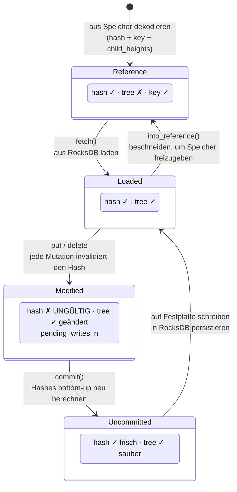
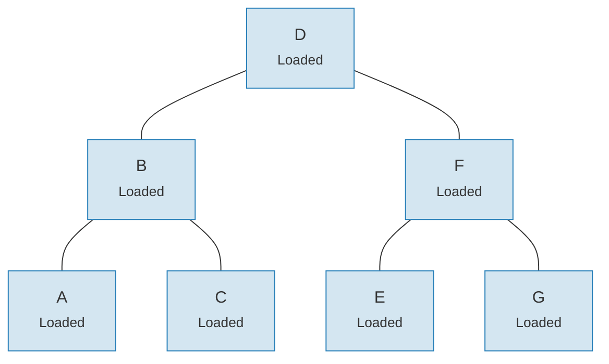
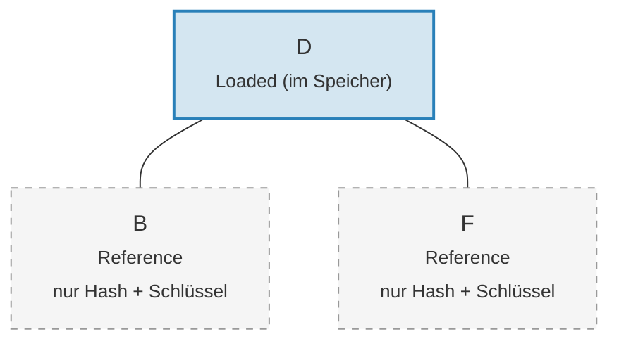

# Das Link-System — Lazy-Loading-Architektur

Einen gesamten Merk-Baum in den Speicher zu laden wäre für große Bäume prohibitiv teuer.
Das Link-System löst dieses Problem, indem es Kind-Verbindungen in vier möglichen Zuständen
darstellt und so **Lazy Loading** (verzögertes Laden) ermöglicht — Kinder werden erst dann
aus dem Speicher geladen, wenn sie tatsächlich benötigt werden.

## Vier Link-Zustände

```rust
// merk/src/tree/link.rs
pub enum Link {
    Reference {                    // Beschnitten: nur Metadaten, kein Baum im Speicher
        hash: CryptoHash,
        child_heights: (u8, u8),
        key: Vec<u8>,
        aggregate_data: AggregateData,
    },
    Modified {                     // Kürzlich geändert, Hash noch nicht berechnet
        pending_writes: usize,
        child_heights: (u8, u8),
        tree: TreeNode,
    },
    Uncommitted {                  // Gehasht, aber noch nicht im Speicher persistiert
        hash: CryptoHash,
        child_heights: (u8, u8),
        tree: TreeNode,
        aggregate_data: AggregateData,
    },
    Loaded {                       // Vollständig aus dem Speicher geladen
        hash: CryptoHash,
        child_heights: (u8, u8),
        tree: TreeNode,
        aggregate_data: AggregateData,
    },
}
```

## Zustandsübergangsdiagramm



## Was jeder Zustand speichert

| Zustand | Hash? | Baum im Speicher? | Zweck |
|---------|-------|-------------------|-------|
| **Reference** | Ja | Nein | Kompakte On-Disk-Darstellung. Speichert nur Schlüssel, Hash, Kind-Höhen und Aggregatdaten. |
| **Modified** | Nein | Ja | Nach jeder Mutation. Verfolgt die `pending_writes`-Anzahl für Stapeloptimierung. |
| **Uncommitted** | Ja | Ja | Nach Hash-Berechnung, aber vor Speicher-Schreibvorgang. Zwischenzustand beim Commit. |
| **Loaded** | Ja | Ja | Vollständig materialisiert. Bereit für Lesevorgänge oder weitere Modifikationen. |

Das `pending_writes`-Feld in `Modified` ist bemerkenswert:

```rust
// Berechnet als: 1 + pending_writes_links + pending_writes_rechts
pending_writes: 1 + tree.child_pending_writes(true)
                  + tree.child_pending_writes(false),
```

Dieser Zähler hilft der Commit-Phase zu entscheiden, wie Schreibvorgänge für optimale
Leistung angeordnet werden.

## Das Fetch-Callback-Muster

Das Link-System verwendet ein **Fetch-Trait**, um zu abstrahieren, wie Kindknoten geladen werden:

```rust
pub trait Fetch {
    fn fetch(
        &self,
        link: &Link,
        value_defined_cost_fn: Option<&impl Fn(&[u8], &GroveVersion) -> Option<ValueDefinedCostType>>,
        grove_version: &GroveVersion,
    ) -> CostResult<TreeNode, Error>;
}
```

Verschiedene Fetch-Implementierungen dienen unterschiedlichen Zwecken:

- **StorageFetch**: Lädt aus RocksDB (der normale Pfad)
- **PanicSource**: Wird in Tests verwendet, wo ein Fetch niemals stattfinden sollte
- **MockSource**: Gibt kontrollierte Testdaten zurück

Dieses Muster erlaubt es den Baumoperationen, **speicherunabhängig** zu sein — dieselbe
Balancierungs- und Mutationslogik funktioniert unabhängig davon, woher die Daten stammen.

## Das Walker-Muster

Der `Walker` umhüllt einen `TreeNode` mit einer `Fetch`-Quelle und ermöglicht sichere Baum-
Traversierung mit automatischem Lazy Loading (`merk/src/tree/walk/mod.rs`):

```rust
pub struct Walker<S: Fetch + Sized + Clone> {
    tree: Owner<TreeNode>,
    source: S,
}
```

Der Walker bietet drei Schlüsseloperationen:

**walk()** — Ein Kind abtrennen, transformieren und wieder anhängen:

```rust
pub fn walk<F, T>(self, left: bool, f: F, ...) -> CostResult<Self, Error>
where
    F: FnOnce(Option<Self>) -> CostResult<Option<T>, Error>,
    T: Into<TreeNode>,
```

**detach()** — Ein Kind entfernen, bei Bedarf aus dem Speicher laden:

```rust
pub fn detach(self, left: bool, ...) -> CostResult<(Self, Option<Self>), Error>
```

Wenn das Kind ein `Link::Reference` (beschnitten) ist, ruft detach `fetch()` auf, um es
zuerst zu laden. Wenn das Kind bereits im Speicher ist (`Modified`, `Uncommitted`, `Loaded`),
übernimmt es einfach den Besitz.

**attach()** — Ein Kind an einen Elternknoten anhängen:

```rust
pub fn attach(self, left: bool, maybe_child: Option<Self>) -> Self
```

Das Anhängen erzeugt immer einen `Link::Modified`, da sich die Eltern-Kind-Beziehung
geändert hat.

## Speichereffizienz durch Beschneidung

Nach dem Commit von Änderungen kann der Baum geladene Teilbäume wieder zu
`Link::Reference` **beschneiden** und so Speicher freigeben, während der Hash für die
Beweiserzeugung erhalten bleibt:

**Vor der Beschneidung** — alle 7 Knoten im Speicher:



**Nach der Beschneidung** — nur die Wurzel im Speicher, Kinder sind `Link::Reference` (nur Hash + Schlüssel):



> **Link::Loaded** enthält `hash + child_heights + tree (TreeNode)`. **Link::Reference** enthält nur `hash + child_heights + key` — der TreeNode wird aus dem Speicher freigegeben.

Die Transformation ist einfach:

```rust
pub fn into_reference(self) -> Link {
    Link::Reference {
        hash: self.hash(),
        child_heights: self.child_heights(),
        key: self.key().to_vec(),
        aggregate_data: self.aggregate_data(),
    }
}
```

Dies ist entscheidend, um den Speicherverbrauch bei großen Bäumen begrenzt zu halten — nur die Knoten,
auf die aktiv zugegriffen wird, müssen sich im Speicher befinden.

---
