# Der Merk-Baum — Ein Merkle-AVL-Baum

Der Merk-Baum ist der grundlegende Baustein von GroveDB. Jeder Teilbaum im
Hain ist ein Merk-Baum — ein selbstbalancierender binärer Suchbaum, bei dem jeder Knoten
kryptographisch gehasht wird und einen einzelnen Wurzel-Hash erzeugt, der den
gesamten Bauminhalt authentifiziert.

## Was ist ein Merk-Knoten?

Anders als bei vielen Merkle-Baum-Implementierungen, bei denen Daten nur an den Blättern gespeichert werden,
speichert in einem Merk-Baum **jeder Knoten ein Schlüssel-Wert-Paar**. Das bedeutet, es gibt keine "leeren"
internen Knoten — der Baum ist gleichzeitig eine Suchstruktur und ein Datenspeicher.

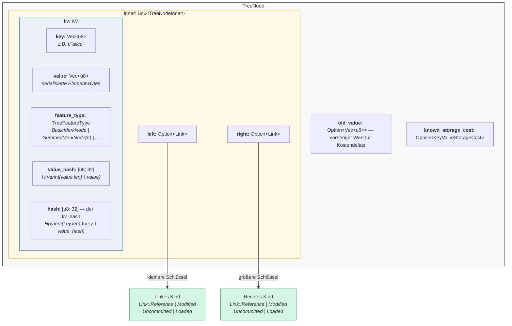

Im Code (`merk/src/tree/mod.rs`):

```rust
pub struct TreeNode {
    pub(crate) inner: Box<TreeNodeInner>,
    pub(crate) old_value: Option<Vec<u8>>,        // Vorheriger Wert für Kostenerfassung
    pub(crate) known_storage_cost: Option<KeyValueStorageCost>,
}

pub struct TreeNodeInner {
    pub(crate) left: Option<Link>,    // Linkes Kind (kleinere Schlüssel)
    pub(crate) right: Option<Link>,   // Rechtes Kind (größere Schlüssel)
    pub(crate) kv: KV,               // Die Schlüssel-Wert-Nutzlast
}
```

Das `Box<TreeNodeInner>` hält den Knoten auf dem Heap, was essenziell ist, da Kind-Links
rekursiv ganze `TreeNode`-Instanzen enthalten können.

## Die KV-Struktur

Die `KV`-Struktur enthält sowohl die Rohdaten als auch ihre kryptographischen Digests
(`merk/src/tree/kv.rs`):

```rust
pub struct KV {
    pub(super) key: Vec<u8>,                        // Der Suchschlüssel
    pub(super) value: Vec<u8>,                      // Der gespeicherte Wert
    pub(super) feature_type: TreeFeatureType,       // Aggregationsverhalten
    pub(crate) value_defined_cost: Option<ValueDefinedCostType>,
    pub(super) hash: CryptoHash,                    // kv_hash
    pub(super) value_hash: CryptoHash,              // H(value)
}
```

Zwei wichtige Punkte:

1. **Schlüssel werden nicht als Teil des kodierten Knotens auf der Festplatte gespeichert.** Sie werden als
   RocksDB-Schlüssel gespeichert. Wenn ein Knoten aus dem Speicher dekodiert wird, wird der Schlüssel von
   außen injiziert. Das vermeidet die Duplizierung von Schlüssel-Bytes.

2. **Zwei Hash-Felder werden gepflegt.** Der `value_hash` ist `H(value)` und der
   `hash` (kv_hash) ist `H(key, value_hash)`. Beide vorzuhalten ermöglicht es dem Beweissystem,
   zu wählen, wie viele Informationen offengelegt werden.

## Die semi-balancierte Natur — Wie AVL "wackelt"

Ein Merk-Baum ist ein **AVL-Baum** — der klassische selbstbalancierende binäre Suchbaum,
erfunden von Adelson-Welski und Landis. Die zentrale Invariante lautet:

> Für jeden Knoten beträgt der Höhenunterschied zwischen seinen linken und rechten Teilbäumen
> höchstens 1.

Dies wird als **Balance-Faktor** (Balancefaktor) ausgedrückt:

```text
balance_factor = rechte_höhe - linke_höhe
```

Gültige Werte: **{-1, 0, 1}**

```rust
// merk/src/tree/mod.rs
pub const fn balance_factor(&self) -> i8 {
    let left_height = self.child_height(true) as i8;
    let right_height = self.child_height(false) as i8;
    right_height - left_height
}
```

Aber hier ist der subtile Punkt: Während jeder einzelne Knoten nur um eine Ebene kippen kann,
können sich diese Neigungen durch den Baum **kumulieren**. Deshalb nennen wir ihn
"semi-balanciert" — der Baum ist nicht perfekt ausgewogen wie ein vollständiger Binärbaum.

Betrachte einen Baum mit 10 Knoten. Ein perfekt ausgewogener Baum hätte die Höhe 4
(⌈log₂(10+1)⌉). Ein AVL-Baum kann jedoch die Höhe 5 haben:

**Perfekt ausgewogen (Höhe 4)** — jede Ebene vollständig gefüllt:

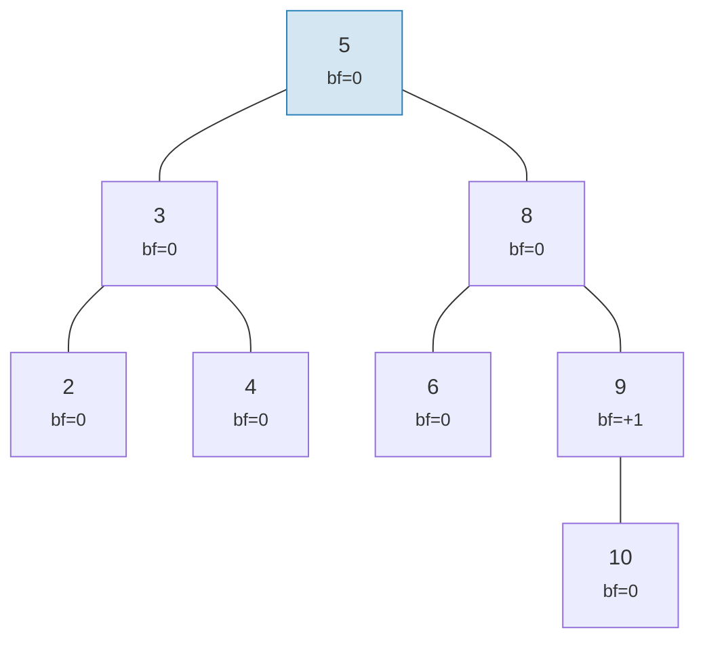

**AVL-gültiges "Wackeln" (Höhe 5)** — jeder Knoten neigt sich höchstens um 1, aber es kumuliert sich:

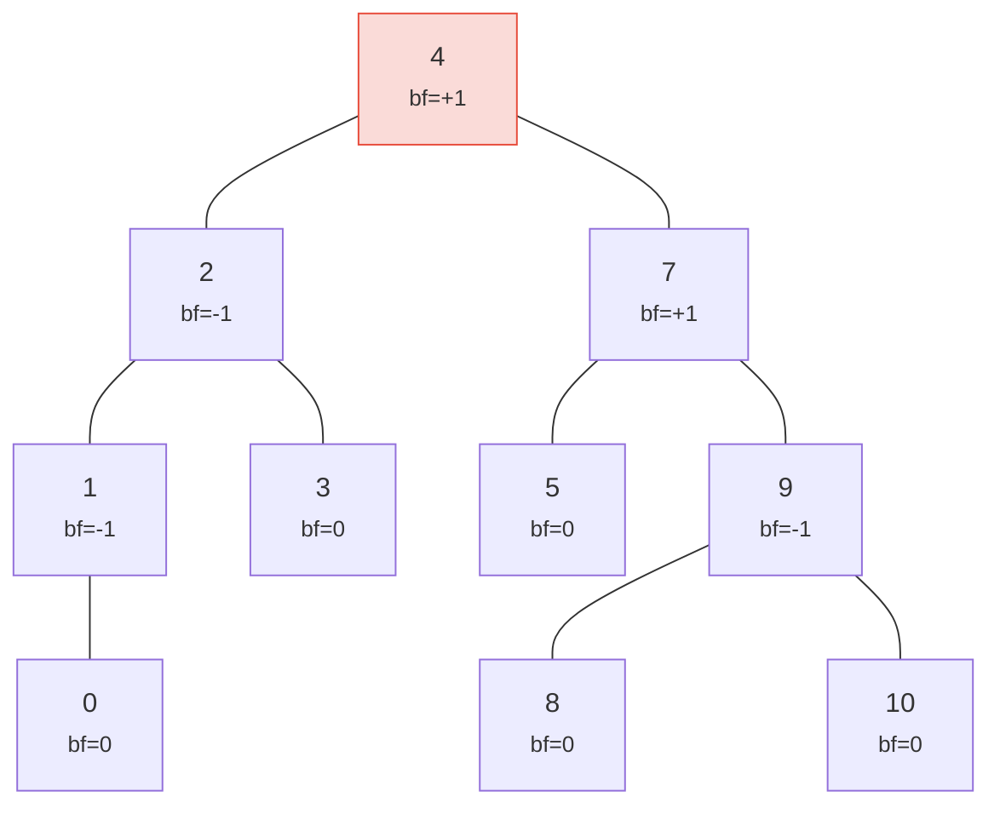

> Höhe 5 versus die perfekte 4 — das ist das "Wackeln". Worst Case: h ≤ 1,44 × log₂(n+2).

Beide Bäume sind gültige AVL-Bäume! Die maximale Höhe eines AVL-Baums im Worst Case beträgt:

```text
h ≤ 1,4404 × log₂(n + 2) − 0,3277
```

Also für **n = 1.000.000** Knoten:
- Perfekte Balance: Höhe 20
- AVL Worst Case: Höhe ≈ 29

Dieser ~44% Overhead ist der Preis für die einfachen Rotationsregeln von AVL. In der Praxis
erzeugen zufällige Einfügungen Bäume, die viel näher an der perfekten Balance liegen.

So sehen gültige und ungültige Bäume aus:

**GÜLTIG** — alle Balance-Faktoren in {-1, 0, +1}:

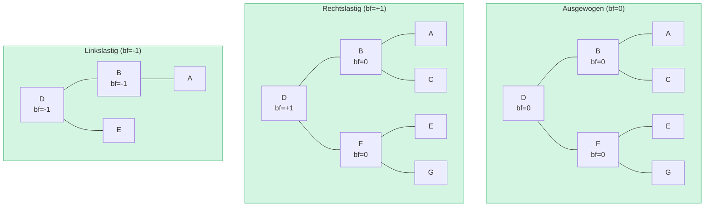

**UNGÜLTIG** — Balance-Faktor = +2 (Rotation erforderlich!):

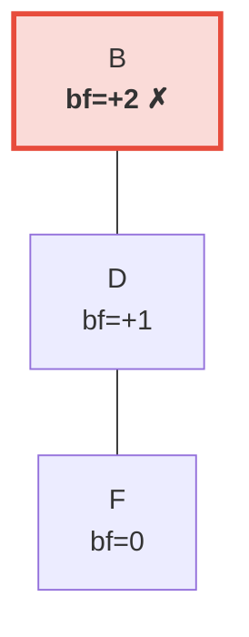

> Der rechte Teilbaum ist 2 Ebenen höher als der linke (der leer ist). Dies löst eine **Linksrotation** aus, um die AVL-Invariante wiederherzustellen.

## Rotationen — Balance wiederherstellen

Wenn eine Einfügung oder Löschung dazu führt, dass ein Balance-Faktor ±2 erreicht, muss der Baum
**rotiert** werden, um die AVL-Invariante wiederherzustellen. Es gibt vier Fälle, die auf
zwei grundlegende Operationen reduziert werden können.

### Einfache Linksrotation

Wird verwendet, wenn ein Knoten **rechtslastig** ist (bf = +2) und sein rechtes Kind
**rechtslastig oder ausgewogen** ist (bf ≥ 0):

**Vorher** (bf=+2):

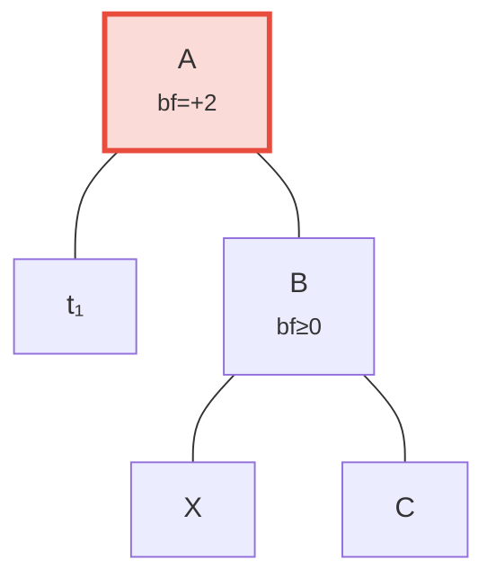

**Nachher** — Linksrotation — B zur Wurzel befördert:

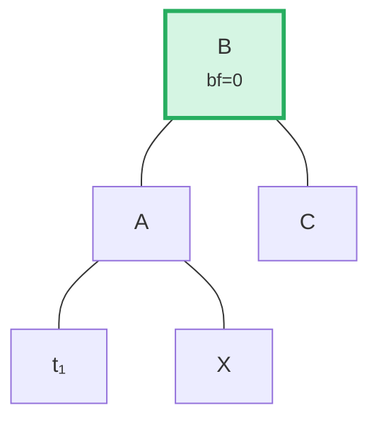

> **Schritte:** (1) B von A abtrennen. (2) X (B's linkes Kind) abtrennen. (3) X als A's rechtes Kind anhängen. (4) A als B's linkes Kind anhängen. Der bei B gewurzelte Teilbaum ist nun ausgewogen.

Im Code (`merk/src/tree/ops.rs`):

```rust
fn rotate<V>(self, left: bool, ...) -> CostResult<Self, Error> {
    // Kind auf der schweren Seite abtrennen
    let (tree, child) = self.detach_expect(left, ...);
    // Enkel von der gegenüberliegenden Seite des Kindes abtrennen
    let (child, maybe_grandchild) = child.detach(!left, ...);

    // Enkel an die ursprüngliche Wurzel anhängen
    tree.attach(left, maybe_grandchild)
        .maybe_balance(...)
        .flat_map_ok(|tree| {
            // Ursprüngliche Wurzel als Kind des beförderten Knotens anhängen
            child.attach(!left, Some(tree))
                .maybe_balance(...)
        })
}
```

Beachte, wie `maybe_balance` rekursiv aufgerufen wird — die Rotation selbst könnte
neue Ungleichgewichte erzeugen, die weitere Korrekturen erfordern.

### Doppelrotation (Links-Rechts)

Wird verwendet, wenn ein Knoten **linkslastig** ist (bf = -2), aber sein linkes Kind
**rechtslastig** ist (bf > 0). Eine einfache Rotation würde das nicht beheben:

**Schritt 0: Vorher** — C ist linkslastig (bf=-2), aber sein linkes Kind A neigt sich nach rechts (bf=+1). Eine einfache Rotation löst das nicht:

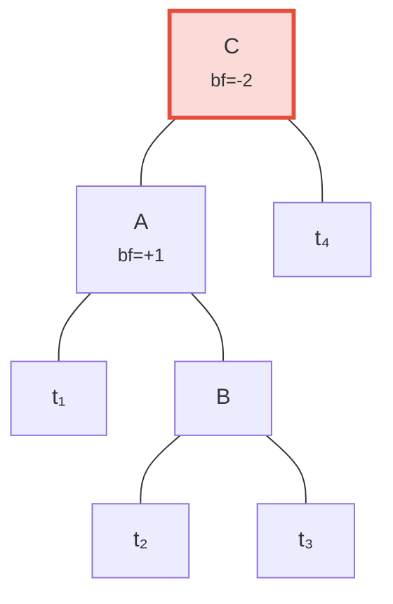

**Schritt 1: Kind A nach links rotieren** — nun neigen sich sowohl C als auch B nach links, behebbar durch eine einfache Rotation:

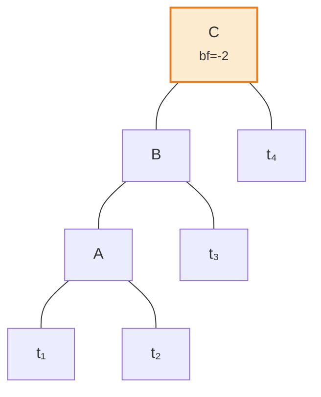

**Schritt 2: Wurzel C nach rechts rotieren** — ausgewogen!

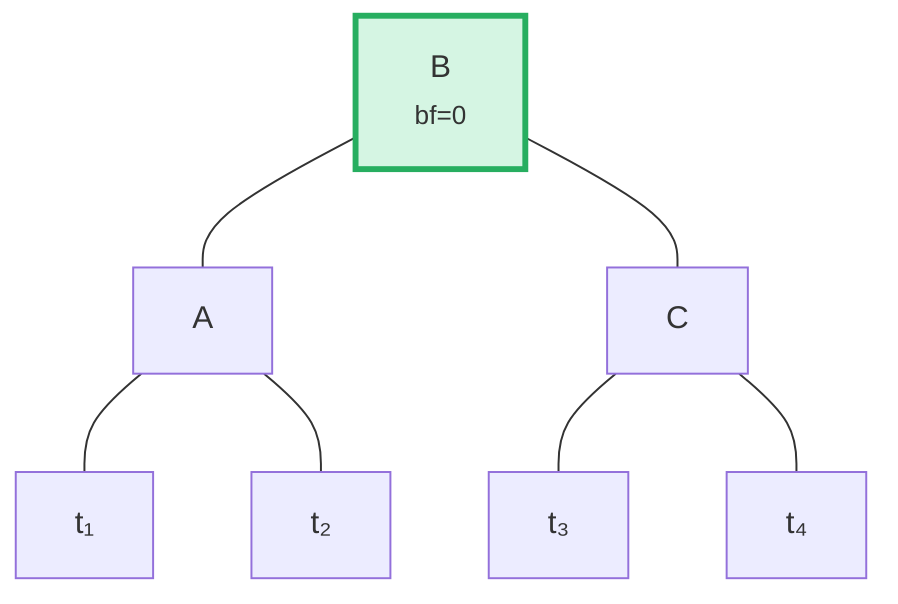

Der Algorithmus erkennt diesen Fall durch Vergleich der Neigungsrichtung des Elternknotens mit dem
Balance-Faktor des Kindes:

```rust
fn maybe_balance<V>(self, ...) -> CostResult<Self, Error> {
    let balance_factor = self.balance_factor();
    if balance_factor.abs() <= 1 {
        return Ok(self);  // Bereits ausgewogen
    }

    let left = balance_factor < 0;  // true wenn linkslastig

    // Doppelrotation nötig, wenn Kind sich entgegengesetzt zum Elternknoten neigt
    let tree = if left == (self.tree().link(left).unwrap().balance_factor() > 0) {
        // Erste Rotation: Kind in entgegengesetzter Richtung rotieren
        self.walk_expect(left, |child|
            child.rotate(!left, ...).map_ok(Some), ...
        )
    } else {
        self
    };

    // Zweite (oder einzige) Rotation
    tree.rotate(left, ...)
}
```

## Stapeloperationen — Aufbau und Anwendung

Anstatt Elemente einzeln einzufügen, unterstützt Merk Stapeloperationen (Batch Operations), die
mehrere Änderungen in einem einzigen Durchgang anwenden. Dies ist entscheidend für die Effizienz: ein Stapel
von N Operationen auf einem Baum mit M Elementen benötigt **O((M + N) log(M + N))** Zeit,
gegenüber O(N log M) für sequentielle Einfügungen.

### Der MerkBatch-Typ

```rust
type MerkBatch<K> = [(K, Op)];

enum Op {
    Put(Vec<u8>, TreeFeatureType),  // Einfügen oder Aktualisieren mit Wert und Feature-Typ
    PutWithSpecializedCost(...),     // Einfügen mit vordefinierten Kosten
    PutCombinedReference(...),       // Einfügen einer Referenz mit kombiniertem Hash
    Replace(Vec<u8>, TreeFeatureType),
    Patch { .. },                    // Teilweise Wertaktualisierung
    Delete,                          // Schlüssel entfernen
    DeleteLayered,                   // Entfernen mit geschichteten Kosten
    DeleteMaybeSpecialized,          // Entfernen mit optionalen spezialisierten Kosten
}
```

### Strategie 1: build() — Aufbau von Grund auf

Wenn der Baum leer ist, konstruiert `build()` einen ausgewogenen Baum direkt aus dem
sortierten Stapel mittels eines **Median-Split-Algorithmus**:

Eingabestapel (sortiert): `[A, B, C, D, E, F, G]` — Mitte (D) als Wurzel wählen, auf jeder Hälfte rekursiv:

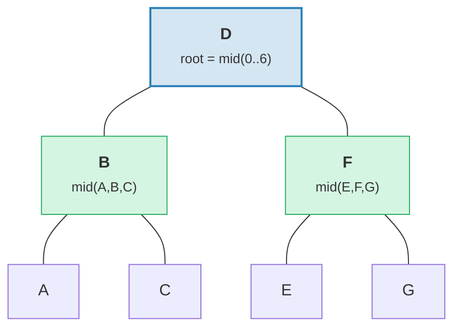

> Ergebnis: perfekt ausgewogener Baum mit Höhe = 3 = ⌈log₂(7)⌉.

```rust
fn build(batch: &MerkBatch<K>, ...) -> CostResult<Option<TreeNode>, Error> {
    let mid_index = batch.len() / 2;
    let (mid_key, mid_op) = &batch[mid_index];

    // Wurzelknoten aus dem mittleren Element erstellen
    let mid_tree = TreeNode::new(mid_key.clone(), value.clone(), None, feature_type)?;

    // Linke und rechte Teilbäume rekursiv aufbauen
    let left = Self::build(&batch[..mid_index], ...);
    let right = Self::build(&batch[mid_index + 1..], ...);

    // Kinder anhängen
    mid_tree.attach(true, left).attach(false, right)
}
```

Dies erzeugt einen Baum mit Höhe ⌈log₂(n)⌉ — perfekt ausgewogen.

### Strategie 2: apply_sorted() — In bestehenden Baum einfügen

Wenn der Baum bereits Daten enthält, verwendet `apply_sorted()` eine **binäre Suche**, um
zu finden, wohin jede Stapeloperation gehört, und wendet dann Operationen rekursiv auf die linken
und rechten Teilbäume an:

Bestehender Baum mit Stapel `[(B, Put), (F, Delete)]`:

Binäre Suche: B < D (gehe links), F > D (gehe rechts).

**Vorher:**
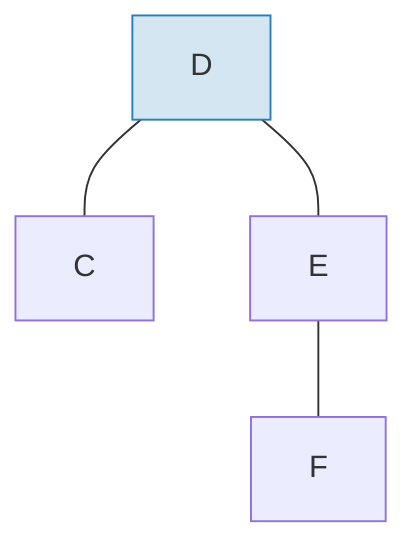

**Nachher** — Stapel angewendet und rebalanciert:
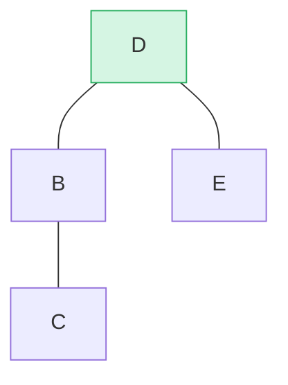

> B als linker Teilbaum eingefügt, F aus dem rechten Teilbaum gelöscht. `maybe_balance()` bestätigt bf(D) = 0.

```rust
fn apply_sorted(self, batch: &MerkBatch<K>, ...) -> CostResult<...> {
    let search = batch.binary_search_by(|(key, _)| key.cmp(self.tree().key()));

    match search {
        Ok(index) => {
            // Schlüssel stimmt mit diesem Knoten überein — Operation direkt anwenden
            // (Put ersetzt den Wert, Delete entfernt den Knoten)
        }
        Err(mid) => {
            // Schlüssel nicht gefunden — mid ist der Teilungspunkt
            // Auf left_batch[..mid] und right_batch[mid..] rekursiv
        }
    }

    self.recurse(batch, mid, exclusive, ...)
}
```

Die `recurse`-Methode teilt den Stapel und traversiert links und rechts:

```rust
fn recurse(self, batch: &MerkBatch<K>, mid: usize, ...) {
    let left_batch = &batch[..mid];
    let right_batch = &batch[mid..];  // oder mid+1 wenn exklusiv

    // Linken Stapel auf den linken Teilbaum anwenden
    let tree = self.walk(true, |maybe_left| {
        Self::apply_to(maybe_left, left_batch, ...)
    });

    // Rechten Stapel auf den rechten Teilbaum anwenden
    let tree = tree.walk(false, |maybe_right| {
        Self::apply_to(maybe_right, right_batch, ...)
    });

    // Nach Modifikationen neu balancieren
    tree.maybe_balance(...)
}
```

### Knotenentfernung

Beim Löschen eines Knotens mit zwei Kindern befördert Merk den **Randknoten** aus dem
höheren Teilbaum. Das minimiert die Wahrscheinlichkeit zusätzlicher Rotationen:

**Vorher** — D wird gelöscht (hat zwei Kinder, rechter Teilbaum Höhe ≥ linker):

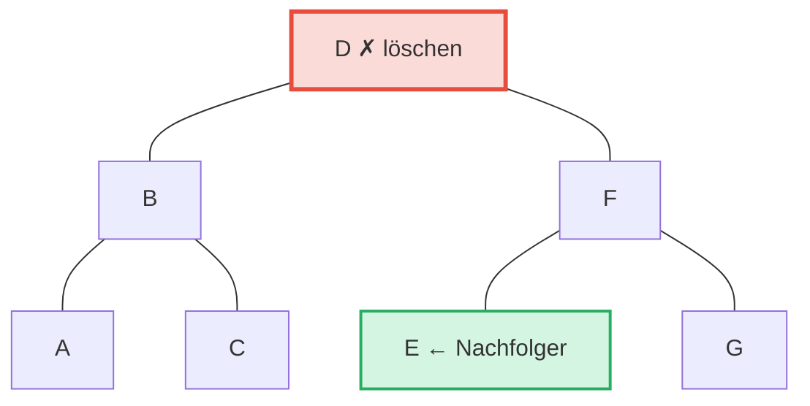

**Nachher** — E (am weitesten links im rechten Teilbaum = Inorder-Nachfolger) auf D's Position befördert:

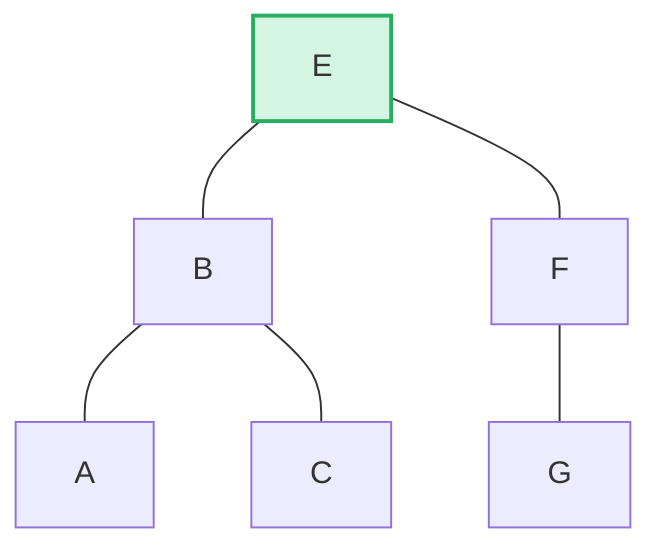

> **Regel:** Wenn linke Höhe > rechte → rechten Rand des linken Teilbaums befördern. Wenn rechte Höhe ≥ linke → linken Rand des rechten Teilbaums befördern. Das minimiert das Rebalancing nach der Löschung.

```rust
pub fn remove(self, ...) -> CostResult<Option<Self>, Error> {
    let has_left = tree.link(true).is_some();
    let has_right = tree.link(false).is_some();
    let left = tree.child_height(true) > tree.child_height(false);

    if has_left && has_right {
        // Zwei Kinder: Rand des höheren Kindes befördern
        let (tree, tall_child) = self.detach_expect(left, ...);
        let (_, short_child) = tree.detach_expect(!left, ...);
        tall_child.promote_edge(!left, short_child, ...)
    } else if has_left || has_right {
        // Ein Kind: direkt befördern
        self.detach_expect(left, ...).1
    } else {
        // Blattknoten: einfach entfernen
        None
    }
}
```

---
