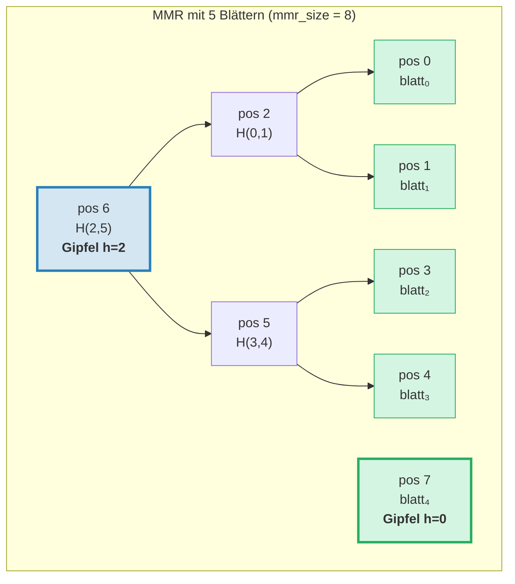
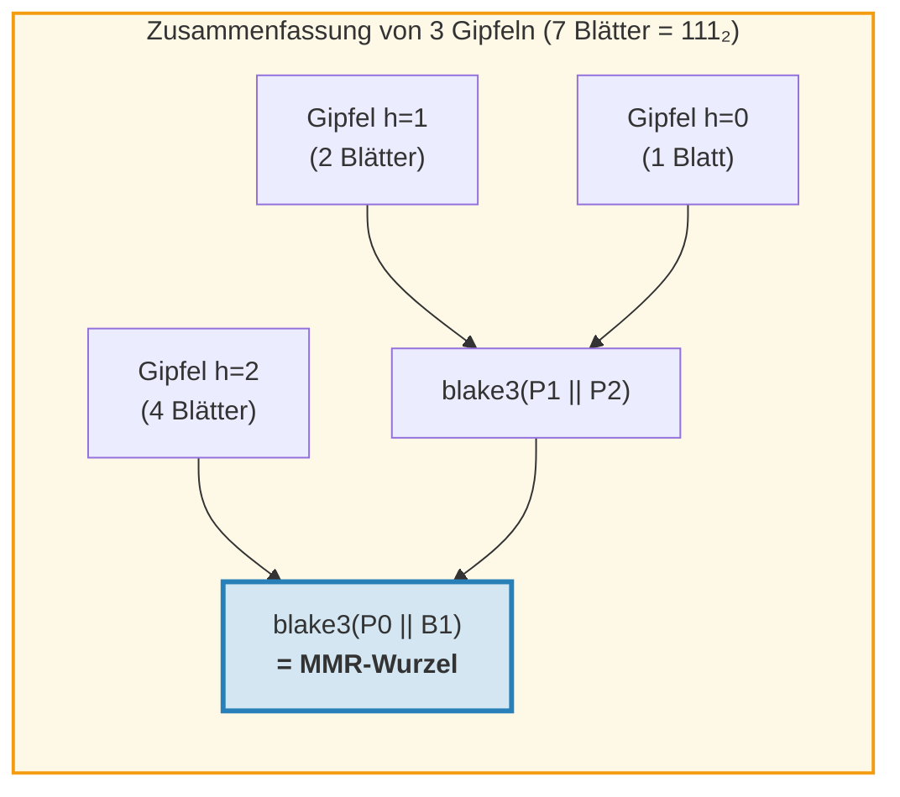
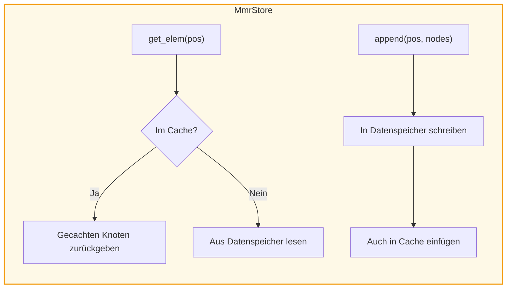
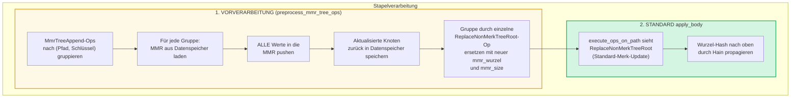
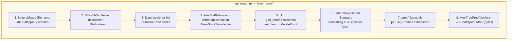
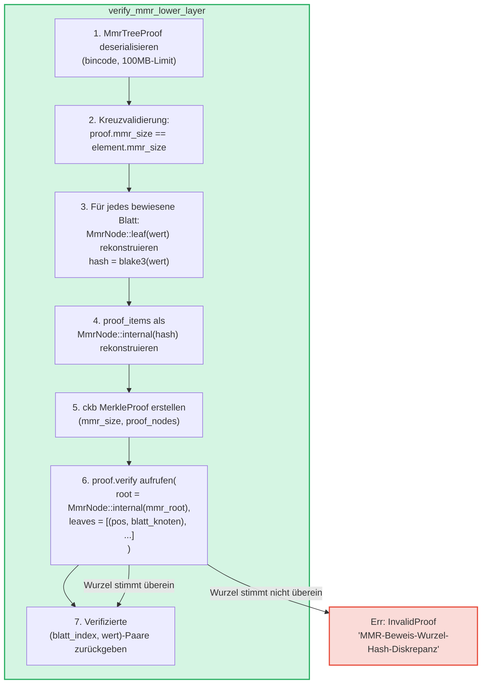

# Der MMR-Baum — Append-Only-authentifizierte Protokolle

Der **MmrTree** ist die Append-Only-authentifizierte Datenstruktur von GroveDB, aufgebaut auf
einer Merkle Mountain Range (MMR) mit Blake3-Hashing. Während Merk-AVL-Bäume
(Kapitel 2) sich durch zufällige Schlüssel-Wert-Operationen mit O(log N)-Aktualisierungen auszeichnen,
sind MMRs speziell für den Append-Only-Fall konzipiert: sie bieten null Rotationen, O(1)
amortisierte Hash-Kosten pro Anhängen und sequentielle I/O-Muster.

Dieses Kapitel behandelt die MMR-Datenstruktur eingehend — wie sie wächst, wie Knoten
gespeichert werden, wie Anhängeoperationen kaskadieren und wie das Beweissystem es jeder
dritten Partei ermöglicht zu verifizieren, dass ein bestimmter Wert an einer bestimmten Position
angehängt wurde.

## Warum ein separater Baumtyp?

Die Standard-Merk-Bäume von GroveDB handhaben geordnete Schlüssel-Wert-Daten gut, aber
Append-Only-Protokolle haben andere Anforderungen:

| Eigenschaft | Merk-AVL-Baum | MMR |
|-------------|--------------|-----|
| Operationen | Einfügen, Aktualisieren, Löschen | Nur Anhängen |
| Rebalancing | O(log N) Rotationen pro Schreibvorgang | Keine |
| I/O-Muster | Zufällig (Rebalancing berührt viele Knoten) | Sequentiell (neue Knoten immer am Ende) |
| Hashes insgesamt für N Einfügungen | O(N log N) | O(N) |
| Struktur | Bestimmt durch Einfügereihenfolge | Nur durch Blattanzahl bestimmt |
| Beweise | Pfad von Wurzel zu Blatt | Geschwister- + Gipfel-Hashes |

Für Anwendungsfälle wie Transaktionsprotokolle, Event-Streams oder beliebige monoton wachsende
Daten ist die MMR strikt besser: einfacher, schneller und vorhersagbarer.

## Die MMR-Datenstruktur

Eine MMR ist ein **Wald perfekter Binärbäume** (genannt "Gipfel" bzw. Peaks), der von links
nach rechts wächst. Jeder Gipfel ist ein vollständiger Binärbaum einer bestimmten Höhe *h*, der
exakt 2^h Blätter enthält.

Die Schlüsselerkenntnis: **Die Binärdarstellung der Blattanzahl bestimmt die
Gipfelstruktur**. Jedes 1-Bit in der Binärform entspricht einem Gipfel:

```text
Blattanzahl   Binär     Gipfel
───────────   ──────    ──────
1             1         ein Gipfel h=0
2             10        ein Gipfel h=1
3             11        Gipfel h=1, h=0
4             100       ein Gipfel h=2
5             101       Gipfel h=2, h=0
6             110       Gipfel h=2, h=1
7             111       Gipfel h=2, h=1, h=0
8             1000      ein Gipfel h=3
```

Das bedeutet, die MMR-Struktur wird vollständig durch eine einzige Zahl bestimmt — die
Blattanzahl. Zwei MMRs mit derselben Blattanzahl haben immer dieselbe Form,
unabhängig davon, welche Werte angehängt wurden.

## Wie sich die MMR füllt

Jeder Knoten in der MMR hat eine **Position** (0-indiziert). Blätter und interne Knoten
sind in einem bestimmten Muster verschachtelt. Hier das schrittweise Wachstum:

**Nach 1 Blatt (mmr_size = 1):**
```text
pos:  0
      blatt₀        ← ein Gipfel der Höhe 0
```

**Nach 2 Blättern (mmr_size = 3):**
```text
pos:     2          ← intern: blake3(blatt₀.hash || blatt₁.hash)
        / \
       0   1        ← Blätter

Ein Gipfel der Höhe 1. Positionen 0 und 1 sind Blätter, Position 2 ist intern.
```
Als blatt₁ angehängt wurde, entstand ein Gipfel der Höhe 0. Aber es gab bereits einen
Gipfel der Höhe 0 (blatt₀), also **verschmolzen** sie zu einem Gipfel der Höhe 1.

**Nach 3 Blättern (mmr_size = 4):**
```text
pos:     2     3    ← Gipfel h=1, Gipfel h=0
        / \
       0   1

Zwei Gipfel. Keine Verschmelzung — Höhen 1 und 0 sind unterschiedlich.
(Binär: 3 = 11₂ → ein Gipfel pro 1-Bit)
```

**Nach 4 Blättern (mmr_size = 7):**
```text
pos:         6              ← intern: Verschmelzung von Knoten 2 und 5
           /   \
         2       5          ← interne Knoten
        / \     / \
       0   1   3   4        ← Blätter

Ein Gipfel der Höhe 2.
```
Hier wird es interessant. Das Anhängen von blatt₃ (Position 4) erzeugt knoten₅
(Verschmelzung der Positionen 3 und 4). Aber nun sind knoten₅ (Höhe 1) und knoten₂ (Höhe 1)
gleichhohe benachbarte Gipfel, also verschmelzen sie zu knoten₆. **Eine Kaskade von zwei
Verschmelzungen durch ein einzelnes Anhängen.**

**Nach 5 Blättern (mmr_size = 8):**
```text
pos:         6         7    ← Gipfel h=2, Gipfel h=0
           /   \
         2       5
        / \     / \
       0   1   3   4

Zwei Gipfel. (Binär: 5 = 101₂)
```

**Nach 7 Blättern (mmr_size = 11):**
```text
pos:         6         10    ← Gipfel h=2, Gipfel h=1, Gipfel h=0
           /   \      / \
         2       5   8   9    7
        / \     / \
       0   1   3   4

Drei Gipfel. (Binär: 7 = 111₂)
```

**Nach 8 Blättern (mmr_size = 15):**
```text
pos:              14                     ← einzelner Gipfel h=3
               /      \
            6            13
          /   \        /    \
        2       5    9       12
       / \     / \  / \     / \
      0   1   3  4 7   8  10  11

Ein Gipfel der Höhe 3. Drei kaskadierende Verschmelzungen durch Anhängen von blatt₇.
```



> **Blau** = Gipfel (Wurzeln perfekter binärer Teilbäume). **Grün** = Blattknoten.

## Die Verschmelzungskaskade

Wenn ein neues Blatt angehängt wird, kann es eine Kette von Verschmelzungen auslösen. Die Anzahl
der Verschmelzungen entspricht der Anzahl der **nachfolgenden 1-Bits** (Trailing Ones) in der Binärdarstellung
der aktuellen Blattanzahl:

| Blattanzahl (vor dem Push) | Binär | Trailing 1s | Verschmelzungen | Hash-Aufrufe gesamt |
|----------------------------|-------|-------------|-----------------|---------------------|
| 0 | `0` | 0 | 0 | 1 (nur Blatt) |
| 1 | `1` | 1 | 1 | 2 |
| 2 | `10` | 0 | 0 | 1 |
| 3 | `11` | 2 | 2 | 3 |
| 4 | `100` | 0 | 0 | 1 |
| 5 | `101` | 1 | 1 | 2 |
| 6 | `110` | 0 | 0 | 1 |
| 7 | `111` | 3 | 3 | 4 |

**Hash-Aufrufe gesamt pro Push** = `1 + trailing_ones(blattanzahl)`:
- 1 Hash für das Blatt selbst: `blake3(wert)`
- N Hashes für die Verschmelzungskaskade: `blake3(links.hash || rechts.hash)` für jede
  Verschmelzung

So verfolgt GroveDB die Hash-Kosten für jedes Anhängen. Die Implementierung:
```rust
pub fn hash_count_for_push(leaf_count: u64) -> u32 {
    1 + leaf_count.trailing_ones()
}
```

## MMR-Größe vs. Blattanzahl

Die MMR speichert sowohl Blätter als auch interne Knoten in einem flachen Positionsraum, daher
ist `mmr_size` immer größer als die Blattanzahl. Die exakte Beziehung ist:

```text
mmr_size = 2 * blattanzahl - popcount(blattanzahl)
```

wobei `popcount` die Anzahl der 1-Bits ist (d.h. die Anzahl der Gipfel). Jeder
interne Knoten verschmilzt zwei Teilbäume und reduziert die Knotenanzahl um eins pro Verschmelzung.

Die umgekehrte Berechnung — Blattanzahl aus mmr_size — verwendet die Gipfelpositionen:

```rust
fn mmr_size_to_leaf_count(mmr_size: u64) -> u64 {
    // Jeder Gipfel der Höhe h enthält 2^h Blätter
    get_peaks(mmr_size).iter()
        .map(|&peak_pos| 1u64 << pos_height_in_tree(peak_pos))
        .sum()
}
```

| mmr_size | blattanzahl | Gipfel |
|----------|------------|--------|
| 0 | 0 | (leer) |
| 1 | 1 | h=0 |
| 3 | 2 | h=1 |
| 4 | 3 | h=1, h=0 |
| 7 | 4 | h=2 |
| 8 | 5 | h=2, h=0 |
| 10 | 6 | h=2, h=1 |
| 11 | 7 | h=2, h=1, h=0 |
| 15 | 8 | h=3 |

GroveDB speichert `mmr_size` im Element (nicht die Blattanzahl), weil die ckb-MMR-
Bibliothek intern mit Positionen arbeitet. Die `mmr_tree_leaf_count`-Operation leitet
die Blattanzahl spontan ab.

## MMR-Wurzel-Hash — Die Gipfel zusammenfassen

Eine MMR hat mehrere Gipfel (einen pro 1-Bit in der Blattanzahl). Um einen
einzelnen 32-Byte-Wurzel-Hash zu erzeugen, werden die Gipfel von rechts nach links **"zusammengefasst"** (Bagging):

```text
root = bag_rhs_peaks(gipfel):
    mit dem rechtesten Gipfel beginnen
    nach links falten: blake3(linker_gipfel || akkumulierter_rechter)
```

Mit 1 Gipfel ist die Wurzel einfach der Hash dieses Gipfels. Mit 3 Gipfeln:



> Der Wurzel-Hash ändert sich mit **jedem** Anhängen, auch wenn keine Verschmelzungen auftreten,
> weil sich der rechteste Gipfel ändert und die Zusammenfassung neu berechnet werden muss.

## Knotenstruktur und Serialisierung

Jeder MMR-Knoten ist ein `MmrNode`:

```rust
struct MmrNode {
    hash: [u8; 32],           // Blake3-Hash
    value: Option<Vec<u8>>,   // Some für Blätter, None für interne Knoten
}
```

**Blattknoten:** `hash = blake3(wert_bytes)`, `value = Some(wert_bytes)`
**Interner Knoten:** `hash = blake3(links.hash || rechts.hash)`, `value = None`

Die Verschmelzungsfunktion ist unkompliziert — zwei 32-Byte-Hashes konkatenieren und
das Ergebnis mit Blake3 hashen:

```rust
fn blake3_merge(left: &[u8; 32], right: &[u8; 32]) -> [u8; 32] {
    let mut input = [0u8; 64];
    input[..32].copy_from_slice(left);
    input[32..].copy_from_slice(right);
    *blake3::hash(&input).as_bytes()
}
```

> **Hinweis zu PartialEq:** `MmrNode` implementiert `PartialEq` nur durch Vergleich des
> **Hash-Feldes**, nicht des Wertes. Dies ist entscheidend für die Beweisverifikation: Der
> ckb-Verifizierer vergleicht eine rekonstruierte Wurzel (value = None) mit der erwarteten
> Wurzel. Wenn PartialEq das Wertfeld vergleichen würde, würden Einzel-Blatt-MMR-Beweise
> immer fehlschlagen, weil das Blatt `value: Some(...)` hat, die Wurzelrekonstruktion aber
> `value: None` erzeugt.

**Serialisierungsformat:**
```text
Intern: [0x00] [hash: 32 Bytes]                                = 33 Bytes
Blatt:  [0x01] [hash: 32 Bytes] [wert_länge: 4 BE] [wert...]  = 37 + Länge Bytes
```

Das Flag-Byte unterscheidet interne Knoten von Blättern. Die Deserialisierung validiert
exakte Länge — keine nachfolgenden Bytes erlaubt.

## Speicherarchitektur

MmrTree speichert seine Knoten in der **Daten**-Spalte (derselben Spaltenfamilie wie
Merk-Knoten), nicht in einem Kind-Merk-Teilbaum. Das Element hat kein `root_key`-
Feld — der MMR-Wurzel-Hash fließt als Merk-**Kind-Hash** über
`insert_subtree(subtree_root_hash)` und authentifiziert so den MMR-Zustand.

**Speicherschlüssel** sind positionsbasiert:
```text
schlüssel = 'm' || position_als_be_u64    (9 Bytes: Präfix + u64 BE)
```

Also wird Position 42 unter Schlüssel `[0x6D, 0x00, 0x00, 0x00, 0x00, 0x00, 0x00,
0x00, 0x2A]` gespeichert.

Das Nachschlagen von Blatt *i* erfordert zuerst die Berechnung der MMR-Position:
`pos = leaf_index_to_pos(i)`, dann Lesen des Datenschlüssels `m{pos}`.

**Durchschreibe-Cache:** Während des Anhängens müssen neu geschriebene Knoten für
nachfolgende Verschmelzungen im selben Push sofort lesbar sein. Da der transaktionale
Speicher von GroveDB Schreibvorgänge auf einen Batch verschiebt (sie sind für Lesevorgänge
erst nach dem Commit sichtbar), umhüllt ein `MmrStore`-Adapter den Speicherkontext mit einer
In-Memory-`HashMap`-Cache:



Dies stellt sicher, dass wenn das Anhängen von blatt₃ eine Verschmelzungskaskade auslöst (die
interne Knoten an den Positionen 5 und 6 erzeugt), knoten₅ sofort verfügbar ist, wenn
knoten₆ berechnet wird, obwohl knoten₅ noch nicht in RocksDB committed wurde.

**Wurzel-Hash-Propagierung zur GroveDB-Zustandswurzel:**

```text
combined_value_hash = blake3(
    blake3(varint(len) || element_bytes),   ← value_hash aus serialisiertem Element
    mmr_root_hash                           ← child_hash = typspezifische Wurzel
)
```

Der MMR-Wurzel-Hash fließt als Merk-Kind-Hash über `insert_subtree`. Jede Änderung
am MMR-Zustand erzeugt einen anderen `combined_value_hash`, der sich durch die
Eltern-Merk-Hierarchie bis zur GroveDB-Zustandswurzel nach oben propagiert.

## GroveDB-Operationen

MmrTree bietet vier Operationen:

```rust
// Wert anhängen — gibt (neue_mmr_wurzel, blatt_index) zurück
db.mmr_tree_append(path, key, value, tx, version)

// Aktuellen Wurzel-Hash lesen (aus Element, kein Speicherzugriff)
db.mmr_tree_root_hash(path, key, tx, version)

// Blattwert nach 0-basiertem Index abrufen
db.mmr_tree_get_value(path, key, leaf_index, tx, version)

// Anzahl der angehängten Blätter abrufen
db.mmr_tree_leaf_count(path, key, tx, version)
```

### Anhänge-Ablauf

Die Anhängeoperation ist die komplexeste und führt 8 Schritte durch:

```mermaid
graph TD
    subgraph append["mmr_tree_append(path, key, value, tx)"]
        A1["1. Element bei path/key lesen<br/>→ mmr_size, flags abrufen"]
        A2["2. Datenspeicher bei<br/>path/key-Teilbaum öffnen"]
        A3["3. MmrNode::leaf(value) erstellen<br/>hash = blake3(value)"]
        A4["4. Blatt in ckb-MMR pushen<br/>→ kaskadierende Verschmelzungen<br/>schreiben neue interne Knoten"]
        A5["5. Commit → neue Knoten<br/>in Speicher flushen"]
        A6["6. Gipfel zusammenfassen → neue mmr_wurzel"]
        A7["7. Element mit neuer<br/>mmr_wurzel und mmr_size aktualisieren"]
        A8["8. Änderungen nach oben durch<br/>GroveDB-Merk-Hierarchie<br/>propagieren + tx committen"]

        A1 --> A2 --> A3 --> A4 --> A5 --> A6 --> A7 --> A8
    end

    style append fill:#d5f5e3,stroke:#27ae60,stroke-width:2px
    style A6 fill:#d4e6f1,stroke:#2980b9,stroke-width:2px
```



Schritt 4 kann 1 Knoten (nur Blatt) oder 1 + N Knoten (Blatt + N interne Verschmelzungs-
Knoten) schreiben. Schritt 5 ruft `mmr.commit()` auf, das den ckb-MemStore in den
MmrStore flusht. Schritt 7 ruft `insert_subtree` mit der neuen MMR-Wurzel als Kind-Hash
auf (über `subtree_root_hash`), da MmrTree keinen Kind-Merk hat.

### Leseoperationen

`mmr_tree_root_hash` berechnet die Wurzel aus den MMR-Daten im Speicher.
`mmr_tree_leaf_count` leitet die Blattanzahl aus `mmr_size` im Element ab.
Kein Datenspeicherzugriff nötig.

`mmr_tree_get_value` berechnet `pos = leaf_index_to_pos(leaf_index)`, liest
den einzelnen Datenspeichereintrag bei `m{pos}`, deserialisiert den `MmrNode` und
gibt `node.value` zurück.

## Stapeloperationen

Mehrere MMR-Anhänge können mittels `GroveOp::MmrTreeAppend { value }` gebündelt werden.
Da die Standard-Stapelfunktion `execute_ops_on_path` nur Zugriff auf den
Merk (nicht den Speicherkontext der MMR) hat, verwenden MMR-Anhänge eine **Vorverarbeitungsphase**:



Beispiel: Ein Stapel mit 3 Anhängen an dieselbe MMR:
```rust
vec![
    QualifiedGroveDbOp { path: p, key: k, op: MmrTreeAppend { value: v1 } },
    QualifiedGroveDbOp { path: p, key: k, op: MmrTreeAppend { value: v2 } },
    QualifiedGroveDbOp { path: p, key: k, op: MmrTreeAppend { value: v3 } },
]
```

Die Vorverarbeitung lädt die MMR einmal, pusht v1, v2, v3 (erzeugt alle Zwischenknoten),
speichert alles in den Datenspeicher und gibt dann ein einzelnes `ReplaceNonMerkTreeRoot`
mit der finalen `mmr_wurzel` und `mmr_size` aus. Die Standard-Stapelmaschinerie erledigt
den Rest.

## Beweiserzeugung

MMR-Beweise sind **V1-Beweise** — sie verwenden die `ProofBytes::MMR`-Variante in der
geschichteten Beweisstruktur (siehe §9.6). Der Beweis demonstriert, dass bestimmte Blatt-
werte an bestimmten Positionen innerhalb der MMR existieren und dass ihre Hashes
mit der im Eltern-Element gespeicherten `mmr_root` konsistent sind.

### Abfragekodierung

Abfrageschlüssel kodieren Positionen als **Big-Endian-u64-Bytes**. Dies bewahrt die
lexikographische Sortierreihenfolge (da BE-Kodierung monoton ist), sodass alle Standard-
`QueryItem`-Varianten funktionieren:

```text
QueryItem::Key([0,0,0,0,0,0,0,5])            → Blattindex 5
QueryItem::RangeInclusive([..2]..=[..7])      → Blattindizes [2, 3, 4, 5, 6, 7]
QueryItem::RangeFrom([..10]..)                → Blattindizes [10, 11, ..., N-1]
QueryItem::RangeFull                          → alle Blätter [0..blattanzahl)
```

Eine Sicherheitsobergrenze von **10.000.000 Indizes** verhindert Speichererschöpfung durch
unbegrenzte Bereichsabfragen. Eine leere MMR (null Blätter) gibt einen leeren Beweis zurück.

### Die MmrTreeProof-Struktur

```rust
struct MmrTreeProof {
    mmr_size: u64,                 // MMR-Größe zum Beweiszeitpunkt
    leaves: Vec<(u64, Vec<u8>)>,   // (blatt_index, wert) für jedes bewiesene Blatt
    proof_items: Vec<[u8; 32]>,    // Geschwister-/Gipfel-Hashes für Verifikation
}
```

Die `proof_items` enthalten die minimale Menge an Hashes, die benötigt wird, um
Pfade von den bewiesenen Blättern bis zur MMR-Wurzel zu rekonstruieren. Das sind die Geschwisterknoten
auf jeder Ebene und die nicht beteiligten Gipfel-Hashes.

### Erzeugungsablauf



Schritt 4 verwendet einen `MemNodeStore` — eine schreibgeschützte BTreeMap, die alle MMR-
Knoten aus dem Datenspeicher vorab lädt. Der ckb-Beweiserzeuger benötigt wahlfreien Zugriff,
daher müssen alle Knoten im Speicher sein.

Schritt 5 ist, wo die ckb-Bibliothek die Hauptarbeit leistet: Anhand der MMR-Größe und
der zu beweisenden Positionen bestimmt sie, welche Geschwister- und Gipfel-Hashes benötigt werden.

### Ausgearbeitetes Beispiel

**Beweis von Blatt 2 in einer 5-Blatt-MMR (mmr_size = 8):**

```text
MMR-Struktur:
pos:         6         7
           /   \
         2       5
        / \     / \
       0   1   3   4

Blattindex 2 → MMR-Position 3

Zur Verifikation des Blatts an Position 3:
  1. Behaupteten Wert hashen: blatt_hash = blake3(wert)
  2. Geschwister an Position 4:  knoten₅ = blake3(blatt_hash || beweis[pos 4])
  3. Geschwister an Position 2:  knoten₆ = blake3(beweis[pos 2] || knoten₅)
  4. Gipfel an Position 7:      wurzel  = bag(knoten₆, beweis[pos 7])
  5. Vergleich: wurzel == erwartete mmr_wurzel ✓

proof_items = [hash(pos 4), hash(pos 2), hash(pos 7)]
leaves = [(2, original_wert_bytes)]
```

Die Beweisgröße für dieses Beispiel beträgt: 3 Hashes (96 Bytes) + 1 Blattwert +
Metadaten. Im Allgemeinen erfordert der Beweis von K Blättern aus einer N-Blatt-MMR
O(K * log N) Geschwister-Hashes.

## Beweisverifikation

Die Verifikation ist **pur** — sie erfordert keinen Datenbankzugriff. Der Verifizierer benötigt
nur die Beweis-Bytes und den erwarteten MMR-Wurzel-Hash (den er aus dem
in der darüber liegenden Merk-Schicht bewiesenen Eltern-Element extrahiert).

### Verifikationsschritte



Die ckb-Funktion `MerkleProof::verify` rekonstruiert die Wurzel aus den Blättern
und Beweis-Elementen und vergleicht sie dann (mittels `PartialEq`, das nur den
Hash prüft) mit der erwarteten Wurzel.

### Vertrauenskette

Die vollständige Kette von der GroveDB-Zustandswurzel zu einem verifizierten Blattwert:

```text
GroveDB state_root (bekannt/vertrauenswürdig)
│
├─ V0-Merk-Beweisschicht 0: beweist, dass Teilbaum an der Wurzel existiert
│   └─ root_hash stimmt mit state_root überein ✓
│
├─ V0-Merk-Beweisschicht 1: beweist MmrTree-Element bei path/key
│   └─ KVValueHash-Knoten: element_bytes enthalten mmr_root
│   └─ combined_hash = combine_hash(H(element_bytes), mmr_root)
│   └─ root_hash stimmt mit Elternschicht überein ✓
│
└─ V1-MMR-Beweis: beweist, dass Blattwerte in der MMR sind
    └─ Pfade von Blättern durch Geschwister zu Gipfeln rekonstruieren
    └─ Gipfel zusammenfassen → rekonstruierte Wurzel
    └─ rekonstruierte Wurzel == mmr_root aus element_bytes ✓
    └─ Ergebnis: blatt₂ = [verifizierte Wert-Bytes]
```

### Sicherheitseigenschaften

- **mmr_size-Kreuzvalidierung:** Die `mmr_size` des Beweises muss mit der
  `mmr_size` des Elements übereinstimmen. Eine Diskrepanz zeigt an, dass der Beweis gegen
  einen anderen Zustand erzeugt wurde und wird abgelehnt.
- **Bincode-Größenlimit:** Die Deserialisierung verwendet ein 100MB-Limit, um zu verhindern, dass
  manipulierte Längenheader riesige Allokationen verursachen.
- **Limit-Abrechnung:** Jedes bewiesene Blatt dekrementiert das Gesamtabfragelimit um
  1 mittels `saturating_sub`, um Unterlauf zu verhindern.
- **Kind-Hash-Rückgabe:** Der Verifizierer gibt die berechnete MMR-Wurzel als Kind-Hash
  für die combine_hash-Berechnung in der Elternschicht zurück.
- **V0-Ablehnung:** Der Versuch, mit V0-Beweisen in einen MmrTree abzusteigen,
  gibt `Error::NotSupported` zurück. Nur V1-Beweise können in Nicht-Merk-Bäume absteigen.

## Kostenerfassung

MMR-Operationen erfassen Kosten mit Präzision:

| Operation | Hash-Aufrufe | Speicheroperationen |
|-----------|-------------|---------------------|
| 1 Blatt anhängen | `1 + trailing_ones(blattanzahl)` | 1 Blatt-Schreibvorgang + N interne Schreibvorgänge |
| Wurzel-Hash | 0 (im Element gecacht) | 1 Element-Lesevorgang |
| Wert abrufen | 0 | 1 Element-Lesevorgang + 1 Daten-Lesevorgang |
| Blattanzahl | 0 | 1 Element-Lesevorgang |

Die Hash-Zahl-Formel `1 + trailing_ones(N)` ergibt die exakte Anzahl der Blake3-
Aufrufe: 1 für den Blatt-Hash plus einen Verschmelzungs-Hash pro Kaskadenebene.

**Amortisierte Analyse:** Über N Anhänge beträgt die Gesamtzahl der Hash-Aufrufe:

```text
Σ (1 + trailing_ones(i)) für i = 0..N-1
= N + Σ trailing_ones(i) für i = 0..N-1
= N + (N - popcount(N))
≈ 2N
```

Die amortisierten Kosten pro Anhängen betragen also ungefähr **2 Blake3-Hash-Aufrufe** —
konstant und unabhängig von der Baumgröße. Vergleiche dies mit Merk-AVL-Bäumen, bei denen
jede Einfügung O(log N) Hashes für den Pfad plus potentielle Rotations-Hashes erfordert.

**Speicherkosten:** Jedes Anhängen schreibt 1 Blattknoten (37 + wert_länge Bytes) plus
0 bis log₂(N) interne Knoten (je 33 Bytes). Der amortisierte Speicher-Schreibvorgang pro
Anhängen beträgt ungefähr 33 + 37 + wert_länge Bytes ≈ 70 + wert_länge Bytes.

## Implementierungsdateien

| Datei | Zweck |
|-------|-------|
| `grovedb-mmr/src/node.rs` | `MmrNode`-Struct, Blake3-Verschmelzung, Serialisierung |
| `grovedb-mmr/src/grove_mmr.rs` | `GroveMmr`-Wrapper um ckb-MMR |
| `grovedb-mmr/src/util.rs` | `mmr_node_key`, `hash_count_for_push`, `mmr_size_to_leaf_count` |
| `grovedb-mmr/src/proof.rs` | `MmrTreeProof`-Erzeugung und -Verifikation |
| `grovedb-mmr/src/dense_merkle.rs` | Dichte Merkle-Baum-Wurzeln (verwendet von BulkAppendTree) |
| `grovedb/src/operations/mmr_tree.rs` | GroveDB-Operationen + `MmrStore`-Adapter + Stapelvorverarbeitung |
| `grovedb/src/operations/proof/generate.rs` | V1-Beweiserzeugung: `generate_mmr_layer_proof`, `query_items_to_leaf_indices` |
| `grovedb/src/operations/proof/verify.rs` | V1-Beweisverifikation: `verify_mmr_lower_layer` |
| `grovedb/src/tests/mmr_tree_tests.rs` | 28 Integrationstests |

## Vergleich mit anderen authentifizierten Strukturen

| | MMR (MmrTree) | Merk-AVL (Tree) | Sinsemilla (CommitmentTree) |
|---|---|---|---|
| **Anwendungsfall** | Append-Only-Protokolle | Schlüssel-Wert-Speicher | ZK-freundliche Commitments |
| **Hash-Funktion** | Blake3 | Blake3 | Sinsemilla (Pallas-Kurve) |
| **Operationen** | Anhängen, nach Index lesen | Einfügen, Aktualisieren, Löschen, Abfragen | Anhängen, Witness |
| **Amortisierte Hashes/Schreibvorgang** | ~2 | O(log N) | ~33 (32 Ebenen + Ommer) |
| **Beweistyp** | V1 (MMR-Geschwister-Hashes) | V0 (Merk-Pfad-Beweis) | Witness (Merkle-Auth-Pfad) |
| **ZK-freundlich** | Nein | Nein | Ja (Halo 2-Schaltkreise) |
| **Rebalancing** | Keines | AVL-Rotationen | Keines |
| **Löschunterstützung** | Nein | Ja | Nein |

---
