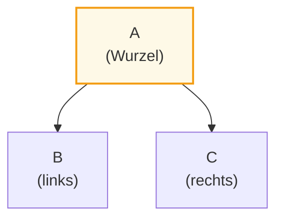
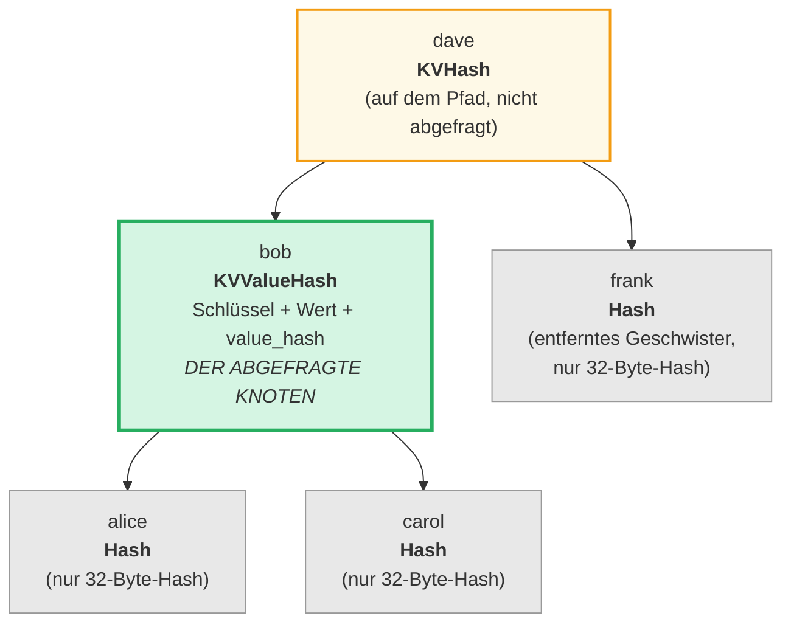
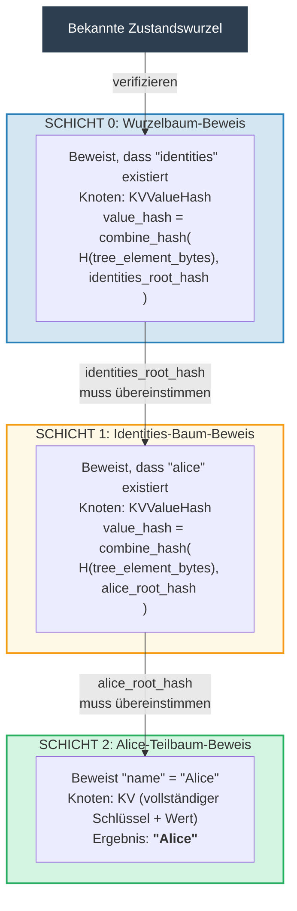
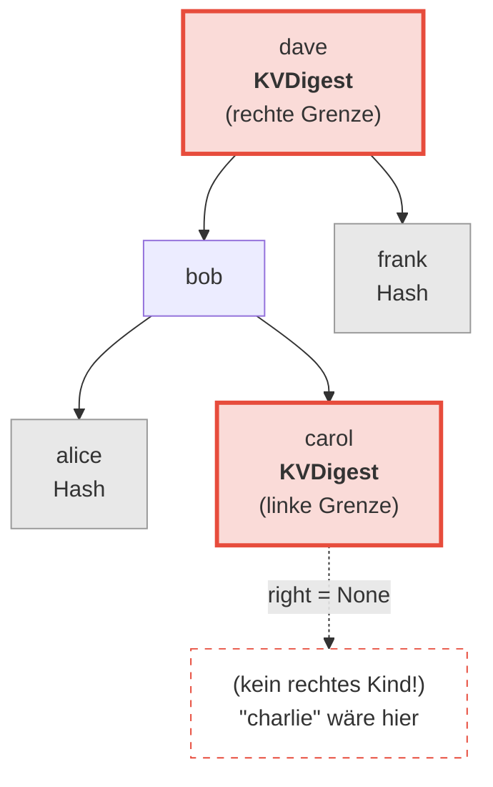
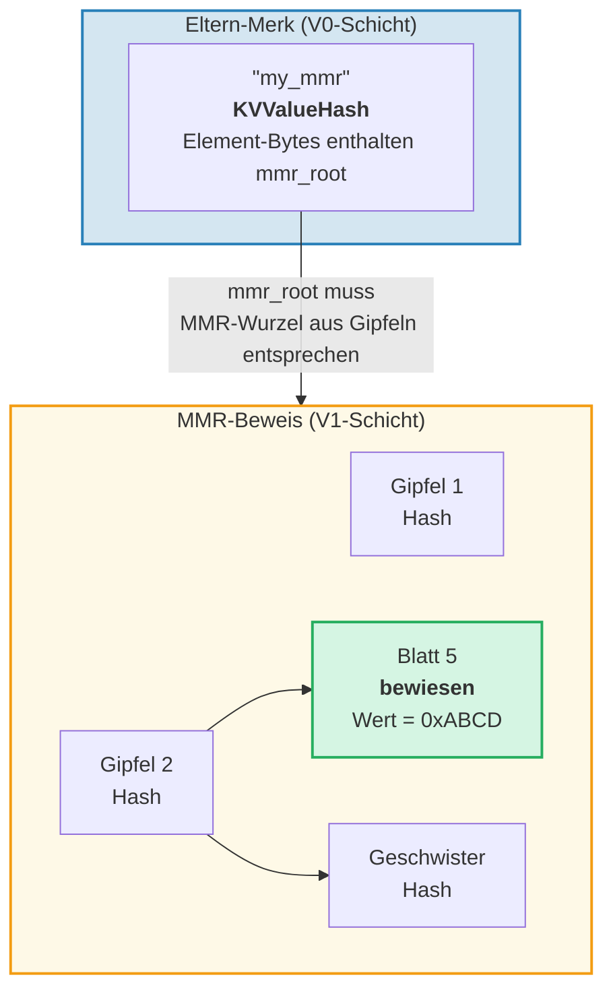
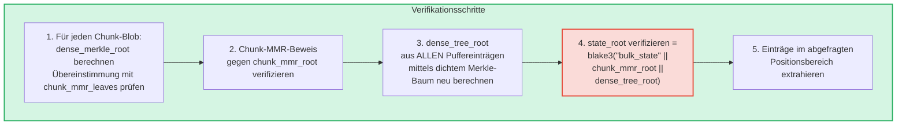
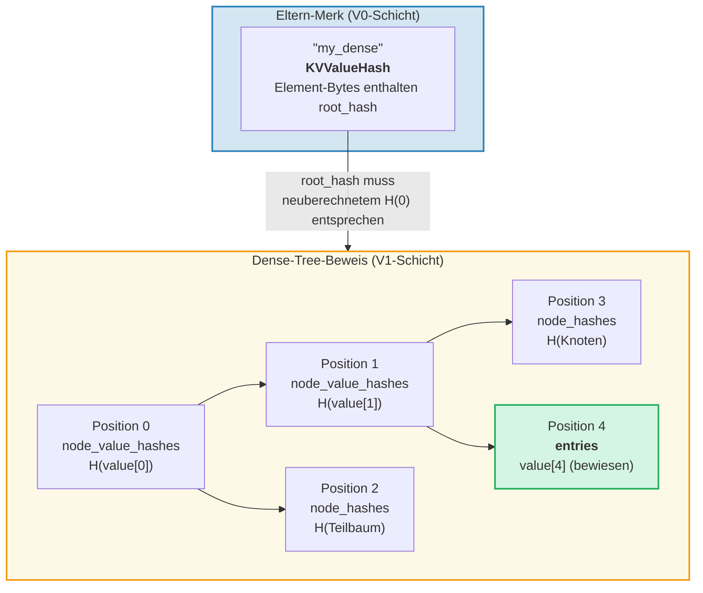

# Das Beweissystem

Das Beweissystem von GroveDB ermöglicht es jeder Partei, die Korrektheit von Abfrageergebnissen
zu verifizieren, ohne die vollständige Datenbank zu besitzen. Ein Beweis (Proof) ist eine kompakte
Darstellung der relevanten Baumstruktur, die die Rekonstruktion des Wurzel-Hashs erlaubt.

## Stack-basierte Beweisoperationen

Beweise werden als Sequenz von **Operationen** kodiert, die einen partiellen Baum
mittels einer Stapelmaschine (Stack Machine) rekonstruieren:

```rust
// merk/src/proofs/mod.rs
pub enum Op {
    Push(Node),        // Knoten auf den Stapel legen (aufsteigende Schlüsselreihenfolge)
    PushInverted(Node),// Knoten legen (absteigende Schlüsselreihenfolge)
    Parent,            // Eltern abheben, Kind abheben → Kind als LINKS des Eltern anhängen
    Child,             // Kind abheben, Eltern abheben → Kind als RECHTS des Eltern anhängen
    ParentInverted,    // Eltern abheben, Kind abheben → Kind als RECHTS des Eltern anhängen
    ChildInverted,     // Kind abheben, Eltern abheben → Kind als LINKS des Eltern anhängen
}
```

Ausführung mit einem Stapel:

Beweis-Ops: `Push(B), Push(A), Parent, Push(C), Child`

| Schritt | Operation | Stapel (oben→rechts) | Aktion |
|---------|-----------|---------------------|--------|
| 1 | Push(B) | [ B ] | B auf den Stapel legen |
| 2 | Push(A) | [ B , A ] | A auf den Stapel legen |
| 3 | Parent | [ A{left:B} ] | A (Eltern) abheben, B (Kind) abheben, B → LINKS von A |
| 4 | Push(C) | [ A{left:B} , C ] | C auf den Stapel legen |
| 5 | Child | [ A{left:B, right:C} ] | C (Kind) abheben, A (Eltern) abheben, C → RECHTS von A |

Endergebnis — ein Baum auf dem Stapel:



> Der Verifizierer berechnet `node_hash(A) = Blake3(kv_hash_A || node_hash_B || node_hash_C)` und prüft, ob es mit dem erwarteten Wurzel-Hash übereinstimmt.

Dies ist die `execute`-Funktion (`merk/src/proofs/tree.rs`):

```rust
pub fn execute<I, F>(ops: I, collapse: bool, mut visit_node: F) -> CostResult<Tree, Error>
where
    I: IntoIterator<Item = Result<Op, Error>>,
    F: FnMut(&Node) -> Result<(), Error>,
{
    let mut stack: Vec<Tree> = Vec::with_capacity(32);

    for op in ops {
        match op? {
            Op::Parent => {
                let (mut parent, child) = (try_pop(&mut stack), try_pop(&mut stack));
                parent.left = Some(Child { tree: Box::new(child), hash: child.hash() });
                stack.push(parent);
            }
            Op::Child => {
                let (child, mut parent) = (try_pop(&mut stack), try_pop(&mut stack));
                parent.right = Some(Child { tree: Box::new(child), hash: child.hash() });
                stack.push(parent);
            }
            Op::Push(node) => {
                visit_node(&node)?;
                stack.push(Tree::from(node));
            }
            // ... Invertierte Varianten tauschen links/rechts
        }
    }
    // Letztes Element auf dem Stapel ist die Wurzel
}
```

## Knotentypen in Beweisen

Jeder `Push` enthält einen `Node`, der genau die Informationen enthält, die für die
Verifikation notwendig sind:

```rust
pub enum Node {
    // Minimale Info — nur der Hash. Für entfernte Geschwister.
    Hash(CryptoHash),

    // KV-Hash für Knoten auf dem Pfad, aber nicht abgefragt.
    KVHash(CryptoHash),

    // Vollständiger Schlüssel-Wert für abgefragte Einträge.
    KV(Vec<u8>, Vec<u8>),

    // Schlüssel, Wert und vorberechneter value_hash.
    // Verwendet für Teilbäume, bei denen value_hash = combine_hash(...)
    KVValueHash(Vec<u8>, Vec<u8>, CryptoHash),

    // KV mit Feature-Typ — für ProvableCountTree oder Chunk-Wiederherstellung.
    KVValueHashFeatureType(Vec<u8>, Vec<u8>, CryptoHash, TreeFeatureType),

    // Referenz: Schlüssel, dereferenzierter Wert, Hash des Referenz-Elements.
    KVRefValueHash(Vec<u8>, Vec<u8>, CryptoHash),

    // Für Einträge im ProvableCountTree.
    KVCount(Vec<u8>, Vec<u8>, u64),

    // KV-Hash + Zähler für nicht-abgefragte ProvableCountTree-Knoten.
    KVHashCount(CryptoHash, u64),

    // Referenz im ProvableCountTree.
    KVRefValueHashCount(Vec<u8>, Vec<u8>, CryptoHash, u64),

    // Für Grenz-/Abwesenheitsbeweise im ProvableCountTree.
    KVDigestCount(Vec<u8>, CryptoHash, u64),

    // Schlüssel + value_hash für Abwesenheitsbeweise (reguläre Bäume).
    KVDigest(Vec<u8>, CryptoHash),
}
```

Die Wahl des Knotentyps bestimmt, welche Informationen der Verifizierer benötigt:

**Abfrage: "Wert für Schlüssel 'bob' abrufen"**



> Grün = abgefragter Knoten (vollständige Daten offengelegt). Gelb = auf dem Pfad (nur kv_hash). Grau = Geschwister (nur 32-Byte-Knoten-Hashes).

Als Beweis-Ops kodiert:

| # | Op | Wirkung |
|---|----|----|
| 1 | Push(Hash(alice_node_hash)) | Alice-Hash legen |
| 2 | Push(KVValueHash("bob", value, value_hash)) | Bob mit vollständigen Daten legen |
| 3 | Parent | Alice wird linkes Kind von Bob |
| 4 | Push(Hash(carol_node_hash)) | Carol-Hash legen |
| 5 | Child | Carol wird rechtes Kind von Bob |
| 6 | Push(KVHash(dave_kv_hash)) | Dave-kv_hash legen |
| 7 | Parent | Bob-Teilbaum wird links von Dave |
| 8 | Push(Hash(frank_node_hash)) | Frank-Hash legen |
| 9 | Child | Frank wird rechtes Kind von Dave |

## Mehrschicht-Beweiserzeugung

Da GroveDB ein Baum von Bäumen ist, erstrecken sich Beweise über mehrere Schichten. Jede Schicht beweist
den relevanten Teil eines Merk-Baums, und die Schichten werden durch den
kombinierten value_hash-Mechanismus verbunden:

**Abfrage:** `Get ["identities", "alice", "name"]`



> **Vertrauenskette:** `bekannte_zustandswurzel → Schicht 0 verifizieren → Schicht 1 verifizieren → Schicht 2 verifizieren → "Alice"`. Der rekonstruierte Wurzel-Hash jeder Schicht muss mit dem value_hash der darüber liegenden Schicht übereinstimmen.

Der Verifizierer prüft jede Schicht und bestätigt, dass:
1. Der Schichtbeweis den erwarteten Wurzel-Hash rekonstruiert
2. Der Wurzel-Hash mit dem value_hash der Elternschicht übereinstimmt
3. Der oberste Wurzel-Hash mit der bekannten Zustandswurzel übereinstimmt

## Beweisverifikation

Die Verifikation folgt den Beweisschichten bottom-up oder top-down und verwendet die `execute`-Funktion,
um den Baum jeder Schicht zu rekonstruieren. Die `Tree::hash()`-Methode im Beweis-
Baum berechnet den Hash basierend auf dem Knotentyp:

```rust
impl Tree {
    pub fn hash(&self) -> CostContext<CryptoHash> {
        match &self.node {
            Node::Hash(hash) => *hash,  // Bereits ein Hash, direkt zurückgeben

            Node::KVHash(kv_hash) =>
                node_hash(kv_hash, &self.child_hash(true), &self.child_hash(false)),

            Node::KV(key, value) =>
                kv_hash(key, value)
                    .flat_map(|kv_hash| node_hash(&kv_hash, &left, &right)),

            Node::KVValueHash(key, _, value_hash) =>
                kv_digest_to_kv_hash(key, value_hash)
                    .flat_map(|kv_hash| node_hash(&kv_hash, &left, &right)),

            Node::KVValueHashFeatureType(key, _, value_hash, feature_type) => {
                let kv = kv_digest_to_kv_hash(key, value_hash);
                match feature_type {
                    ProvableCountedMerkNode(count) =>
                        node_hash_with_count(&kv, &left, &right, *count),
                    _ => node_hash(&kv, &left, &right),
                }
            }

            Node::KVRefValueHash(key, referenced_value, ref_element_hash) => {
                let ref_value_hash = value_hash(referenced_value);
                let combined = combine_hash(ref_element_hash, &ref_value_hash);
                let kv = kv_digest_to_kv_hash(key, &combined);
                node_hash(&kv, &left, &right)
            }
            // ... weitere Varianten
        }
    }
}
```

## Abwesenheitsbeweise

GroveDB kann beweisen, dass ein Schlüssel **nicht** existiert. Dies verwendet Grenzknoten —
die Knoten, die dem fehlenden Schlüssel benachbart wären, wenn er existieren würde:

**Beweisen:** "charlie" existiert NICHT



> **Binäre Suche:** alice < bob < carol < **"charlie"** < dave < frank. "charlie" wäre zwischen carol und dave. Carols rechtes Kind ist `None`, was beweist, dass zwischen carol und dave nichts existiert. Daher kann "charlie" in diesem Baum nicht existieren.

Für Bereichsabfragen zeigen Abwesenheitsbeweise, dass es keine Schlüssel innerhalb des abgefragten
Bereichs gibt, die nicht in der Ergebnismenge enthalten sind.

## V1-Beweise — Nicht-Merk-Bäume

Das V0-Beweissystem arbeitet ausschließlich mit Merk-Teilbäumen und steigt Schicht für
Schicht durch die Hain-Hierarchie ab. Jedoch speichern **CommitmentTree**, **MmrTree**,
**BulkAppendTree** und **DenseAppendOnlyFixedSizeTree**-Elemente ihre Daten
außerhalb eines Kind-Merk-Baums. Sie haben keinen Kind-Merk-Baum, in den sie absteigen können — ihr
typspezifischer Wurzel-Hash fließt stattdessen als Merk-Kind-Hash.

Das **V1-Beweisformat** erweitert V0, um diese Nicht-Merk-Bäume mit
typspezifischen Beweisstrukturen zu handhaben:

```rust
/// Welches Beweisformat eine Schicht verwendet.
pub enum ProofBytes {
    Merk(Vec<u8>),            // Standard-Merk-Beweis-Ops
    MMR(Vec<u8>),             // MMR-Mitgliedschaftsbeweis
    BulkAppendTree(Vec<u8>),  // BulkAppendTree-Bereichsbeweis
    DenseTree(Vec<u8>),       // Dense-Tree-Einschlussbeweis
    CommitmentTree(Vec<u8>),  // Sinsemilla-Wurzel (32 Bytes) + BulkAppendTree-Beweis
}

/// Eine Schicht eines V1-Beweises.
pub struct LayerProof {
    pub merk_proof: ProofBytes,
    pub lower_layers: BTreeMap<Vec<u8>, LayerProof>,
}
```

**V0/V1-Auswahlregel:** Wenn jede Schicht im Beweis ein Standard-Merk-Baum ist,
erzeugt `prove_query` einen `GroveDBProof::V0` (abwärtskompatibel). Wenn eine Schicht
einen MmrTree, BulkAppendTree oder DenseAppendOnlyFixedSizeTree beinhaltet, wird
`GroveDBProof::V1` erzeugt.

### Wie Nicht-Merk-Baum-Beweise an den Wurzel-Hash binden

Der Eltern-Merk-Baum beweist die serialisierten Bytes des Elements über einen Standard-Merk-
Beweisknoten (`KVValueHash`). Die typspezifische Wurzel (z.B. `mmr_root` oder
`state_root`) fließt als Merk-**Kind-Hash** — sie ist NICHT in den
Element-Bytes eingebettet:

```text
combined_value_hash = combine_hash(
    Blake3(varint(len) || element_bytes),   ← enthält Zähler, Höhe, etc.
    typspezifische_wurzel                   ← mmr_root / state_root / dense_root
)
```

Der typspezifische Beweis zeigt dann, dass die abgefragten Daten konsistent mit
der typspezifischen Wurzel sind, die als Kind-Hash verwendet wurde.

### MMR-Baum-Beweise

Ein MMR-Beweis demonstriert, dass bestimmte Blätter an bekannten Positionen innerhalb
der MMR existieren und dass der Wurzel-Hash der MMR mit dem im
Eltern-Merk-Knoten gespeicherten Kind-Hash übereinstimmt:

```rust
pub struct MmrProof {
    pub mmr_size: u64,
    pub proof: MerkleProof,  // ckb_merkle_mountain_range::MerkleProof
    pub leaves: Vec<MmrProofLeaf>,
}

pub struct MmrProofLeaf {
    pub position: u64,       // MMR-Position
    pub leaf_index: u64,     // Logischer Blattindex
    pub hash: [u8; 32],      // Blatt-Hash
    pub value: Vec<u8>,      // Blatt-Wert-Bytes
}
```



**Abfrageschlüssel sind Positionen:** Query-Items kodieren Positionen als Big-Endian-u64-
Bytes (was die Sortierreihenfolge bewahrt). `QueryItem::RangeInclusive` mit BE-kodierten
Start-/Endpositionen wählt einen zusammenhängenden Bereich von MMR-Blättern aus.

**Verifikation:**
1. `MmrNode`-Blätter aus dem Beweis rekonstruieren
2. Den ckb-`MerkleProof` gegen die erwartete MMR-Wurzel aus dem Eltern-Merk-Kind-Hash verifizieren
3. Kreuzvalidierung, dass `proof.mmr_size` mit der im Element gespeicherten Größe übereinstimmt
4. Die bewiesenen Blattwerte zurückgeben

### BulkAppendTree-Beweise

BulkAppendTree-Beweise sind komplexer, da die Daten an zwei Stellen liegen: in versiegelten
Chunk-Blobs und im laufenden Puffer. Ein Bereichsbeweis muss zurückgeben:

- **Vollständige Chunk-Blobs** für jeden abgeschlossenen Chunk, der den Abfragebereich überlappt
- **Einzelne Puffereinträge** für Positionen, die sich noch im Puffer befinden

```rust
pub struct BulkAppendTreeProof {
    pub chunk_power: u8,
    pub total_count: u64,
    pub chunk_blobs: Vec<(u64, Vec<u8>)>,       // (chunk_index, blob_bytes)
    pub chunk_mmr_size: u64,
    pub chunk_mmr_proof_items: Vec<[u8; 32]>,    // MMR-Geschwister-Hashes
    pub chunk_mmr_leaves: Vec<(u64, [u8; 32])>,  // (mmr_pos, dense_merkle_root)
    pub buffer_entries: Vec<Vec<u8>>,             // ALLE aktuellen Puffereinträge (dichter Baum)
    pub chunk_mmr_root: [u8; 32],
}
```



> **Warum ALLE Puffereinträge einschließen?** Der Puffer ist ein dichter Merkle-Baum, dessen Wurzel-
> Hash jeden Eintrag bindet. Um den `dense_tree_root` zu verifizieren, muss der Verifizierer
> den Baum aus allen Einträgen neu aufbauen. Da der Puffer auf `capacity` Einträge begrenzt ist
> (höchstens 65.535), ist dies akzeptabel.

**Limit-Abrechnung:** Jeder einzelne Wert (innerhalb eines Chunks oder des Puffers) zählt
zum Abfragelimit, nicht jeder Chunk-Blob als Ganzes. Wenn eine Abfrage
`limit: 100` hat und ein Chunk 1024 Einträge enthält, von denen 500 den Bereich überlappen,
zählen alle 500 Einträge zum Limit.

### DenseAppendOnlyFixedSizeTree-Beweise

Ein Dense-Tree-Beweis demonstriert, dass bestimmte Positionen bestimmte Werte enthalten,
authentifiziert gegen den Wurzel-Hash des Baums (der als Merk-Kind-Hash fließt).
Alle Knoten verwenden `blake3(H(value) || H(left) || H(right))`, sodass Vorfahrenknoten auf dem
Authentifizierungspfad nur ihren 32-Byte-**Wert-Hash** benötigen — nicht den vollständigen Wert.

```rust
pub struct DenseTreeProof {
    pub entries: Vec<(u16, Vec<u8>)>,            // bewiesene (Position, Wert)
    pub node_value_hashes: Vec<(u16, [u8; 32])>, // Vorfahren-Wert-Hashes auf dem Auth-Pfad
    pub node_hashes: Vec<(u16, [u8; 32])>,       // vorberechnete Geschwister-Teilbaum-Hashes
}
```

> `height` und `count` stammen aus dem Eltern-Element (authentifiziert durch die Merk-Hierarchie), nicht aus dem Beweis.



**Verifikation** ist eine reine Funktion, die keinen Speicherzugriff erfordert:
1. Lookup-Maps aus `entries`, `node_value_hashes` und `node_hashes` erstellen
2. Den Wurzel-Hash rekursiv ab Position 0 neu berechnen:
   - Position hat vorberechneten Hash in `node_hashes` → direkt verwenden
   - Position mit Wert in `entries` → `blake3(blake3(value) || H(left) || H(right))`
   - Position mit Hash in `node_value_hashes` → `blake3(hash || H(left) || H(right))`
   - Position `>= count` oder `>= capacity` → `[0u8; 32]`
3. Berechnete Wurzel mit erwartetem Wurzel-Hash aus dem Eltern-Element vergleichen
4. Bei Erfolg bewiesene Einträge zurückgeben

**Mehrpositions-Beweise** verschmelzen überlappende Authentifizierungspfade: Gemeinsame Vorfahren und ihre
Werte erscheinen nur einmal, was sie kompakter macht als unabhängige Beweise.

---
