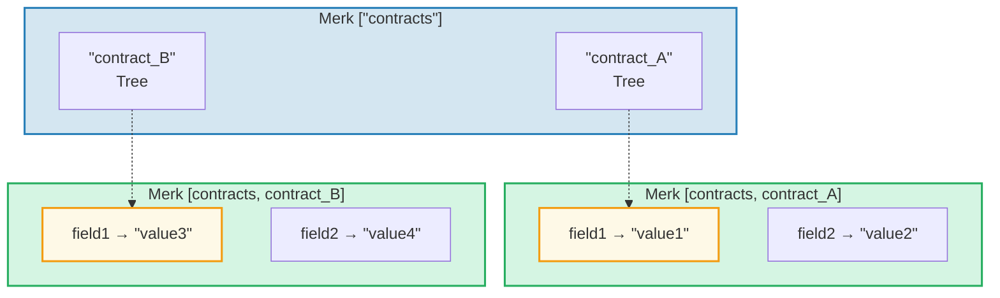
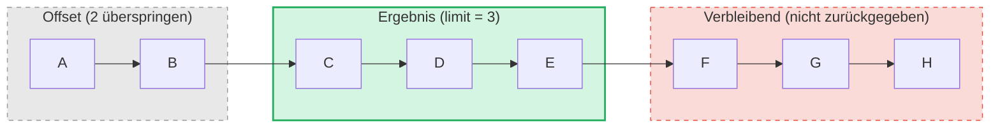

# Das Abfragesystem

## PathQuery-Struktur

GroveDB-Abfragen verwenden den `PathQuery`-Typ, der einen Pfad (wo gesucht wird)
mit einer Abfrage (was ausgewählt wird) kombiniert:

```rust
pub struct PathQuery {
    pub path: Vec<Vec<u8>>,         // Startpfad im Hain
    pub query: SizedQuery,          // Was ausgewählt werden soll
}

pub struct SizedQuery {
    pub query: Query,               // Die Auswahlkriterien
    pub limit: Option<u16>,         // Maximale Anzahl von Ergebnissen
    pub offset: Option<u16>,        // Erste N Ergebnisse überspringen
}
```

## Der Query-Typ

```rust
pub struct Query {
    pub items: Vec<QueryItem>,              // Was abgeglichen werden soll
    pub default_subquery_branch: SubqueryBranch,
    pub conditional_subquery_branches: Option<IndexMap<QueryItem, SubqueryBranch>>,
    pub left_to_right: bool,                // Iterationsrichtung
    pub add_parent_tree_on_subquery: bool,  // Elternbaum-Element in Ergebnisse einschließen (v2)
}
```

> **`add_parent_tree_on_subquery`** (v2): Wenn `true`, wird das Elternbaum-Element (z.B. ein
> CountTree oder SumTree) zusammen mit den Werten seiner Kinder in die Abfrageergebnisse aufgenommen.
> So können Sie sowohl Aggregatwerte als auch Einzelelemente in einer Abfrage abrufen.

## QueryItems — Was ausgewählt wird

Jedes `QueryItem` spezifiziert einen Schlüssel oder Bereich zum Abgleich:

```rust
pub enum QueryItem {
    Key(Vec<u8>),                           // Exakte Schlüsselübereinstimmung
    Range(Range<Vec<u8>>),                  // Exklusiver Bereich [start..end)
    RangeInclusive(RangeInclusive<Vec<u8>>),// Inklusiver Bereich [start..=end]
    RangeFull(RangeFull),                   // Alle Schlüssel
    RangeFrom(RangeFrom<Vec<u8>>),          // [start..)
    RangeTo(RangeTo<Vec<u8>>),              // [..end)
    RangeToInclusive(RangeToInclusive<Vec<u8>>), // [..=end]
    RangeAfter(RangeFrom<Vec<u8>>),         // (start..) exklusiver Start
    RangeAfterTo(Range<Vec<u8>>),           // (start..end) beidseitig exklusiv
    RangeAfterToInclusive(RangeInclusive<Vec<u8>>), // (start..=end]
}
```

Beispielabfragen:

Merk-Baum (sortiert): `alice  bob  carol  dave  eve  frank`

| Abfrage | Auswahl | Ergebnis |
|---------|---------|----------|
| `Key("bob")` | alice **[bob]** carol dave eve frank | bob |
| `RangeInclusive("bob"..="dave")` | alice **[bob carol dave]** eve frank | bob, carol, dave |
| `RangeAfter("carol"..)` | alice bob carol **[dave eve frank]** | dave, eve, frank |
| `RangeFull`, limit=2 | **[alice bob]** carol dave eve frank *(durch Limit gestoppt)* | alice, bob |
| `RangeFull`, limit=2, rechts-nach-links | alice bob carol dave **[eve frank]** *(durch Limit gestoppt)* | frank, eve |

## Unterabfragen und bedingte Verzweigungen

Die wahre Stärke von GroveDB-Abfragen sind **Unterabfragen** (Subqueries) — wenn eine Abfrage ein Tree-
Element findet, kann die Abfrage automatisch in diesen Teilbaum absteigen:



> **PathQuery:** `path: ["contracts"], query: RangeFull` mit `default_subquery: Key("field1")`
>
> **Ausführung:**
> 1. `RangeFull` auf ["contracts"] → trifft contract_A, contract_B
> 2. Beide sind Tree-Elemente → mit Unterabfrage `Key("field1")` absteigen
> 3. contract_A → "value1", contract_B → "value3"
>
> **Ergebnis:** `["value1", "value3"]`

**Bedingte Unterabfragen** erlauben es, verschiedene Unterabfragen basierend auf dem
übereinstimmenden Schlüssel anzuwenden:

```rust
conditional_subquery_branches: Some(indexmap! {
    QueryItem::Key(b"contract_A".to_vec()) => SubqueryBranch {
        subquery: Some(Query { items: vec![Key(b"field1".to_vec())] }),
        ..
    },
    QueryItem::Key(b"contract_B".to_vec()) => SubqueryBranch {
        subquery: Some(Query { items: vec![Key(b"field2".to_vec())] }),
        ..
    },
})
```

Dies würde `field1` von `contract_A`, aber `field2` von `contract_B` abrufen.

## Größenbeschränkte Abfragen — Limit und Offset

Der `SizedQuery`-Wrapper fügt Paginierung hinzu:



> `SizedQuery { query: RangeFull, limit: Some(3), offset: Some(2) }` → Ergebnis: **[C, D, E]**

In Kombination mit `left_to_right: false` wird die Iteration umgekehrt:

```text
    SizedQuery {
        query: Query { items: [RangeFull], left_to_right: false, .. },
        limit: Some(3),
        offset: None
    }

    Ergebnis: [H, G, F]
```

## Abfragenzusammenführung

Mehrere PathQueries können für mehr Effizienz zu einer einzigen Abfrage zusammengeführt werden.
Der Zusammenführungsalgorithmus findet gemeinsame Pfadpräfixe und kombiniert Query-Items:

```text
    Abfrage A: path=["users"], query=Key("alice")
    Abfrage B: path=["users"], query=Key("bob")

    Zusammengeführt: path=["users"], query=items=[Key("alice"), Key("bob")]
```

---
