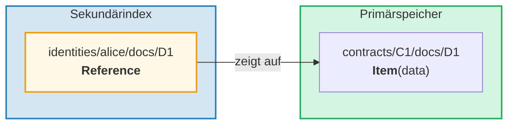
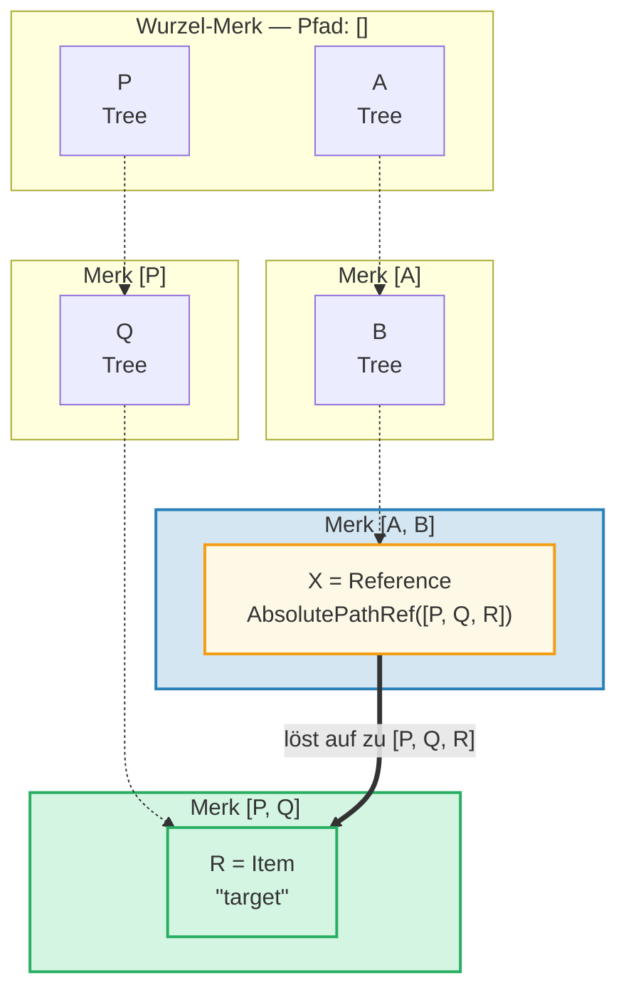
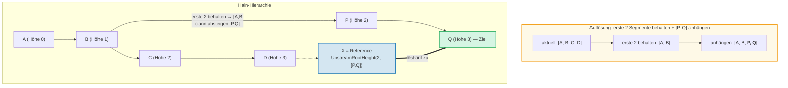
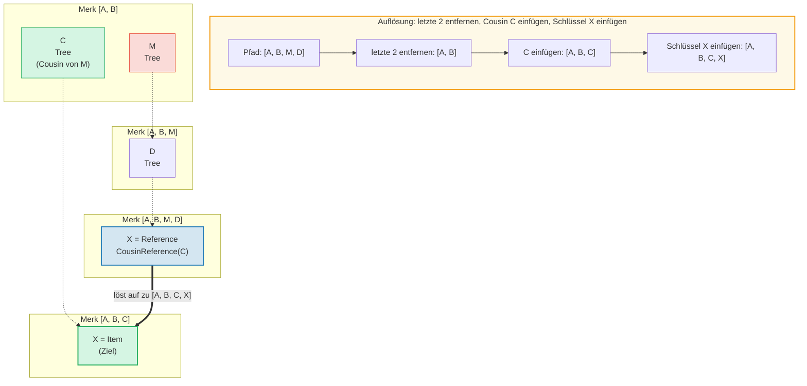
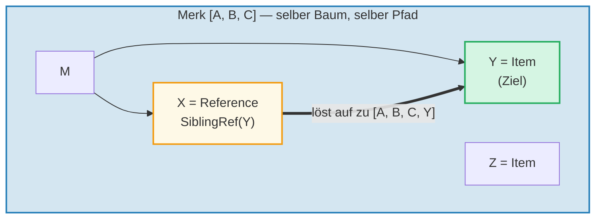
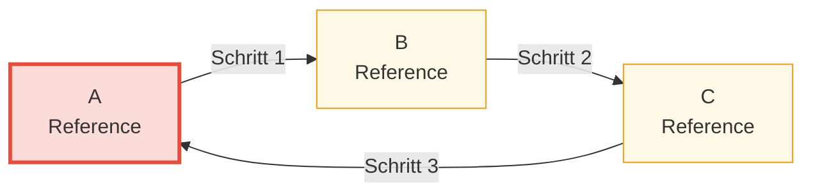

# Das Referenz-System

## Warum Referenzen existieren

In einer hierarchischen Datenbank müssen häufig dieselben Daten über mehrere
Pfade zugänglich sein. Beispielsweise könnten Dokumente unter ihrem Vertrag gespeichert,
aber auch nach Eigentümer-Identität abfragbar sein. **Referenzen** sind die Antwort von GroveDB —
es sind Zeiger von einem Ort zu einem anderen, ähnlich wie symbolische Links in einem Dateisystem.



Wichtige Eigenschaften:
- Referenzen sind **authentifiziert** — der value_hash der Referenz enthält sowohl die
  Referenz selbst als auch das referenzierte Element
- Referenzen können **verkettet** werden — eine Referenz kann auf eine andere Referenz zeigen
- Zykluserkennung verhindert Endlosschleifen
- Ein konfigurierbares Hop-Limit verhindert Ressourcenerschöpfung

## Die sieben Referenztypen

```rust
// grovedb-element/src/reference_path/mod.rs
pub enum ReferencePathType {
    AbsolutePathReference(Vec<Vec<u8>>),
    UpstreamRootHeightReference(u8, Vec<Vec<u8>>),
    UpstreamRootHeightWithParentPathAdditionReference(u8, Vec<Vec<u8>>),
    UpstreamFromElementHeightReference(u8, Vec<Vec<u8>>),
    CousinReference(Vec<u8>),
    RemovedCousinReference(Vec<Vec<u8>>),
    SiblingReference(Vec<u8>),
}
```

Gehen wir jeden mit Diagrammen durch.

### AbsolutePathReference

Der einfachste Typ. Speichert den vollständigen Pfad zum Ziel:



> X speichert den vollständigen absoluten Pfad `[P, Q, R]`. Unabhängig davon, wo sich X befindet, löst es immer zum selben Ziel auf.

### UpstreamRootHeightReference

Behält die ersten N Segmente des aktuellen Pfads bei und hängt dann einen neuen Pfad an:



### UpstreamRootHeightWithParentPathAdditionReference

Wie UpstreamRootHeight, aber hängt das letzte Segment des aktuellen Pfads wieder an:

```text
    Referenz bei Pfad [A, B, C, D, E] key=X
    UpstreamRootHeightWithParentPathAdditionReference(2, [P, Q])

    Aktueller Pfad:      [A, B, C, D, E]
    Erste 2 behalten:    [A, B]
    [P, Q] anhängen:     [A, B, P, Q]
    Letztes wieder anhängen: [A, B, P, Q, E]   ← "E" aus dem Originalpfad wieder hinzugefügt

    Nützlich für: Indizes, bei denen der Elternschlüssel erhalten bleiben soll
```

### UpstreamFromElementHeightReference

Verwirft die letzten N Segmente und hängt dann an:

```text
    Referenz bei Pfad [A, B, C, D] key=X
    UpstreamFromElementHeightReference(1, [P, Q])

    Aktueller Pfad:      [A, B, C, D]
    Letztes 1 verwerfen: [A, B, C]
    [P, Q] anhängen:     [A, B, C, P, Q]
```

### CousinReference

Ersetzt nur den unmittelbaren Elternknoten durch einen neuen Schlüssel:



> Der "Cousin" ist ein Geschwister-Teilbaum des Großelternknotens der Referenz. Die Referenz navigiert zwei Ebenen nach oben und steigt dann in den Cousin-Teilbaum ab.

### RemovedCousinReference

Wie CousinReference, ersetzt aber den Elternknoten durch einen mehrsegmentigen Pfad:

```text
    Referenz bei Pfad [A, B, C, D] key=X
    RemovedCousinReference([M, N])

    Aktueller Pfad:    [A, B, C, D]
    Eltern C entfernen: [A, B]
    [M, N] anhängen:   [A, B, M, N]
    Schlüssel X einfügen: [A, B, M, N, X]
```

### SiblingReference

Die einfachste relative Referenz — ändert nur den Schlüssel innerhalb desselben Elternknotens:



> Der einfachste Referenztyp. X und Y sind Geschwister im selben Merk-Baum — die Auflösung ändert nur den Schlüssel, behält aber denselben Pfad bei.

## Referenzverfolgung und das Hop-Limit

Wenn GroveDB auf ein Reference-Element trifft, muss es ihm **folgen**, um den
tatsächlichen Wert zu finden. Da Referenzen auf andere Referenzen zeigen können, beinhaltet dies eine Schleife:

```rust
// grovedb/src/reference_path.rs
pub const MAX_REFERENCE_HOPS: usize = 10;

pub fn follow_reference(...) -> CostResult<ResolvedReference, Error> {
    let mut hops_left = MAX_REFERENCE_HOPS;
    let mut visited = HashSet::new();

    while hops_left > 0 {
        // Referenzpfad in absoluten Pfad auflösen
        let target_path = current_ref.absolute_qualified_path(...);

        // Auf Zyklen prüfen
        if !visited.insert(target_path.clone()) {
            return Err(Error::CyclicReference);
        }

        // Element am Ziel abrufen
        let element = Element::get(target_path);

        match element {
            Element::Reference(next_ref, ..) => {
                // Immer noch eine Referenz — weiter folgen
                current_ref = next_ref;
                hops_left -= 1;
            }
            other => {
                // Tatsächliches Element gefunden!
                return Ok(ResolvedReference { element: other, ... });
            }
        }
    }

    Err(Error::ReferenceLimit)  // 10 Hops überschritten
}
```

## Zykluserkennung

Das `visited`-HashSet verfolgt alle Pfade, die wir gesehen haben. Wenn wir auf einen Pfad stoßen,
den wir bereits besucht haben, haben wir einen Zyklus:



> **Zykluserkennungs-Ablauf:**
>
> | Schritt | Folge | visited-Menge | Ergebnis |
> |---------|-------|---------------|----------|
> | 1 | Start bei A | { A } | A ist Ref → folgen |
> | 2 | A → B | { A, B } | B ist Ref → folgen |
> | 3 | B → C | { A, B, C } | C ist Ref → folgen |
> | 4 | C → A | A bereits in visited! | **Error::CyclicRef** |
>
> Ohne Zykluserkennung würde dies endlos schleifen. `MAX_REFERENCE_HOPS = 10` begrenzt zusätzlich die Traversierungstiefe für lange Ketten.

## Referenzen in Merk — Kombinierte Wert-Hashes

Wenn eine Referenz in einem Merk-Baum gespeichert wird, muss ihr `value_hash`
sowohl die Referenzstruktur als auch die referenzierten Daten authentifizieren:

```rust
// merk/src/tree/kv.rs
pub fn update_hashes_using_reference_value_hash(
    mut self,
    reference_value_hash: CryptoHash,
) -> CostContext<Self> {
    // Die eigenen Bytes des Referenz-Elements hashen
    let actual_value_hash = value_hash(self.value_as_slice());

    // Kombinieren: H(referenz_bytes) ⊕ H(referenzierte_daten)
    let combined = combine_hash(&actual_value_hash, &reference_value_hash);

    self.value_hash = combined;
    self.hash = kv_digest_to_kv_hash(self.key(), self.value_hash());
    // ...
}
```

Das bedeutet, dass eine Änderung entweder der Referenz selbst ODER der Daten, auf die sie zeigt,
den Wurzel-Hash ändert — beides ist kryptographisch gebunden.

---
