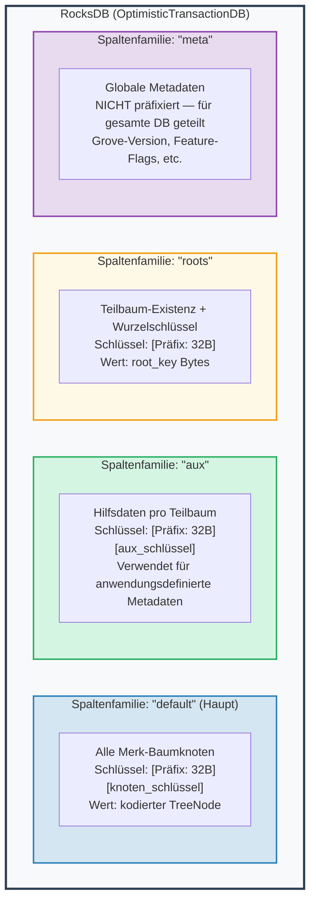
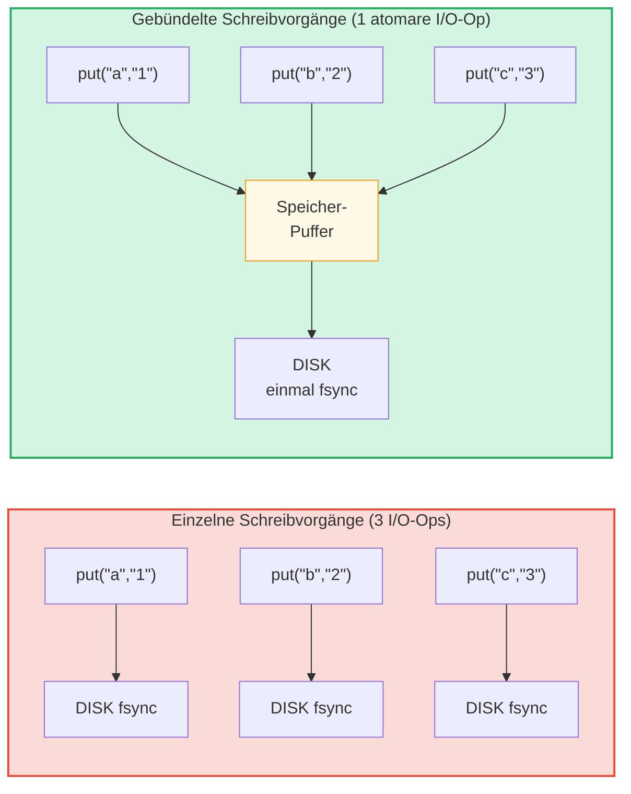

# Die Speicherschicht

## RocksDB mit OptimisticTransactionDB

GroveDB verwendet **RocksDB** als Speicher-Backend, genauer die
`OptimisticTransactionDB`-Variante, die Transaktionen unterstützt:

```rust
// storage/src/rocksdb_storage/storage.rs
pub(crate) type Db = OptimisticTransactionDB;
pub(crate) type Tx<'db> = Transaction<'db, Db>;

pub struct RocksDbStorage {
    db: OptimisticTransactionDB,
}
```

**Optimistische Transaktionen** funktionieren unter der Annahme, dass es keine Konflikte gibt. Wenn zwei
Transaktionen dieselben Daten modifizieren, schlägt die zweite beim Commit fehl und kann
erneut versucht werden. Dies ist effizienter als pessimistisches Locking für Arbeitslasten, bei denen
Konflikte selten sind.

Die RocksDB-Optionen sind auf die Arbeitslast von GroveDB abgestimmt:

```rust
lazy_static! {
    static ref DEFAULT_OPTS: rocksdb::Options = {
        let mut opts = rocksdb::Options::default();
        opts.create_if_missing(true);
        opts.increase_parallelism(num_cpus::get() as i32);
        opts.set_allow_mmap_writes(true);
        opts.set_allow_mmap_reads(true);
        opts.create_missing_column_families(true);
        opts.set_atomic_flush(true);
        opts
    };
}
```

## Vier Spaltenfamilien

RocksDB-Spaltenfamilien (Column Families) fungieren als separate Schlüssel-Wert-Namensräume innerhalb
einer einzelnen Datenbank. GroveDB verwendet vier:



> **Beispiel:** Schlüssel `[ab3fc2...][6e616d65]` in der "default"-CF bildet auf `TreeNode{key:"name", val:"Al"}` ab, wobei `ab3fc2...` `Blake3(Pfad)` ist und `6e616d65` `"name"` in Bytes ist.

```rust
pub(crate) const AUX_CF_NAME: &str = "aux";
pub(crate) const ROOTS_CF_NAME: &str = "roots";
pub(crate) const META_CF_NAME: &str = "meta";
// Hauptdaten verwenden die Standard-Spaltenfamilie
```

## Präfixierte Speicherkontexte

Jeder Teilbaum erhält seinen eigenen **präfixierten Speicherkontext** — einen Wrapper, der
automatisch das 32-Byte-Blake3-Präfix allen Schlüsseln voranstellt:

```text
    Teilbaum-Pfad: ["identities", "alice"]
    Präfix: Blake3(Pfad) = [0xab, 0x3f, 0xc2, ...]  (32 Bytes)

    Wenn der Teilbaum den Schlüssel "name" mit dem Wert "Alice" speichert:

    RocksDB-Schlüssel:   [0xab 0x3f 0xc2 ... (32 Bytes) | 0x6e 0x61 0x6d 0x65]
                          \_________Präfix________/       \_____"name"_____/

    RocksDB-Wert: [kodierter TreeNode mit Wert "Alice"]
```

Die Kontexttypen:

```text
    Ohne Transaktion:
    PrefixedRocksDbImmediateStorageContext
    └── Liest/schreibt direkt in die DB mit Präfix

    Mit Transaktion:
    PrefixedRocksDbTransactionContext
    └── Liest/schreibt durch eine Transaction mit Präfix
```

Beide implementieren das `StorageContext`-Trait:

```rust
pub trait StorageContext<'db> {
    fn get(&self, key: &[u8]) -> CostResult<Option<Vec<u8>>, Error>;
    fn get_aux(&self, key: &[u8]) -> CostResult<Option<Vec<u8>>, Error>;
    fn get_root(&self, key: &[u8]) -> CostResult<Option<Vec<u8>>, Error>;
    fn get_meta(&self, key: &[u8]) -> CostResult<Option<Vec<u8>>, Error>;
    fn put(&self, key: &[u8], value: &[u8], ...) -> CostResult<(), Error>;
    fn put_aux(&self, key: &[u8], value: &[u8], ...) -> CostResult<(), Error>;
    fn put_root(&self, key: &[u8], value: &[u8], ...) -> CostResult<(), Error>;
    fn put_meta(&self, key: &[u8], value: &[u8], ...) -> CostResult<(), Error>;
    fn delete(&self, key: &[u8], ...) -> CostResult<(), Error>;
    // ...
}
```

## Schreib-Batches und Transaktionsmodell

Für die Leistung akkumuliert GroveDB Schreibvorgänge in Batches:



> 3 Disk-Syncs vs. 1 Disk-Sync = ~3x schneller. Gebündelte Schreibvorgänge sind zudem **atomar** (alles-oder-nichts).

Der `StorageBatch` akkumuliert Operationen, die gemeinsam geflusht werden:

```rust
pub struct StorageBatch {
    operations: RefCell<Vec<AbstractBatchOperation>>,
}
```

## Das kritische commit_local()-Muster

Bei der Verwendung von Transaktionen gibt es ein kritisches Muster, das befolgt werden muss.
Schreibvorgänge innerhalb einer Transaktion werden gepuffert — sie sind erst nach dem Commit sichtbar:

```rust
// KORREKTES Muster:
{
    let tx = db.start_transaction();
    let storage_ctx = db.get_transactional_storage_context(path, &tx);

    storage_ctx.put(key, value);  // Schreibt in den Transaktionspuffer

    drop(storage_ctx);            // Borrow auf tx freigeben
    tx.commit_local();            // Transaktion in die DB flushen
}

// FALSCH — Daten gehen verloren:
{
    let tx = db.start_transaction();
    let storage_ctx = db.get_transactional_storage_context(path, &tx);

    storage_ctx.put(key, value);  // Schreibt in den Transaktionspuffer

    // tx wird hier ohne commit_local() gedroppt!
    // Alle Schreibvorgänge werden ZURÜCKGEROLLT!
}
```

Dies ist besonders wichtig, weil der `storage_ctx` die Transaktion ausleiht.
Man muss `drop(storage_ctx)` aufrufen, bevor man `tx.commit_local()` aufrufen kann.

---
