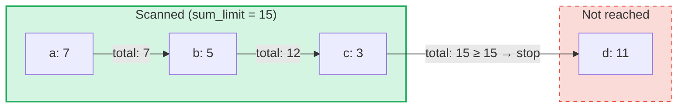

# Consultas de Suma Agregada

## Descripcion General

Las Consultas de Suma Agregada son un tipo de consulta especializado disenado para **SumTrees** en GroveDB.
Mientras que las consultas regulares recuperan elementos por clave o rango, las consultas de suma agregada
iteran a traves de los elementos y acumulan sus valores de suma hasta que se alcanza un **limite de suma**.

Esto es util para preguntas como:
- "Dame transacciones hasta que el total acumulado supere 1000"
- "¿Cuales elementos contribuyen a las primeras 500 unidades de valor en este arbol?"
- "Recolectar elementos de suma hasta un presupuesto de N"

## Conceptos Fundamentales

### En que se Diferencia de las Consultas Regulares

| Caracteristica | PathQuery | AggregateSumPathQuery |
|----------------|-----------|----------------------|
| **Objetivo** | Cualquier tipo de elemento | Elementos SumItem / ItemWithSumItem |
| **Condicion de parada** | Limite (conteo) o fin del rango | Limite de suma (total acumulado) **y/o** limite de elementos |
| **Retorna** | Elementos o claves | Pares clave-valor de suma |
| **Subconsultas** | Si (desciende a subarboles) | No (un solo nivel del arbol) |
| **Referencias** | Resueltas por la capa de GroveDB | Opcionalmente seguidas o ignoradas |

### La Estructura AggregateSumQuery

```rust
pub struct AggregateSumQuery {
    pub items: Vec<QueryItem>,              // Keys or ranges to scan
    pub left_to_right: bool,                // Iteration direction
    pub sum_limit: u64,                     // Stop when running total reaches this
    pub limit_of_items_to_check: Option<u16>, // Max number of matching items to return
}
```

La consulta se envuelve en un `AggregateSumPathQuery` para especificar donde buscar en el grove:

```rust
pub struct AggregateSumPathQuery {
    pub path: Vec<Vec<u8>>,                 // Path to the SumTree
    pub aggregate_sum_query: AggregateSumQuery,
}
```

### Limite de Suma — El Total Acumulado

El `sum_limit` es el concepto central. A medida que se escanean los elementos, sus valores de suma se
acumulan. Una vez que el total acumulado alcanza o supera el limite de suma, la iteracion se detiene:



> **Resultado:** `[(a, 7), (b, 5), (c, 3)]` — la iteracion se detiene porque 7 + 5 + 3 = 15 >= sum_limit

Los valores de suma negativos estan soportados. Un valor negativo aumenta el presupuesto restante:

```text
sum_limit = 12, elements: a(10), b(-3), c(5)

a: total = 10, remaining = 2
b: total =  7, remaining = 5  ← negative value gave us more room
c: total = 12, remaining = 0  ← stop

Result: [(a, 10), (b, -3), (c, 5)]
```

## Opciones de Consulta

La estructura `AggregateSumQueryOptions` controla el comportamiento de la consulta:

```rust
pub struct AggregateSumQueryOptions {
    pub allow_cache: bool,                              // Use cached reads (default: true)
    pub error_if_intermediate_path_tree_not_present: bool, // Error on missing path (default: true)
    pub error_if_non_sum_item_found: bool,              // Error on non-sum elements (default: true)
    pub ignore_references: bool,                        // Skip references (default: false)
}
```

### Manejo de Elementos que No Son de Suma

Los SumTrees pueden contener una mezcla de tipos de elementos: `SumItem`, `Item`, `Reference`, `ItemWithSumItem`,
y otros. Por defecto, encontrar un elemento que no es de suma ni de referencia produce un error.

Cuando `error_if_non_sum_item_found` se establece en `false`, los elementos que no son de suma se **omiten
silenciosamente** sin consumir una posicion del limite del usuario:

```text
Tree contents: a(SumItem=7), b(Item), c(SumItem=3)
Query: sum_limit=100, limit_of_items_to_check=2, error_if_non_sum_item_found=false

Scan: a(7) → returned, limit=1
      b(Item) → skipped, limit still 1
      c(3) → returned, limit=0 → stop

Result: [(a, 7), (c, 3)]
```

Nota: Los elementos `ItemWithSumItem` **siempre** se procesan (nunca se omiten), porque contienen
un valor de suma.

### Manejo de Referencias

Por defecto, los elementos `Reference` son **seguidos** — la consulta resuelve la cadena de referencias
(hasta 3 saltos intermedios) para encontrar el valor de suma del elemento destino:

```text
Tree contents: a(SumItem=7), ref_b(Reference → a)
Query: sum_limit=100

ref_b is followed → resolves to a(SumItem=7)

Result: [(a, 7), (ref_b, 7)]
```

Cuando `ignore_references` es `true`, las referencias se omiten silenciosamente sin consumir una posicion
del limite, de manera similar a como se omiten los elementos que no son de suma.

Las cadenas de referencias con mas de 3 saltos intermedios producen un error `ReferenceLimit`.

## El Tipo de Resultado

Las consultas devuelven un `AggregateSumQueryResult`:

```rust
pub struct AggregateSumQueryResult {
    pub results: Vec<(Vec<u8>, i64)>,       // Key-sum value pairs
    pub hard_limit_reached: bool,           // True if system limit truncated results
}
```

La bandera `hard_limit_reached` indica si el limite estricto de escaneo del sistema (por defecto: 1024
elementos) se alcanzo antes de que la consulta terminara naturalmente. Cuando es `true`, pueden existir
mas resultados mas alla de los que se devolvieron.

## Tres Sistemas de Limites

Las consultas de suma agregada tienen **tres** condiciones de parada:

| Limite | Origen | Que cuenta | Efecto al alcanzarse |
|--------|--------|------------|---------------------|
| **sum_limit** | Usuario (consulta) | Total acumulado de valores de suma | Detiene la iteracion |
| **limit_of_items_to_check** | Usuario (consulta) | Elementos coincidentes devueltos | Detiene la iteracion |
| **Limite estricto de escaneo** | Sistema (GroveVersion, por defecto 1024) | Todos los elementos escaneados (incluyendo omitidos) | Detiene la iteracion, establece `hard_limit_reached` |

El limite estricto de escaneo previene la iteracion ilimitada cuando no se establece un limite de usuario.
Los elementos omitidos (elementos que no son de suma con `error_if_non_sum_item_found=false`, o referencias con
`ignore_references=true`) cuentan contra el limite estricto de escaneo pero **no** contra el
`limit_of_items_to_check` del usuario.

## Uso de la API

### Consulta Simple

```rust
use grovedb::AggregateSumPathQuery;
use grovedb_merk::proofs::query::AggregateSumQuery;

// "Give me items from this SumTree until the total reaches 1000"
let query = AggregateSumQuery::new(1000, None);
let path_query = AggregateSumPathQuery {
    path: vec![b"my_tree".to_vec()],
    aggregate_sum_query: query,
};

let result = db.query_aggregate_sums(
    &path_query,
    true,   // allow_cache
    true,   // error_if_intermediate_path_tree_not_present
    None,   // transaction
    grove_version,
).unwrap().expect("query failed");

for (key, sum_value) in &result.results {
    println!("{}: {}", String::from_utf8_lossy(key), sum_value);
}
```

### Consulta con Opciones

```rust
use grovedb::{AggregateSumPathQuery, AggregateSumQueryOptions};
use grovedb_merk::proofs::query::AggregateSumQuery;

// Skip non-sum items and ignore references
let query = AggregateSumQuery::new(1000, Some(50));
let path_query = AggregateSumPathQuery {
    path: vec![b"mixed_tree".to_vec()],
    aggregate_sum_query: query,
};

let result = db.query_aggregate_sums_with_options(
    &path_query,
    AggregateSumQueryOptions {
        error_if_non_sum_item_found: false,  // skip Items, Trees, etc.
        ignore_references: true,              // skip References
        ..AggregateSumQueryOptions::default()
    },
    None,
    grove_version,
).unwrap().expect("query failed");

if result.hard_limit_reached {
    println!("Warning: results may be incomplete (hard limit reached)");
}
```

### Consultas Basadas en Claves

En lugar de escanear un rango, puedes consultar claves especificas:

```rust
// Check the sum value of specific keys
let query = AggregateSumQuery::new_with_keys(
    vec![b"alice".to_vec(), b"bob".to_vec(), b"carol".to_vec()],
    u64::MAX,  // no sum limit
    None,      // no item limit
);
```

### Consultas Descendentes

Iterar desde la clave mas alta hasta la mas baja:

```rust
let query = AggregateSumQuery::new_descending(500, Some(10));
// Or: query.left_to_right = false;
```

## Referencia de Constructores

| Constructor | Descripcion |
|-------------|-------------|
| `new(sum_limit, limit)` | Rango completo, ascendente |
| `new_descending(sum_limit, limit)` | Rango completo, descendente |
| `new_single_key(key, sum_limit)` | Busqueda de una sola clave |
| `new_with_keys(keys, sum_limit, limit)` | Multiples claves especificas |
| `new_with_keys_reversed(keys, sum_limit, limit)` | Multiples claves, descendente |
| `new_single_query_item(item, sum_limit, limit)` | Un solo QueryItem (clave o rango) |
| `new_with_query_items(items, sum_limit, limit)` | Multiples QueryItems |

---
