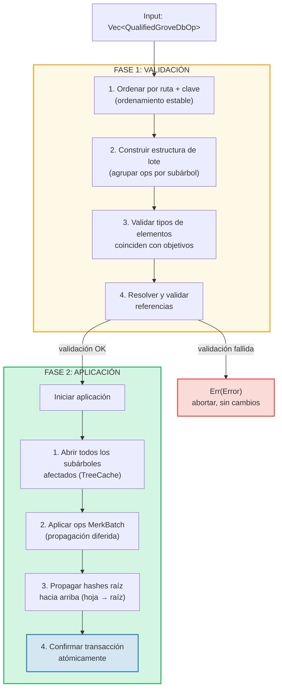
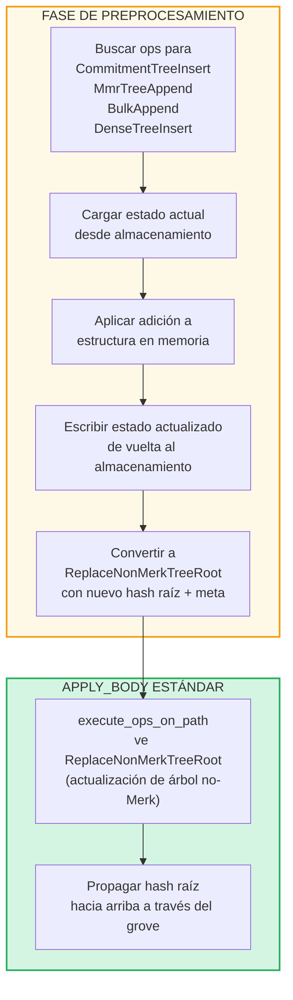

# Operaciones por Lotes a Nivel del Grove

## Variantes de GroveOp

A nivel de GroveDB, las operaciones se representan como `GroveOp`:

```rust
pub enum GroveOp {
    // User-facing operations:
    InsertOnly { element: Element },
    InsertOrReplace { element: Element },
    Replace { element: Element },
    Patch { element: Element, change_in_bytes: i32 },
    RefreshReference { reference_path_type, max_reference_hop, flags, trust_refresh_reference },
    Delete,
    DeleteTree(TreeType),                          // Parameterized by tree type

    // Non-Merk tree append operations (user-facing):
    CommitmentTreeInsert { cmx: [u8; 32], payload: Vec<u8> },
    MmrTreeAppend { value: Vec<u8> },
    BulkAppend { value: Vec<u8> },
    DenseTreeInsert { value: Vec<u8> },

    // Internal operations (created by preprocessing/propagation, rejected by from_ops):
    ReplaceTreeRootKey { hash, root_key, aggregate_data },
    InsertTreeWithRootHash { hash, root_key, flags, aggregate_data },
    ReplaceNonMerkTreeRoot { hash: [u8; 32], meta: NonMerkTreeMeta },
    InsertNonMerkTree { hash, root_key, flags, aggregate_data, meta: NonMerkTreeMeta },
}
```

**NonMerkTreeMeta** transporta el estado específico del tipo de árbol a través del procesamiento por lotes:

```rust
pub enum NonMerkTreeMeta {
    CommitmentTree { total_count: u64, chunk_power: u8 },
    MmrTree { mmr_size: u64 },
    BulkAppendTree { total_count: u64, chunk_power: u8 },
    DenseTree { count: u16, height: u8 },
}
```

Cada operación se envuelve en un `QualifiedGroveDbOp` que incluye la ruta:

```rust
pub struct QualifiedGroveDbOp {
    pub path: KeyInfoPath,           // Where in the grove
    pub key: Option<KeyInfo>,        // Which key (None for append-only tree ops)
    pub op: GroveOp,                 // What to do
}
```

> **Nota:** El campo `key` es `Option<KeyInfo>` — es `None` para las operaciones de árboles
> de solo-adición (`CommitmentTreeInsert`, `MmrTreeAppend`, `BulkAppend`, `DenseTreeInsert`)
> donde la clave del árbol es el último segmento de `path` en su lugar.

## Procesamiento en Dos Fases

Las operaciones por lotes se procesan en dos fases:



## TreeCache y Propagación Diferida

Durante la aplicación del lote, GroveDB usa un **TreeCache** para diferir la
propagación del hash raíz hasta que todas las operaciones en un subárbol estén completas:

```mermaid
graph TD
    subgraph without["SIN TreeCache (ingenuo)"]
        w1["Op 1: Insertar A en X"]
        w1p["Propagar X → padre → raíz"]
        w2["Op 2: Insertar B en X"]
        w2p["Propagar X → padre → raíz"]
        w3["Op 3: Insertar C en X"]
        w3p["Propagar X → padre → raíz"]
        w1 --> w1p --> w2 --> w2p --> w3 --> w3p
    end

    subgraph with_tc["CON TreeCache (diferido)"]
        t1["Op 1: Insertar A en X<br/>→ en buffer"]
        t2["Op 2: Insertar B en X<br/>→ en buffer"]
        t3["Op 3: Insertar C en X<br/>→ en buffer"]
        tp["Propagar X → padre → raíz<br/>(subir UNA VEZ)"]
        t1 --> t2 --> t3 --> tp
    end

    style without fill:#fadbd8,stroke:#e74c3c,stroke-width:2px
    style with_tc fill:#d5f5e3,stroke:#27ae60,stroke-width:2px
    style w1p fill:#fadbd8,stroke:#e74c3c
    style w2p fill:#fadbd8,stroke:#e74c3c
    style w3p fill:#fadbd8,stroke:#e74c3c
    style tp fill:#d5f5e3,stroke:#27ae60,stroke-width:2px
```



> **3 propagaciones × O(profundidad)** vs **1 propagación × O(profundidad)** = 3x más rápido para este subárbol.

Esta es una optimización significativa cuando muchas operaciones apuntan al mismo subárbol.

## Operaciones Atómicas Entre Subárboles

Una propiedad clave de los lotes de GroveDB es la **atomicidad entre subárboles**. Un solo lote
puede modificar elementos en múltiples subárboles, y o todos los cambios se confirman o ninguno:

```text
    Lote:
    1. Eliminar ["balances", "alice"]       (eliminar balance)
    2. Insertar ["balances", "bob"] = 100   (agregar balance)
    3. Actualizar ["identities", "bob", "rev"] = 2  (actualizar revisión)

    Tres subárboles afectados: balances, identities, identities/bob

    Si CUALQUIER operación falla → TODAS las operaciones se revierten
    Si TODAS tienen éxito → TODAS se confirman atómicamente
```

El procesador de lotes maneja esto mediante:
1. Recolectar todas las rutas afectadas
2. Abrir todos los subárboles necesarios
3. Aplicar todas las operaciones
4. Propagar todos los hashes raíz en orden de dependencia
5. Confirmar toda la transacción

## Preprocesamiento de Lotes para Árboles No-Merk

Las operaciones de CommitmentTree, MmrTree, BulkAppendTree y DenseAppendOnlyFixedSizeTree
requieren acceso a contextos de almacenamiento fuera del Merk, lo cual no está disponible dentro del
método estándar `execute_ops_on_path` (solo tiene acceso al Merk). Estas operaciones
usan un **patrón de preprocesamiento**: antes de la fase principal `apply_body`, los puntos
de entrada buscan operaciones de árboles no-Merk y las convierten a operaciones internas estándar.

```rust
pub enum GroveOp {
    // ... standard ops ...

    // Non-Merk tree operations (user-facing):
    CommitmentTreeInsert { cmx: [u8; 32], payload: Vec<u8> },
    MmrTreeAppend { value: Vec<u8> },
    BulkAppend { value: Vec<u8> },
    DenseTreeInsert { value: Vec<u8> },

    // Internal ops (produced by preprocessing):
    ReplaceNonMerkTreeRoot { hash: [u8; 32], meta: NonMerkTreeMeta },
}
```



**¿Por qué preprocesamiento?** La función `execute_ops_on_path` opera sobre un único
subárbol Merk y no tiene acceso a `self.db` o contextos de almacenamiento más amplios.
El preprocesamiento en los puntos de entrada (`apply_batch_with_element_flags_update`,
`apply_partial_batch_with_element_flags_update`) tiene acceso completo a la base de datos,
por lo que puede cargar/guardar datos y luego entregar un simple `ReplaceNonMerkTreeRoot`
a la maquinaria estándar de lotes.

Cada método de preprocesamiento sigue el mismo patrón:
1. **`preprocess_commitment_tree_ops`** — Carga la frontera y BulkAppendTree del
   almacenamiento de datos, añade a ambos, guarda de vuelta, convierte a `ReplaceNonMerkTreeRoot`
   con la raíz combinada actualizada y meta `CommitmentTree { total_count, chunk_power }`
2. **`preprocess_mmr_tree_ops`** — Carga el MMR del almacenamiento de datos, añade valores,
   guarda de vuelta, convierte a `ReplaceNonMerkTreeRoot` con la raíz MMR actualizada
   y meta `MmrTree { mmr_size }`
3. **`preprocess_bulk_append_ops`** — Carga el BulkAppendTree del almacenamiento de datos,
   añade valores (puede disparar compactación de chunks), guarda de vuelta, convierte a
   `ReplaceNonMerkTreeRoot` con la raíz de estado actualizada y meta `BulkAppendTree { total_count, chunk_power }`
4. **`preprocess_dense_tree_ops`** — Carga el DenseFixedSizedMerkleTree del almacenamiento
   de datos, inserta valores secuencialmente, recalcula el hash raíz, guarda de vuelta,
   convierte a `ReplaceNonMerkTreeRoot` con el hash raíz actualizado y meta `DenseTree { count, height }`

La operación `ReplaceNonMerkTreeRoot` lleva el nuevo hash raíz y un enum `NonMerkTreeMeta`
para que el elemento pueda ser completamente reconstruido después del procesamiento.

---
