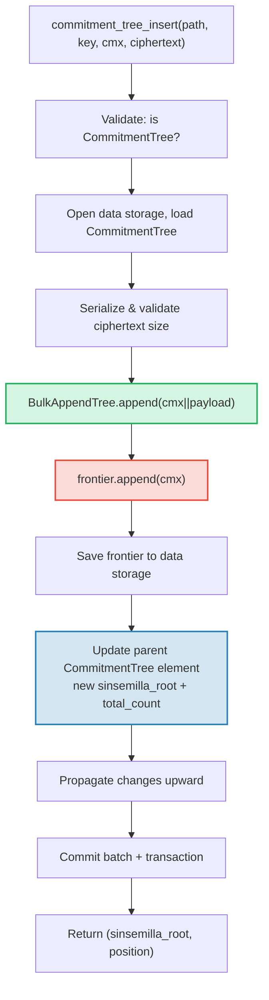

# El CommitmentTree — Anclas de Compromiso Sinsemilla

El **CommitmentTree** es el puente de GroveDB entre el almacenamiento autenticado y
los sistemas de pruebas de conocimiento cero (zero-knowledge). Combina un **BulkAppendTree** (Capitulo 14) para
almacenamiento eficiente de datos compactados en chunks con una **frontera Sinsemilla** en el
espacio de nombres data para anclas compatibles con ZK. Al igual que MmrTree y BulkAppendTree,
**no tiene Merk hijo** — el hash raiz combinado fluye como el hash hijo del Merk.
Tanto las entradas del BulkAppendTree como la frontera Sinsemilla residen en el **espacio
de nombres data**.

Este capitulo cubre la funcion de hash Sinsemilla y por que importa para los
circuitos de conocimiento cero, la estructura de datos de la frontera y su serializacion
compacta, la arquitectura de almacenamiento de doble espacio de nombres, las operaciones de GroveDB,
el preprocesamiento por lotes, la generacion de testigos del lado del cliente, y como funcionan las pruebas.

## Por Que un Arbol Compatible con ZK?

Los arboles estandar de GroveDB usan hashing Blake3. Blake3 es rapido en software, pero
**costoso dentro de circuitos de conocimiento cero**. Cuando un gastador necesita probar
"Conozco una nota en la posicion P en el arbol de compromisos" sin revelar P, debe
evaluar la funcion de hash de Merkle 32 veces (una por nivel del arbol) dentro de un
circuito ZK.

Sinsemilla (especificado en ZIP-244 para el protocolo Orchard de Zcash) esta disenado
para exactamente este caso de uso — proporciona **hashing eficiente dentro del circuito** sobre
la curva eliptica Pallas, una mitad del ciclo de curvas Pasta usado por el sistema
de pruebas Halo 2.

| Propiedad | Blake3 | Sinsemilla |
|----------|--------|------------|
| **Costo en circuito** | ~25,000 restricciones por hash | ~800 restricciones por hash |
| **Velocidad en software** | Muy rapido (~2 GB/s) | Lento (~10,000 hashes/s) |
| **Estructura algebraica** | Ninguna (operaciones a nivel de bits) | Operaciones de puntos en curva Pallas |
| **Proposito principal** | Hashing general, arboles de Merkle | Pruebas de Merkle dentro de circuitos |
| **Usado por** | Arboles Merk de GroveDB, MMR, Bulk | Protocolo blindado Orchard |
| **Tamano de salida** | 32 bytes | 32 bytes (elemento de campo Pallas) |

El CommitmentTree usa Sinsemilla para el arbol de Merkle sobre el cual razonan los circuitos ZK,
mientras sigue usando Blake3 para la jerarquia Merk de GroveDB por encima.
Los items insertados en el arbol se almacenan via un BulkAppendTree en el espacio de nombres
data (compactados en chunks, recuperables por posicion) y simultaneamente se anaden
a la frontera Sinsemilla (produciendo un ancla demostrable por ZK).

## La Arquitectura del Espacio de Nombres Data

El CommitmentTree almacena **todos los datos en el espacio de nombres data** en la misma ruta de
subarbol. Al igual que MmrTree y BulkAppendTree, **no tiene Merk hijo** (no tiene campo
`root_key` — la raiz especifica del tipo fluye como el hash hijo del Merk). Las entradas del BulkAppendTree y la frontera Sinsemilla coexisten
en el espacio de nombres data usando prefijos de clave distintos:

```text
┌──────────────────────────────────────────────────────────────┐
│                       CommitmentTree                          │
│                                                               │
│  ┌─────────────────────────────────────────────────────────┐  │
│  │  Data Namespace                                         │  │
│  │                                                         │  │
│  │  BulkAppendTree storage (Chapter 14):                   │  │
│  │    Buffer entries → chunk blobs → chunk MMR             │  │
│  │    value = cmx (32 bytes) || ciphertext (216 bytes)     │  │
│  │                                                         │  │
│  │  Sinsemilla Frontier (~1KB):                            │  │
│  │    key: b"__ct_data__" (COMMITMENT_TREE_DATA_KEY)       │  │
│  │    Depth-32 incremental Merkle tree                     │  │
│  │    Stores only the rightmost path (leaf + ommers)       │  │
│  │    O(1) append, O(1) root computation                   │  │
│  │    Produces Orchard-compatible Anchor for ZK proofs     │  │
│  └─────────────────────────────────────────────────────────┘  │
│                                                               │
│  sinsemilla_root embedded in Element bytes                    │
│    → flows through Merk value_hash → GroveDB state root      │
└──────────────────────────────────────────────────────────────┘
```

**Por que dos estructuras?** El BulkAppendTree proporciona almacenamiento y recuperacion
eficientes, compactados en chunks, para potencialmente millones de notas cifradas. La
frontera Sinsemilla proporciona anclas compatibles con ZK que pueden ser demostradas dentro de un
circuito Halo 2. Ambas se actualizan sincronizadamente en cada adicion.

Comparacion con los otros tipos de arbol no estandar:

| | CommitmentTree | MmrTree | BulkAppendTree |
|---|---|---|---|
| **Merk hijo** | No | No | No |
| **Espacio de nombres data** | Entradas BulkAppendTree + frontera | Nodos MMR | Buffer + chunks + MMR |
| **Espacio de nombres aux** | — | — | — |
| **Items consultables** | Via pruebas V1 | Via pruebas V1 | Via pruebas V1 |
| **Funcion de hash** | Sinsemilla + Blake3 | Blake3 | Blake3 |

## La Frontera Sinsemilla

La frontera es un arbol de Merkle incremental de profundidad 32 implementado por el
tipo `Frontier<MerkleHashOrchard, 32>` del crate `incrementalmerkletree`. En lugar
de almacenar las 2^32 hojas posibles, almacena solo la informacion necesaria para
**anadir la siguiente hoja y calcular la raiz actual**: la hoja mas a la derecha y
sus ommers (hashes hermanos necesarios para el calculo de la raiz).

```text
                         root (level 32)
                        /               \
                      ...               ...
                     /                     \
                  (level 2)             (level 2)
                  /     \               /     \
              (level 1) (level 1)   (level 1)  ?
              /    \    /    \      /    \
             L0    L1  L2    L3   L4    ?     ← frontier stores L4
                                              + ommers at levels
                                              where left sibling exists
```

La frontera almacena:
- **leaf** (hoja): el valor anadido mas recientemente (un elemento de campo Pallas)
- **ommers**: los hashes del hermano izquierdo en cada nivel donde el camino de la frontera
  va a la derecha (como maximo 32 ommers para un arbol de profundidad 32)
- **position** (posicion): la posicion indexada desde 0 de la hoja

Propiedades clave:
- **Adicion O(1)**: insertar una nueva hoja, actualizar ommers, recalcular raiz
- **Raiz O(1)**: recorrer los ommers almacenados desde la hoja hasta la raiz
- **Tamano constante ~1KB**: independientemente de cuantas hojas se hayan anadido
- **Determinista**: dos fronteras con la misma secuencia de adiciones producen
  la misma raiz

La constante `EMPTY_SINSEMILLA_ROOT` es la raiz de un arbol vacio de profundidad 32,
precalculada como `MerkleHashOrchard::empty_root(Level::from(32)).to_bytes()`:

```text
0xae2935f1dfd8a24aed7c70df7de3a668eb7a49b1319880dde2bbd9031ae5d82f
```

## Como Funciona la Adicion — La Cascada de Ommers

Cuando se anade un nuevo compromiso en la posicion N, el numero de ommers que deben
actualizarse es igual a `trailing_ones(N)` — el numero de bits 1 finales en la
representacion binaria de N. Este es el mismo patron que la cascada de fusion del MMR
(seccion 13.4), pero operando sobre ommers en lugar de picos.

**Ejemplo detallado — anadiendo 4 hojas:**

```text
Position 0 (binary: 0, trailing_ones: 0):
  frontier = { leaf: L0, ommers: [], position: 0 }
  Sinsemilla hashes: 32 (root computation) + 0 (no ommer merges) = 32

Position 1 (binary: 1, trailing_ones: 0 of PREVIOUS position 0):
  Before: position 0 has trailing_ones = 0
  frontier = { leaf: L1, ommers: [H(L0,L1) at level 1], position: 1 }
  Sinsemilla hashes: 32 + 0 = 32

Position 2 (binary: 10, trailing_ones: 0 of PREVIOUS position 1):
  Before: position 1 has trailing_ones = 1
  frontier = { leaf: L2, ommers: [level1_hash], position: 2 }
  Sinsemilla hashes: 32 + 1 = 33

Position 3 (binary: 11, trailing_ones: 0 of PREVIOUS position 2):
  Before: position 2 has trailing_ones = 0
  frontier = { leaf: L3, ommers: [level1_hash, level2_hash], position: 3 }
  Sinsemilla hashes: 32 + 0 = 32
```

El **total de hashes Sinsemilla** por adicion es:

```text
32 (root computation always traverses all 32 levels)
+ trailing_ones(current_position)  (ommer cascade)
```

En promedio, `trailing_ones` es ~1 (distribucion geometrica), por lo que el costo
promedio es **~33 hashes Sinsemilla por adicion**. El peor caso (en la posicion
2^32 - 1, donde todos los bits son 1) es **64 hashes**.

## El Formato de Serializacion de la Frontera

La frontera se almacena en el almacenamiento data con la clave `b"__ct_data__"`. El formato
de cable es:

```text
┌──────────────────────────────────────────────────────────────────┐
│ has_frontier: u8                                                  │
│   0x00 → empty tree (no more fields)                             │
│   0x01 → non-empty (fields follow)                               │
├──────────────────────────────────────────────────────────────────┤
│ position: u64 BE (8 bytes)      — 0-indexed leaf position        │
├──────────────────────────────────────────────────────────────────┤
│ leaf: [u8; 32]                  — Pallas field element bytes     │
├──────────────────────────────────────────────────────────────────┤
│ ommer_count: u8                 — number of ommers (0..=32)      │
├──────────────────────────────────────────────────────────────────┤
│ ommers: [ommer_count × 32 bytes] — Pallas field elements        │
└──────────────────────────────────────────────────────────────────┘
```

**Analisis de tamano:**

| Estado | Tamano | Desglose |
|-------|------|-----------|
| Vacio | 1 byte | Solo flag `0x00` |
| 1 hoja, 0 ommers | 42 bytes | 1 + 8 + 32 + 1 |
| ~16 ommers (promedio) | 554 bytes | 1 + 8 + 32 + 1 + 16x32 |
| 32 ommers (maximo) | 1,066 bytes | 1 + 8 + 32 + 1 + 32x32 |

El tamano de la frontera esta acotado por ~1.1KB independientemente de cuantos millones de
compromisos se hayan anadido. Esto hace que el ciclo de cargar->modificar->guardar sea muy
economico (1 busqueda para leer, 1 busqueda para escribir).

## Representacion del Element

```rust
CommitmentTree(
    u64,                  // total_count: number of appended items
    u8,                   // chunk_power: dense tree height for BulkAppendTree buffer
    Option<ElementFlags>, // flags: optional metadata
)
```

El parametro `chunk_power` controla la altura del arbol denso del buffer del BulkAppendTree;
`chunk_power` debe estar en el rango 1..=16 (ver secciones 14.1 y 16).

**Identificadores de tipo:**

| Identificador | Valor |
|---|---|
| Discriminante de Element | 11 |
| `TreeType` | `CommitmentTree = 7` |
| `ElementType` | 11 |
| `COMMITMENT_TREE_COST_SIZE` | 12 bytes (8 total_count + 1 chunk_power + 1 discriminante + 2 overhead) |

La raiz Sinsemilla NO se almacena en el Element. Fluye como el hash hijo del Merk
a traves del mecanismo `insert_subtree`. Cuando el Merk padre calcula su
`combined_value_hash`, la raiz derivada de Sinsemilla se incluye como el hash hijo:

```text
combined_value_hash = blake3(value_hash || child_hash)
                                           ↑ sinsemilla/BulkAppendTree combined root
```

Esto significa que cualquier cambio en la frontera Sinsemilla se propaga automaticamente
a traves de la jerarquia Merk de GroveDB hasta la raiz de estado.

**Metodos constructores:**

| Metodo | Crea |
|---|---|
| `Element::empty_commitment_tree(chunk_power)` | Arbol vacio, count=0, sin flags |
| `Element::empty_commitment_tree_with_flags(chunk_power, flags)` | Arbol vacio con flags |
| `Element::new_commitment_tree(total_count, chunk_power, flags)` | Todos los campos explicitos |

## Arquitectura de Almacenamiento

El CommitmentTree almacena todos sus datos en un unico **espacio de nombres data** en la
ruta del subarbol. Las entradas del BulkAppendTree y la frontera Sinsemilla coexisten en
la misma columna usando prefijos de clave distintos. No se usa el espacio de nombres aux.

```text
┌──────────────────────────────────────────────────────────────────┐
│  Data Namespace (all CommitmentTree storage)                      │
│                                                                   │
│  BulkAppendTree storage keys (see §14.7):                         │
│    b"m" || pos (u64 BE)  → MMR node blobs                        │
│    b"b" || index (u64 BE)→ buffer entries (cmx || ciphertext)     │
│    b"e" || chunk (u64 BE)→ chunk blobs (compacted buffer)         │
│    b"M"                  → BulkAppendTree metadata                │
│                                                                   │
│  Sinsemilla frontier:                                             │
│    b"__ct_data__"        → serialized CommitmentFrontier (~1KB)   │
│                                                                   │
│  No Merk nodes — this is a non-Merk tree.                         │
│  Data authenticated via BulkAppendTree state_root (Blake3).       │
│  Sinsemilla root authenticates all cmx values via Pallas curve.   │
└──────────────────────────────────────────────────────────────────┘
```

**El patron cargar->modificar->guardar**: Cada operacion mutante carga la frontera
del almacenamiento data, la modifica en memoria y la escribe de vuelta. Dado que la frontera
tiene como maximo ~1KB, este es un par economico de operaciones de E/S (1 busqueda para leer,
1 busqueda para escribir). Simultaneamente, el BulkAppendTree se carga, se le anade,
y se guarda.

**Propagacion del hash raiz**: Cuando se inserta un item, dos cosas cambian:
1. El estado del BulkAppendTree cambia (nueva entrada en el buffer o compactacion de chunk)
2. La raiz Sinsemilla cambia (nuevo compromiso en la frontera)

Ambas se capturan en el elemento `CommitmentTree` actualizado. El hash del nodo Merk
padre se convierte en:

```text
combined_hash = combine_hash(
    value_hash(element_bytes),    ← includes total_count + chunk_power
    child_hash(combined_root)     ← sinsemilla/BulkAppendTree combined root
)
```

Al igual que MmrTree y BulkAppendTree, la raiz especifica del tipo fluye como el hash hijo
del Merk. Toda la autenticacion de datos fluye a traves de este enlace de hash hijo.

**Implicaciones del almacenamiento de datos no-Merk**: Dado que el espacio de nombres data contiene
claves de BulkAppendTree (no nodos Merk), las operaciones que iteran el almacenamiento como
elementos Merk — como `find_subtrees`, `is_empty_tree` y
`verify_merk_and_submerks` — deben manejar CommitmentTree como caso especial (y otros
tipos de arbol no-Merk). El helper `uses_non_merk_data_storage()` en tanto
`Element` como `TreeType` identifica estos tipos de arbol. Las operaciones de eliminacion limpian
el espacio de nombres data directamente en lugar de iterarlo, y verify_grovedb omite
la recursion de sub-merk para estos tipos.

## Operaciones de GroveDB

CommitmentTree proporciona cuatro operaciones. La operacion de insercion es generica sobre
`M: MemoSize` (del crate `orchard`), que controla la validacion del tamano de la carga util
del texto cifrado. El valor por defecto `M = DashMemo` da una carga util de 216 bytes
(32 epk + 104 enc + 80 out).

```rust
// Insert a commitment (typed) — returns (sinsemilla_root, position)
// M controls ciphertext size validation
db.commitment_tree_insert::<_, _, M>(path, key, cmx, ciphertext, tx, version)

// Insert a commitment (raw bytes) — validates payload.len() == ciphertext_payload_size::<DashMemo>()
db.commitment_tree_insert_raw(path, key, cmx, payload_vec, tx, version)

// Get the current Orchard Anchor
db.commitment_tree_anchor(path, key, tx, version)

// Retrieve a value by global position
db.commitment_tree_get_value(path, key, position, tx, version)

// Get the current item count
db.commitment_tree_count(path, key, tx, version)
```

El `commitment_tree_insert` tipado acepta un `TransmittedNoteCiphertext<M>` y
lo serializa internamente. El `commitment_tree_insert_raw` crudo (pub(crate))
acepta `Vec<u8>` y es usado por el preprocesamiento por lotes donde las cargas utiles ya estan
serializadas.

### commitment_tree_insert

La operacion de insercion actualiza tanto el BulkAppendTree como la frontera Sinsemilla
en una unica operacion atomica:

```text
Step 1: Validate element at path/key is a CommitmentTree
        → extract total_count, chunk_power, flags

Step 2: Build ct_path = path ++ [key]

Step 3: Open data storage context at ct_path
        Load CommitmentTree (frontier + BulkAppendTree)
        Serialize ciphertext → validate payload size matches M
        Append cmx||ciphertext to BulkAppendTree
        Append cmx to Sinsemilla frontier → get new sinsemilla_root
        Track Blake3 + Sinsemilla hash costs

Step 4: Save updated frontier to data storage

Step 5: Open parent Merk at path
        Write updated CommitmentTree element:
          new total_count, same chunk_power, same flags
        Child hash = combined_root (sinsemilla + bulk state)

Step 6: Propagate changes from parent upward through Merk hierarchy

Step 7: Commit storage batch and local transaction
        Return (sinsemilla_root, position)
```



> **Rojo** = Operaciones Sinsemilla. **Verde** = Operaciones BulkAppendTree.
> **Azul** = actualizacion del elemento que conecta ambas.

### commitment_tree_anchor

La operacion de ancla es una consulta de solo lectura:

```text
Step 1: Validate element at path/key is a CommitmentTree
Step 2: Build ct_path = path ++ [key]
Step 3: Load frontier from data storage
Step 4: Return frontier.anchor() as orchard::tree::Anchor
```

El tipo `Anchor` es la representacion nativa de Orchard de la raiz Sinsemilla,
adecuada para pasar directamente a `orchard::builder::Builder` al construir
pruebas de autorizacion de gasto.

### commitment_tree_get_value

Recupera un valor almacenado (cmx || carga util) por su posicion global:

```text
Step 1: Validate element at path/key is a CommitmentTree
        → extract total_count, chunk_power
Step 2: Build ct_path = path ++ [key]
Step 3: Open data storage context, wrap in CachedBulkStore
Step 4: Load BulkAppendTree, call get_value(position)
Step 5: Return Option<Vec<u8>>
```

Esto sigue el mismo patron que `bulk_get_value` (seccion 14.9) — el BulkAppendTree
recupera transparentemente del buffer o de un blob de chunk compactado dependiendo de
donde cae la posicion.

### commitment_tree_count

Retorna el numero total de items anadidos al arbol:

```text
Step 1: Read element at path/key
Step 2: Verify it is a CommitmentTree
Step 3: Return total_count from element fields
```

Esta es una simple lectura de campo del elemento — sin acceso al almacenamiento mas alla del Merk padre.

## Operaciones por Lotes

CommitmentTree soporta inserciones por lotes a traves de la variante `GroveOp::CommitmentTreeInsert`:

```rust
GroveOp::CommitmentTreeInsert {
    cmx: [u8; 32],      // extracted note commitment
    payload: Vec<u8>,    // serialized ciphertext (216 bytes for DashMemo)
}
```

Dos constructores crean esta operacion:

```rust
// Raw constructor — caller serializes payload manually
QualifiedGroveDbOp::commitment_tree_insert_op(path, cmx, payload_vec)

// Typed constructor — serializes TransmittedNoteCiphertext<M> internally
QualifiedGroveDbOp::commitment_tree_insert_op_typed::<M>(path, cmx, &ciphertext)
```

Multiples inserciones apuntando al mismo arbol estan permitidas en un solo lote. Dado que
`execute_ops_on_path` no tiene acceso al almacenamiento data, todas las operaciones de CommitmentTree
deben ser preprocesadas antes de `apply_body`.

**La tuberia de preprocesamiento** (`preprocess_commitment_tree_ops`):

```text
Input: [CTInsert{cmx1}, Insert{...}, CTInsert{cmx2}, CTInsert{cmx3}]
                                       ↑ same (path,key) as cmx1

Step 1: Group CommitmentTreeInsert ops by (path, key)
        group_1: [cmx1, cmx2, cmx3]

Step 2: For each group:
        a. Read existing element → verify CommitmentTree, extract chunk_power
        b. Open transactional storage context at ct_path
        c. Load CommitmentTree from data storage (frontier + BulkAppendTree)
        d. For each (cmx, payload):
           - ct.append_raw(cmx, payload) — validates size, appends to both
        e. Save updated frontier to data storage

Step 3: Replace all CTInsert ops with one ReplaceNonMerkTreeRoot per group
        carrying: hash=bulk_state_root (combined root),
                  meta=NonMerkTreeMeta::CommitmentTree {
                      total_count: new_count,
                      chunk_power,
                  }

Output: [ReplaceNonMerkTreeRoot{...}, Insert{...}]
```

La primera operacion CommitmentTreeInsert en cada grupo se reemplaza por el
`ReplaceNonMerkTreeRoot`; las operaciones subsiguientes para el mismo (path, key) se eliminan.
La maquinaria estandar de lotes luego maneja la actualizacion del elemento y la propagacion del
hash raiz.

## Generico MemoSize y Manejo de Texto Cifrado

La estructura `CommitmentTree<S, M>` es generica sobre `M: MemoSize` (del
crate `orchard`). Esto controla el tamano de los textos cifrados de notas encriptadas almacenados
junto con cada compromiso.

```rust
pub struct CommitmentTree<S, M: MemoSize = DashMemo> {
    frontier: CommitmentFrontier,
    pub bulk_tree: BulkAppendTree<S>,
    _memo: PhantomData<M>,
}
```

El valor por defecto `M = DashMemo` significa que el codigo existente que no le importa el tamano
del memo (como `verify_grovedb`, `commitment_tree_anchor`, `commitment_tree_count`)
funciona sin especificar `M`.

**Formato de entrada almacenada**: Cada entrada en el BulkAppendTree es
`cmx (32 bytes) || ciphertext_payload`, donde la disposicion de la carga util es:

```text
epk_bytes (32) || enc_ciphertext (variable by M) || out_ciphertext (80)
```

Para `DashMemo`: `32 + 104 + 80 = 216 bytes` de carga util, asi que cada entrada es
`32 + 216 = 248 bytes` en total.

**Helpers de serializacion** (funciones libres publicas):

| Funcion | Descripcion |
|----------|-------------|
| `ciphertext_payload_size::<M>()` | Tamano esperado de la carga util para un `MemoSize` dado |
| `serialize_ciphertext::<M>(ct)` | Serializa `TransmittedNoteCiphertext<M>` a bytes |
| `deserialize_ciphertext::<M>(data)` | Deserializa bytes de vuelta a `TransmittedNoteCiphertext<M>` |

**Validacion de carga util**: El metodo `append_raw()` valida que
`payload.len() == ciphertext_payload_size::<M>()` y retorna
`CommitmentTreeError::InvalidPayloadSize` en caso de discrepancia. El metodo tipado `append()`
serializa internamente, asi que el tamano siempre es correcto por construccion.

## Generacion de Testigos del Lado del Cliente

El crate `grovedb-commitment-tree` proporciona un arbol **del lado del cliente** para billeteras
y arneses de prueba que necesitan generar caminos de testigo de Merkle para gastar notas.
Habilita la caracteristica `client` para usarlo:

```toml
grovedb-commitment-tree = { version = "4", features = ["client"] }
```

```rust
pub struct ClientMemoryCommitmentTree {
    inner: ShardTree<MemoryShardStore<MerkleHashOrchard, u32>, 32, 4>,
}
```

El `ClientMemoryCommitmentTree` envuelve `ShardTree` — un arbol de compromisos completo (no solo
una frontera) que mantiene el historial completo en memoria. Esto permite generar
caminos de autenticacion para cualquier hoja marcada, lo cual la frontera sola no puede hacer.

**API:**

| Metodo | Descripcion |
|---|---|
| `new(max_checkpoints)` | Crea arbol vacio con limite de retencion de checkpoints |
| `append(cmx, retention)` | Anade un compromiso con politica de retencion |
| `checkpoint(id)` | Crea un checkpoint en el estado actual |
| `max_leaf_position()` | Posicion de la hoja anadida mas recientemente |
| `witness(position, depth)` | Genera `MerklePath` para gastar una nota |
| `anchor()` | Raiz actual como `orchard::tree::Anchor` |

**Politicas de retencion** controlan cuales hojas pueden ser testificadas despues:

| Retencion | Significado |
|---|---|
| `Retention::Ephemeral` | La hoja no puede ser testificada (notas de otras personas) |
| `Retention::Marked` | La hoja puede ser testificada (tus propias notas) |
| `Retention::Checkpoint { id, marking }` | Crear un checkpoint, opcionalmente marcar |

**Comparacion Servidor vs Cliente:**

| | `CommitmentFrontier` (servidor) | `ClientMemoryCommitmentTree` (cliente) | `ClientPersistentCommitmentTree` (sqlite) |
|---|---|---|---|
| **Almacenamiento** | Frontera de ~1KB en almacenamiento data | Arbol completo en memoria | Arbol completo en SQLite |
| **Puede testificar** | No | Si (solo hojas marcadas) | Si (solo hojas marcadas) |
| **Puede calcular ancla** | Si | Si | Si |
| **El ancla coincide** | Misma secuencia -> misma ancla | Misma secuencia -> misma ancla | Misma secuencia -> misma ancla |
| **Persiste entre reinicios** | Si (almacenamiento data de GroveDB) | No (se pierde al hacer drop) | Si (base de datos SQLite) |
| **Caso de uso** | Seguimiento de anclas del lado servidor de GroveDB | Pruebas, billeteras efimeras | Billeteras de produccion |
| **Flag de caracteristica** | `server` | `client` | `sqlite` |

Las tres producen **anclas identicas** para la misma secuencia de adiciones. Esto se
verifica por la prueba `test_frontier_and_client_same_root`.

### Cliente Persistente — Generacion de Testigos Respaldada por SQLite

El `ClientMemoryCommitmentTree` en memoria pierde todo el estado al hacer drop. Para
billeteras de produccion que deben sobrevivir a reinicios sin re-escanear toda la
blockchain, el crate proporciona `ClientPersistentCommitmentTree` respaldado por
SQLite. Habilita la caracteristica `sqlite`:

```toml
grovedb-commitment-tree = { version = "4", features = ["sqlite"] }
```

```rust
pub struct ClientPersistentCommitmentTree {
    inner: ShardTree<SqliteShardStore, 32, 4>,
}
```

**Tres modos de constructor:**

| Constructor | Descripcion |
|---|---|
| `open(conn, max_checkpoints)` | Toma posesion de una `rusqlite::Connection` existente |
| `open_on_shared_connection(arc, max_checkpoints)` | Comparte un `Arc<Mutex<Connection>>` con otros componentes |
| `open_path(path, max_checkpoints)` | Conveniencia — abre/crea una BD SQLite en la ruta dada |

Los constructores de trae-tu-propia-conexion (`open`, `open_on_shared_connection`)
permiten a la billetera usar su **base de datos existente** para el almacenamiento del arbol de compromisos.
El `SqliteShardStore` crea sus tablas con un prefijo `commitment_tree_`, por lo que
coexiste de forma segura junto a otras tablas de la aplicacion.

**API** es identica a `ClientMemoryCommitmentTree`:

| Metodo | Descripcion |
|---|---|
| `append(cmx, retention)` | Anade un compromiso con politica de retencion |
| `checkpoint(id)` | Crea un checkpoint en el estado actual |
| `max_leaf_position()` | Posicion de la hoja anadida mas recientemente |
| `witness(position, depth)` | Genera `MerklePath` para gastar una nota |
| `anchor()` | Raiz actual como `orchard::tree::Anchor` |

**Esquema SQLite** (4 tablas, creadas automaticamente):

```sql
commitment_tree_shards                -- Shard data (serialized prunable trees)
commitment_tree_cap                   -- Tree cap (single-row, top of shard tree)
commitment_tree_checkpoints           -- Checkpoint metadata (position or empty)
commitment_tree_checkpoint_marks_removed  -- Marks removed per checkpoint
```

**Ejemplo de persistencia:**

```rust
use grovedb_commitment_tree::{ClientPersistentCommitmentTree, Retention, Position};

// First session: append notes and close
let mut tree = ClientPersistentCommitmentTree::open_path("wallet.db", 100)?;
tree.append(cmx_0, Retention::Marked)?;
tree.append(cmx_1, Retention::Ephemeral)?;
let anchor_before = tree.anchor()?;
drop(tree);

// Second session: reopen, state is preserved
let tree = ClientPersistentCommitmentTree::open_path("wallet.db", 100)?;
let anchor_after = tree.anchor()?;
assert_eq!(anchor_before, anchor_after);  // same anchor, no re-scan needed
```

**Ejemplo de conexion compartida** (para billeteras con una base de datos SQLite existente):

```rust
use std::sync::{Arc, Mutex};
use grovedb_commitment_tree::rusqlite::Connection;

let conn = Arc::new(Mutex::new(Connection::open("wallet.db")?));
// conn is also used by other wallet components...
let mut tree = ClientPersistentCommitmentTree::open_on_shared_connection(
    conn.clone(), 100
)?;
```

El crate `grovedb-commitment-tree` re-exporta `rusqlite` bajo la
flag de caracteristica `sqlite`, asi que los consumidores aguas abajo no necesitan agregar `rusqlite` como una
dependencia separada.

**Internos de SqliteShardStore:**

El `SqliteShardStore` implementa los 18 metodos del trait `ShardStore`.
Los arboles de fragmentos se serializan usando un formato binario compacto:

```text
Nil:    [0x00]                                     — 1 byte
Leaf:   [0x01][hash: 32][flags: 1]                 — 34 bytes
Parent: [0x02][has_ann: 1][ann?: 32][left][right]  — recursive
```

`LocatedPrunableTree` agrega un prefijo de direccion: `[level: 1][index: 8][tree_bytes]`.

El enum `ConnectionHolder` abstrae sobre conexiones propias vs compartidas:

```rust
enum ConnectionHolder {
    Owned(Connection),                    // exclusive access
    Shared(Arc<Mutex<Connection>>),       // shared with other components
}
```

Todas las operaciones de base de datos adquieren la conexion a traves de un helper `with_conn` que
maneja transparentemente ambos modos, bloqueando el mutex solo cuando es compartido.

## Integracion de Pruebas

CommitmentTree soporta dos caminos de prueba:

**1. Prueba de ancla Sinsemilla (camino ZK):**

```text
GroveDB root hash
  ↓ Merk proof (V0, standard)
Parent Merk node
  ↓ value_hash includes CommitmentTree element bytes
CommitmentTree element bytes
  ↓ contains sinsemilla_root field
Sinsemilla root (Orchard Anchor)
  ↓ ZK proof (Halo 2 circuit, off-chain)
Note commitment at position P
```

1. La prueba del Merk padre demuestra que el elemento `CommitmentTree` existe
   en la ruta/clave reclamada, con bytes especificos.
2. Esos bytes incluyen el campo `sinsemilla_root`.
3. El cliente (billetera) construye independientemente un testigo de Merkle en el
   arbol Sinsemilla usando `ClientMemoryCommitmentTree::witness()` (pruebas) o
   `ClientPersistentCommitmentTree::witness()` (produccion, respaldado por SQLite).
4. El circuito ZK verifica el testigo contra el ancla (sinsemilla_root).

**2. Prueba de recuperacion de item (camino V1):**

Los items individuales (cmx || carga util) pueden consultarse por posicion y probarse usando
pruebas V1 (seccion 9.6), el mismo mecanismo usado por el BulkAppendTree independiente. La
prueba V1 incluye el camino de autenticacion del BulkAppendTree para la posicion solicitada,
encadenado a la prueba Merk del padre para el elemento CommitmentTree.

## Seguimiento de Costos

CommitmentTree introduce un campo de costo dedicado para las operaciones Sinsemilla:

```rust
pub struct OperationCost {
    pub seek_count: u32,
    pub storage_cost: StorageCost,
    pub storage_loaded_bytes: u64,
    pub hash_node_calls: u32,
    pub sinsemilla_hash_calls: u32,   // ← new field for CommitmentTree
}
```

El campo `sinsemilla_hash_calls` esta separado de `hash_node_calls` porque
los hashes Sinsemilla son dramaticamente mas costosos que Blake3 tanto en tiempo de CPU
como en costo de circuito ZK.

**Desglose de costo por adicion:**

| Componente | Caso promedio | Peor caso |
|---|---|---|
| Hashes Sinsemilla | 33 (32 raiz + 1 ommer promedio) | 64 (32 raiz + 32 ommers) |
| Busquedas E/S de la frontera | 2 (get + put) | 2 |
| Bytes cargados de la frontera | 554 (~16 ommers) | 1,066 (32 ommers) |
| Bytes escritos de la frontera | 554 | 1,066 |
| Hashes del BulkAppendTree | ~5 Blake3 (amortizado, ver seccion 14.15) | O(chunk_size) en compactacion |
| E/S del BulkAppendTree | 2-3 busquedas (metadatos + buffer) | +2 en compactacion de chunk |

**Constantes de estimacion de costos** (de `average_case_costs.rs` y
`worst_case_costs.rs`):

```rust
// Average case
const AVG_FRONTIER_SIZE: u32 = 554;    // ~16 ommers
const AVG_SINSEMILLA_HASHES: u32 = 33; // 32 root levels + 1 avg ommer

// Worst case
const MAX_FRONTIER_SIZE: u32 = 1066;   // 32 ommers (max depth)
const MAX_SINSEMILLA_HASHES: u32 = 64; // 32 root levels + 32 ommers
```

El costo del componente BulkAppendTree se rastrea junto con el costo de Sinsemilla,
combinando tanto hashes Blake3 (de las operaciones de buffer/chunk del BulkAppendTree) como
hashes Sinsemilla (de la adicion a la frontera) en un unico `OperationCost`.

## La Jerarquia de Claves Orchard y Re-exportaciones

El crate `grovedb-commitment-tree` re-exporta la API completa de Orchard necesaria para
construir y verificar transacciones blindadas. Esto permite que el codigo de Platform importe
todo desde un unico crate.

**Tipos de gestion de claves:**

```text
SpendingKey
  ├── SpendAuthorizingKey → SpendValidatingKey
  └── FullViewingKey
        ├── IncomingViewingKey (decrypt received notes)
        ├── OutgoingViewingKey (decrypt sent notes)
        └── Address (= PaymentAddress, derive recipient addresses)
```

**Tipos de notas:**

| Tipo | Proposito |
|---|---|
| `Note` | Nota completa con valor, destinatario, aleatoriedad |
| `ExtractedNoteCommitment` | El `cmx` extraido de una nota (32 bytes) |
| `Nullifier` | Etiqueta unica que marca una nota como gastada |
| `Rho` | Entrada de derivacion del nullifier (vincula gasto a nota previa) |
| `NoteValue` | Valor de nota de 64 bits |
| `ValueCommitment` | Compromiso de Pedersen a un valor de nota |

**Tipos de prueba y bundle:**

| Tipo | Proposito |
|---|---|
| `ProvingKey` | Clave de demostracion Halo 2 para circuitos Orchard |
| `VerifyingKey` | Clave de verificacion Halo 2 para circuitos Orchard |
| `BatchValidator` | Verificacion por lotes de multiples bundles Orchard |
| `Bundle<T, V>` | Coleccion de Actions formando una transferencia blindada |
| `Action` | Par individual de gasto/salida dentro de un bundle |
| `Authorized` | Estado de autorizacion del bundle (firmas + prueba ZK) |
| `Flags` | Flags del bundle (gastos habilitados, salidas habilitadas) |
| `Proof` | La prueba Halo 2 dentro de un bundle autorizado |

**Tipos de constructor:**

| Tipo | Proposito |
|---|---|
| `Builder` | Construye un bundle Orchard a partir de gastos y salidas |
| `BundleType` | Configura la estrategia de relleno para el bundle |

**Tipos de arbol:**

| Tipo | Proposito |
|---|---|
| `Anchor` | Raiz Sinsemilla como tipo nativo de Orchard |
| `MerkleHashOrchard` | Nodo de hash Sinsemilla en el arbol de compromisos |
| `MerklePath` | Camino de autenticacion de 32 niveles para generacion de testigos |

## Archivos de Implementacion

| Archivo | Proposito |
|------|---------|
| `grovedb-commitment-tree/src/lib.rs` | Estructura `CommitmentFrontier`, serializacion, `EMPTY_SINSEMILLA_ROOT`, re-exportaciones |
| `grovedb-commitment-tree/src/commitment_tree/mod.rs` | Estructura `CommitmentTree<S, M>`, append tipado/crudo, helpers de ser/de de texto cifrado |
| `grovedb-commitment-tree/src/commitment_frontier/mod.rs` | `CommitmentFrontier` (frontera Sinsemilla envolviendo `Frontier`) |
| `grovedb-commitment-tree/src/error.rs` | `CommitmentTreeError` (incluyendo `InvalidPayloadSize`) |
| `grovedb-commitment-tree/src/client/mod.rs` | `ClientMemoryCommitmentTree`, generacion de testigos en memoria |
| `grovedb-commitment-tree/src/client/sqlite_store.rs` | `SqliteShardStore`, impl `ShardStore` sobre SQLite, serializacion de arboles |
| `grovedb-commitment-tree/src/client/client_persistent_commitment_tree.rs` | `ClientPersistentCommitmentTree`, generacion de testigos respaldada por SQLite |
| `grovedb-commitment-tree/Cargo.toml` | Flags de caracteristica: `server`, `client`, `sqlite` |
| `grovedb-element/src/element/mod.rs` | Variante `Element::CommitmentTree` (3 campos: `u64, u8, Option<ElementFlags>`) |
| `grovedb-element/src/element/constructor.rs` | `empty_commitment_tree(chunk_power)`, `new_commitment_tree_with_all()` |
| `grovedb-element/src/element/helpers.rs` | Helper `uses_non_merk_data_storage()` |
| `merk/src/tree_type/costs.rs` | `COMMITMENT_TREE_COST_SIZE = 12` |
| `merk/src/tree_type/mod.rs` | `TreeType::CommitmentTree = 7`, `uses_non_merk_data_storage()` |
| `grovedb/src/operations/commitment_tree.rs` | Operaciones GroveDB: insert tipado, insert crudo, anchor, get_value, count, preprocesamiento por lotes |
| `grovedb/src/operations/delete/mod.rs` | Manejo de eliminacion de tipos de arbol no-Merk |
| `grovedb/src/batch/mod.rs` | `GroveOp::CommitmentTreeInsert`, constructor `commitment_tree_insert_op_typed` |
| `grovedb/src/batch/estimated_costs/average_case_costs.rs` | Modelo de costo caso promedio |
| `grovedb/src/batch/estimated_costs/worst_case_costs.rs` | Modelo de costo peor caso |
| `grovedb/src/tests/commitment_tree_tests.rs` | 32 pruebas de integracion |

## Comparacion con Otros Tipos de Arbol

| | CommitmentTree | MmrTree | BulkAppendTree | DenseTree |
|---|---|---|---|---|
| **Discriminante de Element** | 11 | 12 | 13 | 14 |
| **TreeType** | 7 | 8 | 9 | 10 |
| **Tiene Merk hijo** | No | No | No | No |
| **Espacio de nombres data** | Entradas BulkAppendTree + frontera Sinsemilla | Nodos MMR | Buffer + chunks + MMR | Valores por posicion |
| **Funcion de hash** | Sinsemilla + Blake3 | Blake3 | Blake3 | Blake3 |
| **Tipo de prueba** | V1 (Bulk) + ZK (Sinsemilla) | V1 (prueba MMR) | V1 (prueba Bulk) | V1 (prueba DenseTree) |
| **Hashes por adicion** | ~33 Sinsemilla + ~5 Blake3 | ~2 Blake3 | ~5 Blake3 (amortizado) | O(n) Blake3 |
| **Tamano de costo** | 12 bytes | 11 bytes | 12 bytes | 6 bytes |
| **Capacidad** | Ilimitada | Ilimitada | Ilimitada | Fija (2^h - 1) |
| **Compatible con ZK** | Si (Halo 2) | No | No | No |
| **Compactacion de chunks** | Si (chunk_power configurable) | No | Si | No |
| **Caso de uso** | Compromisos de notas blindadas | Registros de eventos/transacciones | Registros masivos de alto rendimiento | Estructuras pequenas acotadas |

Elige CommitmentTree cuando necesites anclas demostrables por ZK para protocolos blindados
con almacenamiento eficiente compactado en chunks. Elige MmrTree cuando necesites un simple
registro de solo-adicion con pruebas de hojas individuales. Elige BulkAppendTree cuando
necesites consultas de rango de alto rendimiento con instantaneas basadas en chunks. Elige
DenseAppendOnlyFixedSizeTree cuando necesites una estructura compacta de capacidad fija
donde cada posicion almacena un valor y el hash raiz siempre se recalcula sobre
la marcha.

---
