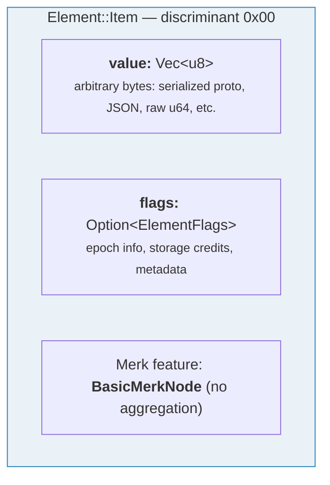
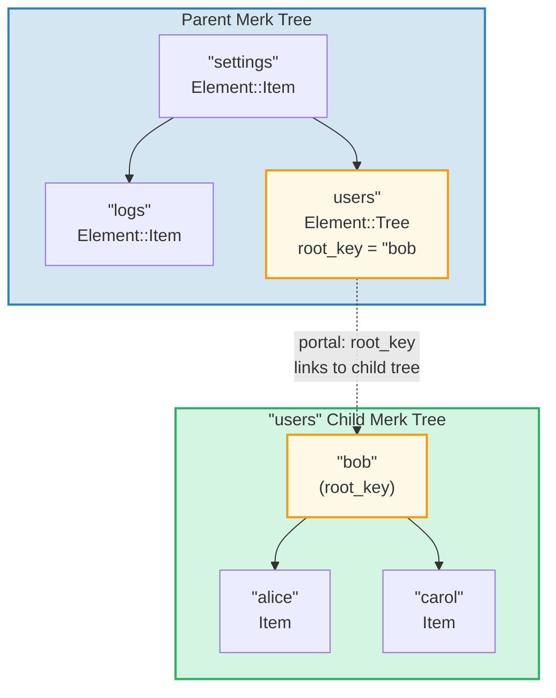
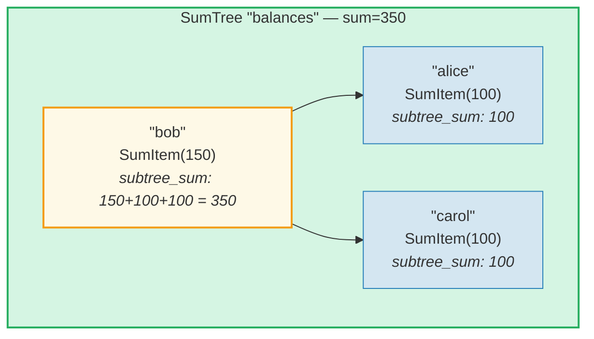
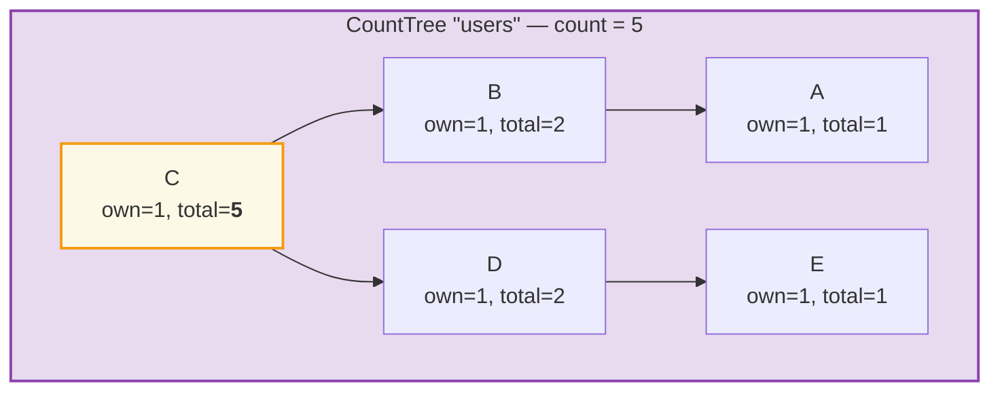
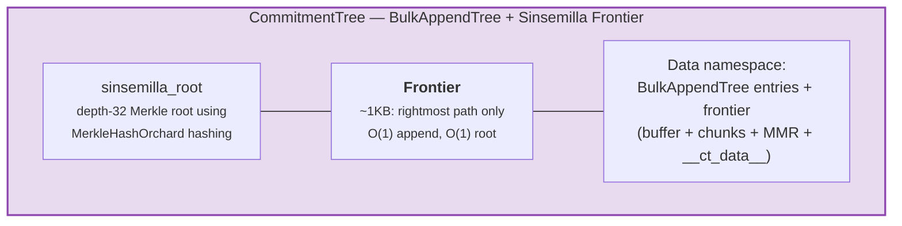

# El Sistema de Elementos

Mientras que Merk trabaja con pares clave-valor crudos, GroveDB opera a un nivel superior
usando **Elementos** (Elements) — valores tipados que llevan significado semántico. Cada valor almacenado
en GroveDB es un Elemento.

## El Enum Element

```rust
// grovedb-element/src/element/mod.rs
pub enum Element {
    Item(Vec<u8>, Option<ElementFlags>),                                    // [0]
    Reference(ReferencePathType, MaxReferenceHop, Option<ElementFlags>),    // [1]
    Tree(Option<Vec<u8>>, Option<ElementFlags>),                           // [2]
    SumItem(SumValue, Option<ElementFlags>),                               // [3]
    SumTree(Option<Vec<u8>>, SumValue, Option<ElementFlags>),              // [4]
    BigSumTree(Option<Vec<u8>>, BigSumValue, Option<ElementFlags>),        // [5]
    CountTree(Option<Vec<u8>>, CountValue, Option<ElementFlags>),          // [6]
    CountSumTree(Option<Vec<u8>>, CountValue, SumValue, Option<ElementFlags>), // [7]
    ProvableCountTree(Option<Vec<u8>>, CountValue, Option<ElementFlags>),  // [8]
    ItemWithSumItem(Vec<u8>, SumValue, Option<ElementFlags>),              // [9]
    ProvableCountSumTree(Option<Vec<u8>>, CountValue, SumValue,
                         Option<ElementFlags>),                            // [10]
    CommitmentTree(u64, u8, Option<ElementFlags>),                         // [11]
    MmrTree(u64, Option<ElementFlags>),                                    // [12]
    BulkAppendTree(u64, u8, Option<ElementFlags>),                         // [13]
    DenseAppendOnlyFixedSizeTree(u16, u8, Option<ElementFlags>),           // [14]
}
```

Los números discriminantes (mostrados entre corchetes) se usan durante la serialización.

Alias de tipos usados a lo largo del código:

```rust
pub type ElementFlags = Vec<u8>;        // Arbitrary metadata per element
pub type MaxReferenceHop = Option<u8>;  // Optional hop limit for references
pub type SumValue = i64;                // 64-bit signed sum
pub type BigSumValue = i128;            // 128-bit signed sum
pub type CountValue = u64;              // 64-bit unsigned count
```

## Item — Almacenamiento Básico Clave-Valor

El elemento más simple. Almacena bytes arbitrarios:

```rust
Element::Item(value: Vec<u8>, flags: Option<ElementFlags>)
```



Constructores:

```rust
Element::new_item(b"hello world".to_vec())
Element::new_item_with_flags(b"data".to_vec(), Some(vec![0x01, 0x02]))
```

Los Items participan en la agregación de sumas: dentro de un SumTree, un Item contribuye una
suma predeterminada de 0. Un SumItem contribuye su valor explícito.

## Tree — Contenedores para Subárboles

Un elemento Tree es un **portal** a otro árbol Merk. Almacena la clave raíz del
árbol hijo (si existe):

```rust
Element::Tree(root_key: Option<Vec<u8>>, flags: Option<ElementFlags>)
```



> El elemento Tree en el Merk padre almacena la `root_key` del árbol Merk hijo. Esto crea un **portal** — un enlace de un árbol Merk hacia otro.

Cuando un árbol está vacío, `root_key` es `None`. El constructor `Element::empty_tree()`
crea `Element::Tree(None, None)`.

## SumItem / SumTree — Sumas Agregadas

Un **SumTree** mantiene automáticamente la suma de las contribuciones de suma de todos sus
hijos directos:

```rust
Element::SumTree(root_key: Option<Vec<u8>>, sum: SumValue, flags: Option<ElementFlags>)
Element::SumItem(value: SumValue, flags: Option<ElementFlags>)
```



> **Fórmula de agregación:** `node_sum = own_value + left_child_sum + right_child_sum`
> Bob: 150 + 100 (alice) + 100 (carol) = **350**. La suma raíz (350) se almacena en el elemento SumTree del padre.

La suma se mantiene a nivel de Merk a través del tipo de característica `TreeFeatureType::SummedMerkNode(i64)`. Durante la propagación del árbol, los datos agregados de cada nodo se recalculan:

```text
aggregate_sum = own_sum + left_child_sum + right_child_sum
```

## CountTree, CountSumTree, BigSumTree

Tipos adicionales de árboles agregados:

| Tipo de Elemento | Tipo de Característica Merk | Agrega |
|---|---|---|
| `CountTree` | `CountedMerkNode(u64)` | Número de elementos |
| `CountSumTree` | `CountedSummedMerkNode(u64, i64)` | Tanto conteo como suma |
| `BigSumTree` | `BigSummedMerkNode(i128)` | Suma de 128 bits para valores grandes |
| `ProvableCountTree` | `ProvableCountedMerkNode(u64)` | Conteo integrado en el hash |
| `ProvableCountSumTree` | `ProvableCountedSummedMerkNode(u64, i64)` | Conteo en hash + suma |

**ProvableCountTree** es especial: su conteo se incluye en el cálculo de `node_hash`
(vía `node_hash_with_count`), por lo que una prueba puede verificar el conteo sin
revelar ningún valor.

## Serialización de Elementos

Los elementos se serializan usando **bincode** con orden de bytes big-endian:

```rust
pub fn serialize(&self, grove_version: &GroveVersion) -> Result<Vec<u8>, ElementError> {
    let config = config::standard().with_big_endian().with_no_limit();
    bincode::encode_to_vec(self, config)
}
```

El primer byte es el **discriminante**, permitiendo detección de tipo en O(1):

```rust
pub fn from_serialized_value(value: &[u8]) -> Option<ElementType> {
    match value.first()? {
        0 => Some(ElementType::Item),
        1 => Some(ElementType::Reference),
        2 => Some(ElementType::Tree),
        3 => Some(ElementType::SumItem),
        // ... etc
    }
}
```

## TreeFeatureType y Flujo de Datos Agregados

El enum `TreeFeatureType` tiende un puente entre los Elementos de GroveDB y los nodos Merk:

```rust
pub enum TreeFeatureType {
    BasicMerkNode,                              // No aggregation
    SummedMerkNode(i64),                       // Sum aggregation
    BigSummedMerkNode(i128),                   // Large sum
    CountedMerkNode(u64),                      // Count
    CountedSummedMerkNode(u64, i64),           // Count + sum
    ProvableCountedMerkNode(u64),              // Count in hash
    ProvableCountedSummedMerkNode(u64, i64),   // Count in hash + sum
}
```

Los datos agregados fluyen **hacia arriba** a través del árbol:



> **Tabla de agregación:** El agregado de cada nodo = propio(1) + agregado_izquierdo + agregado_derecho
>
> | Nodo | propio | agg_izq | agg_der | total |
> |------|-----|----------|-----------|-------|
> | A | 1 | 0 | 0 | 1 |
> | B | 1 | 1 (A) | 0 | 2 |
> | E | 1 | 0 | 0 | 1 |
> | D | 1 | 0 | 1 (E) | 2 |
> | C | 1 | 2 (B) | 2 (D) | **5** (raíz) |

El conteo almacenado en cada nodo representa el conteo total en el
subárbol con raíz en ese nodo, incluyéndose a sí mismo. El conteo del nodo raíz es el total
para todo el árbol.

El enum `AggregateData` lo transporta a través del sistema de enlaces:

```rust
pub enum AggregateData {
    NoAggregateData,
    Sum(i64),
    BigSum(i128),
    Count(u64),
    CountAndSum(u64, i64),
    ProvableCount(u64),
    ProvableCountAndSum(u64, i64),
}
```

## CommitmentTree — Árbol de Compromisos Sinsemilla

Un **CommitmentTree** proporciona un árbol de Merkle Sinsemilla de profundidad 32 para rastrear
anclas de compromisos de notas, como se usa en el protocolo blindado Orchard de Zcash. Envuelve
`incrementalmerkletree::Frontier<MerkleHashOrchard, 32>` para O(1) de inserción y
cálculo de raíz:

```rust
Element::CommitmentTree(
    total_count: u64,               // Number of commitments appended
    chunk_power: u8,                // BulkAppendTree compaction size (chunk_size = 2^chunk_power)
    flags: Option<ElementFlags>,
)                                   // discriminant [11]
```

> **Nota:** El hash raíz de la frontera Sinsemilla NO se almacena en el Elemento.
> Se persiste en el almacenamiento de datos y fluye a través del mecanismo de hash hijo del Merk
> (parámetro `subtree_root_hash` de `insert_subtree`). Cualquier cambio en la frontera
> se propaga automáticamente hacia arriba a través de la jerarquía Merk de GroveDB.



**Arquitectura:**
- La *frontera* (la ruta más a la derecha del árbol de Merkle, ~1KB de tamaño constante) se
  almacena en el **espacio de nombres de datos**, con clave `COMMITMENT_TREE_DATA_KEY`
- Los datos reales de las notas (`cmx || ciphertext`) se almacenan a través de un **BulkAppendTree**
  en el **espacio de nombres de datos** — compactados en chunks, recuperables por posición
- Las anclas históricas son rastreadas por Platform en un árbol demostrable separado
- La raíz Sinsemilla NO se almacena en el Elemento — fluye como el hash hijo del
  Merk a través de la jerarquía de hash de GroveDB

**Operaciones:**
- `commitment_tree_insert(path, key, cmx, ciphertext, tx)` — Inserción tipada
  que acepta `TransmittedNoteCiphertext<M>`; retorna `(new_root, position)`
- `commitment_tree_anchor(path, key, tx)` — Obtener el Anchor de Orchard actual
- `commitment_tree_get_value(path, key, position, tx)` — Recuperar valor por posición
- `commitment_tree_count(path, key, tx)` — Obtener el conteo total de elementos

**Genérico MemoSize:** `CommitmentTree<S, M: MemoSize = DashMemo>` valida que
las cargas útiles de texto cifrado coincidan con el tamaño esperado para `M`. Para Dash (memos de 36 bytes):
`epk_bytes (32) + enc_ciphertext (104) + out_ciphertext (80) = 216 bytes`.

**Seguimiento de costos:** Las operaciones de hash Sinsemilla se rastrean vía
`cost.sinsemilla_hash_calls`. El cálculo de la raíz siempre recorre 32 niveles.
Las fusiones de ommers se propagan en cascada a través de `trailing_ones()` de la posición anterior.
Las operaciones del BulkAppendTree agregan costos de hash Blake3.

## MmrTree — Merkle Mountain Range

Un **MmrTree** almacena datos en un Merkle Mountain Range (MMR) de solo-adición usando
hashing Blake3. Los nodos del MMR se almacenan en la columna de **datos** (la misma que los nodos Merk),
no en un subárbol Merk hijo. Consulta el **[Capítulo 13](#chapter-13-the-mmr-tree--append-only-authenticated-logs)**
para una inmersión profunda completa sobre cómo funcionan los MMR, cómo se llenan, cómo se generan
y verifican las pruebas, y cómo MmrTree se integra con GroveDB.

```rust
Element::MmrTree(
    mmr_size: u64,                  // Internal MMR size (nodes, not leaves)
    flags: Option<ElementFlags>,
)                                   // discriminant [12]
```

> **Nota:** El hash raíz del MMR NO se almacena en el Elemento. Fluye como el hash hijo del
> Merk vía el parámetro `subtree_root_hash` de `insert_subtree`.

**Operaciones:** `mmr_tree_append`, `mmr_tree_root_hash`, `mmr_tree_get_value`,
`mmr_tree_leaf_count`. **Pruebas:** Pruebas V1 (ver §9.6 y §13.9).

## BulkAppendTree — Estructura de Solo-Adición de Dos Niveles

Un **BulkAppendTree** combina un buffer de árbol denso de Merkle con un MMR a nivel de chunk
para inserciones eficientes de alto rendimiento con consultas de rango demostrables. Es un
árbol no-Merk — los datos residen en el espacio de nombres de **datos**, no en un subárbol Merk hijo.
Consulta el **[Capítulo 14](#chapter-14-the-bulkappendtree--high-throughput-append-only-storage)**
para una inmersión profunda completa sobre la arquitectura de dos niveles, la compactación de chunks,
la generación de pruebas, la verificación y la integración con GroveDB.

```rust
Element::BulkAppendTree(
    total_count: u64,               // Total values appended
    chunk_power: u8,                // Dense tree height (buffer capacity = 2^chunk_power - 1)
    flags: Option<ElementFlags>,
)                                   // discriminant [13]
```

> **Nota:** La raíz de estado (`blake3("bulk_state" || mmr_root || dense_tree_root)`)
> NO se almacena en el Elemento. Fluye como el hash hijo del Merk vía
> el parámetro `subtree_root_hash` de `insert_subtree`.

**Operaciones:** `bulk_append`, `bulk_get_value`, `bulk_get_chunk`,
`bulk_get_buffer`, `bulk_count`, `bulk_chunk_count`.
**Pruebas:** Pruebas de rango V1 (ver §9.6 y §14.10).

## DenseAppendOnlyFixedSizeTree — Almacenamiento Denso de Capacidad Fija

Un **DenseAppendOnlyFixedSizeTree** es un árbol binario completo de altura fija *h*
donde cada nodo (interno y hoja) almacena un valor de datos. Las posiciones se llenan
en orden por niveles (BFS). El hash raíz se recalcula sobre la marcha — no se persisten
hashes intermedios. Consulta el **[Capítulo 16](#chapter-16-the-denseappendonlyfixedsizetree--dense-fixed-capacity-merkle-storage)**
para la inmersión profunda completa.

```rust
Element::DenseAppendOnlyFixedSizeTree(
    count: u16,                     // Number of values stored (max 65,535)
    height: u8,                     // Tree height (1..=16, immutable), capacity = 2^h - 1
    flags: Option<ElementFlags>,
)                                   // discriminant [14]
```

> **Nota:** El hash raíz NO se almacena en el Elemento — se recalcula sobre
> la marcha y fluye como el hash hijo del Merk. El campo `count` es `u16` (no u64),
> limitando los árboles a 65,535 posiciones. Las alturas están restringidas a 1..=16.

**Operaciones:** `dense_tree_insert`, `dense_tree_get`, `dense_tree_root_hash`,
`dense_tree_count`.
**Pruebas:** Solo a nivel de elemento (sin pruebas de subconsulta por ahora).

## Árboles No-Merk — Patrones Comunes

CommitmentTree, MmrTree, BulkAppendTree y DenseAppendOnlyFixedSizeTree comparten un patrón arquitectónico
común que los distingue de los tipos de árbol basados en Merk (Tree, SumTree,
CountTree, etc.):

| Propiedad | Árboles basados en Merk | Árboles no-Merk |
|----------|-----------------|-------------------|
| Subárbol Merk hijo | Sí (`root_key = Some(...)`) | No (sin campo root_key) |
| Almacenamiento de datos | Pares clave-valor Merk | Blobs en columna de datos (claves no-Merk) |
| Vinculación del hash raíz | `combine_hash(elem_hash, child_root_hash)` | `combine_hash(elem_hash, type_specific_root)` |
| Raíz específica del tipo | Mantenida por Merk AVL | Fluye como hash hijo del Merk (NO en bytes del elemento) |
| Formato de prueba | V0 (Merk capa por capa) | V1 (prueba específica del tipo) |
| TreeFeatureType | BasicMerkNode (sin agregación) | BasicMerkNode |

> **Nota sobre columna de almacenamiento:** Los cuatro tipos de árboles no-Merk (MmrTree,
> CommitmentTree, BulkAppendTree, DenseAppendOnlyFixedSizeTree) almacenan sus
> datos en la columna de **datos** usando claves no-Merk. CommitmentTree almacena su
> frontera Sinsemilla junto con las entradas del BulkAppendTree en la misma columna de **datos**
> (clave `b"__ct_data__"`).

La raíz específica del tipo (raíz Sinsemilla, raíz MMR, raíz de estado, o hash raíz del árbol denso) NO se
almacena en el Elemento. En su lugar, fluye como el **hash hijo** del Merk vía
el parámetro `subtree_root_hash` de `insert_subtree`. El combined_value_hash del Merk
se convierte en `combine_hash(value_hash(element_bytes), type_specific_root)`.
Cualquier cambio en la raíz específica del tipo cambia el hash hijo, que cambia
el combined_value_hash, que se propaga hacia arriba a través de la jerarquía de hash de
GroveDB — manteniendo la integridad criptográfica.

---
