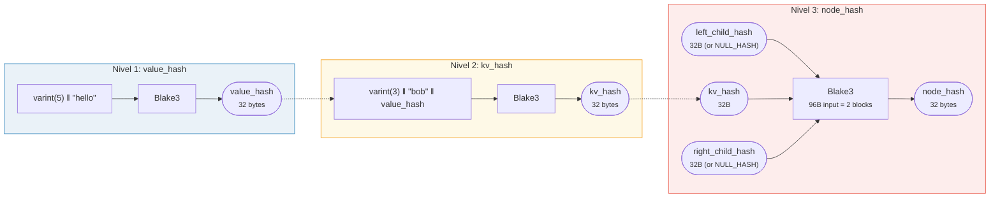
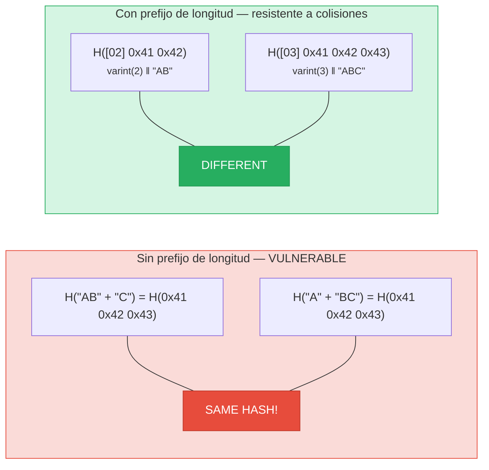
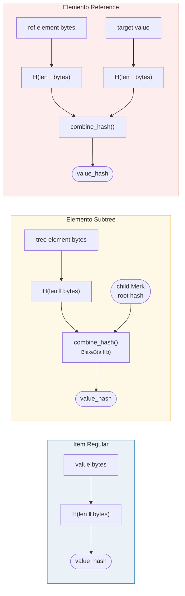

# Hashing — Integridad Criptográfica

Cada nodo en un árbol Merk se hashea para producir un **hash raíz** — un único valor de 32 bytes
que autentica todo el árbol. Cualquier cambio en cualquier clave, valor o
relación estructural producirá un hash raíz diferente.

## Jerarquía de Hash de Tres Niveles

Merk usa un esquema de hashing de tres niveles, del más interno al más externo:

Ejemplo: key = `"bob"` (3 bytes), value = `"hello"` (5 bytes):



> La RAÍZ del árbol = `node_hash` del nodo raíz — autentica **cada** clave, valor y relación estructural. Los hijos faltantes usan `NULL_HASH = [0x00; 32]`.

### Nivel 1: value_hash

```rust
// merk/src/tree/hash.rs
pub fn value_hash(value: &[u8]) -> CostContext<CryptoHash> {
    let mut hasher = blake3::Hasher::new();
    let val_length = value.len().encode_var_vec();  // Varint encoding
    hasher.update(val_length.as_slice());
    hasher.update(value);
    // ...
}
```

La longitud del valor se **codifica como varint** y se antepone. Esto es crítico para la
resistencia a colisiones — sin él, `H("AB" ‖ "C")` sería igual a `H("A" ‖ "BC")`.

### Nivel 2: kv_hash

```rust
pub fn kv_hash(key: &[u8], value: &[u8]) -> CostContext<CryptoHash> {
    let mut hasher = blake3::Hasher::new();
    let key_length = key.len().encode_var_vec();
    hasher.update(key_length.as_slice());
    hasher.update(key);
    let vh = value_hash(value);
    hasher.update(vh.as_slice());  // Nested hash
    // ...
}
```

Esto vincula la clave al valor. Para la verificación de pruebas, también existe una variante
que toma un value_hash precalculado:

```rust
pub fn kv_digest_to_kv_hash(key: &[u8], value_hash: &CryptoHash) -> CostContext<CryptoHash>
```

Esto se usa cuando el verificador ya tiene el value_hash (por ejemplo, para subárboles
donde value_hash es un hash combinado).

### Nivel 3: node_hash

```rust
pub fn node_hash(
    kv: &CryptoHash,
    left: &CryptoHash,
    right: &CryptoHash,
) -> CostContext<CryptoHash> {
    let mut hasher = blake3::Hasher::new();
    hasher.update(kv);       // 32 bytes
    hasher.update(left);     // 32 bytes
    hasher.update(right);    // 32 bytes — total 96 bytes
    // Always exactly 2 hash operations (96 bytes / 64-byte block = 2)
}
```

Si un hijo está ausente, su hash es el **NULL_HASH** — 32 bytes cero:

```rust
pub const NULL_HASH: CryptoHash = [0; HASH_LENGTH];  // [0u8; 32]
```

## Blake3 como Función de Hash

GroveDB usa **Blake3** para todo el hashing. Propiedades clave:

- **Salida de 256 bits** (32 bytes)
- **Tamaño de bloque**: 64 bytes
- **Velocidad**: ~3x más rápido que SHA-256 en hardware moderno
- **Streaming**: Puede alimentar datos incrementalmente

El costo de la operación de hash se calcula según cuántos bloques de 64 bytes se
procesan:

```rust
let hashes = 1 + (hasher.count() - 1) / 64;  // Number of hash operations
```

## Codificación de Prefijo de Longitud para Resistencia a Colisiones

Cada entrada de longitud variable se prefija con su longitud usando **codificación varint**:



> **Entrada de value_hash**: `[varint(value.len)] [bytes del valor]`
> **Entrada de kv_hash**: `[varint(key.len)] [bytes de la clave] [value_hash: 32 bytes]`

Sin prefijos de longitud, un atacante podría crear diferentes pares clave-valor que
produzcan el mismo digest. El prefijo de longitud hace esto criptográficamente
inviable.

## Hashing Combinado para Elementos Especiales

Para **subárboles** y **referencias**, el `value_hash` no es simplemente `H(value)`.
En su lugar, es un **hash combinado** que vincula el elemento a su objetivo:



> **Subtree:** vincula el hash raíz del Merk hijo en el padre. **Reference:** vincula tanto la ruta de la referencia COMO el valor objetivo. Cambiar cualquiera cambia el hash raíz.

La función `combine_hash`:

```rust
pub fn combine_hash(hash_one: &CryptoHash, hash_two: &CryptoHash) -> CostContext<CryptoHash> {
    let mut hasher = blake3::Hasher::new();
    hasher.update(hash_one);   // 32 bytes
    hasher.update(hash_two);   // 32 bytes — total 64 bytes, exactly 1 hash op
    // ...
}
```

Esto es lo que permite a GroveDB autenticar toda la jerarquía a través de un único
hash raíz — el value_hash de cada árbol padre para un elemento de subárbol incluye el
hash raíz del árbol hijo.

## Hashing Agregado para ProvableCountTree

Los nodos `ProvableCountTree` incluyen el conteo agregado en el hash del nodo:

```rust
pub fn node_hash_with_count(
    kv: &CryptoHash,
    left: &CryptoHash,
    right: &CryptoHash,
    count: u64,
) -> CostContext<CryptoHash> {
    let mut hasher = blake3::Hasher::new();
    hasher.update(kv);                        // 32 bytes
    hasher.update(left);                      // 32 bytes
    hasher.update(right);                     // 32 bytes
    hasher.update(&count.to_be_bytes());      // 8 bytes — total 104 bytes
    // Still exactly 2 hash ops (104 < 128 = 2 × 64)
}
```

Esto significa que una prueba del conteo no requiere revelar los datos reales — el conteo
está integrado en el compromiso criptográfico.

---
