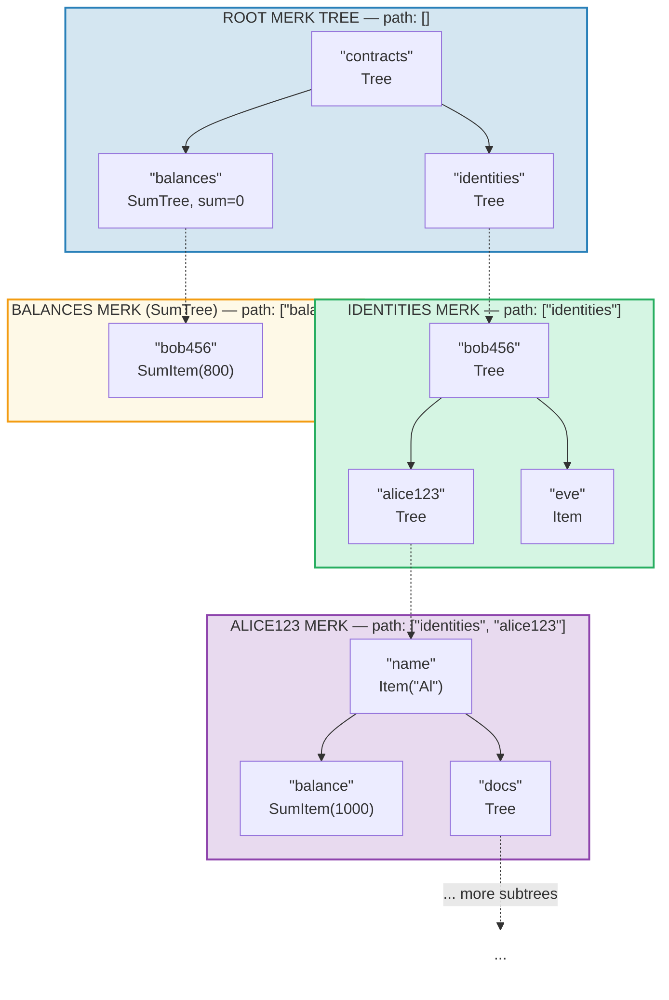
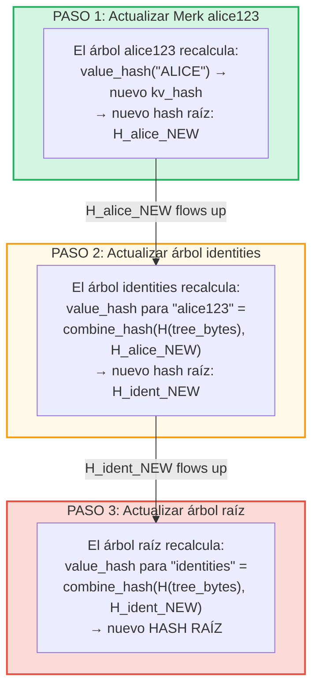
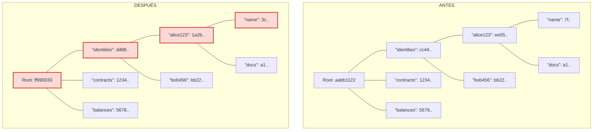
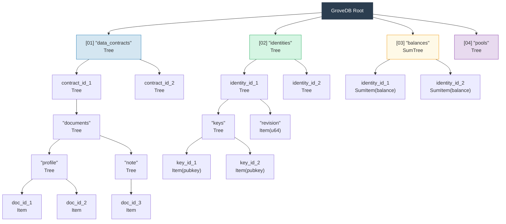

# El Grove Jerárquico — Árbol de Árboles

## Cómo los Subárboles se Anidan Dentro de los Árboles Padre

La característica definitoria de GroveDB es que un árbol Merk puede contener elementos que son
a su vez árboles Merk. Esto crea un **espacio de nombres jerárquico**:



> Cada caja coloreada es un árbol Merk separado. Las flechas discontinuas representan los enlaces portal desde los elementos Tree hacia sus árboles Merk hijos. La ruta hacia cada Merk se muestra en su etiqueta.

## Sistema de Direccionamiento por Rutas

Cada elemento en GroveDB se direcciona mediante una **ruta** (path) — una secuencia de cadenas de bytes
que navega desde la raíz a través de subárboles hasta la clave objetivo:

```text
    Path: ["identities", "alice123", "name"]

    Paso 1: En el árbol raíz, buscar "identities" → elemento Tree
    Paso 2: Abrir subárbol identities, buscar "alice123" → elemento Tree
    Paso 3: Abrir subárbol alice123, buscar "name" → Item("Alice")
```

Las rutas se representan como `Vec<Vec<u8>>` o usando el tipo `SubtreePath` para
manipulación eficiente sin asignación:

```rust
// The path to the element (all segments except the last)
let path: &[&[u8]] = &[b"identities", b"alice123"];
// The key within the final subtree
let key: &[u8] = b"name";
```

## Generación de Prefijos Blake3 para Aislamiento de Almacenamiento

Cada subárbol en GroveDB obtiene su propio **espacio de nombres de almacenamiento aislado** en RocksDB.
El espacio de nombres se determina hasheando la ruta con Blake3:

```rust
pub type SubtreePrefix = [u8; 32];

// The prefix is computed by hashing the path segments
// storage/src/rocksdb_storage/storage.rs
```

Por ejemplo:

```text
    Path: ["identities", "alice123"]
    Prefix: Blake3(["identities", "alice123"]) = [0xab, 0x3f, ...]  (32 bytes)

    En RocksDB, las claves para este subárbol se almacenan como:
    [prefix: 32 bytes][original_key]

    Entonces "name" en este subárbol se convierte en:
    [0xab, 0x3f, ...][0x6e, 0x61, 0x6d, 0x65]  ("name")
```

Esto asegura:
- Sin colisiones de claves entre subárboles (prefijo de 32 bytes = aislamiento de 256 bits)
- Cálculo eficiente del prefijo (un solo hash Blake3 sobre los bytes de la ruta)
- Los datos del subárbol están co-ubicados en RocksDB para eficiencia de caché

## Propagación del Hash Raíz a Través de la Jerarquía

Cuando un valor cambia profundamente en el grove, el cambio debe **propagarse hacia arriba** para
actualizar el hash raíz:

```text
    Cambio: Actualizar "name" a "ALICE" en identities/alice123/

    Paso 1: Actualizar valor en el árbol Merk de alice123
            → el árbol alice123 obtiene nuevo hash raíz: H_alice_new

    Paso 2: Actualizar elemento "alice123" en el árbol identities
            → el value_hash del árbol identities para "alice123" =
              combine_hash(H(tree_element_bytes), H_alice_new)
            → el árbol identities obtiene nuevo hash raíz: H_ident_new

    Paso 3: Actualizar elemento "identities" en el árbol raíz
            → el value_hash del árbol raíz para "identities" =
              combine_hash(H(tree_element_bytes), H_ident_new)
            → EL HASH RAÍZ cambia
```



**Antes vs Después** — nodos cambiados marcados en rojo:



> Solo los nodos en la ruta desde el valor cambiado hasta la raíz se recalculan. Los hermanos y otras ramas permanecen sin cambios.

La propagación se implementa mediante `propagate_changes_with_transaction`, que recorre
la ruta hacia arriba desde el subárbol modificado hasta la raíz, actualizando el hash del elemento de cada padre
en el camino.

## Ejemplo de Estructura de Grove Multi-Nivel

Aquí hay un ejemplo completo mostrando cómo Dash Platform estructura su estado:



Cada caja es un árbol Merk separado, autenticado completamente hasta un único hash
raíz en el que los validadores están de acuerdo.

---
