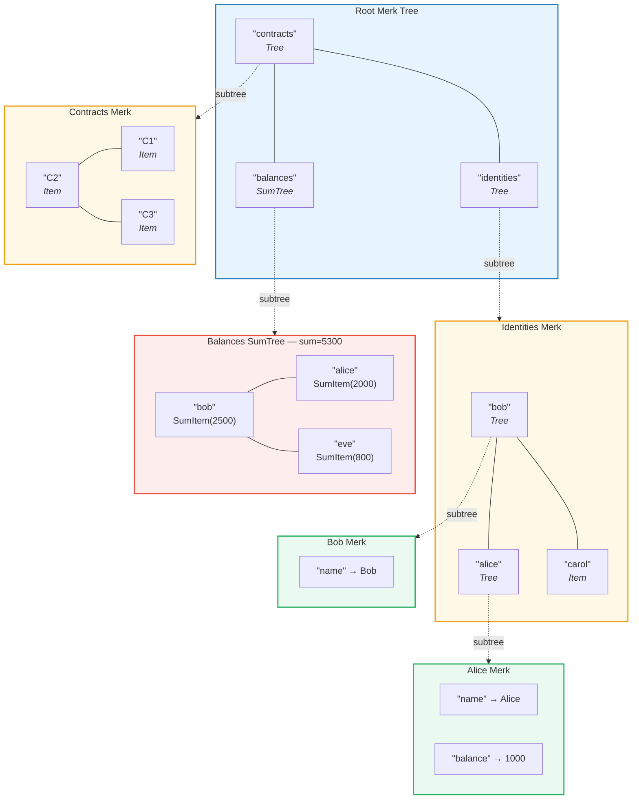
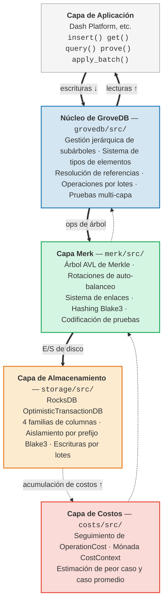

# Introducción — ¿Qué es GroveDB?

## La Idea Central

GroveDB es una **estructura de datos autenticada jerárquica** — esencialmente un *grove*
(bosque, o árbol de árboles) construido sobre árboles AVL de Merkle. Cada nodo en la
base de datos es parte de un árbol autenticado criptográficamente, y cada árbol puede
contener otros árboles como hijos, formando una jerarquía profunda de estado verificable.

> Cada caja de color es un **árbol Merk separado**. Las flechas discontinuas muestran la relación de subárbol — un elemento Tree en el padre contiene la clave raíz del Merk hijo.

En una base de datos tradicional, podrías almacenar datos en un almacén clave-valor plano con
un único árbol de Merkle encima para autenticación. GroveDB toma un enfoque diferente:
anida árboles de Merkle dentro de árboles de Merkle. Esto te proporciona:

1. **Índices secundarios eficientes** — consulta por cualquier ruta, no solo por clave primaria
2. **Pruebas criptográficas compactas** — demuestra la existencia (o ausencia) de cualquier dato
3. **Datos agregados** — los árboles pueden sumar, contar o agregar automáticamente
   sus hijos
4. **Operaciones atómicas entre árboles** — las operaciones por lotes abarcan múltiples subárboles

## Por Qué Existe GroveDB

GroveDB fue diseñado para **Dash Platform**, una plataforma de aplicaciones descentralizada
donde cada pieza de estado debe ser:

- **Autenticada**: Cualquier nodo puede demostrar cualquier pieza de estado a un cliente ligero
- **Determinista**: Cada nodo calcula exactamente la misma raíz de estado
- **Eficiente**: Las operaciones deben completarse dentro de las restricciones de tiempo de bloque
- **Consultable**: Las aplicaciones necesitan consultas ricas, no solo búsquedas por clave

Los enfoques tradicionales se quedan cortos:

| Enfoque | Problema |
|----------|---------|
| Árbol de Merkle simple | Solo soporta búsquedas por clave, sin consultas por rango |
| MPT de Ethereum | Rebalanceo costoso, tamaños de prueba grandes |
| Clave-valor plano + árbol único | Sin consultas jerárquicas, una sola prueba cubre todo |
| Árbol B | No está naturalmente Merklizado, autenticación compleja |

GroveDB resuelve estos problemas combinando las **garantías probadas de balanceo de los árboles AVL**
con **anidamiento jerárquico** y un **sistema rico de tipos de elementos**.

## Visión General de la Arquitectura

GroveDB está organizado en capas distintas, cada una con una responsabilidad clara:

Los datos fluyen **hacia abajo** a través de estas capas durante las escrituras y **hacia arriba** durante las lecturas.
Cada operación acumula costos mientras atraviesa la pila, permitiendo una contabilidad precisa
de recursos.

---
