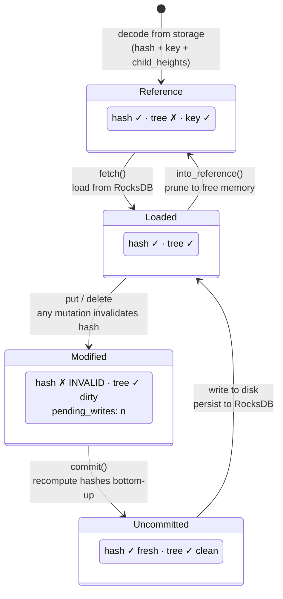
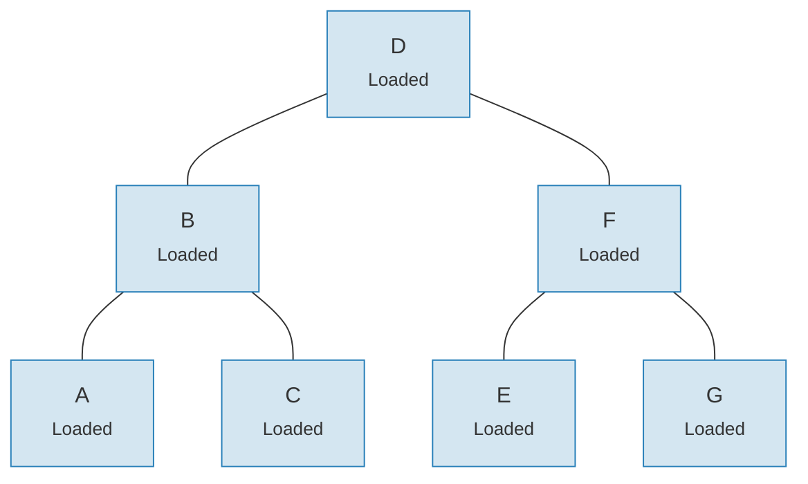
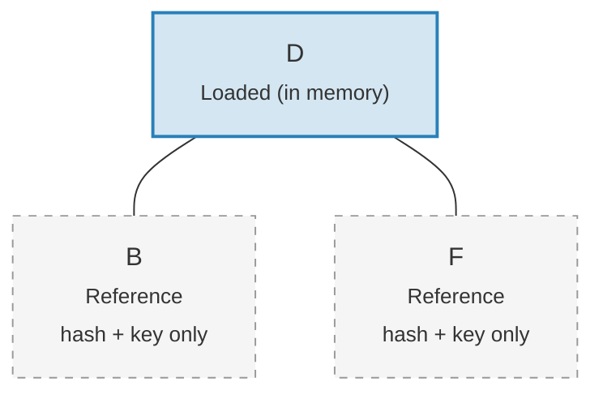

# El Sistema de Enlaces — Arquitectura de Carga Diferida

Cargar un árbol Merk completo en memoria sería prohibitivamente costoso para árboles
grandes. El sistema de enlaces (Link) resuelve esto representando las conexiones hijas en cuatro
estados posibles, habilitando la **carga diferida** (lazy loading) — los hijos se obtienen del almacenamiento solo
cuando realmente se necesitan.

## Cuatro Estados de Enlace

```rust
// merk/src/tree/link.rs
pub enum Link {
    Reference {                    // Pruned: only metadata, no tree in memory
        hash: CryptoHash,
        child_heights: (u8, u8),
        key: Vec<u8>,
        aggregate_data: AggregateData,
    },
    Modified {                     // Recently changed, hash not yet computed
        pending_writes: usize,
        child_heights: (u8, u8),
        tree: TreeNode,
    },
    Uncommitted {                  // Hashed but not yet persisted to storage
        hash: CryptoHash,
        child_heights: (u8, u8),
        tree: TreeNode,
        aggregate_data: AggregateData,
    },
    Loaded {                       // Fully loaded from storage
        hash: CryptoHash,
        child_heights: (u8, u8),
        tree: TreeNode,
        aggregate_data: AggregateData,
    },
}
```

## Diagrama de Transición de Estados



## Qué Almacena Cada Estado

| Estado | ¿Hash? | ¿Árbol en Memoria? | Propósito |
|-------|-------|-----------------|---------|
| **Reference** | Sí | No | Representación compacta en disco. Solo almacena clave, hash, alturas de hijos y datos agregados. |
| **Modified** | No | Sí | Después de cualquier mutación. Rastrea el conteo de `pending_writes` para optimización de lotes. |
| **Uncommitted** | Sí | Sí | Después del cálculo de hash pero antes de la escritura en almacenamiento. Estado intermedio durante el commit. |
| **Loaded** | Sí | Sí | Completamente materializado. Listo para lecturas o modificaciones adicionales. |

El campo `pending_writes` en `Modified` es notable:

```rust
// Computed as: 1 + left_pending_writes + right_pending_writes
pending_writes: 1 + tree.child_pending_writes(true)
                  + tree.child_pending_writes(false),
```

Este conteo ayuda a la fase de commit a decidir cómo ordenar las escrituras para un
rendimiento óptimo.

## El Patrón de Callback Fetch

El sistema de enlaces usa un **trait Fetch** para abstraer cómo se cargan los nodos hijos:

```rust
pub trait Fetch {
    fn fetch(
        &self,
        link: &Link,
        value_defined_cost_fn: Option<&impl Fn(&[u8], &GroveVersion) -> Option<ValueDefinedCostType>>,
        grove_version: &GroveVersion,
    ) -> CostResult<TreeNode, Error>;
}
```

Diferentes implementaciones de fetch sirven para diferentes propósitos:

- **StorageFetch**: Carga desde RocksDB (la ruta normal)
- **PanicSource**: Usado en pruebas donde la carga nunca debería ocurrir
- **MockSource**: Retorna datos de prueba controlados

Este patrón permite que las operaciones del árbol sean **agnósticas al almacenamiento** — la misma
lógica de balanceo y mutación funciona independientemente de dónde vengan los datos.

## El Patrón Walker

El `Walker` envuelve un `TreeNode` con una fuente `Fetch`, proporcionando recorrido seguro del árbol
con carga diferida automática (`merk/src/tree/walk/mod.rs`):

```rust
pub struct Walker<S: Fetch + Sized + Clone> {
    tree: Owner<TreeNode>,
    source: S,
}
```

El Walker proporciona tres operaciones clave:

**walk()** — Separar un hijo, transformarlo y re-adjuntarlo:

```rust
pub fn walk<F, T>(self, left: bool, f: F, ...) -> CostResult<Self, Error>
where
    F: FnOnce(Option<Self>) -> CostResult<Option<T>, Error>,
    T: Into<TreeNode>,
```

**detach()** — Remover un hijo, cargándolo del almacenamiento si es necesario:

```rust
pub fn detach(self, left: bool, ...) -> CostResult<(Self, Option<Self>), Error>
```

Si el hijo es un `Link::Reference` (podado), detach llamará a `fetch()` para cargarlo
primero. Si el hijo ya está en memoria (`Modified`, `Uncommitted`, `Loaded`),
simplemente toma la propiedad.

**attach()** — Conectar un hijo a un padre:

```rust
pub fn attach(self, left: bool, maybe_child: Option<Self>) -> Self
```

Adjuntar siempre crea un `Link::Modified` ya que la relación padre-hijo
ha cambiado.

## Eficiencia de Memoria Mediante Poda

Después de confirmar cambios, el árbol puede **podar** subárboles cargados de vuelta a
`Link::Reference`, liberando memoria mientras retiene el hash necesario para la
generación de pruebas:

**Antes de la poda** — los 7 nodos en memoria:



**Después de la poda** — solo la raíz en memoria, los hijos son `Link::Reference` (solo hash + clave):



> **Link::Loaded** contiene `hash + child_heights + tree (TreeNode)`. **Link::Reference** contiene solo `hash + child_heights + key` — el TreeNode se libera de la memoria.

La transformación es simple:

```rust
pub fn into_reference(self) -> Link {
    Link::Reference {
        hash: self.hash(),
        child_heights: self.child_heights(),
        key: self.key().to_vec(),
        aggregate_data: self.aggregate_data(),
    }
}
```

Esto es crucial para mantener acotado el uso de memoria en árboles grandes — solo los nodos
que se están accediendo activamente necesitan estar en memoria.

---
