# El Árbol Merk — Un Árbol AVL de Merkle

El árbol Merk es el bloque de construcción fundamental de GroveDB. Cada subárbol en el
grove es un árbol Merk — un árbol binario de búsqueda auto-balanceado donde cada nodo está
hasheado criptográficamente, produciendo un único hash raíz que autentica todo el
contenido del árbol.

## ¿Qué es un Nodo Merk?

A diferencia de muchas implementaciones de árboles de Merkle donde los datos residen solo en las hojas, en un
árbol Merk **cada nodo almacena un par clave-valor**. Esto significa que no hay nodos
internos "vacíos" — el árbol es tanto una estructura de búsqueda como un almacén de datos simultáneamente.

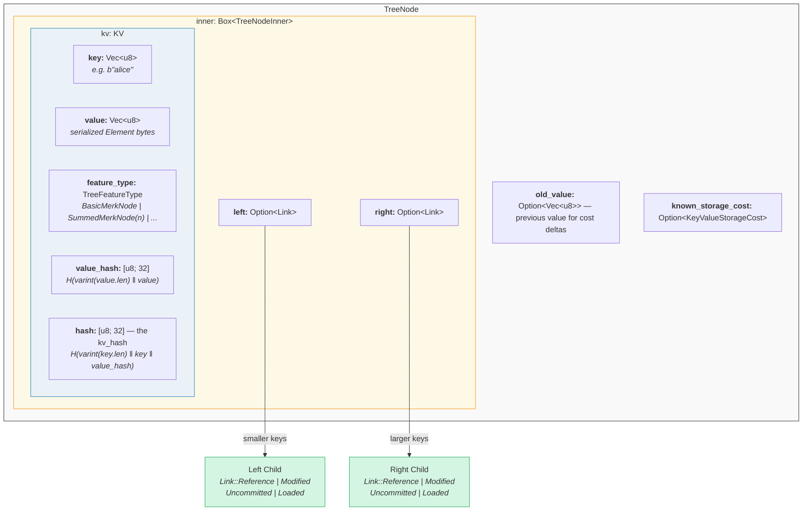

En código (`merk/src/tree/mod.rs`):

```rust
pub struct TreeNode {
    pub(crate) inner: Box<TreeNodeInner>,
    pub(crate) old_value: Option<Vec<u8>>,        // Previous value for cost tracking
    pub(crate) known_storage_cost: Option<KeyValueStorageCost>,
}

pub struct TreeNodeInner {
    pub(crate) left: Option<Link>,    // Left child (smaller keys)
    pub(crate) right: Option<Link>,   // Right child (larger keys)
    pub(crate) kv: KV,               // The key-value payload
}
```

El `Box<TreeNodeInner>` mantiene el nodo en el heap (montículo), lo cual es esencial ya que los
enlaces hijos pueden contener recursivamente instancias completas de `TreeNode`.

## La Estructura KV

La estructura `KV` contiene tanto los datos crudos como sus resúmenes criptográficos
(`merk/src/tree/kv.rs`):

```rust
pub struct KV {
    pub(super) key: Vec<u8>,                        // The lookup key
    pub(super) value: Vec<u8>,                      // The stored value
    pub(super) feature_type: TreeFeatureType,       // Aggregation behavior
    pub(crate) value_defined_cost: Option<ValueDefinedCostType>,
    pub(super) hash: CryptoHash,                    // kv_hash
    pub(super) value_hash: CryptoHash,              // H(value)
}
```

Dos puntos importantes:

1. **Las claves no se almacenan en disco como parte del nodo codificado.** Se almacenan como
   la clave de RocksDB. Cuando un nodo se decodifica desde el almacenamiento, la clave se inyecta
   desde el exterior. Esto evita duplicar los bytes de la clave.

2. **Se mantienen dos campos de hash.** El `value_hash` es `H(value)` y el
   `hash` (kv_hash) es `H(key, value_hash)`. Mantener ambos permite al sistema de pruebas
   elegir cuánta información revelar.

## La Naturaleza Semi-Balanceada — Cómo "Oscila" el AVL

Un árbol Merk es un **árbol AVL** — el clásico árbol binario de búsqueda auto-balanceado
inventado por Adelson-Velsky y Landis. El invariante clave es:

> Para cada nodo, la diferencia de altura entre sus subárboles izquierdo y derecho es
> como máximo 1.

Esto se expresa como el **factor de balance**:

```text
balance_factor = right_height - left_height
```

Valores válidos: **{-1, 0, 1}**

```rust
// merk/src/tree/mod.rs
pub const fn balance_factor(&self) -> i8 {
    let left_height = self.child_height(true) as i8;
    let right_height = self.child_height(false) as i8;
    right_height - left_height
}
```

Pero aquí está el punto sutil: aunque cada nodo individual solo puede inclinarse por un nivel,
estas inclinaciones pueden **acumularse** a lo largo del árbol. Por eso lo llamamos
"semi-balanceado" — el árbol no está perfectamente balanceado como un árbol binario completo.

Consideremos un árbol de 10 nodos. Un árbol perfectamente balanceado tendría altura 4
(⌈log₂(10+1)⌉). Pero un árbol AVL podría tener altura 5:

**Perfectamente balanceado (altura 4)** — cada nivel completamente lleno:

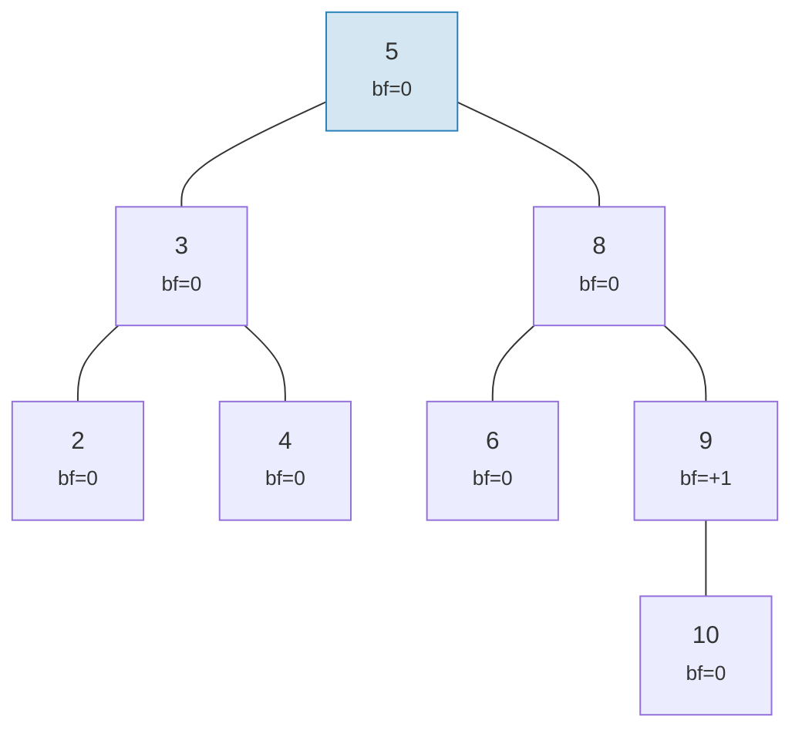

**"Oscilación" válida en AVL (altura 5)** — cada nodo se inclina como máximo 1, pero se acumula:

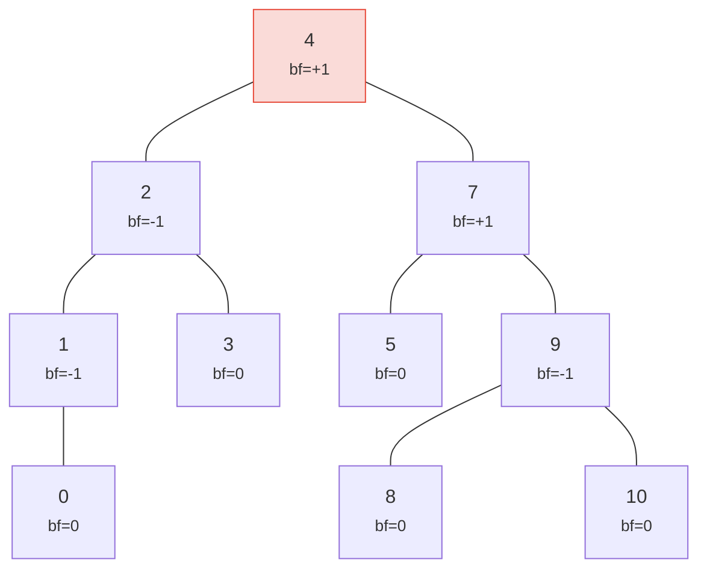

> Altura 5 vs la perfecta 4 — esa es la "oscilación". Peor caso: h ≤ 1.44 × log₂(n+2).

¡Ambos árboles son árboles AVL válidos! La altura en el peor caso de un árbol AVL es:

```text
h ≤ 1.4404 × log₂(n + 2) − 0.3277
```

Entonces para **n = 1,000,000** nodos:
- Balance perfecto: altura 20
- Peor caso AVL: altura ≈ 29

Esta sobrecarga de ~44% es el precio de las reglas simples de rotación del AVL. En la práctica, las
inserciones aleatorias producen árboles mucho más cercanos al balance perfecto.

Así se ven los árboles válidos e inválidos:

**VÁLIDO** — todos los factores de balance en {-1, 0, +1}:

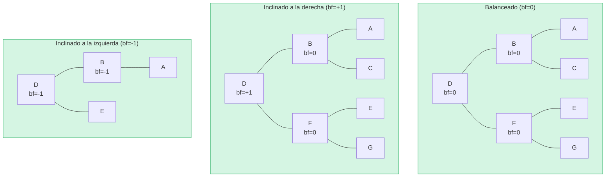

**INVÁLIDO** — factor de balance = +2 (¡necesita rotación!):

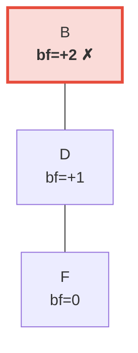

> El subárbol derecho es 2 niveles más alto que el izquierdo (que está vacío). Esto dispara una **rotación a la izquierda** para restaurar el invariante AVL.

## Rotaciones — Restaurando el Balance

Cuando una inserción o eliminación causa que un factor de balance alcance ±2, el árbol debe
ser **rotado** para restaurar el invariante AVL. Hay cuatro casos, reducibles a
dos operaciones fundamentales.

### Rotación Simple a la Izquierda

Se usa cuando un nodo está **cargado a la derecha** (bf = +2) y su hijo derecho está
**cargado a la derecha o balanceado** (bf ≥ 0):

**Antes** (bf=+2):

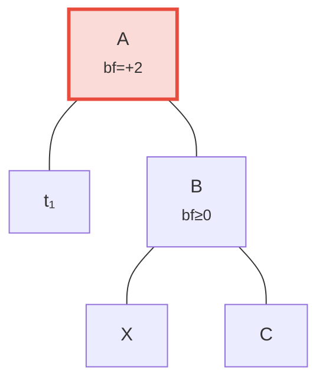

**Después** de la rotación a la izquierda — B promovido a raíz:

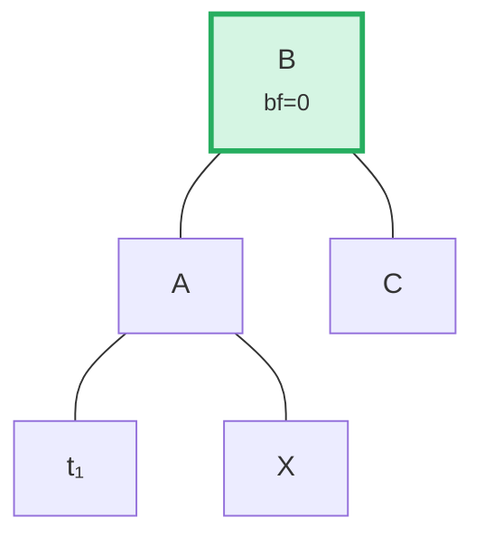

> **Pasos:** (1) Separar B de A. (2) Separar X (hijo izquierdo de B). (3) Adjuntar X como hijo derecho de A. (4) Adjuntar A como hijo izquierdo de B. El subárbol con raíz en B ahora está balanceado.

En código (`merk/src/tree/ops.rs`):

```rust
fn rotate<V>(self, left: bool, ...) -> CostResult<Self, Error> {
    // Detach child on the heavy side
    let (tree, child) = self.detach_expect(left, ...);
    // Detach grandchild from opposite side of child
    let (child, maybe_grandchild) = child.detach(!left, ...);

    // Attach grandchild to original root
    tree.attach(left, maybe_grandchild)
        .maybe_balance(...)
        .flat_map_ok(|tree| {
            // Attach original root as child of promoted node
            child.attach(!left, Some(tree))
                .maybe_balance(...)
        })
}
```

Nota cómo `maybe_balance` se llama recursivamente — la propia rotación podría crear
nuevos desequilibrios que necesiten corrección adicional.

### Rotación Doble (Izquierda-Derecha)

Se usa cuando un nodo está **cargado a la izquierda** (bf = -2) pero su hijo izquierdo está
**cargado a la derecha** (bf > 0). Una rotación simple no arreglaría esto:

**Paso 0: Antes** — C está cargado a la izquierda (bf=-2) pero su hijo izquierdo A se inclina a la derecha (bf=+1). Una rotación simple no arreglará esto:

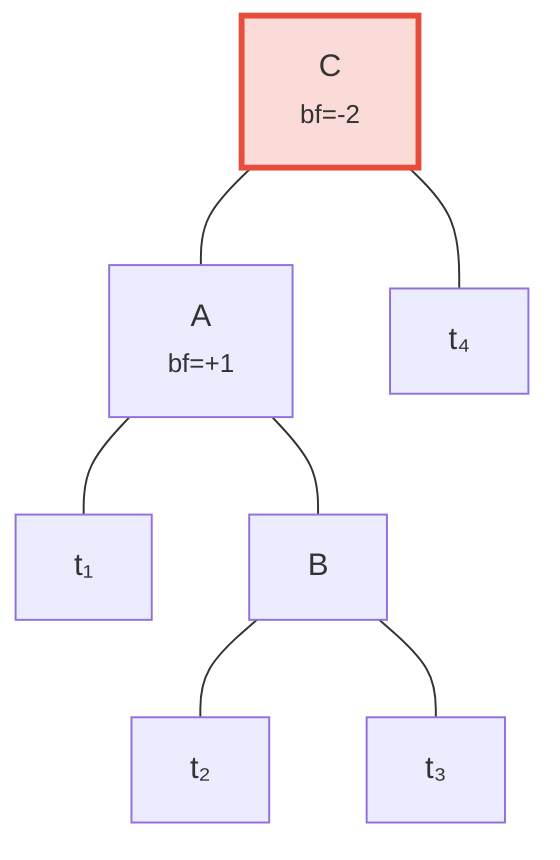

**Paso 1: Rotar hijo A a la izquierda** — ahora tanto C como B se inclinan a la izquierda, arreglable con una rotación simple:

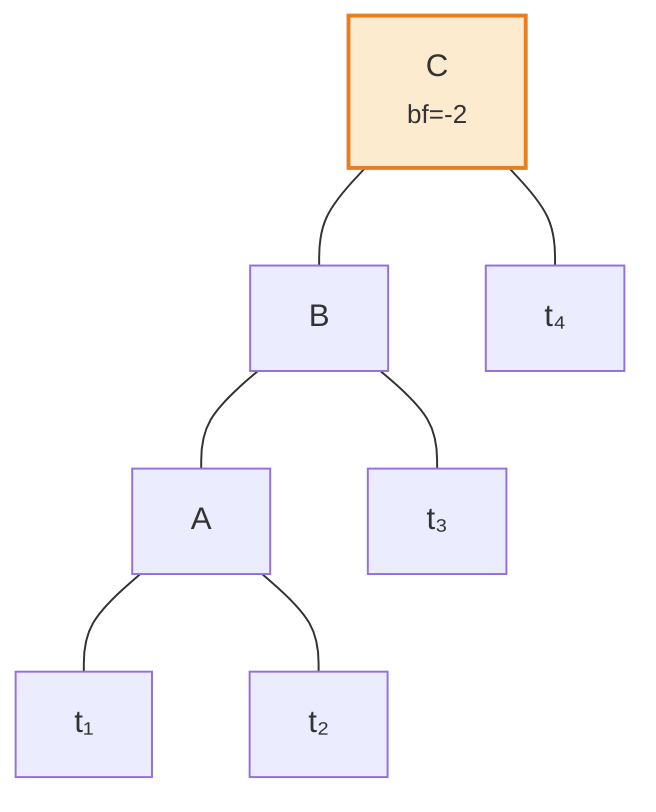

**Paso 2: Rotar raíz C a la derecha** — ¡balanceado!

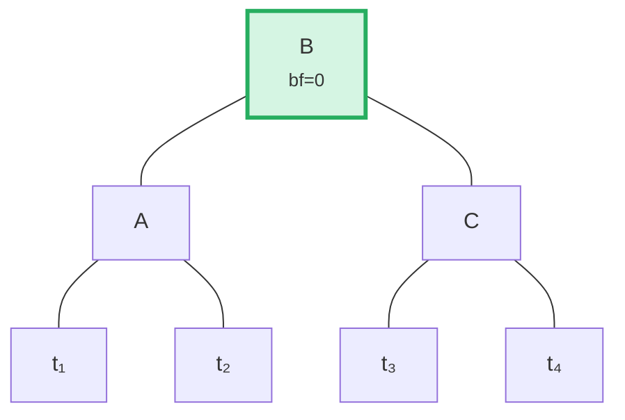

El algoritmo detecta este caso comparando la dirección de inclinación del padre con el
factor de balance del hijo:

```rust
fn maybe_balance<V>(self, ...) -> CostResult<Self, Error> {
    let balance_factor = self.balance_factor();
    if balance_factor.abs() <= 1 {
        return Ok(self);  // Already balanced
    }

    let left = balance_factor < 0;  // true if left-heavy

    // Double rotation needed when child leans opposite to parent
    let tree = if left == (self.tree().link(left).unwrap().balance_factor() > 0) {
        // First rotation: rotate child in opposite direction
        self.walk_expect(left, |child|
            child.rotate(!left, ...).map_ok(Some), ...
        )
    } else {
        self
    };

    // Second (or only) rotation
    tree.rotate(left, ...)
}
```

## Operaciones por Lotes — Construcción y Aplicación

En lugar de insertar elementos uno a la vez, Merk soporta operaciones por lotes que
aplican múltiples cambios en una sola pasada. Esto es crítico para la eficiencia: un lote
de N operaciones en un árbol de M elementos toma **O((M + N) log(M + N))** de tiempo,
versus O(N log M) para inserciones secuenciales.

### El Tipo MerkBatch

```rust
type MerkBatch<K> = [(K, Op)];

enum Op {
    Put(Vec<u8>, TreeFeatureType),  // Insert or update with value and feature type
    PutWithSpecializedCost(...),     // Insert with predefined cost
    PutCombinedReference(...),       // Insert reference with combined hash
    Replace(Vec<u8>, TreeFeatureType),
    Patch { .. },                    // Partial value update
    Delete,                          // Remove key
    DeleteLayered,                   // Remove with layered cost
    DeleteMaybeSpecialized,          // Remove with optional specialized cost
}
```

### Estrategia 1: build() — Construcción desde Cero

Cuando el árbol está vacío, `build()` construye un árbol balanceado directamente a partir del
lote ordenado usando un algoritmo de **división por la mediana**:

Lote de entrada (ordenado): `[A, B, C, D, E, F, G]` — seleccionar el medio (D) como raíz, recursionar en cada mitad:

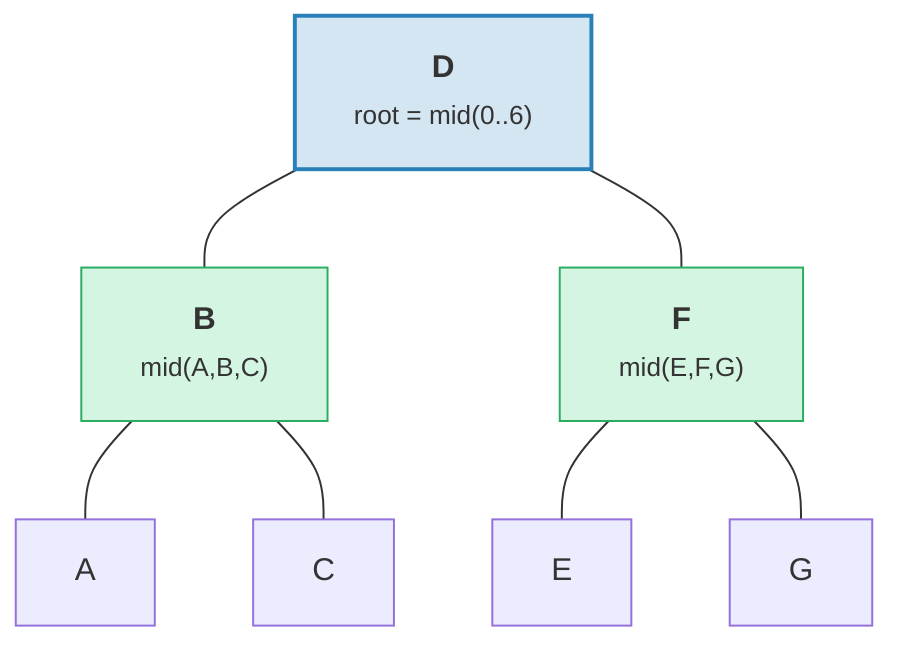

> Resultado: árbol perfectamente balanceado con altura = 3 = ⌈log₂(7)⌉.

```rust
fn build(batch: &MerkBatch<K>, ...) -> CostResult<Option<TreeNode>, Error> {
    let mid_index = batch.len() / 2;
    let (mid_key, mid_op) = &batch[mid_index];

    // Create root node from middle element
    let mid_tree = TreeNode::new(mid_key.clone(), value.clone(), None, feature_type)?;

    // Recursively build left and right subtrees
    let left = Self::build(&batch[..mid_index], ...);
    let right = Self::build(&batch[mid_index + 1..], ...);

    // Attach children
    mid_tree.attach(true, left).attach(false, right)
}
```

Esto produce un árbol con altura ⌈log₂(n)⌉ — perfectamente balanceado.

### Estrategia 2: apply_sorted() — Fusión con Árbol Existente

Cuando el árbol ya tiene datos, `apply_sorted()` usa **búsqueda binaria** para encontrar
dónde pertenece cada operación del lote, luego aplica recursivamente las operaciones a los
subárboles izquierdo y derecho:

Árbol existente con lote `[(B, Put), (F, Delete)]`:

Búsqueda binaria: B < D (ir a la izquierda), F > D (ir a la derecha).

**Antes:**
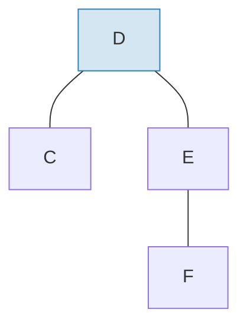

**Después** de aplicar el lote y rebalancear:
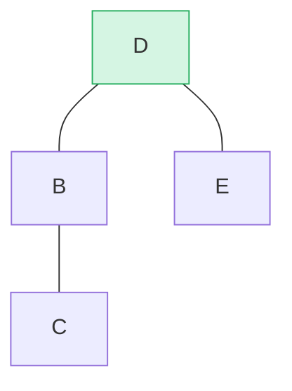

> B insertado como subárbol izquierdo, F eliminado del subárbol derecho. `maybe_balance()` confirma bf(D) = 0.

```rust
fn apply_sorted(self, batch: &MerkBatch<K>, ...) -> CostResult<...> {
    let search = batch.binary_search_by(|(key, _)| key.cmp(self.tree().key()));

    match search {
        Ok(index) => {
            // Key matches this node — apply operation directly
            // (Put replaces value, Delete removes node)
        }
        Err(mid) => {
            // Key not found — mid is the split point
            // Recurse on left_batch[..mid] and right_batch[mid..]
        }
    }

    self.recurse(batch, mid, exclusive, ...)
}
```

El método `recurse` divide el lote y recorre izquierda y derecha:

```rust
fn recurse(self, batch: &MerkBatch<K>, mid: usize, ...) {
    let left_batch = &batch[..mid];
    let right_batch = &batch[mid..];  // or mid+1 if exclusive

    // Apply left batch to left subtree
    let tree = self.walk(true, |maybe_left| {
        Self::apply_to(maybe_left, left_batch, ...)
    });

    // Apply right batch to right subtree
    let tree = tree.walk(false, |maybe_right| {
        Self::apply_to(maybe_right, right_batch, ...)
    });

    // Re-balance after modifications
    tree.maybe_balance(...)
}
```

### Eliminación de Nodos

Al eliminar un nodo con dos hijos, Merk promueve el **nodo del borde** del
subárbol más alto. Esto minimiza la posibilidad de necesitar rotaciones adicionales:

**Antes** — eliminando D (tiene dos hijos, altura del subárbol derecho ≥ izquierdo):

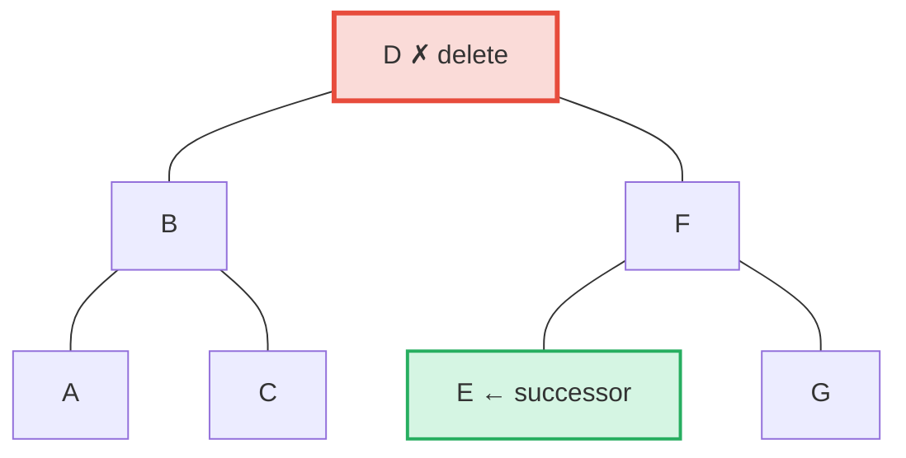

**Después** — E (el más a la izquierda en el subárbol derecho = sucesor en orden) promovido a la posición de D:

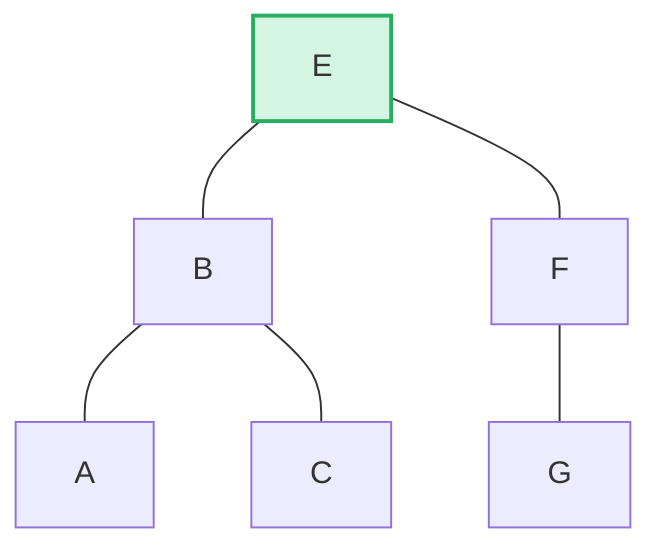

> **Regla:** Si altura izquierda > derecha → promover borde derecho del subárbol izquierdo. Si altura derecha ≥ izquierda → promover borde izquierdo del subárbol derecho. Esto minimiza el rebalanceo post-eliminación.

```rust
pub fn remove(self, ...) -> CostResult<Option<Self>, Error> {
    let has_left = tree.link(true).is_some();
    let has_right = tree.link(false).is_some();
    let left = tree.child_height(true) > tree.child_height(false);

    if has_left && has_right {
        // Two children: promote edge of taller child
        let (tree, tall_child) = self.detach_expect(left, ...);
        let (_, short_child) = tree.detach_expect(!left, ...);
        tall_child.promote_edge(!left, short_child, ...)
    } else if has_left || has_right {
        // One child: promote it directly
        self.detach_expect(left, ...).1
    } else {
        // Leaf node: just remove
        None
    }
}
```

---
