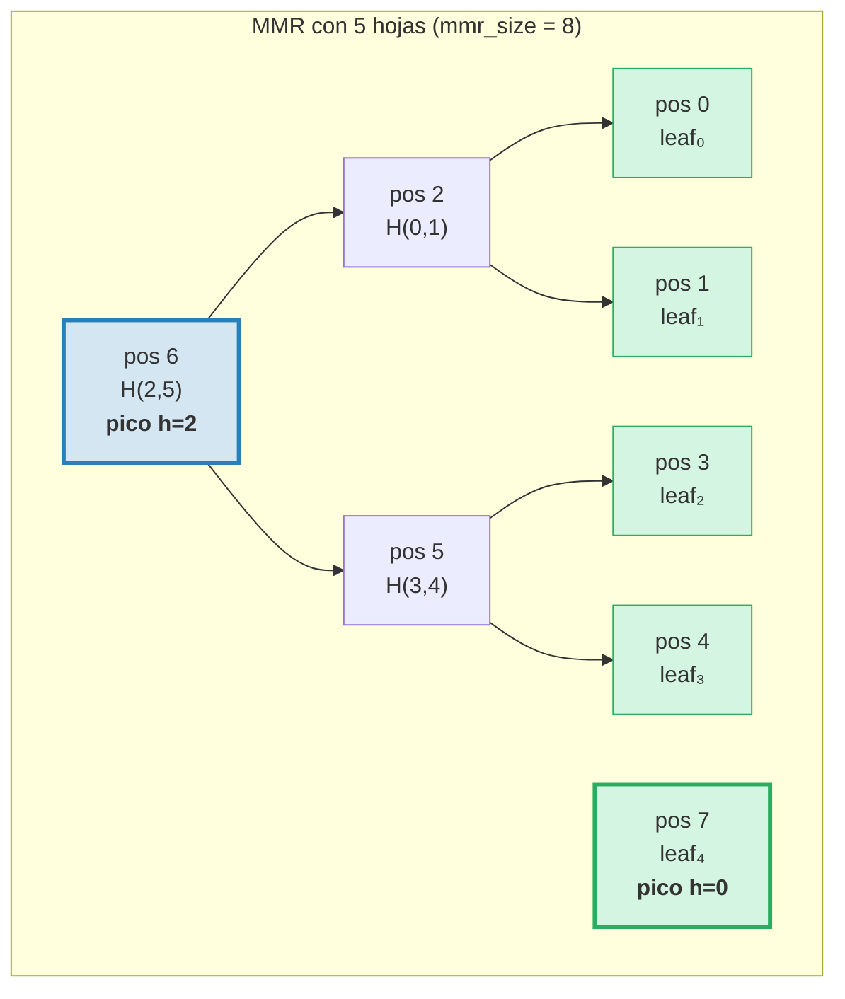
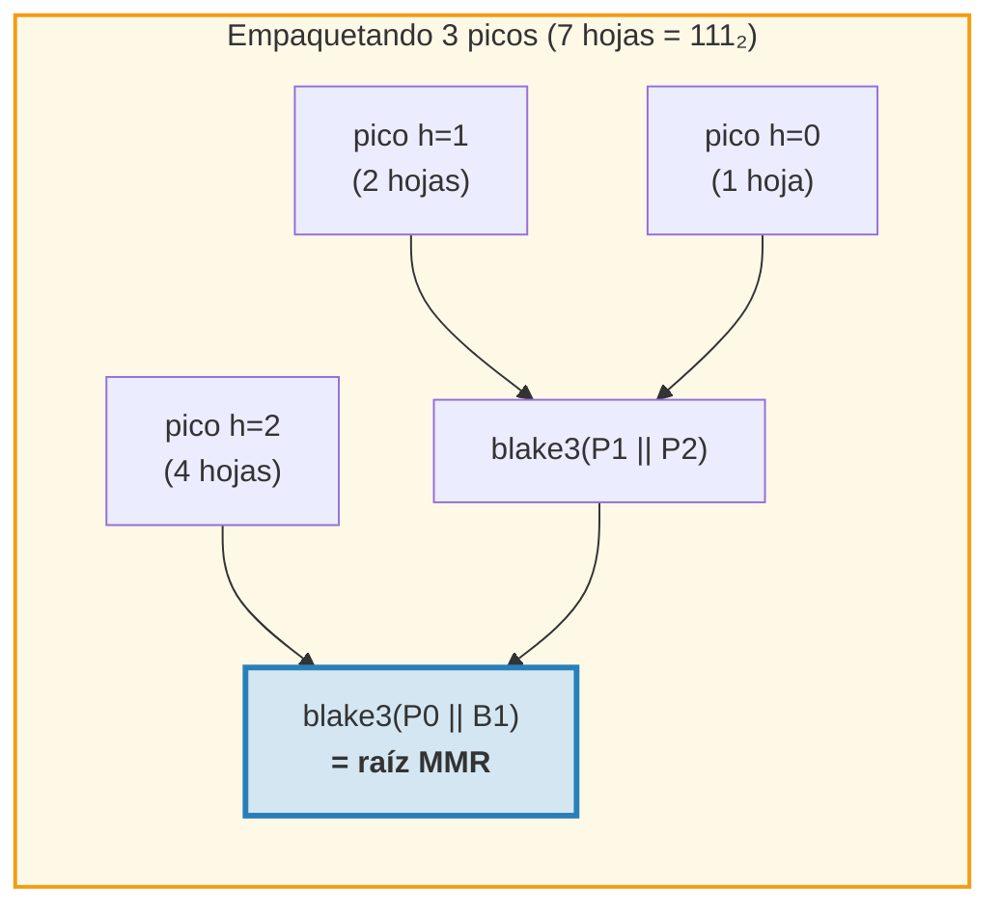
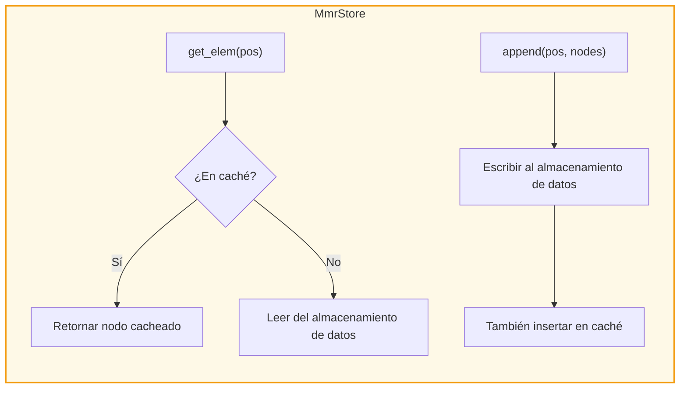
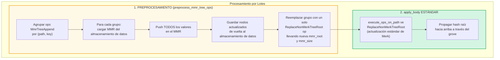
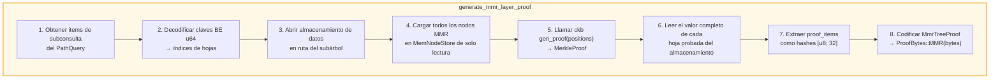
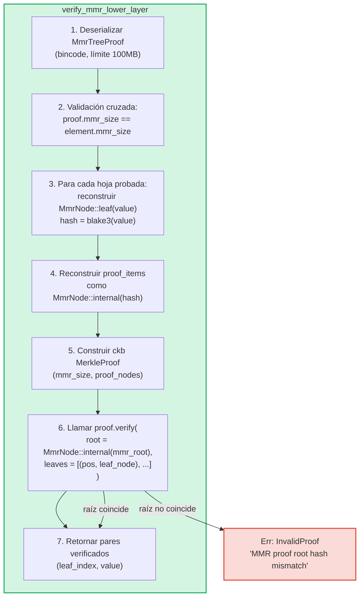

# El Árbol MMR — Registros Autenticados de Solo-Adición

El **MmrTree** es la estructura de datos autenticada de solo-adición de GroveDB, construida sobre
un Merkle Mountain Range (MMR) con hashing Blake3. Mientras que los árboles AVL Merk
(Capítulo 2) destacan en operaciones aleatorias clave-valor con actualizaciones O(log N), los MMR
están diseñados específicamente para el caso de solo-adición: ofrecen cero rotaciones, costo de hash
O(1) amortizado por adición, y patrones de E/S secuencial.

Este capítulo cubre la estructura de datos MMR en profundidad — cómo crece, cómo se
almacenan los nodos, cómo se propagan las adiciones en cascada, y cómo el sistema de pruebas permite que cualquier tercero
verifique que un valor específico fue añadido en una posición específica.

## ¿Por Qué un Tipo de Árbol Separado?

Los árboles Merk estándar de GroveDB manejan bien los datos ordenados clave-valor, pero
los registros de solo-adición tienen requisitos diferentes:

| Propiedad | Árbol AVL Merk | MMR |
|----------|--------------|-----|
| Operaciones | Insertar, actualizar, eliminar | Solo adición |
| Rebalanceo | O(log N) rotaciones por escritura | Ninguno |
| Patrón de E/S | Aleatorio (el rebalanceo toca muchos nodos) | Secuencial (nuevos nodos siempre al final) |
| Total de hashes para N inserciones | O(N log N) | O(N) |
| Estructura | Determinada por orden de inserción | Determinada solo por conteo de hojas |
| Pruebas | Ruta de la raíz a la hoja | Hashes de hermanos + picos |

Para casos de uso como registros de transacciones, flujos de eventos, o cualquier dato que crece
monótonamente, el MMR es estrictamente mejor: más simple, más rápido y más predecible.

## La Estructura de Datos MMR

Un MMR es un **bosque de árboles binarios perfectos** (llamados "picos") que crece de
izquierda a derecha. Cada pico es un árbol binario completo de alguna altura *h*, que contiene
exactamente 2^h hojas.

El concepto clave: **la representación binaria del conteo de hojas determina la
estructura de picos**. Cada bit 1 en la forma binaria corresponde a un pico:

```text
Conteo de hojas   Binario   Picos
─────────────     ──────    ─────
1                 1         un pico h=0
2                 10        un pico h=1
3                 11        picos h=1, h=0
4                 100       un pico h=2
5                 101       picos h=2, h=0
6                 110       picos h=2, h=1
7                 111       picos h=2, h=1, h=0
8                 1000      un pico h=3
```

Esto significa que la estructura del MMR está completamente determinada por un solo número — el conteo
de hojas. Dos MMR con el mismo número de hojas siempre tienen la misma forma,
independientemente de qué valores fueron añadidos.

## Cómo se Llena el MMR

Cada nodo en el MMR tiene una **posición** (indexada desde 0). Las hojas y los nodos internos
se intercalan en un patrón específico. Aquí está el crecimiento paso a paso:

**Después de 1 hoja (mmr_size = 1):**
```text
pos:  0
      leaf₀        ← un pico en altura 0
```

**Después de 2 hojas (mmr_size = 3):**
```text
pos:     2          ← interno: blake3(leaf₀.hash || leaf₁.hash)
        / \
       0   1        ← hojas

Un pico en altura 1. Las posiciones 0 y 1 son hojas, la posición 2 es interna.
```
Cuando se añadió leaf₁, creó un pico de altura 0. Pero ya existía un
pico de altura 0 (leaf₀), así que se **fusionaron** en un pico de altura 1.

**Después de 3 hojas (mmr_size = 4):**
```text
pos:     2     3    ← pico h=1, pico h=0
        / \
       0   1

Dos picos. Sin fusión — las alturas 1 y 0 son diferentes.
(Binario: 3 = 11₂ → un pico por bit 1)
```

**Después de 4 hojas (mmr_size = 7):**
```text
pos:         6              ← interno: fusión de nodos 2 y 5
           /   \
         2       5          ← nodos internos
        / \     / \
       0   1   3   4        ← hojas

Un pico en altura 2.
```
Aquí es donde se pone interesante. Añadir leaf₃ (posición 4) crea node₅
(fusionando posiciones 3 y 4). Pero ahora node₅ (altura 1) y node₂ (altura 1)
son picos adyacentes de igual altura, así que se fusionan en node₆. **Una cascada de dos
fusiones desde una sola adición.**

**Después de 5 hojas (mmr_size = 8):**
```text
pos:         6         7    ← pico h=2, pico h=0
           /   \
         2       5
        / \     / \
       0   1   3   4

Dos picos. (Binario: 5 = 101₂)
```

**Después de 7 hojas (mmr_size = 11):**
```text
pos:         6         10    ← pico h=2, pico h=1, pico h=0
           /   \      / \
         2       5   8   9    7
        / \     / \
       0   1   3   4

Tres picos. (Binario: 7 = 111₂)
```

**Después de 8 hojas (mmr_size = 15):**
```text
pos:              14                     ← pico único h=3
               /      \
            6            13
          /   \        /    \
        2       5    9       12
       / \     / \  / \     / \
      0   1   3  4 7   8  10  11

Un pico en altura 3. Tres fusiones en cascada al añadir leaf₇.
```



> **Azul** = picos (raíces de subárboles binarios perfectos). **Verde** = nodos hoja.

## La Cascada de Fusiones

Cuando se añade una nueva hoja, puede disparar una cadena de fusiones. El número de
fusiones es igual al número de **bits 1 finales** en la representación binaria
del conteo actual de hojas:

| Conteo de hojas (antes de push) | Binario | 1s finales | Fusiones | Total de hashes |
|--------------------------|--------|-------------|--------|--------------|
| 0 | `0` | 0 | 0 | 1 (solo hoja) |
| 1 | `1` | 1 | 1 | 2 |
| 2 | `10` | 0 | 0 | 1 |
| 3 | `11` | 2 | 2 | 3 |
| 4 | `100` | 0 | 0 | 1 |
| 5 | `101` | 1 | 1 | 2 |
| 6 | `110` | 0 | 0 | 1 |
| 7 | `111` | 3 | 3 | 4 |

**Total de hashes por push** = `1 + trailing_ones(leaf_count)`:
- 1 hash para la hoja misma: `blake3(value)`
- N hashes para la cascada de fusiones: `blake3(left.hash || right.hash)` por cada
  fusión

Así es como GroveDB rastrea los costos de hash para cada adición. La implementación:
```rust
pub fn hash_count_for_push(leaf_count: u64) -> u32 {
    1 + leaf_count.trailing_ones()
}
```

## Tamaño del MMR vs Conteo de Hojas

El MMR almacena tanto hojas como nodos internos en un espacio de posiciones plano, así que
`mmr_size` siempre es mayor que el conteo de hojas. La relación exacta es:

```text
mmr_size = 2 * leaf_count - popcount(leaf_count)
```

donde `popcount` es el número de bits 1 (es decir, el número de picos). Cada
nodo interno fusiona dos subárboles, reduciendo el conteo de nodos en uno por fusión.

El cálculo inverso — conteo de hojas desde mmr_size — usa las posiciones de los picos:

```rust
fn mmr_size_to_leaf_count(mmr_size: u64) -> u64 {
    // Each peak at height h contains 2^h leaves
    get_peaks(mmr_size).iter()
        .map(|&peak_pos| 1u64 << pos_height_in_tree(peak_pos))
        .sum()
}
```

| mmr_size | leaf_count | picos |
|----------|-----------|-------|
| 0 | 0 | (vacío) |
| 1 | 1 | h=0 |
| 3 | 2 | h=1 |
| 4 | 3 | h=1, h=0 |
| 7 | 4 | h=2 |
| 8 | 5 | h=2, h=0 |
| 10 | 6 | h=2, h=1 |
| 11 | 7 | h=2, h=1, h=0 |
| 15 | 8 | h=3 |

GroveDB almacena `mmr_size` en el Elemento (no el conteo de hojas) porque la biblioteca MMR
de ckb usa posiciones internamente. La operación `mmr_tree_leaf_count` deriva
el conteo de hojas sobre la marcha.

## Hash Raíz del MMR — Empaquetando los Picos

Un MMR tiene múltiples picos (uno por bit 1 en el conteo de hojas). Para producir un
único hash raíz de 32 bytes, los picos se **"empaquetan"** de derecha a izquierda:

```text
root = bag_rhs_peaks(peaks):
    comenzar con el pico más a la derecha
    plegar hacia la izquierda: blake3(left_peak || accumulated_right)
```

Con 1 pico, la raíz es simplemente el hash de ese pico. Con 3 picos:



> El hash raíz cambia con **cada** adición, incluso cuando no ocurren fusiones,
> porque el pico más a la derecha cambia y el empaquetado debe recalcularse.

## Estructura de Nodos y Serialización

Cada nodo MMR es un `MmrNode`:

```rust
struct MmrNode {
    hash: [u8; 32],           // Blake3 hash
    value: Option<Vec<u8>>,   // Some for leaves, None for internal nodes
}
```

**Nodo hoja:** `hash = blake3(value_bytes)`, `value = Some(value_bytes)`
**Nodo interno:** `hash = blake3(left.hash || right.hash)`, `value = None`

La función de fusión es directa — concatenar dos hashes de 32 bytes y
aplicar Blake3 al resultado:

```rust
fn blake3_merge(left: &[u8; 32], right: &[u8; 32]) -> [u8; 32] {
    let mut input = [0u8; 64];
    input[..32].copy_from_slice(left);
    input[32..].copy_from_slice(right);
    *blake3::hash(&input).as_bytes()
}
```

> **Nota sobre PartialEq:** `MmrNode` implementa `PartialEq` comparando **solo
> el campo hash**, no el valor. Esto es crítico para la verificación de pruebas: el
> verificador de ckb compara una raíz reconstruida (value = None) contra la raíz esperada.
> Si PartialEq comparara el campo value, las pruebas de MMR de una sola hoja siempre
> fallarían porque la hoja tiene `value: Some(...)` pero la reconstrucción de la raíz
> produce `value: None`.

**Formato de serialización:**
```text
Interno: [0x00] [hash: 32 bytes]                                = 33 bytes
Hoja:    [0x01] [hash: 32 bytes] [value_len: 4 BE] [value...]   = 37 + len bytes
```

El byte de bandera distingue nodos internos de hojas. La deserialización valida
la longitud exacta — no se permiten bytes finales.

## Arquitectura de Almacenamiento

MmrTree almacena sus nodos en la columna de **datos** (la misma familia de columnas usada
por los nodos Merk), no en un subárbol Merk hijo. El Elemento no tiene un campo `root_key`
— el hash raíz del MMR fluye como el **hash hijo** del Merk vía
`insert_subtree(subtree_root_hash)`, autenticando el estado del MMR.

**Claves de almacenamiento** están basadas en posiciones:
```text
key = 'm' || position_as_be_u64    (9 bytes: prefijo + u64 BE)
```

Así que la posición 42 se almacena en la clave `[0x6D, 0x00, 0x00, 0x00, 0x00, 0x00, 0x00,
0x00, 0x2A]`.

Buscar la hoja *i* requiere calcular primero la posición en el MMR:
`pos = leaf_index_to_pos(i)`, luego leer la clave de datos `m{pos}`.

**Caché de escritura inmediata:** Durante las adiciones, los nodos recién escritos deben ser
inmediatamente legibles para fusiones subsiguientes en el mismo push. Porque el
almacenamiento transaccional de GroveDB difiere las escrituras a un lote (no son visibles para las lecturas
hasta el commit), un adaptador `MmrStore` envuelve el contexto de almacenamiento con un
caché `HashMap` en memoria:



Esto asegura que cuando añadir leaf₃ dispara una cascada de fusiones (creando
nodos internos en posiciones 5 y 6), node₅ está inmediatamente disponible al
calcular node₆, aunque node₅ no haya sido confirmado en RocksDB todavía.

**Propagación del hash raíz a la raíz de estado de GroveDB:**

```text
combined_value_hash = blake3(
    blake3(varint(len) || element_bytes),   ← value_hash from serialized Element
    mmr_root_hash                           ← child_hash = type-specific root
)
```

El hash raíz del MMR fluye como el hash hijo del Merk vía `insert_subtree`. Cualquier cambio
al estado del MMR produce un `combined_value_hash` diferente, que se propaga hacia
arriba a través de la jerarquía Merk padre hasta la raíz de estado de GroveDB.

## Operaciones de GroveDB

MmrTree proporciona cuatro operaciones:

```rust
// Append a value — returns (new_mmr_root, leaf_index)
db.mmr_tree_append(path, key, value, tx, version)

// Read the current root hash (from Element, no storage access)
db.mmr_tree_root_hash(path, key, tx, version)

// Get a leaf value by 0-based index
db.mmr_tree_get_value(path, key, leaf_index, tx, version)

// Get the number of leaves appended
db.mmr_tree_leaf_count(path, key, tx, version)
```

### Flujo de Adición

La operación de adición es la más compleja, realizando 8 pasos:

```mermaid
graph TD
    subgraph append["mmr_tree_append(path, key, value, tx)"]
        A1["1. Leer Elemento en path/key<br/>→ obtener mmr_size, flags"]
        A2["2. Abrir almacenamiento de datos en<br/>subárbol path/key"]
        A3["3. Crear MmrNode::leaf(value)<br/>hash = blake3(value)"]
        A4["4. Push hoja en MMR de ckb<br/>→ fusiones en cascada escriben<br/>nuevos nodos internos"]
        A5["5. Commit → vaciar nuevos<br/>nodos al almacenamiento"]
        A6["6. Empaquetar picos → nueva mmr_root"]
        A7["7. Actualizar Elemento con<br/>nueva mmr_root y mmr_size"]
        A8["8. Propagar cambios hacia arriba<br/>a través de la jerarquía Merk<br/>de GroveDB + commit tx"]

        A1 --> A2 --> A3 --> A4 --> A5 --> A6 --> A7 --> A8
    end

    style append fill:#d5f5e3,stroke:#27ae60,stroke-width:2px
    style A6 fill:#d4e6f1,stroke:#2980b9,stroke-width:2px
```



El paso 4 puede escribir 1 nodo (solo hoja) o 1 + N nodos (hoja + N nodos internos de fusión).
El paso 5 llama a `mmr.commit()` que vacía el MemStore de ckb al
MmrStore. El paso 7 llama a `insert_subtree` con la nueva raíz del MMR como el hash hijo
(vía `subtree_root_hash`), ya que MmrTree no tiene Merk hijo.

### Operaciones de Lectura

`mmr_tree_root_hash` calcula la raíz desde los datos del MMR en el almacenamiento.
`mmr_tree_leaf_count` deriva el conteo de hojas desde `mmr_size` en el Elemento.
No se necesita acceso al almacenamiento de datos.

`mmr_tree_get_value` calcula `pos = leaf_index_to_pos(leaf_index)`, lee
la única entrada de almacenamiento de datos en `m{pos}`, deserializa el `MmrNode`, y
retorna `node.value`.

## Operaciones por Lotes

Múltiples adiciones al MMR pueden agruparse en lotes usando `GroveOp::MmrTreeAppend { value }`.
Porque la función estándar de lotes `execute_ops_on_path` solo tiene acceso al
Merk (no al contexto de almacenamiento del MMR), las adiciones al MMR usan una **fase de preprocesamiento**:



Ejemplo: Un lote con 3 adiciones al mismo MMR:
```rust
vec![
    QualifiedGroveDbOp { path: p, key: k, op: MmrTreeAppend { value: v1 } },
    QualifiedGroveDbOp { path: p, key: k, op: MmrTreeAppend { value: v2 } },
    QualifiedGroveDbOp { path: p, key: k, op: MmrTreeAppend { value: v3 } },
]
```

El preprocesamiento carga el MMR una vez, hace push de v1, v2, v3 (creando todos los nodos
intermedios), guarda todo en el almacenamiento de datos, luego emite un solo `ReplaceNonMerkTreeRoot`
con el `mmr_root` y `mmr_size` finales. La maquinaria estándar de lotes maneja
el resto.

## Generación de Pruebas

Las pruebas de MMR son **pruebas V1** — usan la variante `ProofBytes::MMR` en la
estructura de prueba por capas (ver §9.6). La prueba demuestra que valores específicos de hojas
existen en posiciones específicas dentro del MMR, y que sus hashes son
consistentes con el `mmr_root` almacenado en el elemento padre.

### Codificación de Consultas

Las claves de consulta codifican posiciones como **bytes u64 big-endian**. Esto preserva
el orden lexicográfico (ya que la codificación BE es monótona), permitiendo que todas las
variantes estándar de `QueryItem` funcionen:

```text
QueryItem::Key([0,0,0,0,0,0,0,5])            → índice de hoja 5
QueryItem::RangeInclusive([..2]..=[..7])      → índices de hojas [2, 3, 4, 5, 6, 7]
QueryItem::RangeFrom([..10]..)                → índices de hojas [10, 11, ..., N-1]
QueryItem::RangeFull                          → todas las hojas [0..leaf_count)
```

Un tope de seguridad de **10,000,000 índices** previene el agotamiento de memoria por
consultas de rango ilimitadas. Un MMR vacío (cero hojas) retorna una prueba vacía.

### La Estructura MmrTreeProof

```rust
struct MmrTreeProof {
    mmr_size: u64,                 // MMR size at proof time
    leaves: Vec<(u64, Vec<u8>)>,   // (leaf_index, value) for each proved leaf
    proof_items: Vec<[u8; 32]>,    // Sibling/peak hashes for verification
}
```

Los `proof_items` contienen el conjunto mínimo de hashes necesarios para reconstruir
las rutas desde las hojas probadas hasta la raíz del MMR. Estos son los nodos hermanos
en cada nivel y los hashes de picos no involucrados.

### Flujo de Generación



El paso 4 usa un `MemNodeStore` — un BTreeMap de solo lectura que pre-carga todos los
nodos del MMR desde el almacenamiento de datos. El generador de pruebas de ckb necesita acceso aleatorio, así que todos
los nodos deben estar en memoria.

El paso 5 es donde la biblioteca ckb hace el trabajo pesado: dados el tamaño del MMR y
las posiciones a probar, determina qué hashes de hermanos y picos son necesarios.

### Ejemplo Detallado

**Probando la hoja 2 en un MMR de 5 hojas (mmr_size = 8):**

```text
Estructura del MMR:
pos:         6         7
           /   \
         2       5
        / \     / \
       0   1   3   4

Índice de hoja 2 → posición MMR 3

Para verificar la hoja en posición 3:
  1. Hashear el valor reclamado: leaf_hash = blake3(value)
  2. Hermano en posición 4:  node₅ = blake3(leaf_hash || proof[pos 4])
  3. Hermano en posición 2:  node₆ = blake3(proof[pos 2] || node₅)
  4. Pico en posición 7:     root  = bag(node₆, proof[pos 7])
  5. Comparar: root == mmr_root esperado ✓

proof_items = [hash(pos 4), hash(pos 2), hash(pos 7)]
leaves = [(2, original_value_bytes)]
```

El tamaño de la prueba para este ejemplo es: 3 hashes (96 bytes) + 1 valor de hoja +
metadatos. En general, probar K hojas de un MMR de N hojas requiere
O(K * log N) hashes de hermanos.

## Verificación de Pruebas

La verificación es **pura** — no requiere acceso a base de datos. El verificador necesita
solo los bytes de la prueba y el hash raíz esperado del MMR (que extrae del
elemento padre probado en la capa Merk superior).

### Pasos de Verificación



La función `MerkleProof::verify` de ckb reconstruye la raíz desde las hojas
y los proof items, luego la compara (usando `PartialEq`, que verifica solo el
hash) contra la raíz esperada.

### Cadena de Confianza

La cadena completa desde la raíz de estado de GroveDB hasta un valor de hoja verificado:

```text
state_root de GroveDB (conocido/confiable)
│
├─ Capa de prueba V0 Merk 0: prueba que el subárbol existe en la raíz
│   └─ root_hash coincide con state_root ✓
│
├─ Capa de prueba V0 Merk 1: prueba el elemento MmrTree en path/key
│   └─ Nodo KVValueHash: element_bytes contienen mmr_root
│   └─ combined_hash = combine_hash(H(element_bytes), mmr_root)
│   └─ root_hash coincide con la capa padre ✓
│
└─ Prueba V1 MMR: prueba que los valores de hojas están en el MMR
    └─ Reconstruir rutas desde hojas a través de hermanos hasta picos
    └─ Empaquetar picos → raíz reconstruida
    └─ raíz reconstruida == mmr_root de element_bytes ✓
    └─ Resultado: leaf₂ = [bytes de valor verificados]
```

### Propiedades de Seguridad

- **Validación cruzada de mmr_size:** El `mmr_size` de la prueba debe coincidir con el
  `mmr_size` del elemento. Una discrepancia indica que la prueba fue generada contra
  un estado diferente y se rechaza.
- **Límite de tamaño de bincode:** La deserialización usa un límite de 100MB para prevenir que cabeceras
  de longitud manipuladas causen asignaciones enormes.
- **Contabilidad de límites:** Cada hoja probada decrementa el límite general de la consulta en
  1 usando `saturating_sub` para prevenir desbordamiento.
- **Retorno de hash hijo:** El verificador retorna la raíz MMR calculada como el hash
  hijo para el cálculo de combine_hash en la capa padre.
- **Rechazo de V0:** Intentar una subconsulta en un MmrTree con pruebas V0
  retorna `Error::NotSupported`. Solo las pruebas V1 pueden descender a árboles no-Merk.

## Seguimiento de Costos

Las operaciones del MMR rastrean costos con precisión:

| Operación | Llamadas de hash | Operaciones de almacenamiento |
|-----------|-----------|-------------------|
| Añadir 1 hoja | `1 + trailing_ones(leaf_count)` | 1 escritura de hoja + N escrituras internas |
| Hash raíz | 0 (cacheado en Elemento) | 1 lectura de Elemento |
| Obtener valor | 0 | 1 lectura de Elemento + 1 lectura de datos |
| Conteo de hojas | 0 | 1 lectura de Elemento |

La fórmula de conteo de hashes `1 + trailing_ones(N)` da el número exacto de llamadas
Blake3: 1 para el hash de la hoja, más un hash de fusión por nivel de cascada.

**Análisis amortizado:** Sobre N adiciones, el conteo total de hashes es:

```text
Σ (1 + trailing_ones(i)) para i = 0..N-1
= N + Σ trailing_ones(i) para i = 0..N-1
= N + (N - popcount(N))
≈ 2N
```

Así que el costo amortizado por adición es aproximadamente **2 llamadas de hash Blake3** —
constante e independiente del tamaño del árbol. Compárese con los árboles AVL Merk donde
cada inserción requiere O(log N) hashes para la ruta más hashes potenciales de rotación.

**Costo de almacenamiento:** Cada adición escribe 1 nodo hoja (37 + value_len bytes) más
0 a log₂(N) nodos internos (33 bytes cada uno). La escritura de almacenamiento amortizada por
adición es aproximadamente 33 + 37 + value_len bytes ≈ 70 + value_len bytes.

## Archivos de Implementación

| Archivo | Propósito |
|------|---------|
| `grovedb-mmr/src/node.rs` | Estructura `MmrNode`, fusión Blake3, serialización |
| `grovedb-mmr/src/grove_mmr.rs` | Wrapper `GroveMmr` alrededor del MMR de ckb |
| `grovedb-mmr/src/util.rs` | `mmr_node_key`, `hash_count_for_push`, `mmr_size_to_leaf_count` |
| `grovedb-mmr/src/proof.rs` | Generación y verificación de `MmrTreeProof` |
| `grovedb-mmr/src/dense_merkle.rs` | Raíces de árboles densos de Merkle (usado por BulkAppendTree) |
| `grovedb/src/operations/mmr_tree.rs` | Operaciones de GroveDB + adaptador `MmrStore` + preprocesamiento de lotes |
| `grovedb/src/operations/proof/generate.rs` | Generación de pruebas V1: `generate_mmr_layer_proof`, `query_items_to_leaf_indices` |
| `grovedb/src/operations/proof/verify.rs` | Verificación de pruebas V1: `verify_mmr_lower_layer` |
| `grovedb/src/tests/mmr_tree_tests.rs` | 28 pruebas de integración |

## Comparación con Otras Estructuras Autenticadas

| | MMR (MmrTree) | Merk AVL (Tree) | Sinsemilla (CommitmentTree) |
|---|---|---|---|
| **Caso de uso** | Registros de solo-adición | Almacén clave-valor | Compromisos amigables con ZK |
| **Función de hash** | Blake3 | Blake3 | Sinsemilla (curva Pallas) |
| **Operaciones** | Añadir, leer por índice | Insertar, actualizar, eliminar, consultar | Añadir, atestiguar |
| **Hash amortizado/escritura** | ~2 | O(log N) | ~33 (32 niveles + ommers) |
| **Tipo de prueba** | V1 (hashes de hermanos MMR) | V0 (prueba de ruta Merk) | Witness (ruta auth de Merkle) |
| **Amigable con ZK** | No | No | Sí (circuitos Halo 2) |
| **Rebalanceo** | Ninguno | Rotaciones AVL | Ninguno |
| **Soporte de eliminación** | No | Sí | No |

---
