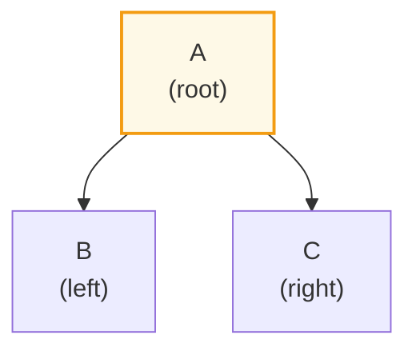
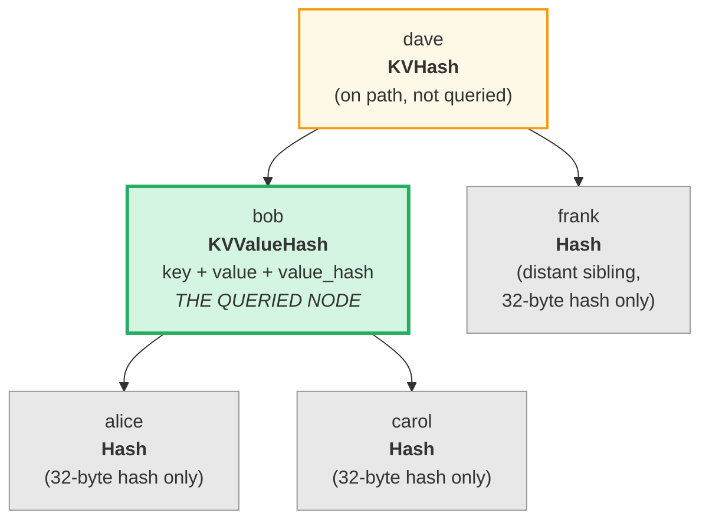
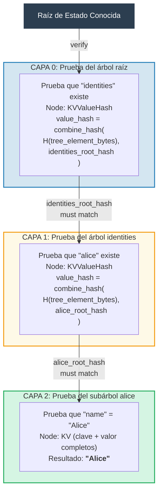
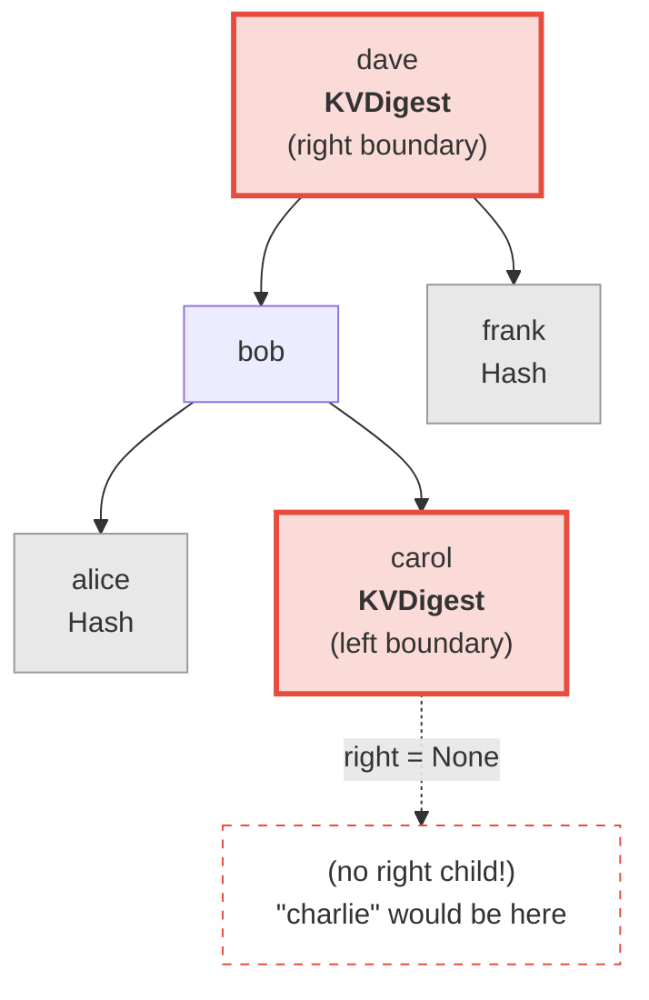
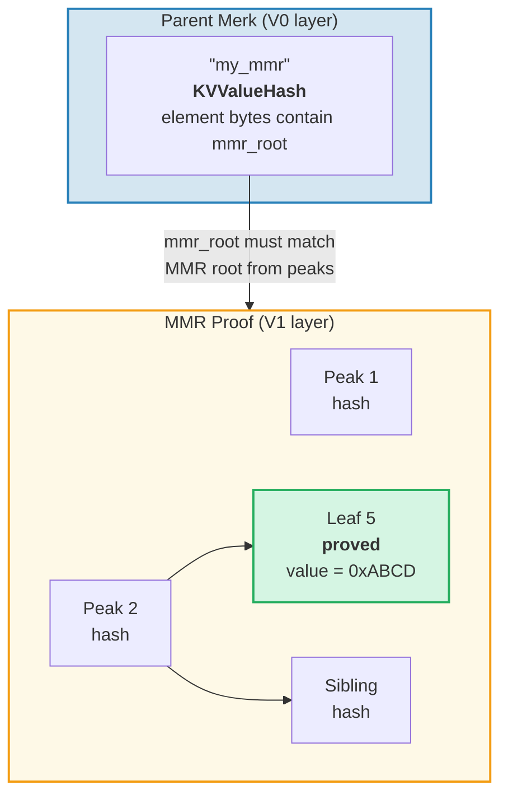
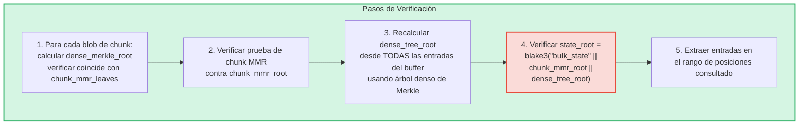
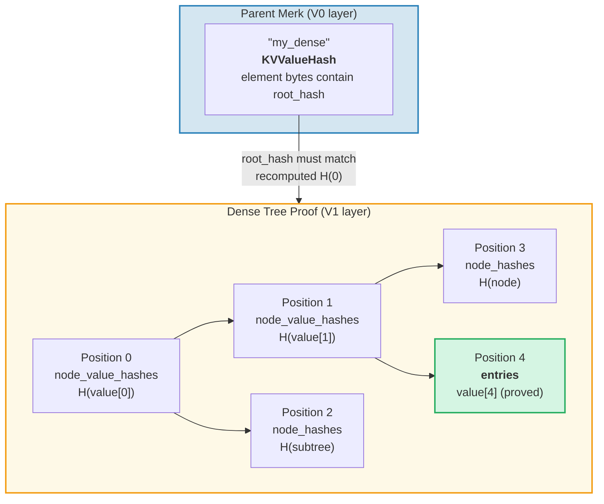

# El Sistema de Pruebas

El sistema de pruebas de GroveDB permite que cualquier parte verifique la corrección de los resultados de consultas
sin tener la base de datos completa. Una prueba es una representación compacta de la
estructura relevante del árbol que permite la reconstrucción del hash raíz.

## Operaciones de Prueba Basadas en Pila

Las pruebas se codifican como una secuencia de **operaciones** que reconstruyen un árbol parcial
usando una máquina de pila:

```rust
// merk/src/proofs/mod.rs
pub enum Op {
    Push(Node),        // Push a node onto the stack (ascending key order)
    PushInverted(Node),// Push a node (descending key order)
    Parent,            // Pop parent, pop child → attach child as LEFT of parent
    Child,             // Pop child, pop parent → attach child as RIGHT of parent
    ParentInverted,    // Pop parent, pop child → attach child as RIGHT of parent
    ChildInverted,     // Pop child, pop parent → attach child as LEFT of parent
}
```

Ejecución usando una pila:

Operaciones de prueba: `Push(B), Push(A), Parent, Push(C), Child`

| Paso | Operación | Pila (tope→derecha) | Acción |
|------|-----------|-------------------|--------|
| 1 | Push(B) | [ B ] | Poner B en la pila |
| 2 | Push(A) | [ B , A ] | Poner A en la pila |
| 3 | Parent | [ A{left:B} ] | Sacar A (padre), sacar B (hijo), B → IZQUIERDA de A |
| 4 | Push(C) | [ A{left:B} , C ] | Poner C en la pila |
| 5 | Child | [ A{left:B, right:C} ] | Sacar C (hijo), sacar A (padre), C → DERECHA de A |

Resultado final — un árbol en la pila:



> El verificador calcula `node_hash(A) = Blake3(kv_hash_A || node_hash_B || node_hash_C)` y comprueba que coincida con el hash raíz esperado.

Esta es la función `execute` (`merk/src/proofs/tree.rs`):

```rust
pub fn execute<I, F>(ops: I, collapse: bool, mut visit_node: F) -> CostResult<Tree, Error>
where
    I: IntoIterator<Item = Result<Op, Error>>,
    F: FnMut(&Node) -> Result<(), Error>,
{
    let mut stack: Vec<Tree> = Vec::with_capacity(32);

    for op in ops {
        match op? {
            Op::Parent => {
                let (mut parent, child) = (try_pop(&mut stack), try_pop(&mut stack));
                parent.left = Some(Child { tree: Box::new(child), hash: child.hash() });
                stack.push(parent);
            }
            Op::Child => {
                let (child, mut parent) = (try_pop(&mut stack), try_pop(&mut stack));
                parent.right = Some(Child { tree: Box::new(child), hash: child.hash() });
                stack.push(parent);
            }
            Op::Push(node) => {
                visit_node(&node)?;
                stack.push(Tree::from(node));
            }
            // ... Inverted variants swap left/right
        }
    }
    // Final item on stack is the root
}
```

## Tipos de Nodo en las Pruebas

Cada `Push` lleva un `Node` que contiene la información justa necesaria para la
verificación:

```rust
pub enum Node {
    // Minimum info — just the hash. Used for distant siblings.
    Hash(CryptoHash),

    // KV hash for nodes on the path but not queried.
    KVHash(CryptoHash),

    // Full key-value for queried items.
    KV(Vec<u8>, Vec<u8>),

    // Key, value, and pre-computed value_hash.
    // Used for subtrees where value_hash = combine_hash(...)
    KVValueHash(Vec<u8>, Vec<u8>, CryptoHash),

    // KV with feature type — for ProvableCountTree or chunk restoration.
    KVValueHashFeatureType(Vec<u8>, Vec<u8>, CryptoHash, TreeFeatureType),

    // Reference: key, dereferenced value, hash of reference element.
    KVRefValueHash(Vec<u8>, Vec<u8>, CryptoHash),

    // For items in ProvableCountTree.
    KVCount(Vec<u8>, Vec<u8>, u64),

    // KV hash + count for non-queried ProvableCountTree nodes.
    KVHashCount(CryptoHash, u64),

    // Reference in ProvableCountTree.
    KVRefValueHashCount(Vec<u8>, Vec<u8>, CryptoHash, u64),

    // For boundary/absence proofs in ProvableCountTree.
    KVDigestCount(Vec<u8>, CryptoHash, u64),

    // Key + value_hash for absence proofs (regular trees).
    KVDigest(Vec<u8>, CryptoHash),
}
```

La elección del tipo de Node determina qué información necesita el verificador:

**Consulta: "Obtener valor para clave 'bob'"**



> Verde = nodo consultado (datos completos revelados). Amarillo = en la ruta (solo kv_hash). Gris = hermanos (solo hashes de nodo de 32 bytes).

Codificado como operaciones de prueba:

| # | Op | Efecto |
|---|----|----|
| 1 | Push(Hash(alice_node_hash)) | Poner hash de alice |
| 2 | Push(KVValueHash("bob", value, value_hash)) | Poner bob con datos completos |
| 3 | Parent | alice se convierte en hijo izquierdo de bob |
| 4 | Push(Hash(carol_node_hash)) | Poner hash de carol |
| 5 | Child | carol se convierte en hijo derecho de bob |
| 6 | Push(KVHash(dave_kv_hash)) | Poner kv_hash de dave |
| 7 | Parent | subárbol de bob se convierte en izquierdo de dave |
| 8 | Push(Hash(frank_node_hash)) | Poner hash de frank |
| 9 | Child | frank se convierte en hijo derecho de dave |

## Generación de Pruebas Multi-Capa

Dado que GroveDB es un árbol de árboles, las pruebas abarcan múltiples capas. Cada capa prueba
la porción relevante de un árbol Merk, y las capas se conectan mediante el
mecanismo de value_hash combinado:

**Consulta:** `Get ["identities", "alice", "name"]`



> **Cadena de confianza:** `raíz_estado_conocida → verificar Capa 0 → verificar Capa 1 → verificar Capa 2 → "Alice"`. El hash raíz reconstruido de cada capa debe coincidir con el value_hash de la capa superior.

El verificador comprueba cada capa, confirmando que:
1. La prueba de la capa reconstruye al hash raíz esperado
2. El hash raíz coincide con el value_hash de la capa padre
3. El hash raíz de nivel superior coincide con la raíz de estado conocida

## Verificación de Pruebas

La verificación sigue las capas de la prueba de abajo hacia arriba o de arriba hacia abajo, usando la función `execute`
para reconstruir el árbol de cada capa. El método `Tree::hash()` en el árbol de
prueba calcula el hash según el tipo de nodo:

```rust
impl Tree {
    pub fn hash(&self) -> CostContext<CryptoHash> {
        match &self.node {
            Node::Hash(hash) => *hash,  // Already a hash, return directly

            Node::KVHash(kv_hash) =>
                node_hash(kv_hash, &self.child_hash(true), &self.child_hash(false)),

            Node::KV(key, value) =>
                kv_hash(key, value)
                    .flat_map(|kv_hash| node_hash(&kv_hash, &left, &right)),

            Node::KVValueHash(key, _, value_hash) =>
                kv_digest_to_kv_hash(key, value_hash)
                    .flat_map(|kv_hash| node_hash(&kv_hash, &left, &right)),

            Node::KVValueHashFeatureType(key, _, value_hash, feature_type) => {
                let kv = kv_digest_to_kv_hash(key, value_hash);
                match feature_type {
                    ProvableCountedMerkNode(count) =>
                        node_hash_with_count(&kv, &left, &right, *count),
                    _ => node_hash(&kv, &left, &right),
                }
            }

            Node::KVRefValueHash(key, referenced_value, ref_element_hash) => {
                let ref_value_hash = value_hash(referenced_value);
                let combined = combine_hash(ref_element_hash, &ref_value_hash);
                let kv = kv_digest_to_kv_hash(key, &combined);
                node_hash(&kv, &left, &right)
            }
            // ... other variants
        }
    }
}
```

## Pruebas de Ausencia

GroveDB puede probar que una clave **no** existe. Esto usa nodos frontera —
los nodos que serían adyacentes a la clave faltante si existiera:

**Probar:** "charlie" NO existe



> **Búsqueda binaria:** alice < bob < carol < **"charlie"** < dave < frank. "charlie" estaría entre carol y dave. El hijo derecho de Carol es `None`, probando que nada existe entre carol y dave. Por lo tanto "charlie" no puede existir en este árbol.

Para consultas por rango, las pruebas de ausencia muestran que no hay claves dentro del rango
consultado que no fueron incluidas en el conjunto de resultados.

## Pruebas V1 — Árboles No-Merk

El sistema de pruebas V0 funciona exclusivamente con subárboles Merk, descendiendo capa por
capa a través de la jerarquía del grove. Sin embargo, los elementos **CommitmentTree**, **MmrTree**,
**BulkAppendTree** y **DenseAppendOnlyFixedSizeTree** almacenan sus datos
fuera de un árbol Merk hijo. No tienen un Merk hijo en el cual descender — su
hash raíz específico del tipo fluye como el hash hijo del Merk en su lugar.

El **formato de prueba V1** extiende V0 para manejar estos árboles no-Merk con
estructuras de prueba específicas del tipo:

```rust
/// Which proof format a layer uses.
pub enum ProofBytes {
    Merk(Vec<u8>),            // Standard Merk proof ops
    MMR(Vec<u8>),             // MMR membership proof
    BulkAppendTree(Vec<u8>),  // BulkAppendTree range proof
    DenseTree(Vec<u8>),       // Dense tree inclusion proof
    CommitmentTree(Vec<u8>),  // Sinsemilla root (32 bytes) + BulkAppendTree proof
}

/// One layer of a V1 proof.
pub struct LayerProof {
    pub merk_proof: ProofBytes,
    pub lower_layers: BTreeMap<Vec<u8>, LayerProof>,
}
```

**Regla de selección V0/V1:** Si cada capa en la prueba es un árbol Merk estándar,
`prove_query` produce un `GroveDBProof::V0` (retrocompatible). Si alguna capa
involucra un MmrTree, BulkAppendTree o DenseAppendOnlyFixedSizeTree, produce
`GroveDBProof::V1`.

### Cómo las Pruebas de Árboles No-Merk se Vinculan al Hash Raíz

El árbol Merk padre prueba los bytes serializados del elemento mediante un nodo de prueba Merk estándar
(`KVValueHash`). La raíz específica del tipo (ej., `mmr_root` o
`state_root`) fluye como el **hash hijo** del Merk — NO está incrustada en los
bytes del elemento:

```text
combined_value_hash = combine_hash(
    Blake3(varint(len) || element_bytes),   ← contains count, height, etc.
    type_specific_root                      ← mmr_root / state_root / dense_root
)
```

La prueba específica del tipo luego demuestra que los datos consultados son consistentes con
la raíz específica del tipo que fue usada como el hash hijo.

### Pruebas de MMR Tree

Una prueba de MMR demuestra que hojas específicas existen en posiciones conocidas dentro
del MMR, y que el hash raíz del MMR coincide con el hash hijo almacenado en el
nodo Merk padre:

```rust
pub struct MmrProof {
    pub mmr_size: u64,
    pub proof: MerkleProof,  // ckb_merkle_mountain_range::MerkleProof
    pub leaves: Vec<MmrProofLeaf>,
}

pub struct MmrProofLeaf {
    pub position: u64,       // MMR position
    pub leaf_index: u64,     // Logical leaf index
    pub hash: [u8; 32],      // Leaf hash
    pub value: Vec<u8>,      // Leaf value bytes
}
```



**Las claves de consulta son posiciones:** Los elementos de consulta codifican posiciones como bytes u64
big-endian (lo que preserva el orden de clasificación). `QueryItem::RangeInclusive` con posiciones
inicio/fin codificadas en BE selecciona un rango contiguo de hojas del MMR.

**Verificación:**
1. Reconstruir hojas `MmrNode` desde la prueba
2. Verificar el `MerkleProof` de ckb contra la raíz MMR esperada del hash hijo del Merk padre
3. Validación cruzada de que `proof.mmr_size` coincide con el tamaño almacenado del elemento
4. Retornar los valores de hoja probados

### Pruebas de BulkAppendTree

Las pruebas de BulkAppendTree son más complejas porque los datos residen en dos lugares: blobs de
chunks sellados y el buffer en progreso. Una prueba de rango debe retornar:

- **Blobs de chunks completos** para cualquier chunk completado que se superponga con el rango de consulta
- **Entradas individuales del buffer** para posiciones aún en el buffer

```rust
pub struct BulkAppendTreeProof {
    pub chunk_power: u8,
    pub total_count: u64,
    pub chunk_blobs: Vec<(u64, Vec<u8>)>,       // (chunk_index, blob_bytes)
    pub chunk_mmr_size: u64,
    pub chunk_mmr_proof_items: Vec<[u8; 32]>,    // MMR sibling hashes
    pub chunk_mmr_leaves: Vec<(u64, [u8; 32])>,  // (mmr_pos, dense_merkle_root)
    pub buffer_entries: Vec<Vec<u8>>,             // ALL current buffer (dense tree) entries
    pub chunk_mmr_root: [u8; 32],
}
```



> **¿Por qué incluir TODAS las entradas del buffer?** El buffer es un árbol denso de Merkle cuyo hash
> raíz compromete cada entrada. Para verificar el `dense_tree_root`, el verificador debe
> reconstruir el árbol desde todas las entradas. Como el buffer está limitado por `capacity`
> entradas (como máximo 65,535), esto es aceptable.

**Contabilidad de límites:** Cada valor individual (dentro de un chunk o el buffer) cuenta
hacia el límite de la consulta, no cada blob de chunk como un todo. Si una consulta tiene
`limit: 100` y un chunk contiene 1024 entradas con 500 superpuestas al rango,
las 500 entradas cuentan hacia el límite.

### Pruebas de DenseAppendOnlyFixedSizeTree

Una prueba de árbol denso demuestra que posiciones específicas contienen valores específicos,
autenticados contra el hash raíz del árbol (que fluye como el hash hijo del Merk).
Todos los nodos usan `blake3(H(value) || H(left) || H(right))`, por lo que los nodos ancestros en la
ruta de autenticación solo necesitan su **hash de valor** de 32 bytes — no el valor completo.

```rust
pub struct DenseTreeProof {
    pub entries: Vec<(u16, Vec<u8>)>,            // proved (position, value)
    pub node_value_hashes: Vec<(u16, [u8; 32])>, // ancestor value hashes on auth path
    pub node_hashes: Vec<(u16, [u8; 32])>,       // precomputed sibling subtree hashes
}
```

> `height` y `count` provienen del Elemento padre (autenticado por la jerarquía Merk), no de la prueba.



La **verificación** es una función pura que no requiere almacenamiento:
1. Construir mapas de búsqueda desde `entries`, `node_value_hashes` y `node_hashes`
2. Recalcular recursivamente el hash raíz desde la posición 0:
   - La posición tiene hash precalculado en `node_hashes` → usarlo directamente
   - Posición con valor en `entries` → `blake3(blake3(value) || H(left) || H(right))`
   - Posición con hash en `node_value_hashes` → `blake3(hash || H(left) || H(right))`
   - Posición `>= count` o `>= capacity` → `[0u8; 32]`
3. Comparar la raíz calculada con el hash raíz esperado del elemento padre
4. Retornar las entradas probadas en caso de éxito

Las **pruebas multi-posición** fusionan rutas de autenticación superpuestas: los ancestros compartidos y sus
valores aparecen solo una vez, haciéndolas más compactas que pruebas independientes.

---
