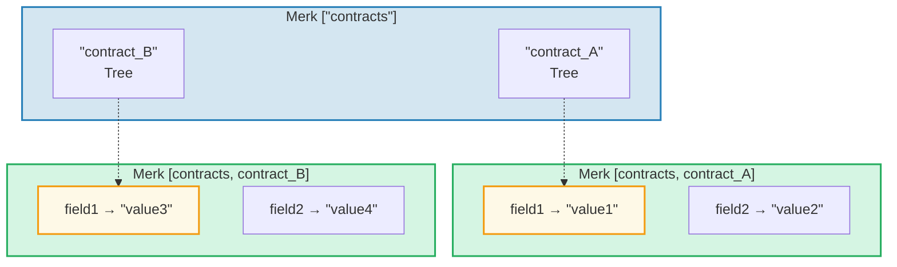
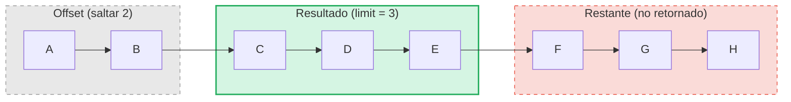

# El Sistema de Consultas

## Estructura de PathQuery

Las consultas de GroveDB usan el tipo `PathQuery`, que combina una ruta (dónde buscar)
con una consulta (qué seleccionar):

```rust
pub struct PathQuery {
    pub path: Vec<Vec<u8>>,         // Starting path in the grove
    pub query: SizedQuery,          // What to select
}

pub struct SizedQuery {
    pub query: Query,               // The selection criteria
    pub limit: Option<u16>,         // Maximum number of results
    pub offset: Option<u16>,        // Skip first N results
}
```

## El Tipo Query

```rust
pub struct Query {
    pub items: Vec<QueryItem>,              // What to match
    pub default_subquery_branch: SubqueryBranch,
    pub conditional_subquery_branches: Option<IndexMap<QueryItem, SubqueryBranch>>,
    pub left_to_right: bool,                // Iteration direction
    pub add_parent_tree_on_subquery: bool,  // Include parent tree element in results (v2)
}
```

> **`add_parent_tree_on_subquery`** (v2): Cuando es `true`, el elemento del árbol padre (ej.,
> un CountTree o SumTree) se incluye en los resultados de la consulta junto con los valores de sus hijos.
> Esto te permite recuperar tanto los valores agregados como los elementos individuales en una sola consulta.

## QueryItems — Qué Seleccionar

Cada `QueryItem` especifica una clave o rango a coincidir:

```rust
pub enum QueryItem {
    Key(Vec<u8>),                           // Exact key match
    Range(Range<Vec<u8>>),                  // Exclusive range [start..end)
    RangeInclusive(RangeInclusive<Vec<u8>>),// Inclusive range [start..=end]
    RangeFull(RangeFull),                   // All keys
    RangeFrom(RangeFrom<Vec<u8>>),          // [start..)
    RangeTo(RangeTo<Vec<u8>>),              // [..end)
    RangeToInclusive(RangeToInclusive<Vec<u8>>), // [..=end]
    RangeAfter(RangeFrom<Vec<u8>>),         // (start..) exclusive start
    RangeAfterTo(Range<Vec<u8>>),           // (start..end) exclusive both
    RangeAfterToInclusive(RangeInclusive<Vec<u8>>), // (start..=end]
}
```

Ejemplos de consultas:

Árbol Merk (ordenado): `alice  bob  carol  dave  eve  frank`

| Consulta | Selección | Resultado |
|-------|-----------|--------|
| `Key("bob")` | alice **[bob]** carol dave eve frank | bob |
| `RangeInclusive("bob"..="dave")` | alice **[bob carol dave]** eve frank | bob, carol, dave |
| `RangeAfter("carol"..)` | alice bob carol **[dave eve frank]** | dave, eve, frank |
| `RangeFull`, limit=2 | **[alice bob]** carol dave eve frank *(detenido por límite)* | alice, bob |
| `RangeFull`, limit=2, right-to-left | alice bob carol dave **[eve frank]** *(detenido por límite)* | frank, eve |

## Subconsultas y Ramas Condicionales

El verdadero poder de las consultas de GroveDB son las **subconsultas** — cuando una consulta coincide con un elemento
Tree, la consulta puede descender automáticamente a ese subárbol:



> **PathQuery:** `path: ["contracts"], query: RangeFull` con `default_subquery: Key("field1")`
>
> **Ejecución:**
> 1. `RangeFull` en ["contracts"] → coincide con contract_A, contract_B
> 2. Ambos son elementos Tree → descender con subconsulta `Key("field1")`
> 3. contract_A → "value1", contract_B → "value3"
>
> **Resultado:** `["value1", "value3"]`

Las **subconsultas condicionales** te permiten aplicar diferentes subconsultas según qué clave
fue coincidida:

```rust
conditional_subquery_branches: Some(indexmap! {
    QueryItem::Key(b"contract_A".to_vec()) => SubqueryBranch {
        subquery: Some(Query { items: vec![Key(b"field1".to_vec())] }),
        ..
    },
    QueryItem::Key(b"contract_B".to_vec()) => SubqueryBranch {
        subquery: Some(Query { items: vec![Key(b"field2".to_vec())] }),
        ..
    },
})
```

Esto obtendría `field1` de `contract_A` pero `field2` de `contract_B`.

## Consultas Dimensionadas — Límite y Desplazamiento

El wrapper `SizedQuery` agrega paginación:



> `SizedQuery { query: RangeFull, limit: Some(3), offset: Some(2) }` → Resultado: **[C, D, E]**

Cuando se combina con `left_to_right: false`, la iteración se invierte:

```text
    SizedQuery {
        query: Query { items: [RangeFull], left_to_right: false, .. },
        limit: Some(3),
        offset: None
    }

    Resultado: [H, G, F]
```

## Fusión de Consultas

Múltiples PathQueries pueden fusionarse en una sola consulta para eficiencia. El algoritmo de
fusión encuentra prefijos de ruta comunes y combina los elementos de consulta:

```text
    Consulta A: path=["users"], query=Key("alice")
    Consulta B: path=["users"], query=Key("bob")

    Fusionada: path=["users"], query=items=[Key("alice"), Key("bob")]
```

---
