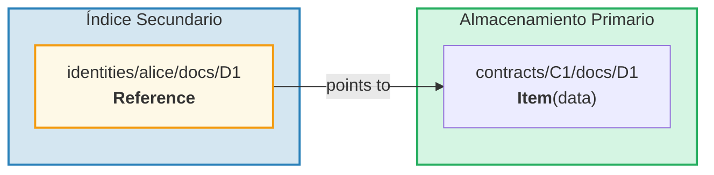
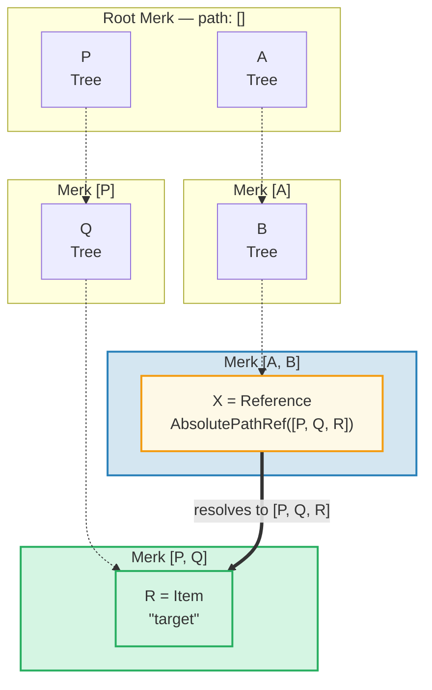
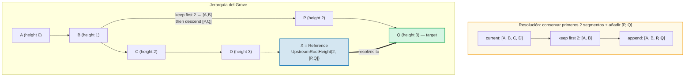
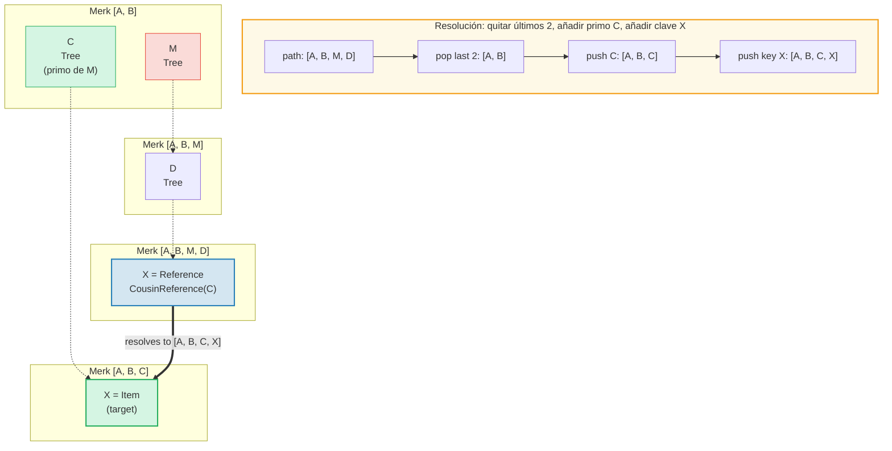
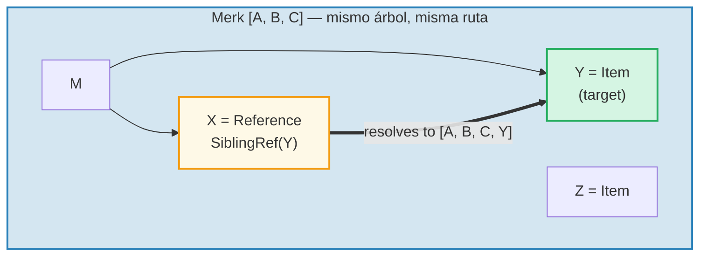
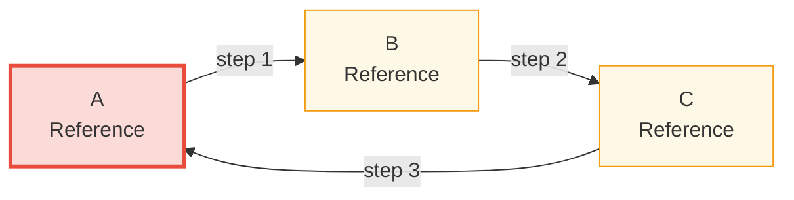

# El Sistema de Referencias

## Por Qué Existen las Referencias

En una base de datos jerárquica, frecuentemente necesitas que los mismos datos sean accesibles desde múltiples
rutas. Por ejemplo, los documentos podrían almacenarse bajo su contrato pero también ser
consultables por identidad del propietario. Las **referencias** (References) son la respuesta de GroveDB — son
punteros de una ubicación a otra, similares a los enlaces simbólicos en un sistema de archivos.



Propiedades clave:
- Las referencias son **autenticadas** — el value_hash de la referencia incluye tanto la
  referencia misma como el elemento referenciado
- Las referencias pueden estar **encadenadas** — una referencia puede apuntar a otra referencia
- La detección de ciclos previene bucles infinitos
- Un límite de saltos configurable previene el agotamiento de recursos

## Los Siete Tipos de Referencia

```rust
// grovedb-element/src/reference_path/mod.rs
pub enum ReferencePathType {
    AbsolutePathReference(Vec<Vec<u8>>),
    UpstreamRootHeightReference(u8, Vec<Vec<u8>>),
    UpstreamRootHeightWithParentPathAdditionReference(u8, Vec<Vec<u8>>),
    UpstreamFromElementHeightReference(u8, Vec<Vec<u8>>),
    CousinReference(Vec<u8>),
    RemovedCousinReference(Vec<Vec<u8>>),
    SiblingReference(Vec<u8>),
}
```

Recorramos cada uno con diagramas.

### AbsolutePathReference

El tipo más simple. Almacena la ruta completa al objetivo:



> X almacena la ruta absoluta completa `[P, Q, R]`. Sin importar dónde esté ubicado X, siempre se resuelve al mismo objetivo.

### UpstreamRootHeightReference

Conserva los primeros N segmentos de la ruta actual, luego añade una nueva ruta:



### UpstreamRootHeightWithParentPathAdditionReference

Como UpstreamRootHeight, pero re-añade el último segmento de la ruta actual:

```text
    Referencia en ruta [A, B, C, D, E] key=X
    UpstreamRootHeightWithParentPathAdditionReference(2, [P, Q])

    Ruta actual:       [A, B, C, D, E]
    Conservar primeros 2: [A, B]
    Añadir [P, Q]:     [A, B, P, Q]
    Re-añadir último:  [A, B, P, Q, E]   ← "E" de la ruta original añadido de vuelta

    Útil para: índices donde la clave padre debe preservarse
```

### UpstreamFromElementHeightReference

Descarta los últimos N segmentos, luego añade:

```text
    Referencia en ruta [A, B, C, D] key=X
    UpstreamFromElementHeightReference(1, [P, Q])

    Ruta actual:      [A, B, C, D]
    Descartar último 1: [A, B, C]
    Añadir [P, Q]:    [A, B, C, P, Q]
```

### CousinReference

Reemplaza solo el padre inmediato con una nueva clave:



> El "primo" es un subárbol hermano del abuelo de la referencia. La referencia navega dos niveles hacia arriba, luego desciende al subárbol primo.

### RemovedCousinReference

Como CousinReference pero reemplaza el padre con una ruta de múltiples segmentos:

```text
    Referencia en ruta [A, B, C, D] key=X
    RemovedCousinReference([M, N])

    Ruta actual:   [A, B, C, D]
    Quitar padre C: [A, B]
    Añadir [M, N]: [A, B, M, N]
    Añadir clave X: [A, B, M, N, X]
```

### SiblingReference

La referencia relativa más simple — solo cambia la clave dentro del mismo padre:



> El tipo de referencia más simple. X e Y son hermanos en el mismo árbol Merk — la resolución solo cambia la clave manteniendo la misma ruta.

## Seguimiento de Referencias y el Límite de Saltos

Cuando GroveDB encuentra un elemento Reference, debe **seguirlo** para encontrar el
valor real. Dado que las referencias pueden apuntar a otras referencias, esto implica un bucle:

```rust
// grovedb/src/reference_path.rs
pub const MAX_REFERENCE_HOPS: usize = 10;

pub fn follow_reference(...) -> CostResult<ResolvedReference, Error> {
    let mut hops_left = MAX_REFERENCE_HOPS;
    let mut visited = HashSet::new();

    while hops_left > 0 {
        // Resolve reference path to absolute path
        let target_path = current_ref.absolute_qualified_path(...);

        // Check for cycles
        if !visited.insert(target_path.clone()) {
            return Err(Error::CyclicReference);
        }

        // Fetch element at target
        let element = Element::get(target_path);

        match element {
            Element::Reference(next_ref, ..) => {
                // Still a reference — keep following
                current_ref = next_ref;
                hops_left -= 1;
            }
            other => {
                // Found the actual element!
                return Ok(ResolvedReference { element: other, ... });
            }
        }
    }

    Err(Error::ReferenceLimit)  // Exceeded 10 hops
}
```

## Detección de Ciclos

El `visited` HashSet rastrea todas las rutas que hemos visto. Si encontramos una ruta que ya
hemos visitado, tenemos un ciclo:



> **Traza de detección de ciclos:**
>
> | Paso | Seguir | conjunto visited | Resultado |
> |------|--------|-------------|--------|
> | 1 | Comenzar en A | { A } | A es Ref → seguir |
> | 2 | A → B | { A, B } | B es Ref → seguir |
> | 3 | B → C | { A, B, C } | C es Ref → seguir |
> | 4 | C → A | ¡A ya está en visited! | **Error::CyclicRef** |
>
> Sin detección de ciclos, esto se ejecutaría para siempre. `MAX_REFERENCE_HOPS = 10` también limita la profundidad de recorrido para cadenas largas.

## Referencias en Merk — Hashes de Valor Combinados

Cuando una Reference se almacena en un árbol Merk, su `value_hash` debe autenticar
tanto la estructura de la referencia como los datos referenciados:

```rust
// merk/src/tree/kv.rs
pub fn update_hashes_using_reference_value_hash(
    mut self,
    reference_value_hash: CryptoHash,
) -> CostContext<Self> {
    // Hash the reference element's own bytes
    let actual_value_hash = value_hash(self.value_as_slice());

    // Combine: H(reference_bytes) ⊕ H(referenced_data)
    let combined = combine_hash(&actual_value_hash, &reference_value_hash);

    self.value_hash = combined;
    self.hash = kv_digest_to_kv_hash(self.key(), self.value_hash());
    // ...
}
```

Esto significa que cambiar la referencia misma O los datos a los que apunta
cambiará el hash raíz — ambos están vinculados criptográficamente.

---
