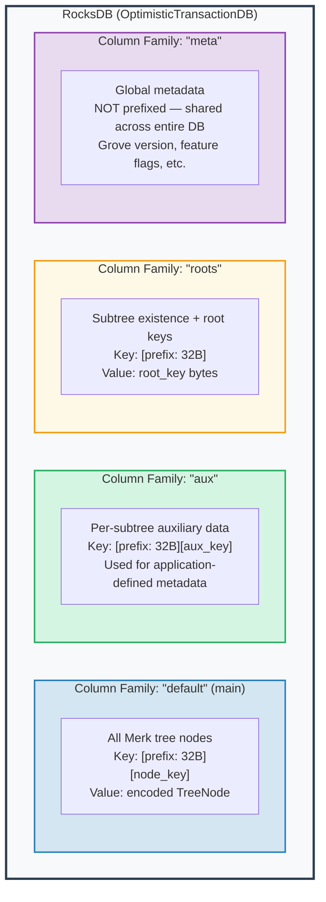
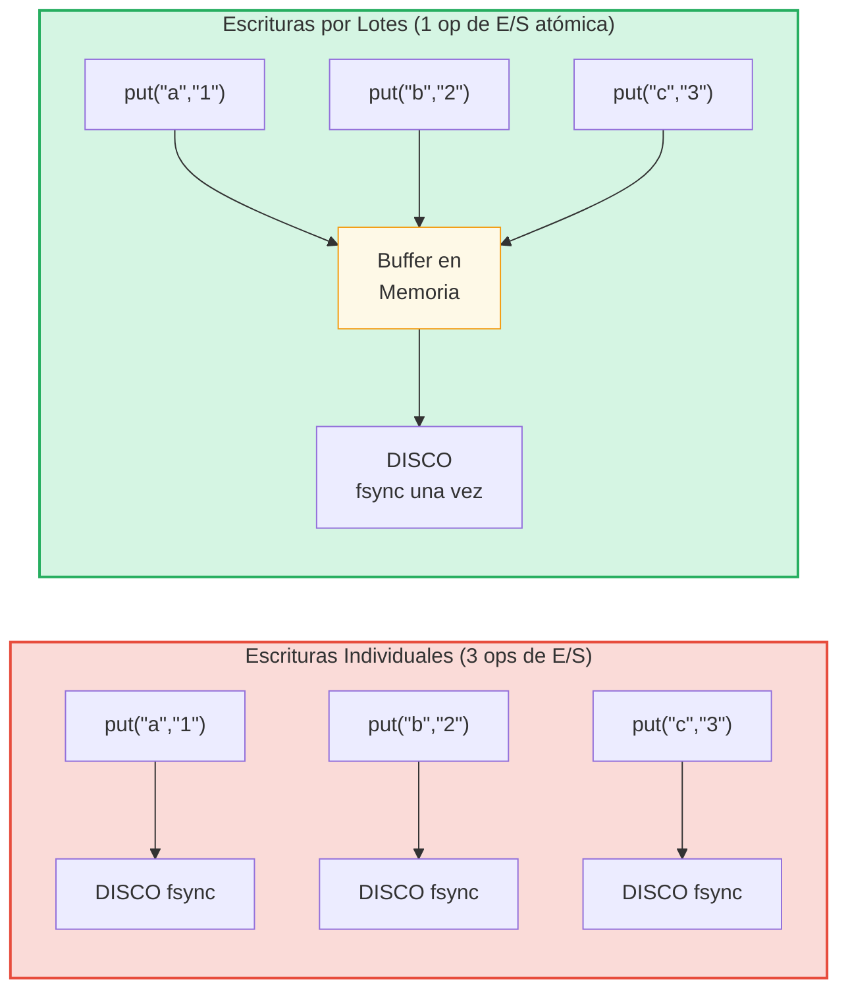

# La Capa de Almacenamiento

## RocksDB con OptimisticTransactionDB

GroveDB usa **RocksDB** como su backend de almacenamiento, específicamente la
variante `OptimisticTransactionDB` que soporta transacciones:

```rust
// storage/src/rocksdb_storage/storage.rs
pub(crate) type Db = OptimisticTransactionDB;
pub(crate) type Tx<'db> = Transaction<'db, Db>;

pub struct RocksDbStorage {
    db: OptimisticTransactionDB,
}
```

Las **transacciones optimistas** funcionan asumiendo que no habrá conflictos. Si dos
transacciones modifican los mismos datos, la segunda en confirmar fallará y puede ser
reintentada. Esto es más eficiente que el bloqueo pesimista para cargas de trabajo donde
los conflictos son raros.

Las opciones de RocksDB están ajustadas para la carga de trabajo de GroveDB:

```rust
lazy_static! {
    static ref DEFAULT_OPTS: rocksdb::Options = {
        let mut opts = rocksdb::Options::default();
        opts.create_if_missing(true);
        opts.increase_parallelism(num_cpus::get() as i32);
        opts.set_allow_mmap_writes(true);
        opts.set_allow_mmap_reads(true);
        opts.create_missing_column_families(true);
        opts.set_atomic_flush(true);
        opts
    };
}
```

## Cuatro Familias de Columnas

Las familias de columnas de RocksDB actúan como espacios de nombres clave-valor separados dentro de una sola
base de datos. GroveDB usa cuatro:



> **Ejemplo:** La clave `[ab3fc2...][6e616d65]` en el CF "default" mapea a `TreeNode{key:"name", val:"Al"}`, donde `ab3fc2...` es `Blake3(path)` y `6e616d65` es `"name"` en bytes.

```rust
pub(crate) const AUX_CF_NAME: &str = "aux";
pub(crate) const ROOTS_CF_NAME: &str = "roots";
pub(crate) const META_CF_NAME: &str = "meta";
// Main data uses the default column family
```

## Contextos de Almacenamiento con Prefijo

Cada subárbol obtiene su propio **contexto de almacenamiento con prefijo** — un wrapper que
automáticamente antepone el prefijo Blake3 de 32 bytes a todas las claves:

```text
    Ruta del subárbol: ["identities", "alice"]
    Prefijo: Blake3(path) = [0xab, 0x3f, 0xc2, ...]  (32 bytes)

    Cuando el subárbol almacena clave "name" con valor "Alice":

    Clave RocksDB:  [0xab 0x3f 0xc2 ... (32 bytes) | 0x6e 0x61 0x6d 0x65]
                    \_________prefijo________/       \_____"name"_____/

    Valor RocksDB: [TreeNode codificado con valor "Alice"]
```

Los tipos de contexto:

```text
    Sin transacción:
    PrefixedRocksDbImmediateStorageContext
    └── Lee/escribe directamente al DB con prefijo

    Con transacción:
    PrefixedRocksDbTransactionContext
    └── Lee/escribe a través de una Transaction con prefijo
```

Ambos implementan el trait `StorageContext`:

```rust
pub trait StorageContext<'db> {
    fn get(&self, key: &[u8]) -> CostResult<Option<Vec<u8>>, Error>;
    fn get_aux(&self, key: &[u8]) -> CostResult<Option<Vec<u8>>, Error>;
    fn get_root(&self, key: &[u8]) -> CostResult<Option<Vec<u8>>, Error>;
    fn get_meta(&self, key: &[u8]) -> CostResult<Option<Vec<u8>>, Error>;
    fn put(&self, key: &[u8], value: &[u8], ...) -> CostResult<(), Error>;
    fn put_aux(&self, key: &[u8], value: &[u8], ...) -> CostResult<(), Error>;
    fn put_root(&self, key: &[u8], value: &[u8], ...) -> CostResult<(), Error>;
    fn put_meta(&self, key: &[u8], value: &[u8], ...) -> CostResult<(), Error>;
    fn delete(&self, key: &[u8], ...) -> CostResult<(), Error>;
    // ...
}
```

## Lotes de Escritura y Modelo de Transacciones

Para rendimiento, GroveDB acumula escrituras en lotes:



> 3 sincronizaciones de disco vs 1 sincronización de disco = ~3x más rápido. Las escrituras por lotes también son **atómicas** (todo o nada).

El `StorageBatch` acumula operaciones que se vacían juntas:

```rust
pub struct StorageBatch {
    operations: RefCell<Vec<AbstractBatchOperation>>,
}
```

## El Patrón Crítico commit_local()

Cuando se usan transacciones, hay un patrón crítico que debe seguirse. Las escrituras
dentro de una transacción están en buffer — no son visibles hasta que se confirman:

```rust
// Patrón CORRECTO:
{
    let tx = db.start_transaction();
    let storage_ctx = db.get_transactional_storage_context(path, &tx);

    storage_ctx.put(key, value);  // Writes to transaction buffer

    drop(storage_ctx);            // Release borrow on tx
    tx.commit_local();            // Flush transaction to DB
}

// INCORRECTO — los datos se pierden:
{
    let tx = db.start_transaction();
    let storage_ctx = db.get_transactional_storage_context(path, &tx);

    storage_ctx.put(key, value);  // Writes to transaction buffer

    // ¡tx se destruye aquí sin commit_local()!
    // ¡Todas las escrituras se REVIERTEN!
}
```

Esto es especialmente importante porque el `storage_ctx` toma prestada la transacción.
Debes hacer `drop(storage_ctx)` antes de poder llamar a `tx.commit_local()`.

---
