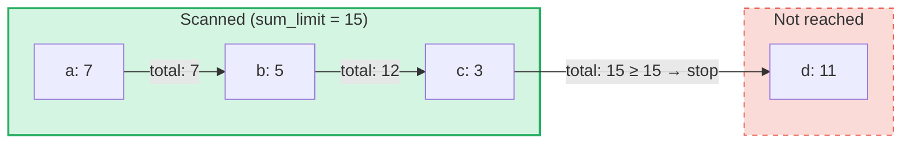

# Requetes de somme agregee

## Vue d'ensemble

Les requetes de somme agregee sont un type de requete specialise concu pour les **SumTrees** dans GroveDB.
Contrairement aux requetes classiques qui recuperent des elements par cle ou par plage, les requetes de somme
agregee parcourent les elements et accumulent leurs valeurs de somme jusqu'a ce qu'une **limite de somme** soit atteinte.

Cela est utile pour des questions telles que :
- "Donne-moi les transactions jusqu'a ce que le total cumulatif depasse 1000"
- "Quels elements contribuent aux 500 premieres unites de valeur dans cet arbre ?"
- "Collecter les elements de somme jusqu'a un budget de N"

## Concepts fondamentaux

### Differences avec les requetes classiques

| Caracteristique | PathQuery | AggregateSumPathQuery |
|---------|-----------|----------------------|
| **Cible** | Tout type d'element | Elements SumItem / ItemWithSumItem |
| **Condition d'arret** | Limite (nombre) ou fin de plage | Limite de somme (total cumulatif) **et/ou** limite d'elements |
| **Retourne** | Elements ou cles | Paires cle-valeur de somme |
| **Sous-requetes** | Oui (descente dans les sous-arbres) | Non (un seul niveau d'arbre) |
| **References** | Resolues par la couche GroveDB | Optionnellement suivies ou ignorees |

### La structure AggregateSumQuery

```rust
pub struct AggregateSumQuery {
    pub items: Vec<QueryItem>,              // Keys or ranges to scan
    pub left_to_right: bool,                // Iteration direction
    pub sum_limit: u64,                     // Stop when running total reaches this
    pub limit_of_items_to_check: Option<u16>, // Max number of matching items to return
}
```

La requete est encapsulee dans un `AggregateSumPathQuery` pour specifier ou chercher dans le bosquet :

```rust
pub struct AggregateSumPathQuery {
    pub path: Vec<Vec<u8>>,                 // Path to the SumTree
    pub aggregate_sum_query: AggregateSumQuery,
}
```

### Limite de somme — Le total cumulatif

Le `sum_limit` est le concept central. A mesure que les elements sont parcourus, leurs valeurs de somme
sont accumulees. Une fois que le total cumulatif atteint ou depasse la limite de somme, l'iteration s'arrete :



> **Resultat :** `[(a, 7), (b, 5), (c, 3)]` — l'iteration s'arrete car 7 + 5 + 3 = 15 >= sum_limit

Les valeurs de somme negatives sont prises en charge. Une valeur negative augmente le budget restant :

```text
sum_limit = 12, elements: a(10), b(-3), c(5)

a: total = 10, remaining = 2
b: total =  7, remaining = 5  ← negative value gave us more room
c: total = 12, remaining = 0  ← stop

Result: [(a, 10), (b, -3), (c, 5)]
```

## Options de requete

La structure `AggregateSumQueryOptions` controle le comportement de la requete :

```rust
pub struct AggregateSumQueryOptions {
    pub allow_cache: bool,                              // Use cached reads (default: true)
    pub error_if_intermediate_path_tree_not_present: bool, // Error on missing path (default: true)
    pub error_if_non_sum_item_found: bool,              // Error on non-sum elements (default: true)
    pub ignore_references: bool,                        // Skip references (default: false)
}
```

### Gestion des elements non-somme

Les SumTrees peuvent contenir un melange de types d'elements : `SumItem`, `Item`, `Reference`, `ItemWithSumItem`,
et d'autres. Par defaut, la rencontre d'un element non-somme et non-reference produit une erreur.

Lorsque `error_if_non_sum_item_found` est defini a `false`, les elements non-somme sont **ignores silencieusement**
sans consommer de place dans la limite utilisateur :

```text
Tree contents: a(SumItem=7), b(Item), c(SumItem=3)
Query: sum_limit=100, limit_of_items_to_check=2, error_if_non_sum_item_found=false

Scan: a(7) → returned, limit=1
      b(Item) → skipped, limit still 1
      c(3) → returned, limit=0 → stop

Result: [(a, 7), (c, 3)]
```

Remarque : les elements `ItemWithSumItem` sont **toujours** traites (jamais ignores), car ils portent
une valeur de somme.

### Gestion des references

Par defaut, les elements `Reference` sont **suivis** — la requete resout la chaine de references
(jusqu'a 3 sauts intermediaires) pour trouver la valeur de somme de l'element cible :

```text
Tree contents: a(SumItem=7), ref_b(Reference → a)
Query: sum_limit=100

ref_b is followed → resolves to a(SumItem=7)

Result: [(a, 7), (ref_b, 7)]
```

Lorsque `ignore_references` est `true`, les references sont ignorees silencieusement sans consommer
de place dans la limite, de maniere similaire a la facon dont les elements non-somme sont ignores.

Les chaines de references de plus de 3 sauts intermediaires produisent une erreur `ReferenceLimit`.

## Le type de resultat

Les requetes retournent un `AggregateSumQueryResult` :

```rust
pub struct AggregateSumQueryResult {
    pub results: Vec<(Vec<u8>, i64)>,       // Key-sum value pairs
    pub hard_limit_reached: bool,           // True if system limit truncated results
}
```

L'indicateur `hard_limit_reached` signale si la limite stricte de parcours du systeme (par defaut : 1024
elements) a ete atteinte avant que la requete ne se termine naturellement. Lorsqu'il est `true`, davantage
de resultats peuvent exister au-dela de ce qui a ete retourne.

## Trois systemes de limites

Les requetes de somme agregee ont **trois** conditions d'arret :

| Limite | Source | Ce qu'elle compte | Effet lorsqu'elle est atteinte |
|-------|--------|---------------|-------------------|
| **sum_limit** | Utilisateur (requete) | Total cumulatif des valeurs de somme | Arrete l'iteration |
| **limit_of_items_to_check** | Utilisateur (requete) | Elements correspondants retournes | Arrete l'iteration |
| **Limite stricte de parcours** | Systeme (GroveVersion, defaut 1024) | Tous les elements parcourus (y compris les ignores) | Arrete l'iteration, definit `hard_limit_reached` |

La limite stricte de parcours empeche une iteration illimitee lorsqu'aucune limite utilisateur n'est definie.
Les elements ignores (elements non-somme avec `error_if_non_sum_item_found=false`, ou references avec
`ignore_references=true`) sont comptes dans la limite stricte de parcours mais **pas** dans la
`limit_of_items_to_check` de l'utilisateur.

## Utilisation de l'API

### Requete simple

```rust
use grovedb::AggregateSumPathQuery;
use grovedb_merk::proofs::query::AggregateSumQuery;

// "Give me items from this SumTree until the total reaches 1000"
let query = AggregateSumQuery::new(1000, None);
let path_query = AggregateSumPathQuery {
    path: vec![b"my_tree".to_vec()],
    aggregate_sum_query: query,
};

let result = db.query_aggregate_sums(
    &path_query,
    true,   // allow_cache
    true,   // error_if_intermediate_path_tree_not_present
    None,   // transaction
    grove_version,
).unwrap().expect("query failed");

for (key, sum_value) in &result.results {
    println!("{}: {}", String::from_utf8_lossy(key), sum_value);
}
```

### Requete avec options

```rust
use grovedb::{AggregateSumPathQuery, AggregateSumQueryOptions};
use grovedb_merk::proofs::query::AggregateSumQuery;

// Skip non-sum items and ignore references
let query = AggregateSumQuery::new(1000, Some(50));
let path_query = AggregateSumPathQuery {
    path: vec![b"mixed_tree".to_vec()],
    aggregate_sum_query: query,
};

let result = db.query_aggregate_sums_with_options(
    &path_query,
    AggregateSumQueryOptions {
        error_if_non_sum_item_found: false,  // skip Items, Trees, etc.
        ignore_references: true,              // skip References
        ..AggregateSumQueryOptions::default()
    },
    None,
    grove_version,
).unwrap().expect("query failed");

if result.hard_limit_reached {
    println!("Warning: results may be incomplete (hard limit reached)");
}
```

### Requetes par cle

Au lieu de parcourir une plage, vous pouvez interroger des cles specifiques :

```rust
// Check the sum value of specific keys
let query = AggregateSumQuery::new_with_keys(
    vec![b"alice".to_vec(), b"bob".to_vec(), b"carol".to_vec()],
    u64::MAX,  // no sum limit
    None,      // no item limit
);
```

### Requetes descendantes

Iterer de la cle la plus haute a la plus basse :

```rust
let query = AggregateSumQuery::new_descending(500, Some(10));
// Or: query.left_to_right = false;
```

## Reference des constructeurs

| Constructeur | Description |
|-------------|-------------|
| `new(sum_limit, limit)` | Plage complete, ordre croissant |
| `new_descending(sum_limit, limit)` | Plage complete, ordre decroissant |
| `new_single_key(key, sum_limit)` | Recherche par cle unique |
| `new_with_keys(keys, sum_limit, limit)` | Plusieurs cles specifiques |
| `new_with_keys_reversed(keys, sum_limit, limit)` | Plusieurs cles, ordre decroissant |
| `new_single_query_item(item, sum_limit, limit)` | Un seul QueryItem (cle ou plage) |
| `new_with_query_items(items, sum_limit, limit)` | Plusieurs QueryItems |

---
