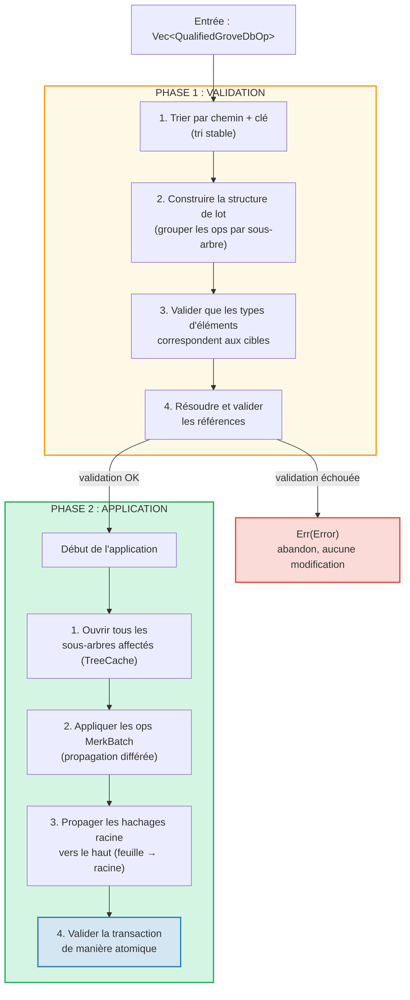
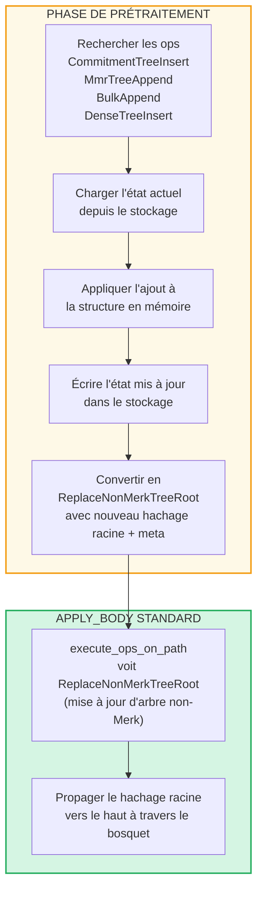

# Les opérations par lots au niveau du bosquet

## Variantes de GroveOp

Au niveau GroveDB, les opérations sont représentées par `GroveOp` :

```rust
pub enum GroveOp {
    // User-facing operations:
    InsertOnly { element: Element },
    InsertOrReplace { element: Element },
    Replace { element: Element },
    Patch { element: Element, change_in_bytes: i32 },
    RefreshReference { reference_path_type, max_reference_hop, flags, trust_refresh_reference },
    Delete,
    DeleteTree(TreeType),                          // Parameterized by tree type

    // Non-Merk tree append operations (user-facing):
    CommitmentTreeInsert { cmx: [u8; 32], payload: Vec<u8> },
    MmrTreeAppend { value: Vec<u8> },
    BulkAppend { value: Vec<u8> },
    DenseTreeInsert { value: Vec<u8> },

    // Internal operations (created by preprocessing/propagation, rejected by from_ops):
    ReplaceTreeRootKey { hash, root_key, aggregate_data },
    InsertTreeWithRootHash { hash, root_key, flags, aggregate_data },
    ReplaceNonMerkTreeRoot { hash: [u8; 32], meta: NonMerkTreeMeta },
    InsertNonMerkTree { hash, root_key, flags, aggregate_data, meta: NonMerkTreeMeta },
}
```

**NonMerkTreeMeta** transporte l'état spécifique au type d'arbre à travers le traitement par lots :

```rust
pub enum NonMerkTreeMeta {
    CommitmentTree { total_count: u64, chunk_power: u8 },
    MmrTree { mmr_size: u64 },
    BulkAppendTree { total_count: u64, chunk_power: u8 },
    DenseTree { count: u16, height: u8 },
}
```

Chaque opération est enveloppée dans un `QualifiedGroveDbOp` qui inclut le chemin :

```rust
pub struct QualifiedGroveDbOp {
    pub path: KeyInfoPath,           // Where in the grove
    pub key: Option<KeyInfo>,        // Which key (None for append-only tree ops)
    pub op: GroveOp,                 // What to do
}
```

> **Note :** Le champ `key` est `Option<KeyInfo>` — il est `None` pour les opérations d'arbres
> en ajout seulement (`CommitmentTreeInsert`, `MmrTreeAppend`, `BulkAppend`, `DenseTreeInsert`)
> où la clé de l'arbre est le dernier segment du `path` à la place.

## Traitement en deux phases

Les opérations par lots sont traitées en deux phases :



## TreeCache et propagation différée

Pendant l'application du lot, GroveDB utilise un **TreeCache** pour différer la
propagation du hachage racine jusqu'à ce que toutes les opérations dans un sous-arbre soient terminées :

```mermaid
graph TD
    subgraph without["SANS TreeCache (naïf)"]
        w1["Op 1 : Insérer A dans X"]
        w1p["Propager X → parent → racine"]
        w2["Op 2 : Insérer B dans X"]
        w2p["Propager X → parent → racine"]
        w3["Op 3 : Insérer C dans X"]
        w3p["Propager X → parent → racine"]
        w1 --> w1p --> w2 --> w2p --> w3 --> w3p
    end

    subgraph with_tc["AVEC TreeCache (différé)"]
        t1["Op 1 : Insérer A dans X<br/>→ mis en tampon"]
        t2["Op 2 : Insérer B dans X<br/>→ mis en tampon"]
        t3["Op 3 : Insérer C dans X<br/>→ mis en tampon"]
        tp["Propager X → parent → racine<br/>(remonter UNE SEULE FOIS)"]
        t1 --> t2 --> t3 --> tp
    end

    style without fill:#fadbd8,stroke:#e74c3c,stroke-width:2px
    style with_tc fill:#d5f5e3,stroke:#27ae60,stroke-width:2px
    style w1p fill:#fadbd8,stroke:#e74c3c
    style w2p fill:#fadbd8,stroke:#e74c3c
    style w3p fill:#fadbd8,stroke:#e74c3c
    style tp fill:#d5f5e3,stroke:#27ae60,stroke-width:2px
```



> **3 propagations x O(profondeur)** contre **1 propagation x O(profondeur)** = 3 fois plus rapide pour ce sous-arbre.

C'est une optimisation significative quand de nombreuses opérations ciblent le même sous-arbre.

## Opérations atomiques inter-sous-arbres

Une propriété clé des lots GroveDB est l'**atomicité inter-sous-arbres**. Un seul lot
peut modifier des éléments dans plusieurs sous-arbres, et soit toutes les modifications sont validées soit aucune :

```text
    Lot :
    1. Supprimer ["balances", "alice"]       (supprimer le solde)
    2. Insérer ["balances", "bob"] = 100    (ajouter le solde)
    3. Mettre à jour ["identities", "bob", "rev"] = 2  (mettre à jour la révision)

    Trois sous-arbres affectés : balances, identities, identities/bob

    Si UNE opération échoue → TOUTES les opérations sont annulées
    Si TOUTES réussissent → TOUTES sont validées de manière atomique
```

Le processeur de lots gère cela en :
1. Collectant tous les chemins affectés
2. Ouvrant tous les sous-arbres nécessaires
3. Appliquant toutes les opérations
4. Propageant tous les hachages racine dans l'ordre de dépendance
5. Validant la transaction entière

## Prétraitement par lots pour les arbres non-Merk

Les opérations CommitmentTree, MmrTree, BulkAppendTree et DenseAppendOnlyFixedSizeTree
nécessitent un accès aux contextes de stockage en dehors du Merk, ce qui n'est pas disponible dans la
méthode standard `execute_ops_on_path` (elle n'a accès qu'au Merk). Ces opérations
utilisent un **patron de prétraitement** : avant la phase principale `apply_body`, les points
d'entrée recherchent les opérations d'arbres non-Merk et les convertissent en opérations internes standard.

```rust
pub enum GroveOp {
    // ... standard ops ...

    // Non-Merk tree operations (user-facing):
    CommitmentTreeInsert { cmx: [u8; 32], payload: Vec<u8> },
    MmrTreeAppend { value: Vec<u8> },
    BulkAppend { value: Vec<u8> },
    DenseTreeInsert { value: Vec<u8> },

    // Internal ops (produced by preprocessing):
    ReplaceNonMerkTreeRoot { hash: [u8; 32], meta: NonMerkTreeMeta },
}
```



**Pourquoi le prétraitement ?** La fonction `execute_ops_on_path` opère sur un seul
sous-arbre Merk et n'a pas accès à `self.db` ou aux contextes de stockage plus larges.
Le prétraitement dans les points d'entrée (`apply_batch_with_element_flags_update`,
`apply_partial_batch_with_element_flags_update`) a un accès complet à la base de données,
donc il peut charger/sauvegarder des données puis transmettre un simple `ReplaceNonMerkTreeRoot`
à la machinerie de lots standard.

Chaque méthode de prétraitement suit le même patron :
1. **`preprocess_commitment_tree_ops`** — Charge la frontière et le BulkAppendTree depuis
   le stockage data, ajoute aux deux, sauvegarde, convertit en `ReplaceNonMerkTreeRoot`
   avec la racine combinée mise à jour et les métadonnées `CommitmentTree { total_count, chunk_power }`
2. **`preprocess_mmr_tree_ops`** — Charge le MMR depuis le stockage data, ajoute les valeurs,
   sauvegarde, convertit en `ReplaceNonMerkTreeRoot` avec la racine MMR mise à jour
   et les métadonnées `MmrTree { mmr_size }`
3. **`preprocess_bulk_append_ops`** — Charge le BulkAppendTree depuis le stockage data,
   ajoute les valeurs (peut déclencher la compaction de chunks), sauvegarde, convertit en
   `ReplaceNonMerkTreeRoot` avec la racine d'état mise à jour et les métadonnées `BulkAppendTree { total_count, chunk_power }`
4. **`preprocess_dense_tree_ops`** — Charge le DenseFixedSizedMerkleTree depuis le stockage
   data, insère les valeurs séquentiellement, recalcule le hachage racine, sauvegarde,
   convertit en `ReplaceNonMerkTreeRoot` avec le hachage racine mis à jour et les métadonnées `DenseTree { count, height }`

L'opération `ReplaceNonMerkTreeRoot` transporte le nouveau hachage racine et une énumération `NonMerkTreeMeta`
pour que l'élément puisse être entièrement reconstruit après le traitement.

---
