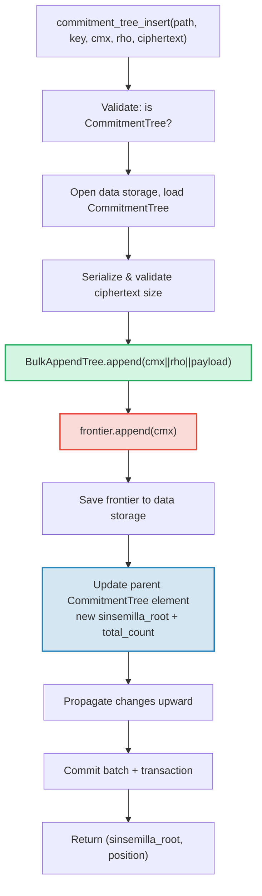

# Le CommitmentTree — Ancres de commitments Sinsemilla

Le **CommitmentTree** (arbre de commitments) est le pont de GroveDB entre le stockage authentifié et
les systemes de preuves a connaissance nulle (zero-knowledge proof systems). Il combine un **BulkAppendTree** (Chapitre 14) pour
le stockage efficace de donnees compactees par chunks avec une **frontiere Sinsemilla** dans
l'espace de noms de donnees pour les ancres compatibles ZK. Comme MmrTree et BulkAppendTree, il
n'a **pas de Merk enfant** — le hachage racine combine circule comme le hachage enfant du Merk.
Les entrees du BulkAppendTree et la frontiere Sinsemilla resident dans l'**espace de noms de donnees** (data namespace).

Ce chapitre couvre la fonction de hachage Sinsemilla et pourquoi elle est importante pour
les circuits a connaissance nulle, la structure de donnees de la frontiere et sa serialisation
compacte, l'architecture de stockage a double espace de noms, les operations GroveDB,
le pretraitement par lots, la generation de temoins cote client, et le fonctionnement des preuves.

## Pourquoi un arbre compatible ZK ?

Les arbres standards de GroveDB utilisent le hachage Blake3. Blake3 est rapide en logiciel, mais
**couteux a l'interieur des circuits a connaissance nulle**. Quand un depenseur doit prouver
« Je connais une note a la position P dans l'arbre de commitments » sans reveler P, il
doit evaluer la fonction de hachage de Merkle 32 fois (une fois par niveau de l'arbre) a l'interieur d'un
circuit ZK.

Sinsemilla (specifie dans le ZIP-244 pour le protocole Zcash Orchard) est concu
pour exactement ce cas d'usage — il fournit un **hachage efficace dans les circuits** sur
la courbe elliptique Pallas, l'une des deux moities du cycle de courbes Pasta utilise par le
systeme de preuve Halo 2.

| Propriete | Blake3 | Sinsemilla |
|----------|--------|------------|
| **Cout en circuit** | ~25 000 contraintes par hachage | ~800 contraintes par hachage |
| **Vitesse logicielle** | Tres rapide (~2 Go/s) | Lent (~10 000 hachages/s) |
| **Structure algebrique** | Aucune (operations binaires) | Operations sur la courbe Pallas |
| **Objectif principal** | Hachage general, arbres de Merkle | Preuves de Merkle dans les circuits |
| **Utilise par** | Arbres Merk GroveDB, MMR, Bulk | Protocole blinde Orchard |
| **Taille de sortie** | 32 octets | 32 octets (element du corps de Pallas) |

Le CommitmentTree utilise Sinsemilla pour l'arbre de Merkle sur lequel les circuits ZK
raisonnent, tout en utilisant Blake3 pour la hierarchie Merk de GroveDB au-dessus.
Les elements inseres dans l'arbre sont stockes via un BulkAppendTree dans l'espace de noms
de donnees (compactes par chunks, recuperables par position) et simultanement ajoutes
a la frontiere Sinsemilla (produisant une ancre prouvable par ZK).

## L'architecture de l'espace de noms de donnees

Le CommitmentTree stocke **toutes les donnees dans l'espace de noms de donnees** au meme chemin
de sous-arbre. Comme MmrTree et BulkAppendTree, il n'a **pas de Merk enfant** (pas de champ `root_key`
— la racine specifique au type circule comme le hachage enfant du Merk). Les entrees du BulkAppendTree et la frontiere Sinsemilla coexistent
dans l'espace de noms de donnees en utilisant des prefixes de cles distincts :

```text
┌──────────────────────────────────────────────────────────────┐
│                       CommitmentTree                          │
│                                                               │
│  ┌─────────────────────────────────────────────────────────┐  │
│  │  Data Namespace                                         │  │
│  │                                                         │  │
│  │  BulkAppendTree storage (Chapter 14):                   │  │
│  │    Buffer entries → chunk blobs → chunk MMR             │  │
│  │    value = cmx (32) || rho (32) || ciphertext (216)     │  │
│  │                                                         │  │
│  │  Sinsemilla Frontier (~1KB):                            │  │
│  │    key: b"__ct_data__" (COMMITMENT_TREE_DATA_KEY)       │  │
│  │    Depth-32 incremental Merkle tree                     │  │
│  │    Stores only the rightmost path (leaf + ommers)       │  │
│  │    O(1) append, O(1) root computation                   │  │
│  │    Produces Orchard-compatible Anchor for ZK proofs     │  │
│  └─────────────────────────────────────────────────────────┘  │
│                                                               │
│  sinsemilla_root embedded in Element bytes                    │
│    → flows through Merk value_hash → GroveDB state root      │
└──────────────────────────────────────────────────────────────┘
```

**Pourquoi deux structures ?** Le BulkAppendTree fournit un stockage et une recuperation
efficaces et compactes par chunks pour potentiellement des millions de notes chiffrees. La
frontiere Sinsemilla fournit des ancres compatibles ZK qui peuvent etre prouvees a l'interieur d'un
circuit Halo 2. Les deux sont mises a jour de maniere synchrone a chaque ajout.

Comparaison avec les autres types d'arbres non standards :

| | CommitmentTree | MmrTree | BulkAppendTree |
|---|---|---|---|
| **Merk enfant** | Non | Non | Non |
| **Espace de noms data** | Entrees BulkAppendTree + frontiere | Noeuds MMR | Tampon + chunks + MMR |
| **Espace de noms aux** | — | — | — |
| **Elements requetables** | Via preuves V1 | Via preuves V1 | Via preuves V1 |
| **Fonction de hachage** | Sinsemilla + Blake3 | Blake3 | Blake3 |

## La frontiere Sinsemilla

La frontiere est un arbre de Merkle incremental de profondeur 32 implemente par le
type `Frontier<MerkleHashOrchard, 32>` du crate `incrementalmerkletree`. Au lieu de
stocker les 2^32 feuilles possibles, elle ne stocke que l'information necessaire pour
**ajouter la prochaine feuille et calculer la racine actuelle** : la feuille la plus a droite et
ses ommers (hachages des freres et soeurs necessaires pour le calcul de la racine).

```text
                         root (level 32)
                        /               \
                      ...               ...
                     /                     \
                  (level 2)             (level 2)
                  /     \               /     \
              (level 1) (level 1)   (level 1)  ?
              /    \    /    \      /    \
             L0    L1  L2    L3   L4    ?     ← frontier stores L4
                                              + ommers at levels
                                              where left sibling exists
```

La frontiere stocke :
- **leaf** (feuille) : la valeur la plus recemment ajoutee (un element du corps de Pallas)
- **ommers** : les hachages des freres gauches a chaque niveau ou le chemin de la frontiere
  va a droite (au plus 32 ommers pour un arbre de profondeur 32)
- **position** : la position indexee a partir de 0 de la feuille

Proprietes cles :
- **Ajout en O(1)** : inserer une nouvelle feuille, mettre a jour les ommers, recalculer la racine
- **Racine en O(1)** : parcourir les ommers stockes de la feuille a la racine
- **Taille constante d'environ 1 Ko** : quel que soit le nombre de feuilles ajoutees
- **Deterministe** : deux frontieres avec la meme sequence d'ajouts produisent
  la meme racine

La constante `EMPTY_SINSEMILLA_ROOT` est la racine d'un arbre de profondeur 32 vide,
precalculee comme `MerkleHashOrchard::empty_root(Level::from(32)).to_bytes()` :

```text
0xae2935f1dfd8a24aed7c70df7de3a668eb7a49b1319880dde2bbd9031ae5d82f
```

## Comment fonctionne l'ajout — La cascade des ommers

Quand un nouveau commitment est ajoute a la position N, le nombre d'ommers qui doivent
etre mis a jour est egal a `trailing_ones(N)` — le nombre de bits 1 de fin dans la
representation binaire de N. C'est le meme patron que la cascade de fusion du MMR
(§13.4), mais operant sur les ommers plutot que sur les sommets.

**Exemple detaille — ajout de 4 feuilles :**

```text
Position 0 (binary: 0, trailing_ones: 0):
  frontier = { leaf: L0, ommers: [], position: 0 }
  Sinsemilla hashes: 32 (root computation) + 0 (no ommer merges) = 32

Position 1 (binary: 1, trailing_ones: 0 of PREVIOUS position 0):
  Before: position 0 has trailing_ones = 0
  frontier = { leaf: L1, ommers: [H(L0,L1) at level 1], position: 1 }
  Sinsemilla hashes: 32 + 0 = 32

Position 2 (binary: 10, trailing_ones: 0 of PREVIOUS position 1):
  Before: position 1 has trailing_ones = 1
  frontier = { leaf: L2, ommers: [level1_hash], position: 2 }
  Sinsemilla hashes: 32 + 1 = 33

Position 3 (binary: 11, trailing_ones: 0 of PREVIOUS position 2):
  Before: position 2 has trailing_ones = 0
  frontier = { leaf: L3, ommers: [level1_hash, level2_hash], position: 3 }
  Sinsemilla hashes: 32 + 0 = 32
```

Le **total de hachages Sinsemilla** par ajout est :

```text
32 (root computation always traverses all 32 levels)
+ trailing_ones(current_position)  (ommer cascade)
```

En moyenne, `trailing_ones` vaut environ 1 (distribution geometrique), donc le cout
moyen est d'**environ 33 hachages Sinsemilla par ajout**. Le pire cas (a la position
2^32 - 1, ou tous les bits valent 1) est de **64 hachages**.

## Le format de serialisation de la frontiere

La frontiere est stockee dans le stockage de donnees a la cle `b"__ct_data__"`. Le
format filaire est :

```text
┌──────────────────────────────────────────────────────────────────┐
│ has_frontier: u8                                                  │
│   0x00 → empty tree (no more fields)                             │
│   0x01 → non-empty (fields follow)                               │
├──────────────────────────────────────────────────────────────────┤
│ position: u64 BE (8 bytes)      — 0-indexed leaf position        │
├──────────────────────────────────────────────────────────────────┤
│ leaf: [u8; 32]                  — Pallas field element bytes     │
├──────────────────────────────────────────────────────────────────┤
│ ommer_count: u8                 — number of ommers (0..=32)      │
├──────────────────────────────────────────────────────────────────┤
│ ommers: [ommer_count × 32 bytes] — Pallas field elements        │
└──────────────────────────────────────────────────────────────────┘
```

**Analyse de la taille :**

| Etat | Taille | Decomposition |
|-------|------|-----------|
| Vide | 1 octet | Drapeau `0x00` uniquement |
| 1 feuille, 0 ommers | 42 octets | 1 + 8 + 32 + 1 |
| ~16 ommers (moyenne) | 554 octets | 1 + 8 + 32 + 1 + 16x32 |
| 32 ommers (maximum) | 1 066 octets | 1 + 8 + 32 + 1 + 32x32 |

La taille de la frontiere est limitee a environ 1,1 Ko quel que soit le nombre de millions de
commitments qui ont ete ajoutes. Cela rend le cycle charger→modifier→sauvegarder tres
peu couteux (1 recherche en lecture, 1 recherche en ecriture).

## Representation en element

```rust
CommitmentTree(
    u64,                  // total_count: number of appended items
    u8,                   // chunk_power: dense tree height for BulkAppendTree buffer
    Option<ElementFlags>, // flags: optional metadata
)
```

Le parametre `chunk_power` controle la hauteur de l'arbre dense du tampon du BulkAppendTree ;
`chunk_power` doit etre dans l'intervalle 1..=16 (voir §14.1 et §16).

**Identifiants de type :**

| Identifiant | Valeur |
|---|---|
| Discriminant de l'element | 11 |
| `TreeType` | `CommitmentTree = 7` |
| `ElementType` | 11 |
| `COMMITMENT_TREE_COST_SIZE` | 12 octets (8 total_count + 1 chunk_power + 1 discriminant + 2 surcharge) |

La racine Sinsemilla N'EST PAS stockee dans l'Element. Elle circule comme le hachage enfant du Merk
a travers le mecanisme `insert_subtree`. Quand le Merk parent calcule son
`combined_value_hash`, la racine derivee de Sinsemilla est incluse comme hachage enfant :

```text
combined_value_hash = blake3(value_hash || child_hash)
                                           ↑ sinsemilla/BulkAppendTree combined root
```

Cela signifie que tout changement de la frontiere Sinsemilla se propage automatiquement
a travers la hierarchie Merk de GroveDB jusqu'a la racine d'etat.

**Methodes de construction :**

| Methode | Cree |
|---|---|
| `Element::empty_commitment_tree(chunk_power)` | Arbre vide, count=0, sans drapeaux |
| `Element::empty_commitment_tree_with_flags(chunk_power, flags)` | Arbre vide avec drapeaux |
| `Element::new_commitment_tree(total_count, chunk_power, flags)` | Tous les champs explicites |

## Architecture de stockage

Le CommitmentTree stocke toutes ses donnees dans un seul **espace de noms de donnees** au
chemin du sous-arbre. Les entrees du BulkAppendTree et la frontiere Sinsemilla coexistent dans
la meme colonne en utilisant des prefixes de cles distincts. Aucun espace de noms auxiliaire n'est utilise.

```text
┌──────────────────────────────────────────────────────────────────┐
│  Data Namespace (all CommitmentTree storage)                      │
│                                                                   │
│  BulkAppendTree storage keys (see §14.7):                         │
│    b"m" || pos (u64 BE)  → MMR node blobs                        │
│    b"b" || index (u64 BE)→ buffer entries (cmx || rho || ciphertext) │
│    b"e" || chunk (u64 BE)→ chunk blobs (compacted buffer)         │
│    b"M"                  → BulkAppendTree metadata                │
│                                                                   │
│  Sinsemilla frontier:                                             │
│    b"__ct_data__"        → serialized CommitmentFrontier (~1KB)   │
│                                                                   │
│  No Merk nodes — this is a non-Merk tree.                         │
│  Data authenticated via BulkAppendTree state_root (Blake3).       │
│  Sinsemilla root authenticates all cmx values via Pallas curve.   │
└──────────────────────────────────────────────────────────────────┘
```

**Le patron charger→modifier→sauvegarder** : Chaque operation de mutation charge la frontiere
depuis le stockage de donnees, la modifie en memoire, et la reecrit. Puisque la frontiere
fait au maximum environ 1 Ko, c'est une paire peu couteuse d'operations d'E/S (1 recherche en lecture,
1 recherche en ecriture). Simultanement, le BulkAppendTree est charge, enrichi,
et sauvegarde.

**Propagation du hachage racine** : Quand un element est insere, deux choses changent :
1. L'etat du BulkAppendTree change (nouvelle entree dans le tampon ou compaction de chunk)
2. La racine Sinsemilla change (nouveau commitment dans la frontiere)

Les deux sont captures dans l'element `CommitmentTree` mis a jour. Le hachage du noeud
Merk parent devient :

```text
combined_hash = combine_hash(
    value_hash(element_bytes),    ← includes total_count + chunk_power
    child_hash(combined_root)     ← sinsemilla/BulkAppendTree combined root
)
```

Comme MmrTree et BulkAppendTree, la racine specifique au type circule comme le hachage
enfant du Merk. Toute l'authentification des donnees passe par cette liaison de hachage enfant.

**Implications du stockage de donnees non-Merk** : Comme l'espace de noms de donnees contient
des cles de BulkAppendTree (pas des noeuds Merk), les operations qui iterent le stockage en tant
qu'elements Merk — telles que `find_subtrees`, `is_empty_tree`, et
`verify_merk_and_submerks` — doivent traiter le CommitmentTree comme un cas special (ainsi que les autres
types d'arbres non-Merk). L'utilitaire `uses_non_merk_data_storage()` sur `Element`
et `TreeType` identifie ces types d'arbres. Les operations de suppression nettoient
l'espace de noms de donnees directement au lieu de l'iterer, et verify_grovedb saute
la recursion des sous-merks pour ces types.

## Operations GroveDB

Le CommitmentTree fournit quatre operations. L'operation d'insertion est generique sur
`M: MemoSize` (du crate `orchard`), qui controle la validation de la taille de la charge utile
du texte chiffre. La valeur par defaut `M = DashMemo` donne une charge utile de 216 octets
(32 epk + 104 enc + 80 out).

```rust
// Insert a commitment (typed) — returns (sinsemilla_root, position)
// M controls ciphertext size validation
db.commitment_tree_insert::<_, _, M>(path, key, cmx, rho, ciphertext, tx, version)

// Insert a commitment (raw bytes) — validates payload.len() == ciphertext_payload_size::<DashMemo>()
db.commitment_tree_insert_raw(path, key, cmx, rho, payload_vec, tx, version)

// Get the current Orchard Anchor
db.commitment_tree_anchor(path, key, tx, version)

// Retrieve a value by global position
db.commitment_tree_get_value(path, key, position, tx, version)

// Get the current item count
db.commitment_tree_count(path, key, tx, version)
```

L'insertion typee `commitment_tree_insert` accepte un `TransmittedNoteCiphertext<M>` et
le serialise en interne. L'insertion brute `commitment_tree_insert_raw` (pub(crate))
accepte un `Vec<u8>` et est utilisee par le pretraitement par lots ou les charges utiles sont deja
serialisees.

### commitment_tree_insert

L'operation d'insertion met a jour a la fois le BulkAppendTree et la frontiere
Sinsemilla en une seule operation atomique :

```text
Step 1: Validate element at path/key is a CommitmentTree
        → extract total_count, chunk_power, flags

Step 2: Build ct_path = path ++ [key]

Step 3: Open data storage context at ct_path
        Load CommitmentTree (frontier + BulkAppendTree)
        Serialize ciphertext → validate payload size matches M
        Append cmx||rho||ciphertext to BulkAppendTree
        Append cmx to Sinsemilla frontier → get new sinsemilla_root
        Track Blake3 + Sinsemilla hash costs

Step 4: Save updated frontier to data storage

Step 5: Open parent Merk at path
        Write updated CommitmentTree element:
          new total_count, same chunk_power, same flags
        Child hash = combined_root (sinsemilla + bulk state)

Step 6: Propagate changes from parent upward through Merk hierarchy

Step 7: Commit storage batch and local transaction
        Return (sinsemilla_root, position)
```



> **Rouge** = operations Sinsemilla. **Vert** = operations BulkAppendTree.
> **Bleu** = mise a jour de l'element reliant les deux.

### commitment_tree_anchor

L'operation d'ancre est une requete en lecture seule :

```text
Step 1: Validate element at path/key is a CommitmentTree
Step 2: Build ct_path = path ++ [key]
Step 3: Load frontier from data storage
Step 4: Return frontier.anchor() as orchard::tree::Anchor
```

Le type `Anchor` est la representation native Orchard de la racine Sinsemilla,
adaptee pour etre passee directement a `orchard::builder::Builder` lors de la construction
des preuves d'autorisation de depense.

### commitment_tree_get_value

Recupere une valeur stockee (cmx || rho || charge utile) par sa position globale :

```text
Step 1: Validate element at path/key is a CommitmentTree
        → extract total_count, chunk_power
Step 2: Build ct_path = path ++ [key]
Step 3: Open data storage context, wrap in CachedBulkStore
Step 4: Load BulkAppendTree, call get_value(position)
Step 5: Return Option<Vec<u8>>
```

Cela suit le meme patron que `bulk_get_value` (§14.9) — le BulkAppendTree
recupere de maniere transparente depuis le tampon ou un blob de chunk compacte selon
l'emplacement de la position.

### commitment_tree_count

Retourne le nombre total d'elements ajoutes a l'arbre :

```text
Step 1: Read element at path/key
Step 2: Verify it is a CommitmentTree
Step 3: Return total_count from element fields
```

C'est une simple lecture de champ d'element — aucun acces au stockage au-dela du Merk parent.

## Operations par lots

Le CommitmentTree supporte les insertions par lots a travers la variante
`GroveOp::CommitmentTreeInsert` :

```rust
GroveOp::CommitmentTreeInsert {
    cmx: [u8; 32],      // extracted note commitment
    rho: [u8; 32],      // nullifier of the spent note
    payload: Vec<u8>,    // serialized ciphertext (216 bytes for DashMemo)
}
```

Deux constructeurs creent cette operation :

```rust
// Raw constructor — caller serializes payload manually
QualifiedGroveDbOp::commitment_tree_insert_op(path, cmx, rho, payload_vec)

// Typed constructor — serializes TransmittedNoteCiphertext<M> internally
QualifiedGroveDbOp::commitment_tree_insert_op_typed::<M>(path, cmx, rho, &ciphertext)
```

Plusieurs insertions ciblant le meme arbre sont autorisees dans un seul lot. Puisque
`execute_ops_on_path` n'a pas acces au stockage de donnees, toutes les operations
CommitmentTree doivent etre pretraitees avant `apply_body`.

**Le pipeline de pretraitement** (`preprocess_commitment_tree_ops`) :

```text
Input: [CTInsert{cmx1}, Insert{...}, CTInsert{cmx2}, CTInsert{cmx3}]
                                       ↑ same (path,key) as cmx1

Step 1: Group CommitmentTreeInsert ops by (path, key)
        group_1: [cmx1, cmx2, cmx3]

Step 2: For each group:
        a. Read existing element → verify CommitmentTree, extract chunk_power
        b. Open transactional storage context at ct_path
        c. Load CommitmentTree from data storage (frontier + BulkAppendTree)
        d. For each (cmx, rho, payload):
           - ct.append_raw(cmx, rho, payload) — validates size, appends to both
        e. Save updated frontier to data storage

Step 3: Replace all CTInsert ops with one ReplaceNonMerkTreeRoot per group
        carrying: hash=bulk_state_root (combined root),
                  meta=NonMerkTreeMeta::CommitmentTree {
                      total_count: new_count,
                      chunk_power,
                  }

Output: [ReplaceNonMerkTreeRoot{...}, Insert{...}]
```

La premiere operation CommitmentTreeInsert de chaque groupe est remplacee par le
`ReplaceNonMerkTreeRoot` ; les operations suivantes pour le meme (path, key) sont supprimees.
La machinerie de lots standard gere ensuite la mise a jour de l'element et la propagation
du hachage racine.

## Le generique MemoSize et la gestion du texte chiffre

La structure `CommitmentTree<S, M>` est generique sur `M: MemoSize` (du crate
`orchard`). Cela controle la taille des textes chiffres des notes cryptees stockes
a cote de chaque commitment.

```rust
pub struct CommitmentTree<S, M: MemoSize = DashMemo> {
    frontier: CommitmentFrontier,
    pub bulk_tree: BulkAppendTree<S>,
    _memo: PhantomData<M>,
}
```

La valeur par defaut `M = DashMemo` signifie que le code existant qui ne se soucie pas de la taille
du memo (comme `verify_grovedb`, `commitment_tree_anchor`, `commitment_tree_count`)
fonctionne sans specifier `M`.

**Utilitaires de serialisation** (fonctions libres publiques) :

| Fonction | Description |
|----------|-------------|
| `ciphertext_payload_size::<M>()` | Taille attendue de la charge utile pour un `MemoSize` donne |
| `serialize_ciphertext::<M>(ct)` | Serialise un `TransmittedNoteCiphertext<M>` en octets |
| `deserialize_ciphertext::<M>(data)` | Deserialise des octets en `TransmittedNoteCiphertext<M>` |

**Validation de la charge utile** : La methode `append_raw()` valide que
`payload.len() == ciphertext_payload_size::<M>()` et retourne
`CommitmentTreeError::InvalidPayloadSize` en cas de non-correspondance. La methode typee `append()`
serialise en interne, donc la taille est toujours correcte par construction.

### Disposition de l'enregistrement stocke (280 octets pour DashMemo)

Chaque entree dans le BulkAppendTree stocke l'enregistrement complet de la note chiffree.
La disposition complete, octet par octet :

```text
┌─────────────────────────────────────────────────────────────────────┐
│  Offset   Size   Field                                              │
├─────────────────────────────────────────────────────────────────────┤
│  0        32     cmx — extracted note commitment (Pallas base field)│
│  32       32     rho — nullifier of the spent note                  │
│  64       32     epk_bytes — ephemeral public key (Pallas point)    │
│  96       104    enc_ciphertext — encrypted note plaintext + MAC    │
│  200      80     out_ciphertext — encrypted outgoing data + MAC     │
├─────────────────────────────────────────────────────────────────────┤
│  Total:   280 bytes                                                 │
└─────────────────────────────────────────────────────────────────────┘
```

Les deux premiers champs (`cmx` et `rho`) sont des **champs de protocole non chiffres** —
ils sont publics par conception. Les trois champs restants (`epk_bytes`,
`enc_ciphertext`, `out_ciphertext`) forment le `TransmittedNoteCiphertext` et
constituent la charge utile chiffree.

### Decomposition champ par champ

**cmx (32 octets)** — Le commitment de note extrait, un element du corps de base
de Pallas. C'est la valeur de feuille ajoutee a la frontiere Sinsemilla. Il s'engage
sur tous les champs de la note (destinataire, valeur, aleatoire) sans les reveler.
Le cmx est ce qui rend la note « trouvable » dans l'arbre de commitments.

**rho (32 octets)** — Le nullifier de la note depensee dans cette action.
Les nullifiers sont deja publics sur la blockchain (ils doivent l'etre pour empecher
la double depense). Stocker `rho` a cote du commitment permet aux clients legers
effectuant un dechiffrement d'essai de verifier `esk = PRF(rseed, rho)` et de confirmer
`epk' == epk` sans une recherche separee du nullifier. Ce champ se situe entre
`cmx` et le texte chiffre en tant qu'association au niveau du protocole non chiffree.

**epk_bytes (32 octets)** — La cle publique ephemere, un point serialise sur la courbe
Pallas. Derivee de maniere deterministe a partir du `rseed` de la note via :

```text
rseed → esk = ToScalar(PRF^expand(rseed, [4] || rho))
esk   → epk = [esk] * g_d     (scalar multiplication on Pallas)
epk   → epk_bytes = Serialize(epk)
```

ou `g_d = DiversifyHash(d)` est le point de base diversifie pour le diversifieur
du destinataire. L'`epk` permet au destinataire de calculer le secret partage
pour le dechiffrement : `shared_secret = [ivk] * epk`. Il est transmis en clair
car il ne revele rien sur l'expediteur ni le destinataire sans connaitre
`esk` ou `ivk`.

**enc_ciphertext (104 octets pour DashMemo)** — Le texte en clair de la note chiffre,
produit par le chiffrement AEAD ChaCha20-Poly1305 :

```text
enc_ciphertext = ChaCha20-Poly1305.Encrypt(key, nonce=[0;12], aad=[], plaintext)
               = ciphertext (88 bytes) || MAC tag (16 bytes) = 104 bytes
```

La cle symetrique est derivee via ECDH :
`key = BLAKE2b-256("Zcash_OrchardKDF", shared_secret || epk_bytes)`.

Quand le destinataire le dechiffre (avec `ivk`), le **texte en clair de la note**
(88 octets pour DashMemo) contient :

| Offset | Size | Champ | Description |
|--------|------|-------|-------------|
| 0 | 1 | version | Toujours `0x02` (Orchard, post-ZIP-212) |
| 1 | 11 | diversifier (d) | Diversifieur du destinataire, derive le point de base `g_d` |
| 12 | 8 | value (v) | Valeur de note sur 64 bits en little-endian en duffs |
| 20 | 32 | rseed | Graine aleatoire pour la derivation deterministe de `rcm`, `psi`, `esk` |
| 52 | 36 | memo | Donnees de memo applicatives (DashMemo : 36 octets) |
| **Total** | **88** | | |

Les 52 premiers octets (version + diversifier + value + rseed) sont la **note
compacte** — les clients legers peuvent tenter de dechiffrer uniquement cette portion
en utilisant le chiffrement de flux ChaCha20 (sans verifier le MAC) pour determiner si la
note leur appartient. Si c'est le cas, ils dechiffrent les 88 octets complets et
verifient le MAC.

**out_ciphertext (80 octets)** — Les donnees sortantes chiffrees, permettant a
l'**expediteur** de recuperer la note apres coup. Chiffre avec la cle de chiffrement
sortante (Outgoing Cipher Key) :

```text
ock = BLAKE2b-256("Zcash_Orchardock", ovk || cv_net || cmx || epk)
out_ciphertext = ChaCha20-Poly1305.Encrypt(ock, nonce=[0;12], aad=[], plaintext)
               = ciphertext (64 bytes) || MAC tag (16 bytes) = 80 bytes
```

Quand l'expediteur le dechiffre (avec `ovk`), le **texte en clair sortant**
(64 octets) contient :

| Offset | Size | Champ | Description |
|--------|------|-------|-------------|
| 0 | 32 | pk_d | Cle de transmission diversifiee (cle publique du destinataire) |
| 32 | 32 | esk | Cle secrete ephemere (scalaire Pallas) |
| **Total** | **64** | | |

Avec `pk_d` et `esk`, l'expediteur peut reconstruire le secret partage, dechiffrer
`enc_ciphertext` et recuperer la note complete. Si l'expediteur definit `ovk = null`,
le texte en clair sortant est rempli d'octets aleatoires avant le chiffrement, rendant
la recuperation impossible meme pour l'expediteur (sortie non recuperable).

### Schema de chiffrement : ChaCha20-Poly1305

`enc_ciphertext` et `out_ciphertext` utilisent tous deux l'AEAD ChaCha20-Poly1305 (RFC 8439) :

| Parametre | Valeur |
|-----------|-------|
| Taille de cle | 256 bits (32 octets) |
| Nonce | `[0u8; 12]` (sur car chaque cle n'est utilisee qu'une seule fois) |
| AAD | Vide |
| Tag MAC | 16 octets (Poly1305) |

Le nonce zero est sur car la cle symetrique est derivee d'un echange
Diffie-Hellman frais par note — chaque cle chiffre exactement un message.

### Comparaison des tailles DashMemo vs ZcashMemo

| Composant | DashMemo | ZcashMemo | Notes |
|-----------|----------|-----------|-------|
| Champ memo | 36 octets | 512 octets | Donnees applicatives |
| Texte en clair de note | 88 octets | 564 octets | 52 fixes + memo |
| enc_ciphertext | 104 octets | 580 octets | texte en clair + 16 MAC |
| Charge utile chiffree (epk+enc+out) | 216 octets | 692 octets | Transmis par note |
| Enregistrement complet stocke (cmx+rho+payload) | **280 octets** | **756 octets** | Entree BulkAppendTree |

Le memo plus petit de DashMemo (36 vs 512 octets) reduit chaque enregistrement stocke de
476 octets — significatif lors du stockage de millions de notes.

### Flux de dechiffrement d'essai (client leger)

Un client leger scannant a la recherche de ses propres notes effectue cette sequence pour chaque
enregistrement stocke :

```text
1. Read record: cmx (32) || rho (32) || epk (32) || enc_ciphertext (104) || out_ciphertext (80)

2. Compute shared_secret = [ivk] * epk     (ECDH with incoming viewing key)

3. Derive key = BLAKE2b-256("Zcash_OrchardKDF", shared_secret || epk)

4. Trial-decrypt compact note (first 52 bytes of enc_ciphertext):
   → version (1) || diversifier (11) || value (8) || rseed (32)

5. Reconstruct esk = PRF(rseed, rho)    ← rho is needed here!
   Verify: [esk] * g_d == epk           ← confirms this is our note

6. If match: decrypt full enc_ciphertext (88 bytes + 16 MAC):
   → compact_note (52) || memo (36)
   Verify MAC tag for authenticity

7. Reconstruct full Note from (diversifier, value, rseed, rho)
   This note can later be spent by proving knowledge of it in ZK
```

L'etape 5 explique pourquoi `rho` doit etre stocke a cote du texte chiffre — sans lui,
le client leger ne peut pas verifier la liaison de la cle ephemere lors du dechiffrement
d'essai.

## Generation de temoins cote client

Le crate `grovedb-commitment-tree` fournit un arbre **cote client** pour les portefeuilles
et les bancs d'essai qui ont besoin de generer des chemins de temoins Merkle pour depenser des notes.
Activez la fonctionnalite `client` pour l'utiliser :

```toml
grovedb-commitment-tree = { version = "4", features = ["client"] }
```

```rust
pub struct ClientMemoryCommitmentTree {
    inner: ShardTree<MemoryShardStore<MerkleHashOrchard, u32>, 32, 4>,
}
```

Le `ClientMemoryCommitmentTree` enveloppe `ShardTree` — un arbre de commitments complet (pas juste
une frontiere) qui conserve l'historique complet en memoire. Cela permet de generer
des chemins d'authentification pour toute feuille marquee, ce que la frontiere seule ne peut pas faire.

**API :**

| Methode | Description |
|---|---|
| `new(max_checkpoints)` | Cree un arbre vide avec une limite de retention des points de controle |
| `append(cmx, retention)` | Ajoute un commitment avec une politique de retention |
| `checkpoint(id)` | Cree un point de controle a l'etat actuel |
| `max_leaf_position()` | Position de la feuille la plus recemment ajoutee |
| `witness(position, depth)` | Genere un `MerklePath` pour depenser une note |
| `anchor()` | Racine actuelle comme `orchard::tree::Anchor` |

**Les politiques de retention** controlent quelles feuilles peuvent etre temoignees par la suite :

| Retention | Signification |
|---|---|
| `Retention::Ephemeral` | La feuille ne peut pas etre temoignee (notes des autres) |
| `Retention::Marked` | La feuille peut etre temoignee (vos propres notes) |
| `Retention::Checkpoint { id, marking }` | Cree un point de controle, marque optionnellement |

**Comparaison serveur vs client :**

| | `CommitmentFrontier` (serveur) | `ClientMemoryCommitmentTree` (client) | `ClientPersistentCommitmentTree` (sqlite) |
|---|---|---|---|
| **Stockage** | Frontiere d'environ 1 Ko dans le stockage de donnees | Arbre complet en memoire | Arbre complet dans SQLite |
| **Peut temoigner** | Non | Oui (feuilles marquees uniquement) | Oui (feuilles marquees uniquement) |
| **Peut calculer l'ancre** | Oui | Oui | Oui |
| **Correspondance des ancres** | Meme sequence → meme ancre | Meme sequence → meme ancre | Meme sequence → meme ancre |
| **Persiste entre redemarrages** | Oui (stockage de donnees GroveDB) | Non (perdu a la destruction) | Oui (base de donnees SQLite) |
| **Cas d'usage** | Suivi des ancres cote serveur GroveDB | Tests, portefeuilles ephemeres | Portefeuilles de production |
| **Drapeau de fonctionnalite** | `server` | `client` | `sqlite` |

Les trois produisent des **ancres identiques** pour la meme sequence d'ajouts. Ceci est
verifie par le test `test_frontier_and_client_same_root`.

### Client persistant — Generation de temoins avec SQLite

Le `ClientMemoryCommitmentTree` en memoire perd tout son etat a la destruction. Pour
les portefeuilles de production qui doivent survivre aux redemarrages sans re-scanner toute la
blockchain, le crate fournit `ClientPersistentCommitmentTree` adosse a
SQLite. Activez la fonctionnalite `sqlite` :

```toml
grovedb-commitment-tree = { version = "4", features = ["sqlite"] }
```

```rust
pub struct ClientPersistentCommitmentTree {
    inner: ShardTree<SqliteShardStore, 32, 4>,
}
```

**Trois modes de construction :**

| Constructeur | Description |
|---|---|
| `open(conn, max_checkpoints)` | Prend possession d'une `rusqlite::Connection` existante |
| `open_on_shared_connection(arc, max_checkpoints)` | Partage un `Arc<Mutex<Connection>>` avec d'autres composants |
| `open_path(path, max_checkpoints)` | Commodite — ouvre/cree une base SQLite au chemin donne |

Les constructeurs apportez-votre-propre-connexion (`open`, `open_on_shared_connection`)
permettent au portefeuille d'utiliser sa **base de donnees existante** pour le stockage de l'arbre de commitments.
Le `SqliteShardStore` cree ses tables avec un prefixe `commitment_tree_`, donc
il coexiste en toute securite avec les autres tables de l'application.

**L'API** est identique a celle du `ClientMemoryCommitmentTree` :

| Methode | Description |
|---|---|
| `append(cmx, retention)` | Ajoute un commitment avec une politique de retention |
| `checkpoint(id)` | Cree un point de controle a l'etat actuel |
| `max_leaf_position()` | Position de la feuille la plus recemment ajoutee |
| `witness(position, depth)` | Genere un `MerklePath` pour depenser une note |
| `anchor()` | Racine actuelle comme `orchard::tree::Anchor` |

**Schema SQLite** (4 tables, creees automatiquement) :

```sql
commitment_tree_shards                -- Shard data (serialized prunable trees)
commitment_tree_cap                   -- Tree cap (single-row, top of shard tree)
commitment_tree_checkpoints           -- Checkpoint metadata (position or empty)
commitment_tree_checkpoint_marks_removed  -- Marks removed per checkpoint
```

**Exemple de persistance :**

```rust
use grovedb_commitment_tree::{ClientPersistentCommitmentTree, Retention, Position};

// First session: append notes and close
let mut tree = ClientPersistentCommitmentTree::open_path("wallet.db", 100)?;
tree.append(cmx_0, Retention::Marked)?;
tree.append(cmx_1, Retention::Ephemeral)?;
let anchor_before = tree.anchor()?;
drop(tree);

// Second session: reopen, state is preserved
let tree = ClientPersistentCommitmentTree::open_path("wallet.db", 100)?;
let anchor_after = tree.anchor()?;
assert_eq!(anchor_before, anchor_after);  // same anchor, no re-scan needed
```

**Exemple de connexion partagee** (pour les portefeuilles avec une base SQLite existante) :

```rust
use std::sync::{Arc, Mutex};
use grovedb_commitment_tree::rusqlite::Connection;

let conn = Arc::new(Mutex::new(Connection::open("wallet.db")?));
// conn is also used by other wallet components...
let mut tree = ClientPersistentCommitmentTree::open_on_shared_connection(
    conn.clone(), 100
)?;
```

Le crate `grovedb-commitment-tree` re-exporte `rusqlite` sous le
drapeau de fonctionnalite `sqlite`, donc les consommateurs en aval n'ont pas besoin d'ajouter `rusqlite` comme
dependance separee.

**Details internes du SqliteShardStore :**

Le `SqliteShardStore` implemente les 18 methodes du trait `ShardStore`.
Les arbres de fragments sont serialises en utilisant un format binaire compact :

```text
Nil:    [0x00]                                     — 1 byte
Leaf:   [0x01][hash: 32][flags: 1]                 — 34 bytes
Parent: [0x02][has_ann: 1][ann?: 32][left][right]  — recursive
```

`LocatedPrunableTree` ajoute un prefixe d'adresse : `[level: 1][index: 8][tree_bytes]`.

L'enum `ConnectionHolder` abstrait les connexions possedees vs partagees :

```rust
enum ConnectionHolder {
    Owned(Connection),                    // exclusive access
    Shared(Arc<Mutex<Connection>>),       // shared with other components
}
```

Toutes les operations de base de donnees acquierent la connexion via un utilitaire `with_conn` qui
gere les deux modes de maniere transparente, ne verrouillant le mutex que dans le cas partage.

## Integration des preuves

Le CommitmentTree supporte deux chemins de preuve :

**1. Preuve d'ancre Sinsemilla (chemin ZK) :**

```text
GroveDB root hash
  ↓ Merk proof (V0, standard)
Parent Merk node
  ↓ value_hash includes CommitmentTree element bytes
CommitmentTree element bytes
  ↓ contains sinsemilla_root field
Sinsemilla root (Orchard Anchor)
  ↓ ZK proof (Halo 2 circuit, off-chain)
Note commitment at position P
```

1. La preuve Merk parente demontre que l'element `CommitmentTree` existe
   au chemin/cle revendique, avec des octets specifiques.
2. Ces octets incluent le champ `sinsemilla_root`.
3. Le client (portefeuille) construit independamment un temoin Merkle dans
   l'arbre Sinsemilla en utilisant `ClientMemoryCommitmentTree::witness()` (test) ou
   `ClientPersistentCommitmentTree::witness()` (production, adosse a SQLite).
4. Le circuit ZK verifie le temoin par rapport a l'ancre (sinsemilla_root).

**2. Preuve de recuperation d'element (chemin V1) :**

Les elements individuels (cmx || rho || charge utile) peuvent etre requetes par position et prouves en utilisant
les preuves V1 (§9.6), le meme mecanisme utilise par le BulkAppendTree autonome. La
preuve V1 inclut le chemin d'authentification du BulkAppendTree pour la position demandee,
chaine a la preuve Merk parente pour l'element CommitmentTree.

## Suivi des couts

Le CommitmentTree introduit un champ de cout dedie pour les operations Sinsemilla :

```rust
pub struct OperationCost {
    pub seek_count: u32,
    pub storage_cost: StorageCost,
    pub storage_loaded_bytes: u64,
    pub hash_node_calls: u32,
    pub sinsemilla_hash_calls: u32,   // ← new field for CommitmentTree
}
```

Le champ `sinsemilla_hash_calls` est separe de `hash_node_calls` car
les hachages Sinsemilla sont nettement plus couteux que Blake3 tant en temps CPU
qu'en cout de circuit ZK.

**Decomposition du cout par ajout :**

| Composant | Cas moyen | Pire cas |
|---|---|---|
| Hachages Sinsemilla | 33 (32 racine + 1 ommer moy.) | 64 (32 racine + 32 ommers) |
| Recherches E/S frontiere | 2 (get + put) | 2 |
| Octets charges frontiere | 554 (~16 ommers) | 1 066 (32 ommers) |
| Octets ecrits frontiere | 554 | 1 066 |
| Hachages BulkAppendTree | ~5 Blake3 (amortis, voir §14.15) | O(chunk_size) lors de la compaction |
| E/S BulkAppendTree | 2-3 recherches (metadonnees + tampon) | +2 lors de la compaction de chunk |

**Constantes d'estimation des couts** (depuis `average_case_costs.rs` et
`worst_case_costs.rs`) :

```rust
// Average case
const AVG_FRONTIER_SIZE: u32 = 554;    // ~16 ommers
const AVG_SINSEMILLA_HASHES: u32 = 33; // 32 root levels + 1 avg ommer

// Worst case
const MAX_FRONTIER_SIZE: u32 = 1066;   // 32 ommers (max depth)
const MAX_SINSEMILLA_HASHES: u32 = 64; // 32 root levels + 32 ommers
```

Le cout du composant BulkAppendTree est suivi a cote du cout Sinsemilla,
combinant les hachages Blake3 (des operations de tampon/chunk du BulkAppendTree) et les
hachages Sinsemilla (de l'ajout a la frontiere) dans un seul `OperationCost`.

## La hierarchie de cles Orchard et les re-exportations

Le crate `grovedb-commitment-tree` re-exporte l'API Orchard complete necessaire pour
construire et verifier les transactions blindees. Cela permet au code de la plateforme d'importer
tout depuis un seul crate.

**Types de gestion de cles :**

```text
SpendingKey
  ├── SpendAuthorizingKey → SpendValidatingKey
  └── FullViewingKey
        ├── IncomingViewingKey (decrypt received notes)
        ├── OutgoingViewingKey (decrypt sent notes)
        └── Address (= PaymentAddress, derive recipient addresses)
```

**Types de notes :**

| Type | Objectif |
|---|---|
| `Note` | Note complete avec valeur, destinataire, aleatoire |
| `ExtractedNoteCommitment` | Le `cmx` extrait d'une note (32 octets) |
| `Nullifier` | Tag unique qui marque une note comme depensee |
| `Rho` | Entree de derivation du nullifier (lie la depense a une note anterieure) |
| `NoteValue` | Valeur de note sur 64 bits |
| `ValueCommitment` | Commitment de Pedersen sur une valeur de note |

**Types de preuve et de lot :**

| Type | Objectif |
|---|---|
| `ProvingKey` | Cle de preuve Halo 2 pour les circuits Orchard |
| `VerifyingKey` | Cle de verification Halo 2 pour les circuits Orchard |
| `BatchValidator` | Verification par lots de multiples lots Orchard |
| `Bundle<T, V>` | Collection d'Actions formant un transfert blinde |
| `Action` | Paire unique depense/sortie au sein d'un lot |
| `Authorized` | Etat d'autorisation du lot (signatures + preuve ZK) |
| `Flags` | Drapeaux du lot (depenses activees, sorties activees) |
| `Proof` | La preuve Halo 2 au sein d'un lot autorise |

**Types de constructeur :**

| Type | Objectif |
|---|---|
| `Builder` | Construit un lot Orchard a partir de depenses et de sorties |
| `BundleType` | Configure la strategie de remplissage pour le lot |

**Types d'arbre :**

| Type | Objectif |
|---|---|
| `Anchor` | Racine Sinsemilla comme type natif Orchard |
| `MerkleHashOrchard` | Noeud de hachage Sinsemilla dans l'arbre de commitments |
| `MerklePath` | Chemin d'authentification a 32 niveaux pour la generation de temoins |

## Fichiers d'implementation

| Fichier | Objectif |
|------|---------|
| `grovedb-commitment-tree/src/lib.rs` | Structure `CommitmentFrontier`, serialisation, `EMPTY_SINSEMILLA_ROOT`, re-exportations |
| `grovedb-commitment-tree/src/commitment_tree/mod.rs` | Structure `CommitmentTree<S, M>`, ajout type/brut, utilitaires de ser/de du texte chiffre |
| `grovedb-commitment-tree/src/commitment_frontier/mod.rs` | `CommitmentFrontier` (frontiere Sinsemilla enveloppant `Frontier`) |
| `grovedb-commitment-tree/src/error.rs` | `CommitmentTreeError` (incluant `InvalidPayloadSize`) |
| `grovedb-commitment-tree/src/client/mod.rs` | `ClientMemoryCommitmentTree`, generation de temoins en memoire |
| `grovedb-commitment-tree/src/client/sqlite_store.rs` | `SqliteShardStore`, impl `ShardStore` sur SQLite, serialisation d'arbre |
| `grovedb-commitment-tree/src/client/client_persistent_commitment_tree.rs` | `ClientPersistentCommitmentTree`, generation de temoins adossee a SQLite |
| `grovedb-commitment-tree/Cargo.toml` | Drapeaux de fonctionnalite : `server`, `client`, `sqlite` |
| `grovedb-element/src/element/mod.rs` | Variante `Element::CommitmentTree` (3 champs : `u64, u8, Option<ElementFlags>`) |
| `grovedb-element/src/element/constructor.rs` | `empty_commitment_tree(chunk_power)`, `new_commitment_tree_with_all()` |
| `grovedb-element/src/element/helpers.rs` | Utilitaire `uses_non_merk_data_storage()` |
| `merk/src/tree_type/costs.rs` | `COMMITMENT_TREE_COST_SIZE = 12` |
| `merk/src/tree_type/mod.rs` | `TreeType::CommitmentTree = 7`, `uses_non_merk_data_storage()` |
| `grovedb/src/operations/commitment_tree.rs` | Operations GroveDB : insertion typee, insertion brute, ancre, get_value, count, pretraitement par lots |
| `grovedb/src/operations/delete/mod.rs` | Gestion de la suppression des types d'arbres non-Merk |
| `grovedb/src/batch/mod.rs` | `GroveOp::CommitmentTreeInsert`, constructeur `commitment_tree_insert_op_typed` |
| `grovedb/src/batch/estimated_costs/average_case_costs.rs` | Modele de cout en cas moyen |
| `grovedb/src/batch/estimated_costs/worst_case_costs.rs` | Modele de cout en pire cas |
| `grovedb/src/tests/commitment_tree_tests.rs` | 32 tests d'integration |

## Comparaison avec les autres types d'arbres

| | CommitmentTree | MmrTree | BulkAppendTree | DenseTree |
|---|---|---|---|---|
| **Discriminant de l'element** | 11 | 12 | 13 | 14 |
| **TreeType** | 7 | 8 | 9 | 10 |
| **Possede un Merk enfant** | Non | Non | Non | Non |
| **Espace de noms data** | Entrees BulkAppendTree + frontiere Sinsemilla | Noeuds MMR | Tampon + chunks + MMR | Valeurs par position |
| **Fonction de hachage** | Sinsemilla + Blake3 | Blake3 | Blake3 | Blake3 |
| **Type de preuve** | V1 (Bulk) + ZK (Sinsemilla) | V1 (preuve MMR) | V1 (preuve Bulk) | V1 (preuve DenseTree) |
| **Hachages par ajout** | ~33 Sinsemilla + ~5 Blake3 | ~2 Blake3 | ~5 Blake3 (amortis) | O(n) Blake3 |
| **Taille de cout** | 12 octets | 11 octets | 12 octets | 6 octets |
| **Capacite** | Illimitee | Illimitee | Illimitee | Fixe (2^h - 1) |
| **Compatible ZK** | Oui (Halo 2) | Non | Non | Non |
| **Compaction de chunks** | Oui (chunk_power configurable) | Non | Oui | Non |
| **Cas d'usage** | Commitments de notes blindees | Journaux d'evenements/transactions | Journaux en masse a haut debit | Petites structures bornees |

Choisissez CommitmentTree quand vous avez besoin d'ancres prouvables par ZK pour des protocoles blindes
avec un stockage efficace compacte par chunks. Choisissez MmrTree quand vous avez besoin d'un simple
journal en ajout seulement avec des preuves de feuilles individuelles. Choisissez BulkAppendTree quand vous
avez besoin de requetes par plage a haut debit avec des instantanes bases sur les chunks. Choisissez
DenseAppendOnlyFixedSizeTree quand vous avez besoin d'une structure compacte a capacite fixe
ou chaque position stocke une valeur et le hachage racine est toujours recalcule a
la volee.

---
