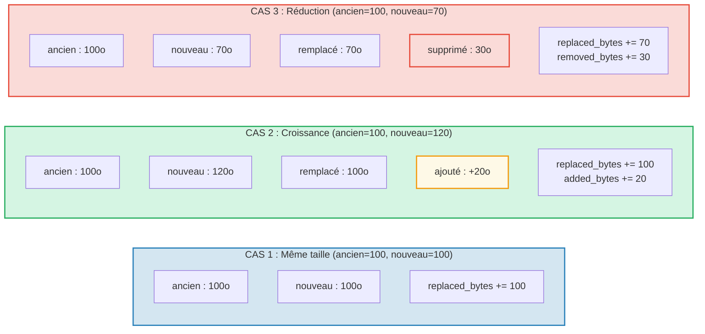

# Le suivi des coûts

## La structure OperationCost

Chaque opération dans GroveDB accumule des coûts, mesurés en ressources de calcul :

```rust
// costs/src/lib.rs
pub struct OperationCost {
    pub seek_count: u32,              // Number of storage seeks
    pub storage_cost: StorageCost,    // Bytes added/replaced/removed
    pub storage_loaded_bytes: u64,    // Bytes read from disk
    pub hash_node_calls: u32,         // Number of Blake3 hash operations
    pub sinsemilla_hash_calls: u32,   // Number of Sinsemilla hash operations (EC ops)
}
```

> Les **appels de hachage Sinsemilla** suivent les opérations de hachage par courbe elliptique pour les ancres du CommitmentTree.
> Ceux-ci sont significativement plus coûteux que les hachages de nœuds Blake3.

Les coûts de stockage se décomposent davantage :

```rust
// costs/src/storage_cost/mod.rs
pub struct StorageCost {
    pub added_bytes: u32,                   // New data written
    pub replaced_bytes: u32,                // Existing data overwritten
    pub removed_bytes: StorageRemovedBytes, // Data freed
}
```

## Le patron CostContext

Toutes les opérations retournent leur résultat enveloppé dans un `CostContext` :

```rust
pub struct CostContext<T> {
    pub value: T,               // The operation result
    pub cost: OperationCost,    // Resources consumed
}

pub type CostResult<T, E> = CostContext<Result<T, E>>;
```

Cela crée un patron de suivi de coûts **monadique** — les coûts circulent à travers les chaînes d'opérations
automatiquement :

```rust
// Unwrap a result, adding its cost to an accumulator
let result = expensive_operation().unwrap_add_cost(&mut total_cost);

// Chain operations, accumulating costs
let final_result = op1()
    .flat_map(|x| op2(x))      // Costs from op1 + op2
    .flat_map(|y| op3(y));      // + costs from op3
```

## La macro cost_return_on_error!

Le patron le plus courant dans le code GroveDB est la macro `cost_return_on_error!`,
qui agit comme `?` mais préserve les coûts lors du retour anticipé :

```rust
macro_rules! cost_return_on_error {
    ( &mut $cost:ident, $($body:tt)+ ) => {
        {
            let result_with_cost = { $($body)+ };
            let result = result_with_cost.unwrap_add_cost(&mut $cost);
            match result {
                Ok(x) => x,
                Err(e) => return Err(e).wrap_with_cost($cost),
            }
        }
    };
}
```

En pratique :

```rust
fn insert_element(&self, path: &[&[u8]], key: &[u8], element: Element) -> CostResult<(), Error> {
    let mut cost = OperationCost::default();

    // Each macro call adds the operation's cost to `cost`
    // and returns the Ok value (or early-returns with accumulated cost on Err)
    let merk = cost_return_on_error!(&mut cost, self.open_merk(path));
    cost_return_on_error!(&mut cost, merk.insert(key, element));
    cost_return_on_error!(&mut cost, self.propagate_changes(path));

    Ok(()).wrap_with_cost(cost)
    // `cost` now contains the sum of all three operations' costs
}
```

## Détail des coûts de stockage

Lorsqu'une valeur est mise à jour, le coût dépend de si la nouvelle valeur est plus grande,
plus petite ou de même taille :



## Coûts des opérations de hachage

Les coûts de hachage sont mesurés en « appels de hachage de nœud » — le nombre de compressions de blocs
Blake3 :

| Opération | Taille d'entrée | Appels de hachage |
|-----------|-----------|------------|
| `value_hash(petit)` | < 64 octets | 1 |
| `value_hash(moyen)` | 64-127 octets | 2 |
| `kv_hash` | clé + value_hash | variable |
| `node_hash` | 96 octets (3 x 32) | 2 (toujours) |
| `combine_hash` | 64 octets (2 x 32) | 1 (toujours) |
| `node_hash_with_count` | 104 octets (3 x 32 + 8) | 2 (toujours) |
| Sinsemilla (CommitmentTree) | opération CE sur courbe Pallas | suivi séparément via `sinsemilla_hash_calls` |

La formule générale pour Blake3 :

```text
hash_calls = 1 + (input_bytes - 1) / 64
```

## Estimation pire cas et cas moyen

GroveDB fournit des fonctions pour **estimer** les coûts des opérations avant de les exécuter.
C'est crucial pour le calcul des frais en blockchain — il faut connaître le coût avant
de s'engager à le payer.

```rust
// Worst-case cost for reading a node
pub fn add_worst_case_get_merk_node(
    cost: &mut OperationCost,
    not_prefixed_key_len: u32,
    max_element_size: u32,
    node_type: NodeType,
) {
    cost.seek_count += 1;  // One disk seek
    cost.storage_loaded_bytes +=
        TreeNode::worst_case_encoded_tree_size(
            not_prefixed_key_len, max_element_size, node_type
        ) as u64;
}

// Worst-case propagation cost
pub fn add_worst_case_merk_propagate(
    cost: &mut OperationCost,
    input: &WorstCaseLayerInformation,
) {
    let levels = match input {
        MaxElementsNumber(n) => ((*n + 1) as f32).log2().ceil() as u32,
        NumberOfLevels(n) => *n,
    };
    let mut nodes_updated = levels;

    // AVL rotations may update additional nodes
    if levels > 2 {
        nodes_updated += 2;  // At most 2 extra nodes for rotations
    }

    cost.storage_cost.replaced_bytes += nodes_updated * MERK_BIGGEST_VALUE_SIZE;
    cost.storage_loaded_bytes +=
        nodes_updated as u64 * (MERK_BIGGEST_VALUE_SIZE + MERK_BIGGEST_KEY_SIZE) as u64;
    cost.seek_count += nodes_updated;
    cost.hash_node_calls += nodes_updated * 2;
}
```

Constantes utilisées :

```rust
pub const MERK_BIGGEST_VALUE_SIZE: u32 = u16::MAX as u32;  // 65535
pub const MERK_BIGGEST_KEY_SIZE: u32 = 256;
```

---
