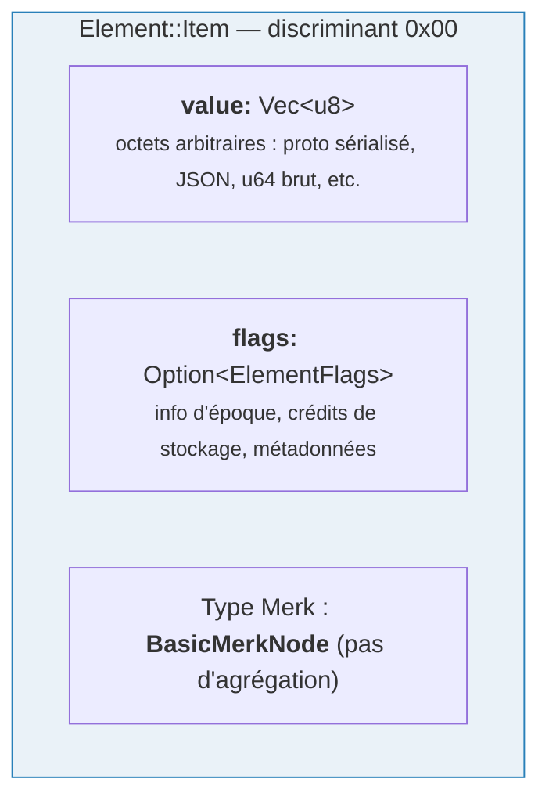
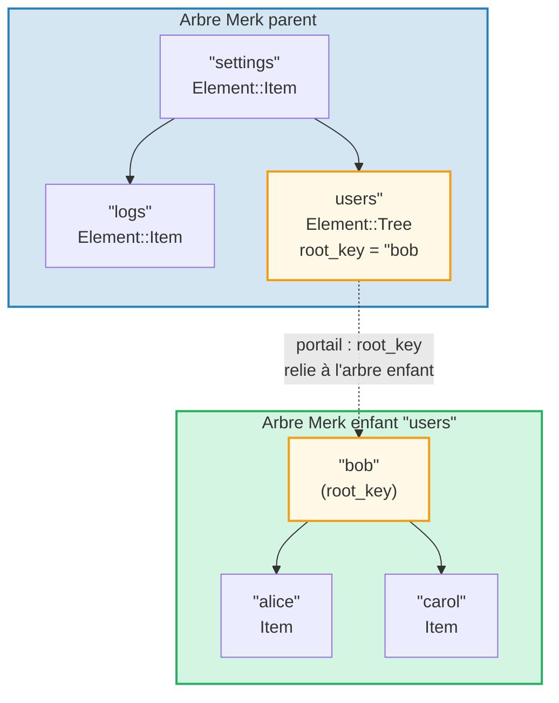
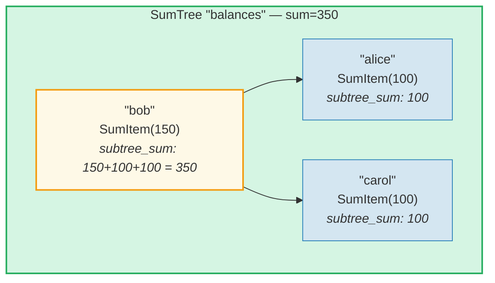
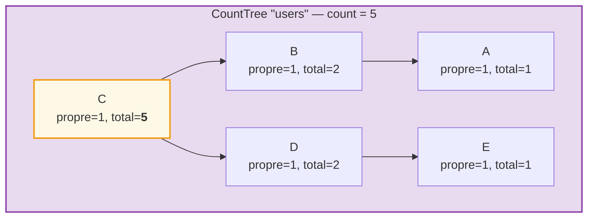
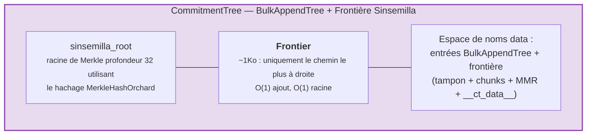

# Le système d'éléments

Alors que Merk traite des paires clé-valeur brutes, GroveDB opère à un niveau supérieur
en utilisant des **éléments** (Elements) — des valeurs typées qui portent une signification sémantique. Chaque valeur stockée
dans GroveDB est un élément.

## L'énumération Element

```rust
// grovedb-element/src/element/mod.rs
pub enum Element {
    Item(Vec<u8>, Option<ElementFlags>),                                    // [0]
    Reference(ReferencePathType, MaxReferenceHop, Option<ElementFlags>),    // [1]
    Tree(Option<Vec<u8>>, Option<ElementFlags>),                           // [2]
    SumItem(SumValue, Option<ElementFlags>),                               // [3]
    SumTree(Option<Vec<u8>>, SumValue, Option<ElementFlags>),              // [4]
    BigSumTree(Option<Vec<u8>>, BigSumValue, Option<ElementFlags>),        // [5]
    CountTree(Option<Vec<u8>>, CountValue, Option<ElementFlags>),          // [6]
    CountSumTree(Option<Vec<u8>>, CountValue, SumValue, Option<ElementFlags>), // [7]
    ProvableCountTree(Option<Vec<u8>>, CountValue, Option<ElementFlags>),  // [8]
    ItemWithSumItem(Vec<u8>, SumValue, Option<ElementFlags>),              // [9]
    ProvableCountSumTree(Option<Vec<u8>>, CountValue, SumValue,
                         Option<ElementFlags>),                            // [10]
    CommitmentTree(u64, u8, Option<ElementFlags>),                         // [11]
    MmrTree(u64, Option<ElementFlags>),                                    // [12]
    BulkAppendTree(u64, u8, Option<ElementFlags>),                         // [13]
    DenseAppendOnlyFixedSizeTree(u16, u8, Option<ElementFlags>),           // [14]
}
```

Les numéros de discriminant (indiqués entre crochets) sont utilisés lors de la sérialisation.

Alias de types utilisés partout :

```rust
pub type ElementFlags = Vec<u8>;        // Arbitrary metadata per element
pub type MaxReferenceHop = Option<u8>;  // Optional hop limit for references
pub type SumValue = i64;                // 64-bit signed sum
pub type BigSumValue = i128;            // 128-bit signed sum
pub type CountValue = u64;              // 64-bit unsigned count
```

## Item — Stockage clé-valeur basique

L'élément le plus simple. Stocke des octets arbitraires :

```rust
Element::Item(value: Vec<u8>, flags: Option<ElementFlags>)
```



Constructeurs :

```rust
Element::new_item(b"hello world".to_vec())
Element::new_item_with_flags(b"data".to_vec(), Some(vec![0x01, 0x02]))
```

Les Items participent à l'agrégation de somme : au sein d'un SumTree, un Item contribue une
somme par défaut de 0. Un SumItem contribue sa valeur explicite.

## Tree — Conteneurs pour les sous-arbres

Un élément Tree est un **portail** vers un autre arbre Merk. Il stocke la clé racine de
l'arbre enfant (le cas échéant) :

```rust
Element::Tree(root_key: Option<Vec<u8>>, flags: Option<ElementFlags>)
```



> L'élément Tree dans le Merk parent stocke le `root_key` de l'arbre Merk enfant. Cela crée un **portail** — un lien d'un arbre Merk vers un autre.

Quand un arbre est vide, `root_key` est `None`. Le constructeur `Element::empty_tree()`
crée `Element::Tree(None, None)`.

## SumItem / SumTree — Sommes agrégées

Un **SumTree** (arbre de somme) maintient automatiquement la somme de toutes les
contributions en somme de ses enfants directs :

```rust
Element::SumTree(root_key: Option<Vec<u8>>, sum: SumValue, flags: Option<ElementFlags>)
Element::SumItem(value: SumValue, flags: Option<ElementFlags>)
```



> **Formule d'agrégation :** `node_sum = own_value + left_child_sum + right_child_sum`
> Bob : 150 + 100 (alice) + 100 (carol) = **350**. La somme racine (350) est stockée dans l'élément SumTree du parent.

La somme est maintenue au niveau Merk via le type de fonctionnalité `TreeFeatureType::SummedMerkNode(i64)`.
Lors de la propagation dans l'arbre, les données agrégées de chaque nœud sont recalculées :

```text
aggregate_sum = own_sum + left_child_sum + right_child_sum
```

## CountTree, CountSumTree, BigSumTree

Types d'arbres agrégés supplémentaires :

| Type d'élément | Type de fonctionnalité Merk | Agrège |
|---|---|---|
| `CountTree` | `CountedMerkNode(u64)` | Nombre d'éléments |
| `CountSumTree` | `CountedSummedMerkNode(u64, i64)` | Compteur et somme |
| `BigSumTree` | `BigSummedMerkNode(i128)` | Somme 128 bits pour grandes valeurs |
| `ProvableCountTree` | `ProvableCountedMerkNode(u64)` | Compteur intégré au hachage |
| `ProvableCountSumTree` | `ProvableCountedSummedMerkNode(u64, i64)` | Compteur dans le hachage + somme |

**ProvableCountTree** est spécial : son compteur est inclus dans le calcul du `node_hash`
(via `node_hash_with_count`), de sorte qu'une preuve peut vérifier le compteur sans
révéler les valeurs.

## Sérialisation des éléments

Les éléments sont sérialisés en utilisant **bincode** avec un ordre d'octets gros-boutiste (big-endian) :

```rust
pub fn serialize(&self, grove_version: &GroveVersion) -> Result<Vec<u8>, ElementError> {
    let config = config::standard().with_big_endian().with_no_limit();
    bincode::encode_to_vec(self, config)
}
```

Le premier octet est le **discriminant**, permettant une détection de type en O(1) :

```rust
pub fn from_serialized_value(value: &[u8]) -> Option<ElementType> {
    match value.first()? {
        0 => Some(ElementType::Item),
        1 => Some(ElementType::Reference),
        2 => Some(ElementType::Tree),
        3 => Some(ElementType::SumItem),
        // ... etc
    }
}
```

## TreeFeatureType et flux de données agrégées

L'énumération `TreeFeatureType` fait le pont entre les éléments GroveDB et les nœuds Merk :

```rust
pub enum TreeFeatureType {
    BasicMerkNode,                              // No aggregation
    SummedMerkNode(i64),                       // Sum aggregation
    BigSummedMerkNode(i128),                   // Large sum
    CountedMerkNode(u64),                      // Count
    CountedSummedMerkNode(u64, i64),           // Count + sum
    ProvableCountedMerkNode(u64),              // Count in hash
    ProvableCountedSummedMerkNode(u64, i64),   // Count in hash + sum
}
```

Les données agrégées circulent vers le **haut** à travers l'arbre :



> **Table d'agrégation :** L'agrégat de chaque nœud = propre(1) + agrégat_gauche + agrégat_droit
>
> | Nœud | propre | agg_gauche | agg_droit | total |
> |------|-----|----------|-----------|-------|
> | A | 1 | 0 | 0 | 1 |
> | B | 1 | 1 (A) | 0 | 2 |
> | E | 1 | 0 | 0 | 1 |
> | D | 1 | 0 | 1 (E) | 2 |
> | C | 1 | 2 (B) | 2 (D) | **5** (racine) |

Le compteur stocké à chaque nœud représente le total dans le
sous-arbre enraciné à ce nœud, y compris lui-même. Le compteur du nœud racine est le total
pour l'arbre entier.

L'énumération `AggregateData` transporte cela à travers le système de liens :

```rust
pub enum AggregateData {
    NoAggregateData,
    Sum(i64),
    BigSum(i128),
    Count(u64),
    CountAndSum(u64, i64),
    ProvableCount(u64),
    ProvableCountAndSum(u64, i64),
}
```

## CommitmentTree — Arbre d'engagement Sinsemilla

Un **CommitmentTree** fournit un arbre de Merkle Sinsemilla de profondeur 32 pour le suivi
des ancres d'engagement de notes, tel qu'utilisé dans le protocole blindé Orchard de Zcash. Il enveloppe
`incrementalmerkletree::Frontier<MerkleHashOrchard, 32>` pour un ajout en O(1) et
un calcul de racine :

```rust
Element::CommitmentTree(
    total_count: u64,               // Number of commitments appended
    chunk_power: u8,                // BulkAppendTree compaction size (chunk_size = 2^chunk_power)
    flags: Option<ElementFlags>,
)                                   // discriminant [11]
```

> **Note :** Le hachage racine de la frontière Sinsemilla n'est PAS stocké dans l'élément.
> Il est persisté dans le stockage de données et circule via le mécanisme de hachage enfant Merk
> (paramètre `subtree_root_hash` de `insert_subtree`). Tout changement de la frontière
> se propage automatiquement vers le haut à travers la hiérarchie Merk de GroveDB.



**Architecture :**
- La *frontière* (chemin le plus à droite de l'arbre de Merkle, taille constante d'environ 1 Ko) est
  stockée dans l'**espace de noms data**, identifiée par `COMMITMENT_TREE_DATA_KEY`
- Les données réelles des notes (`cmx || ciphertext`) sont stockées via un **BulkAppendTree**
  dans l'**espace de noms data** — compactées en chunks, récupérables par position
- Les ancres historiques sont suivies par Platform dans un arbre prouvable séparé
- La racine Sinsemilla n'est PAS stockée dans l'élément — elle circule comme le hachage
  enfant Merk à travers la hiérarchie de hachage de GroveDB

**Opérations :**
- `commitment_tree_insert(path, key, cmx, ciphertext, tx)` — Ajout typé
  acceptant `TransmittedNoteCiphertext<M>` ; retourne `(new_root, position)`
- `commitment_tree_anchor(path, key, tx)` — Obtenir l'Anchor Orchard actuel
- `commitment_tree_get_value(path, key, position, tx)` — Récupérer une valeur par position
- `commitment_tree_count(path, key, tx)` — Obtenir le nombre total d'éléments

**Générique MemoSize :** `CommitmentTree<S, M: MemoSize = DashMemo>` valide que
les charges utiles de texte chiffré correspondent à la taille attendue pour `M`. Pour Dash (mémos de 36 octets) :
`epk_bytes (32) + enc_ciphertext (104) + out_ciphertext (80) = 216 octets`.

**Suivi des coûts :** Les opérations de hachage Sinsemilla sont suivies via
`cost.sinsemilla_hash_calls`. Le calcul de la racine traverse toujours 32 niveaux.
Les fusions d'ommers se propagent via `trailing_ones()` de la position précédente.
Les opérations BulkAppendTree ajoutent des coûts de hachage Blake3.

## MmrTree — Plage de montagnes de Merkle

Un **MmrTree** stocke des données dans une plage de montagnes de Merkle (Merkle Mountain Range, MMR) en ajout seulement, utilisant
le hachage Blake3. Les nœuds MMR sont stockés dans la colonne **data** (même que les nœuds Merk),
pas dans un sous-arbre Merk enfant. Voir le **[chapitre 13](#chapter-13-the-mmr-tree--append-only-authenticated-logs)**
pour une plongée approfondie sur le fonctionnement des MMR, leur remplissage, la génération
et vérification des preuves, et l'intégration de MmrTree avec GroveDB.

```rust
Element::MmrTree(
    mmr_size: u64,                  // Internal MMR size (nodes, not leaves)
    flags: Option<ElementFlags>,
)                                   // discriminant [12]
```

> **Note :** Le hachage racine MMR n'est PAS stocké dans l'élément. Il circule comme le hachage
> enfant Merk via le paramètre `subtree_root_hash` de `insert_subtree`.

**Opérations :** `mmr_tree_append`, `mmr_tree_root_hash`, `mmr_tree_get_value`,
`mmr_tree_leaf_count`. **Preuves :** Preuves V1 (voir paragraphes 9.6 et 13.9).

## BulkAppendTree — Structure d'ajout seulement à deux niveaux

Un **BulkAppendTree** combine un tampon d'arbre de Merkle dense avec un MMR au niveau des chunks
pour des ajouts efficaces à haut débit avec des requêtes de plage prouvables. C'est un
arbre non-Merk — les données résident dans l'espace de noms **data**, pas dans un sous-arbre Merk enfant.
Voir le **[chapitre 14](#chapter-14-the-bulkappendtree--high-throughput-append-only-storage)**
pour une plongée approfondie sur l'architecture à deux niveaux, la compaction des chunks,
la génération de preuves, la vérification et l'intégration avec GroveDB.

```rust
Element::BulkAppendTree(
    total_count: u64,               // Total values appended
    chunk_power: u8,                // Dense tree height (buffer capacity = 2^chunk_power - 1)
    flags: Option<ElementFlags>,
)                                   // discriminant [13]
```

> **Note :** La racine d'état (`blake3("bulk_state" || mmr_root || dense_tree_root)`)
> n'est PAS stockée dans l'élément. Elle circule comme le hachage enfant Merk via
> le paramètre `subtree_root_hash` de `insert_subtree`.

**Opérations :** `bulk_append`, `bulk_get_value`, `bulk_get_chunk`,
`bulk_get_buffer`, `bulk_count`, `bulk_chunk_count`.
**Preuves :** Preuves V1 de plage (voir paragraphes 9.6 et 14.10).

## DenseAppendOnlyFixedSizeTree — Stockage dense de capacité fixe

Un **DenseAppendOnlyFixedSizeTree** est un arbre binaire complet de hauteur fixe *h*
où chaque nœud (interne et feuille) stocke une valeur de données. Les positions sont remplies
en ordre de niveau (BFS). Le hachage racine est recalculé à la volée — aucun hachage
intermédiaire n'est persisté. Voir le **[chapitre 16](#chapter-16-the-denseappendonlyfixedsizetree--dense-fixed-capacity-merkle-storage)**
pour la plongée complète.

```rust
Element::DenseAppendOnlyFixedSizeTree(
    count: u16,                     // Number of values stored (max 65,535)
    height: u8,                     // Tree height (1..=16, immutable), capacity = 2^h - 1
    flags: Option<ElementFlags>,
)                                   // discriminant [14]
```

> **Note :** Le hachage racine n'est PAS stocké dans l'élément — il est recalculé à
> la volée et circule comme le hachage enfant Merk. Le champ `count` est `u16` (pas u64),
> limitant les arbres à 65 535 positions. Les hauteurs sont restreintes à 1..=16.

**Opérations :** `dense_tree_insert`, `dense_tree_get`, `dense_tree_root_hash`,
`dense_tree_count`.
**Preuves :** Au niveau de l'élément uniquement (pas encore de preuves de sous-requête).

## Arbres non-Merk — Patrons communs

CommitmentTree, MmrTree, BulkAppendTree et DenseAppendOnlyFixedSizeTree partagent un patron architectural
commun qui les distingue des types d'arbres basés sur Merk (Tree, SumTree,
CountTree, etc.) :

| Propriété | Arbres basés sur Merk | Arbres non-Merk |
|----------|-----------------|-------------------|
| Sous-arbre Merk enfant | Oui (`root_key = Some(...)`) | Non (pas de champ root_key) |
| Stockage des données | Paires clé-valeur Merk | Blobs de la colonne data (clés non-Merk) |
| Liaison du hachage racine | `combine_hash(elem_hash, child_root_hash)` | `combine_hash(elem_hash, type_specific_root)` |
| Racine spécifique au type | Maintenue par Merk AVL | Circule comme hachage enfant Merk (PAS dans les octets de l'élément) |
| Format de preuve | V0 (Merk couche par couche) | V1 (preuve spécifique au type) |
| TreeFeatureType | BasicMerkNode (pas d'agrégation) | BasicMerkNode |

> **Note sur la colonne de stockage :** Les quatre types d'arbres non-Merk (MmrTree,
> CommitmentTree, BulkAppendTree, DenseAppendOnlyFixedSizeTree) stockent leurs
> données dans la colonne **data** en utilisant des clés non-Merk. CommitmentTree stocke sa
> frontière Sinsemilla à côté des entrées BulkAppendTree dans la même colonne **data**
> (clé `b"__ct_data__"`).

La racine spécifique au type (racine sinsemilla, racine MMR, racine d'état, ou hachage racine de l'arbre dense) n'est
PAS stockée dans l'élément. Au lieu de cela, elle circule comme le **hachage enfant** Merk via
le paramètre `subtree_root_hash` de `insert_subtree`. Le combined_value_hash Merk
devient `combine_hash(value_hash(element_bytes), type_specific_root)`.
Tout changement de la racine spécifique au type modifie le hachage enfant, qui modifie
le combined_value_hash, qui se propage vers le haut à travers la hiérarchie de hachage
de GroveDB — maintenant l'intégrité cryptographique.

---
