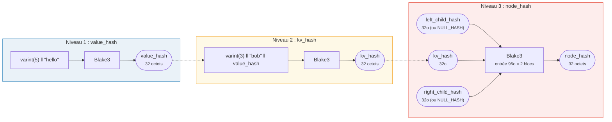
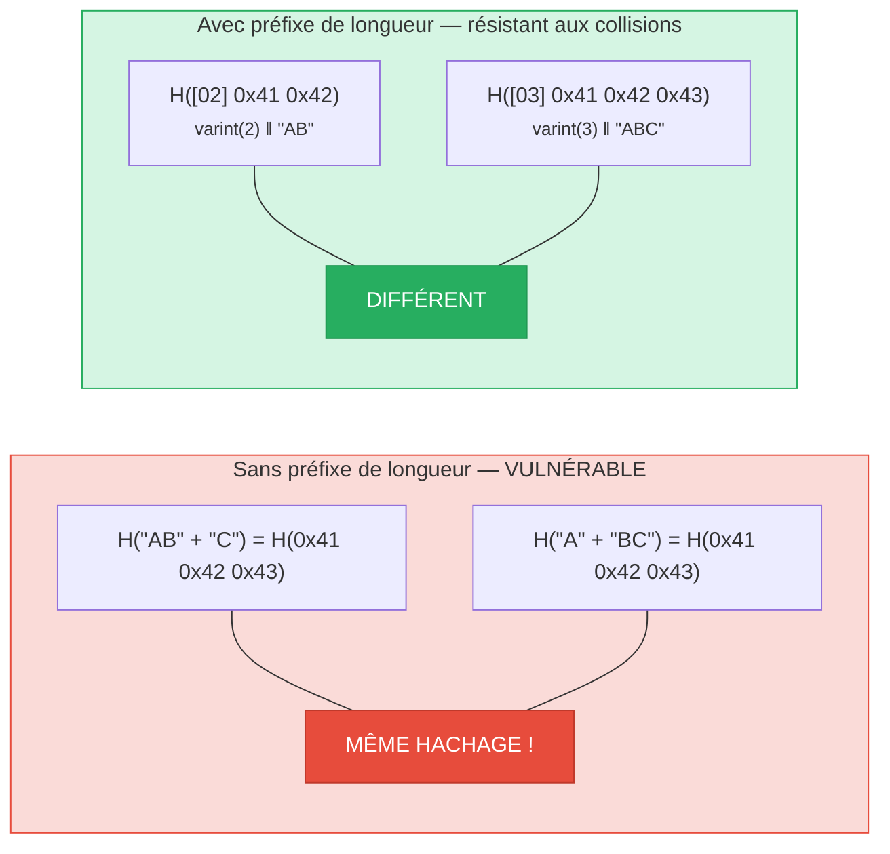
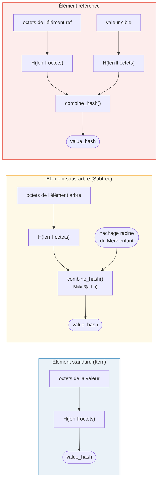

# Le hachage — Intégrité cryptographique

Chaque nœud d'un arbre Merk est haché pour produire un **hachage racine** (root hash) — une seule valeur de 32 octets
qui authentifie l'arbre entier. Tout changement dans une clé, une valeur, ou
une relation structurelle produira un hachage racine différent.

## Hiérarchie de hachage à trois niveaux

Merk utilise un schéma de hachage à trois niveaux, du plus interne au plus externe :

Exemple : key = `"bob"` (3 octets), value = `"hello"` (5 octets) :



> La RACINE de l'arbre = `node_hash` du nœud racine — authentifie **chaque** clé, valeur et relation structurelle. Les enfants manquants utilisent `NULL_HASH = [0x00; 32]`.

### Niveau 1 : value_hash

```rust
// merk/src/tree/hash.rs
pub fn value_hash(value: &[u8]) -> CostContext<CryptoHash> {
    let mut hasher = blake3::Hasher::new();
    let val_length = value.len().encode_var_vec();  // Varint encoding
    hasher.update(val_length.as_slice());
    hasher.update(value);
    // ...
}
```

La longueur de la valeur est **encodée en varint** et préfixée. Ceci est crucial pour la
résistance aux collisions — sans cela, `H("AB" || "C")` serait égal à `H("A" || "BC")`.

### Niveau 2 : kv_hash

```rust
pub fn kv_hash(key: &[u8], value: &[u8]) -> CostContext<CryptoHash> {
    let mut hasher = blake3::Hasher::new();
    let key_length = key.len().encode_var_vec();
    hasher.update(key_length.as_slice());
    hasher.update(key);
    let vh = value_hash(value);
    hasher.update(vh.as_slice());  // Nested hash
    // ...
}
```

Cela lie la clé à la valeur. Pour la vérification des preuves, il existe aussi une variante
qui prend un value_hash pré-calculé :

```rust
pub fn kv_digest_to_kv_hash(key: &[u8], value_hash: &CryptoHash) -> CostContext<CryptoHash>
```

Celle-ci est utilisée lorsque le vérificateur possède déjà le value_hash (par ex. pour les sous-arbres
où value_hash est un hachage combiné).

### Niveau 3 : node_hash

```rust
pub fn node_hash(
    kv: &CryptoHash,
    left: &CryptoHash,
    right: &CryptoHash,
) -> CostContext<CryptoHash> {
    let mut hasher = blake3::Hasher::new();
    hasher.update(kv);       // 32 bytes
    hasher.update(left);     // 32 bytes
    hasher.update(right);    // 32 bytes — total 96 bytes
    // Always exactly 2 hash operations (96 bytes / 64-byte block = 2)
}
```

Si un enfant est absent, son hachage est le **NULL_HASH** — 32 octets à zéro :

```rust
pub const NULL_HASH: CryptoHash = [0; HASH_LENGTH];  // [0u8; 32]
```

## Blake3 comme fonction de hachage

GroveDB utilise **Blake3** pour tous les hachages. Propriétés clés :

- **Sortie de 256 bits** (32 octets)
- **Taille de bloc** : 64 octets
- **Vitesse** : environ 3 fois plus rapide que SHA-256 sur le matériel moderne
- **Flux** : peut alimenter les données de manière incrémentale

Le coût de l'opération de hachage est calculé en fonction du nombre de blocs de 64 octets
traités :

```rust
let hashes = 1 + (hasher.count() - 1) / 64;  // Number of hash operations
```

## Encodage par préfixe de longueur pour la résistance aux collisions

Chaque entrée de longueur variable est préfixée avec sa longueur en utilisant l'**encodage varint** :



> **Entrée de value_hash** : `[varint(value.len)] [octets de la valeur]`
> **Entrée de kv_hash** : `[varint(key.len)] [octets de la clé] [value_hash : 32 octets]`

Sans préfixes de longueur, un attaquant pourrait fabriquer différentes paires clé-valeur qui
produisent le même condensat. Le préfixe de longueur rend cela cryptographiquement
infaisable.

## Hachage combiné pour les éléments spéciaux

Pour les **sous-arbres** et les **références**, le `value_hash` n'est pas simplement `H(value)`.
C'est plutôt un **hachage combiné** qui lie l'élément à sa cible :



> **Sous-arbre :** lie le hachage racine du Merk enfant dans le parent. **Référence :** lie à la fois le chemin de la référence ET la valeur cible. Modifier l'un ou l'autre change le hachage racine.

La fonction `combine_hash` :

```rust
pub fn combine_hash(hash_one: &CryptoHash, hash_two: &CryptoHash) -> CostContext<CryptoHash> {
    let mut hasher = blake3::Hasher::new();
    hasher.update(hash_one);   // 32 bytes
    hasher.update(hash_two);   // 32 bytes — total 64 bytes, exactly 1 hash op
    // ...
}
```

C'est ce qui permet à GroveDB d'authentifier toute la hiérarchie à travers un seul
hachage racine — le value_hash de chaque arbre parent pour un élément sous-arbre inclut le
hachage racine de l'arbre enfant.

## Hachage agrégé pour ProvableCountTree

Les nœuds `ProvableCountTree` incluent le compteur agrégé dans le hachage du nœud :

```rust
pub fn node_hash_with_count(
    kv: &CryptoHash,
    left: &CryptoHash,
    right: &CryptoHash,
    count: u64,
) -> CostContext<CryptoHash> {
    let mut hasher = blake3::Hasher::new();
    hasher.update(kv);                        // 32 bytes
    hasher.update(left);                      // 32 bytes
    hasher.update(right);                     // 32 bytes
    hasher.update(&count.to_be_bytes());      // 8 bytes — total 104 bytes
    // Still exactly 2 hash ops (104 < 128 = 2 × 64)
}
```

Cela signifie qu'une preuve de comptage ne nécessite pas de révéler les données réelles — le compteur
est intégré dans l'engagement cryptographique.

---
