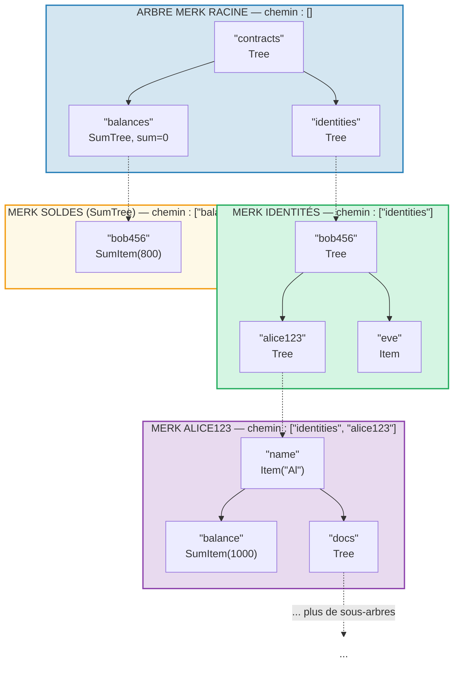
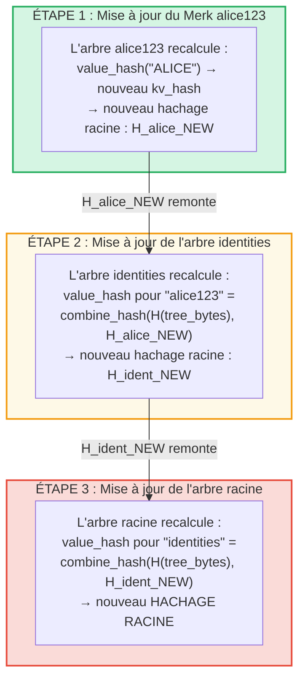
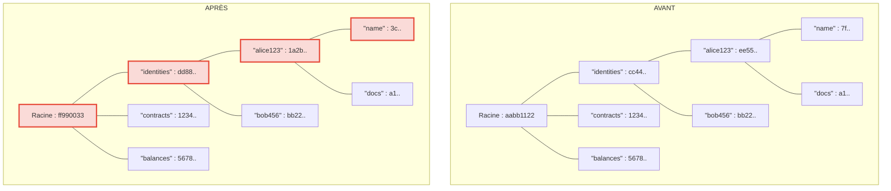
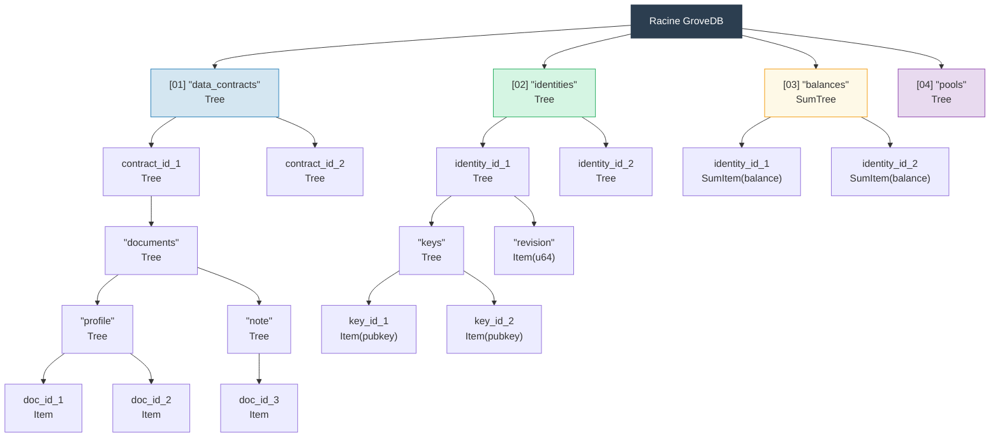

# Le bosquet hiérarchique — Arbre d'arbres

## Comment les sous-arbres s'imbriquent dans les arbres parents

La caractéristique distinctive de GroveDB est qu'un arbre Merk peut contenir des éléments qui sont
eux-mêmes des arbres Merk. Cela crée un **espace de noms hiérarchique** :



> Chaque boîte colorée est un arbre Merk distinct. Les flèches en pointillés représentent les liens portail des éléments Tree vers leurs arbres Merk enfants. Le chemin vers chaque Merk est indiqué dans son étiquette.

## Système d'adressage par chemin

Chaque élément dans GroveDB est adressé par un **chemin** (path) — une séquence de chaînes d'octets
qui navigue depuis la racine à travers les sous-arbres jusqu'à la clé cible :

```text
    Chemin : ["identities", "alice123", "name"]

    Étape 1 : Dans l'arbre racine, chercher "identities" → élément Tree
    Étape 2 : Ouvrir le sous-arbre identities, chercher "alice123" → élément Tree
    Étape 3 : Ouvrir le sous-arbre alice123, chercher "name" → Item("Alice")
```

Les chemins sont représentés comme `Vec<Vec<u8>>` ou en utilisant le type `SubtreePath` pour
une manipulation efficace sans allocation :

```rust
// The path to the element (all segments except the last)
let path: &[&[u8]] = &[b"identities", b"alice123"];
// The key within the final subtree
let key: &[u8] = b"name";
```

## Génération de préfixes Blake3 pour l'isolation du stockage

Chaque sous-arbre dans GroveDB obtient son propre **espace de noms de stockage isolé** dans RocksDB.
L'espace de noms est déterminé par le hachage du chemin avec Blake3 :

```rust
pub type SubtreePrefix = [u8; 32];

// The prefix is computed by hashing the path segments
// storage/src/rocksdb_storage/storage.rs
```

Par exemple :

```text
    Chemin : ["identities", "alice123"]
    Préfixe : Blake3(["identities", "alice123"]) = [0xab, 0x3f, ...]  (32 octets)

    Dans RocksDB, les clés de ce sous-arbre sont stockées comme :
    [préfixe : 32 octets][clé_originale]

    Donc "name" dans ce sous-arbre devient :
    [0xab, 0x3f, ...][0x6e, 0x61, 0x6d, 0x65]  ("name")
```

Cela garantit :
- Aucune collision de clés entre sous-arbres (préfixe de 32 octets = isolation sur 256 bits)
- Calcul de préfixe efficace (un seul hachage Blake3 sur les octets du chemin)
- Les données du sous-arbre sont colocalisées dans RocksDB pour l'efficacité du cache

## Propagation du hachage racine à travers la hiérarchie

Lorsqu'une valeur change en profondeur dans le bosquet, le changement doit se **propager vers le haut** pour
mettre à jour le hachage racine :

```text
    Changement : Mettre à jour "name" en "ALICE" dans identities/alice123/

    Étape 1 : Mettre à jour la valeur dans l'arbre Merk d'alice123
            → l'arbre alice123 obtient un nouveau hachage racine : H_alice_new

    Étape 2 : Mettre à jour l'élément "alice123" dans l'arbre identities
            → le value_hash de l'arbre identities pour "alice123" =
              combine_hash(H(tree_element_bytes), H_alice_new)
            → l'arbre identities obtient un nouveau hachage racine : H_ident_new

    Étape 3 : Mettre à jour l'élément "identities" dans l'arbre racine
            → le value_hash de l'arbre racine pour "identities" =
              combine_hash(H(tree_element_bytes), H_ident_new)
            → LE HACHAGE RACINE change
```



**Avant vs Après** — les nœuds modifiés sont marqués en rouge :



> Seuls les nœuds sur le chemin de la valeur modifiée jusqu'à la racine sont recalculés. Les frères et les autres branches restent inchangés.

La propagation est implémentée par `propagate_changes_with_transaction`, qui remonte
le chemin depuis le sous-arbre modifié jusqu'à la racine, en mettant à jour le hachage de chaque élément parent
en cours de route.

## Exemple de structure de bosquet multi-niveaux

Voici un exemple complet montrant comment Dash Platform structure son état :



Chaque boîte est un arbre Merk distinct, authentifié jusqu'à un unique hachage racine
sur lequel les validateurs s'accordent.

---
