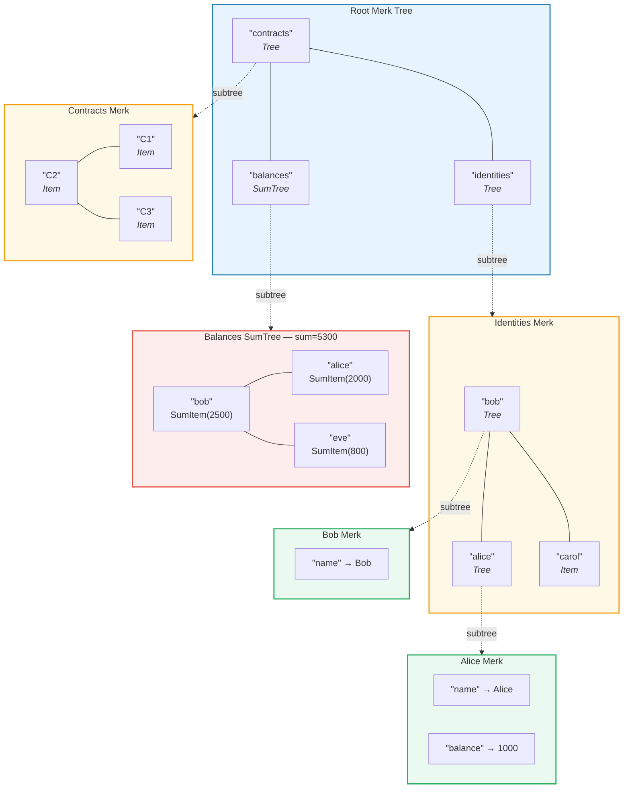
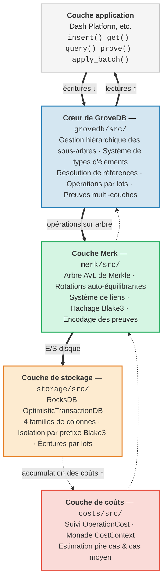

# Introduction — Qu'est-ce que GroveDB ?

## L'idée fondamentale

GroveDB est une **structure de données authentifiée hiérarchique** — essentiellement un *bosquet*
(arbre d'arbres) construit sur des arbres AVL de Merkle (Merkle AVL trees). Chaque nœud dans la base de données fait partie d'un
arbre authentifié cryptographiquement, et chaque arbre peut contenir d'autres arbres en tant
qu'enfants, formant une hiérarchie profonde d'états vérifiables.

> Chaque boîte colorée est un **arbre Merk distinct**. Les flèches en pointillés montrent la relation de sous-arbre — un élément Tree dans le parent contient la clé racine du Merk enfant.

Dans une base de données traditionnelle, on stockerait les données dans un magasin clé-valeur plat avec
un seul arbre de Merkle (Merkle tree) au sommet pour l'authentification. GroveDB adopte une approche différente :
il imbrique des arbres de Merkle à l'intérieur d'autres arbres de Merkle. Cela vous donne :

1. **Des index secondaires efficaces** — interrogation par n'importe quel chemin, pas seulement par clé primaire
2. **Des preuves cryptographiques compactes** — prouver l'existence (ou l'absence) de toute donnée
3. **Des données agrégées** — les arbres peuvent automatiquement additionner, compter, ou autrement agréger
   leurs enfants
4. **Des opérations atomiques inter-arbres** — les opérations par lots s'étendent sur plusieurs sous-arbres

## Pourquoi GroveDB existe

GroveDB a été conçu pour **Dash Platform**, une plateforme d'applications décentralisées
où chaque élément d'état doit être :

- **Authentifié** : N'importe quel nœud peut prouver n'importe quel élément d'état à un client léger
- **Déterministe** : Chaque nœud calcule exactement la même racine d'état
- **Efficace** : Les opérations doivent se terminer dans les contraintes de temps de bloc
- **Interrogeable** : Les applications nécessitent des requêtes riches, pas seulement des recherches par clé

Les approches traditionnelles sont insuffisantes :

| Approche | Problème |
|----------|---------|
| Arbre de Merkle simple | Ne supporte que les recherches par clé, pas les requêtes par plage |
| MPT d'Ethereum | Rééquilibrage coûteux, preuves de grande taille |
| Clé-valeur plat + arbre unique | Pas de requêtes hiérarchiques, une seule preuve couvre tout |
| Arbre B | Pas naturellement « merklisé », authentification complexe |

GroveDB résout ces problèmes en combinant les **garanties d'équilibre éprouvées des arbres AVL**
avec l'**imbrication hiérarchique** et un **système de types d'éléments riche**.

## Vue d'ensemble de l'architecture

GroveDB est organisé en couches distinctes, chacune avec une responsabilité claire :

Les données circulent vers le **bas** à travers ces couches lors des écritures et vers le **haut** lors des lectures.
Chaque opération accumule des coûts en traversant la pile, permettant une comptabilisation
précise des ressources.

---
