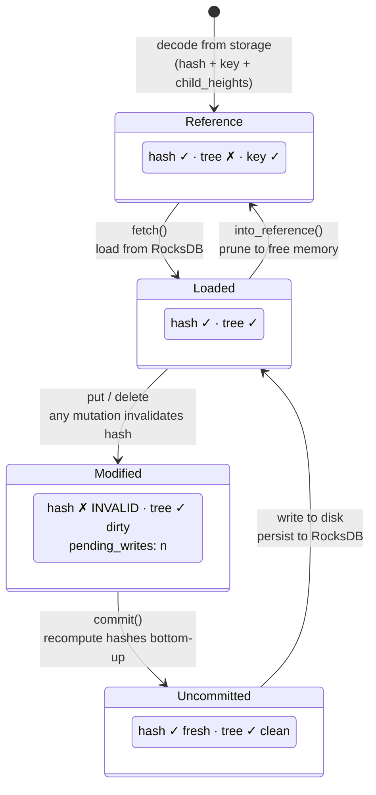
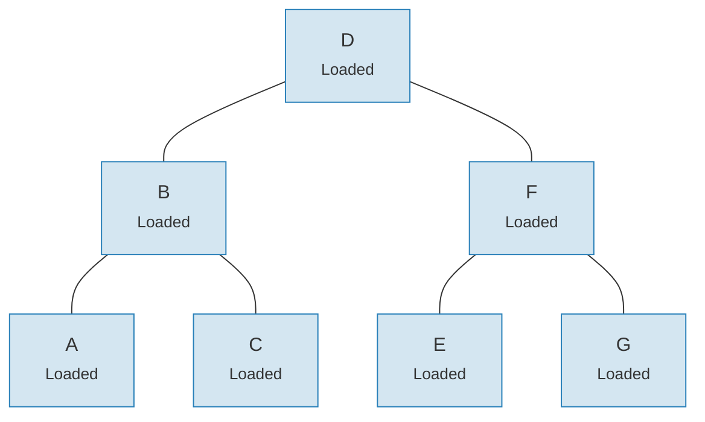
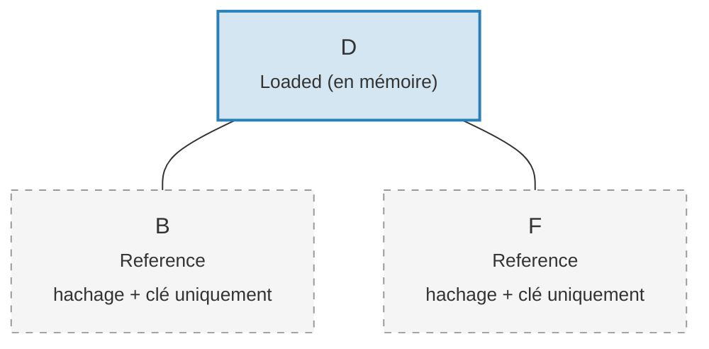

# Le système de liens — Architecture de chargement paresseux

Charger un arbre Merk entier en mémoire serait prohibitivement coûteux pour les grands
arbres. Le système de liens (Link system) résout cela en représentant les connexions enfants dans quatre
états possibles, permettant le **chargement paresseux** (lazy loading) — les enfants ne sont récupérés du stockage que
lorsqu'ils sont réellement nécessaires.

## Quatre états de lien

```rust
// merk/src/tree/link.rs
pub enum Link {
    Reference {                    // Pruned: only metadata, no tree in memory
        hash: CryptoHash,
        child_heights: (u8, u8),
        key: Vec<u8>,
        aggregate_data: AggregateData,
    },
    Modified {                     // Recently changed, hash not yet computed
        pending_writes: usize,
        child_heights: (u8, u8),
        tree: TreeNode,
    },
    Uncommitted {                  // Hashed but not yet persisted to storage
        hash: CryptoHash,
        child_heights: (u8, u8),
        tree: TreeNode,
        aggregate_data: AggregateData,
    },
    Loaded {                       // Fully loaded from storage
        hash: CryptoHash,
        child_heights: (u8, u8),
        tree: TreeNode,
        aggregate_data: AggregateData,
    },
}
```

## Diagramme de transition d'état



## Ce que chaque état stocke

| État | Hachage ? | Arbre en mémoire ? | Objectif |
|-------|-------|-----------------|---------|
| **Reference** | Oui | Non | Représentation compacte sur disque. Stocke uniquement clé, hachage, hauteurs des enfants et données agrégées. |
| **Modified** | Non | Oui | Après toute mutation. Compte les `pending_writes` pour l'optimisation des lots. |
| **Uncommitted** | Oui | Oui | Après le calcul du hachage mais avant l'écriture en stockage. État intermédiaire pendant le commit. |
| **Loaded** | Oui | Oui | Entièrement matérialisé. Prêt pour les lectures ou d'autres modifications. |

Le champ `pending_writes` dans `Modified` est notable :

```rust
// Computed as: 1 + left_pending_writes + right_pending_writes
pending_writes: 1 + tree.child_pending_writes(true)
                  + tree.child_pending_writes(false),
```

Ce compteur aide la phase de commit à décider comment ordonner les écritures pour des performances
optimales.

## Le patron de rappel Fetch

Le système de liens utilise un **trait Fetch** pour abstraire le chargement des nœuds enfants :

```rust
pub trait Fetch {
    fn fetch(
        &self,
        link: &Link,
        value_defined_cost_fn: Option<&impl Fn(&[u8], &GroveVersion) -> Option<ValueDefinedCostType>>,
        grove_version: &GroveVersion,
    ) -> CostResult<TreeNode, Error>;
}
```

Différentes implémentations de fetch servent différents objectifs :

- **StorageFetch** : Charge depuis RocksDB (le chemin normal)
- **PanicSource** : Utilisé dans les tests où le chargement ne devrait jamais se produire
- **MockSource** : Retourne des données de test contrôlées

Ce patron permet aux opérations d'arbre d'être **indépendantes du stockage** — la même
logique d'équilibrage et de mutation fonctionne quelle que soit la provenance des données.

## Le patron Walker

Le `Walker` enveloppe un `TreeNode` avec une source `Fetch`, fournissant un parcours d'arbre
sûr avec chargement paresseux automatique (`merk/src/tree/walk/mod.rs`) :

```rust
pub struct Walker<S: Fetch + Sized + Clone> {
    tree: Owner<TreeNode>,
    source: S,
}
```

Le Walker fournit trois opérations clés :

**walk()** — Détacher un enfant, le transformer, et le rattacher :

```rust
pub fn walk<F, T>(self, left: bool, f: F, ...) -> CostResult<Self, Error>
where
    F: FnOnce(Option<Self>) -> CostResult<Option<T>, Error>,
    T: Into<TreeNode>,
```

**detach()** — Retirer un enfant, en le chargeant depuis le stockage si nécessaire :

```rust
pub fn detach(self, left: bool, ...) -> CostResult<(Self, Option<Self>), Error>
```

Si l'enfant est un `Link::Reference` (élagué), detach appellera `fetch()` pour le charger
d'abord. Si l'enfant est déjà en mémoire (`Modified`, `Uncommitted`, `Loaded`),
il en prend simplement la propriété.

**attach()** — Connecter un enfant à un parent :

```rust
pub fn attach(self, left: bool, maybe_child: Option<Self>) -> Self
```

L'attachement crée toujours un `Link::Modified` puisque la relation parent-enfant
a changé.

## Efficacité mémoire par élagage

Après la validation des modifications, l'arbre peut **élaguer** les sous-arbres chargés pour revenir à
`Link::Reference`, libérant la mémoire tout en conservant le hachage nécessaire pour la
génération de preuves :

**Avant l'élagage** — les 7 nœuds sont en mémoire :



**Après l'élagage** — seule la racine reste en mémoire, les enfants sont `Link::Reference` (uniquement hachage + clé) :



> **Link::Loaded** contient `hash + child_heights + tree (TreeNode)`. **Link::Reference** contient uniquement `hash + child_heights + key` — le TreeNode est libéré de la mémoire.

La transformation est simple :

```rust
pub fn into_reference(self) -> Link {
    Link::Reference {
        hash: self.hash(),
        child_heights: self.child_heights(),
        key: self.key().to_vec(),
        aggregate_data: self.aggregate_data(),
    }
}
```

Ceci est crucial pour maintenir une utilisation mémoire bornée dans les grands arbres — seuls les nœuds
activement consultés doivent être en mémoire.

---
