# L'arbre Merk — Un arbre AVL de Merkle

L'arbre Merk est la brique fondamentale de GroveDB. Chaque sous-arbre dans le
bosquet est un arbre Merk — un arbre binaire de recherche auto-équilibrant où chaque nœud est
haché cryptographiquement, produisant un unique hachage racine (root hash) qui authentifie le
contenu entier de l'arbre.

## Qu'est-ce qu'un nœud Merk ?

Contrairement à de nombreuses implémentations d'arbres de Merkle où les données ne résident qu'aux feuilles, dans un
arbre Merk **chaque nœud stocke une paire clé-valeur**. Cela signifie qu'il n'y a pas de nœuds
internes « vides » — l'arbre est à la fois une structure de recherche et un magasin de données simultanément.

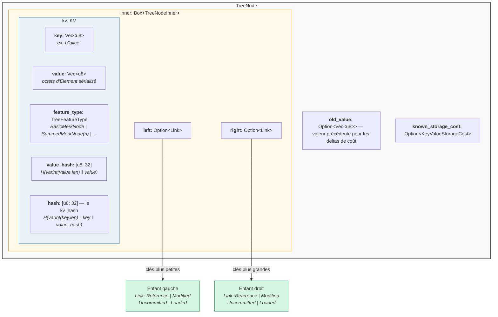

Dans le code (`merk/src/tree/mod.rs`) :

```rust
pub struct TreeNode {
    pub(crate) inner: Box<TreeNodeInner>,
    pub(crate) old_value: Option<Vec<u8>>,        // Previous value for cost tracking
    pub(crate) known_storage_cost: Option<KeyValueStorageCost>,
}

pub struct TreeNodeInner {
    pub(crate) left: Option<Link>,    // Left child (smaller keys)
    pub(crate) right: Option<Link>,   // Right child (larger keys)
    pub(crate) kv: KV,               // The key-value payload
}
```

Le `Box<TreeNodeInner>` conserve le nœud sur le tas (heap), ce qui est essentiel puisque les
liens enfants peuvent contenir récursivement des instances complètes de `TreeNode`.

## La structure KV

La structure `KV` contient à la fois les données brutes et leurs condensats cryptographiques
(`merk/src/tree/kv.rs`) :

```rust
pub struct KV {
    pub(super) key: Vec<u8>,                        // The lookup key
    pub(super) value: Vec<u8>,                      // The stored value
    pub(super) feature_type: TreeFeatureType,       // Aggregation behavior
    pub(crate) value_defined_cost: Option<ValueDefinedCostType>,
    pub(super) hash: CryptoHash,                    // kv_hash
    pub(super) value_hash: CryptoHash,              // H(value)
}
```

Deux points importants :

1. **Les clés ne sont pas stockées sur le disque en tant que partie du nœud encodé.** Elles sont stockées comme
   clé RocksDB. Lorsqu'un nœud est décodé depuis le stockage, la clé est injectée de
   l'extérieur. Cela évite de dupliquer les octets de la clé.

2. **Deux champs de hachage sont maintenus.** Le `value_hash` est `H(value)` et le
   `hash` (kv_hash) est `H(key, value_hash)`. Conserver les deux permet au système de preuves
   de choisir la quantité d'information à révéler.

## La nature semi-équilibrée — Comment l'AVL « oscille »

Un arbre Merk est un **arbre AVL** — l'arbre binaire de recherche auto-équilibrant classique
inventé par Adelson-Velsky et Landis. L'invariant clé est :

> Pour chaque nœud, la différence de hauteur entre ses sous-arbres gauche et droit est
> d'au plus 1.

Cela s'exprime par le **facteur d'équilibre** (balance factor) :

```text
balance_factor = right_height - left_height
```

Valeurs valides : **{-1, 0, 1}**

```rust
// merk/src/tree/mod.rs
pub const fn balance_factor(&self) -> i8 {
    let left_height = self.child_height(true) as i8;
    let right_height = self.child_height(false) as i8;
    right_height - left_height
}
```

Mais voici le point subtil : bien que chaque nœud individuel ne puisse pencher que d'un niveau,
ces inclinaisons peuvent se **cumuler** à travers l'arbre. C'est pourquoi nous l'appelons
« semi-équilibré » — l'arbre n'est pas parfaitement équilibré comme un arbre binaire complet.

Considérons un arbre de 10 nœuds. Un arbre parfaitement équilibré aurait une hauteur de 4
(plafond de log2(10+1)). Mais un arbre AVL peut avoir une hauteur de 5 :

**Parfaitement équilibré (hauteur 4)** — chaque niveau est entièrement rempli :

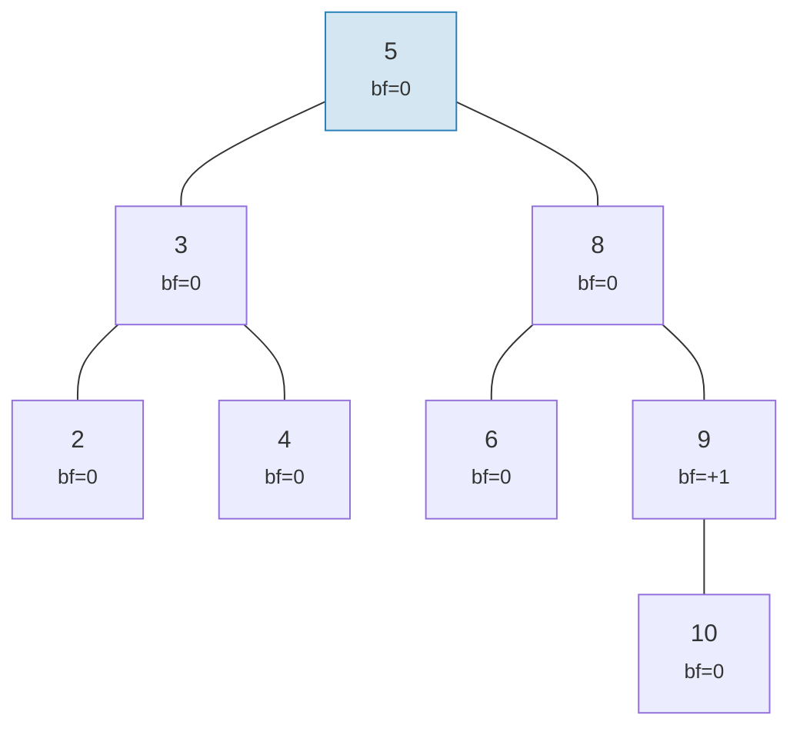

**« Oscillation » valide en AVL (hauteur 5)** — chaque nœud penche d'au plus 1, mais cela se cumule :

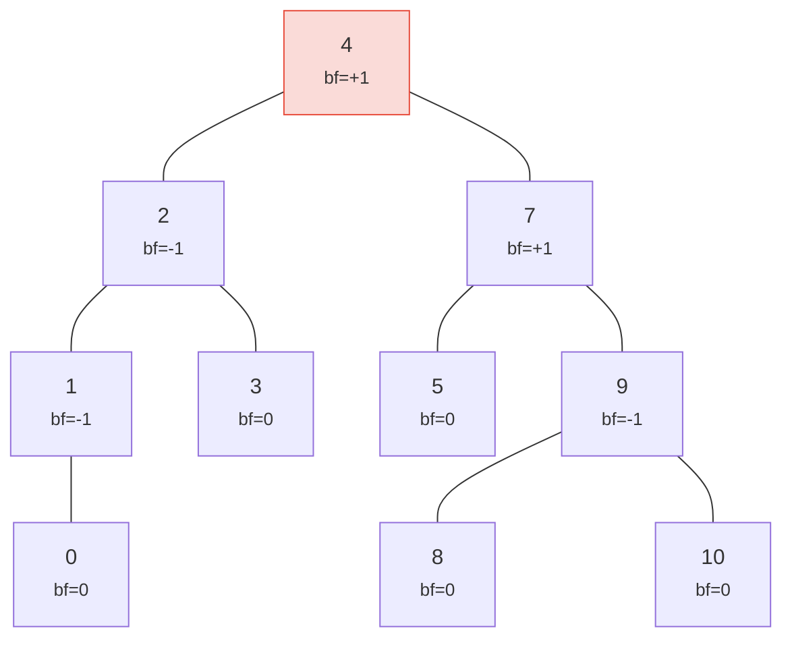

> Hauteur 5 contre 4 idéal — c'est l'« oscillation ». Pire cas : h <= 1,44 x log2(n+2).

Les deux arbres sont des arbres AVL valides ! La hauteur maximale dans le pire cas d'un arbre AVL est :

```text
h ≤ 1.4404 × log₂(n + 2) − 0.3277
```

Donc pour **n = 1 000 000** nœuds :
- Équilibre parfait : hauteur 20
- Pire cas AVL : hauteur environ 29

Ce surcoût d'environ 44 % est le prix des règles de rotation simples de l'AVL. En pratique, les
insertions aléatoires produisent des arbres beaucoup plus proches de l'équilibre parfait.

Voici à quoi ressemblent les arbres valides et invalides :

**VALIDE** — tous les facteurs d'équilibre dans {-1, 0, +1} :

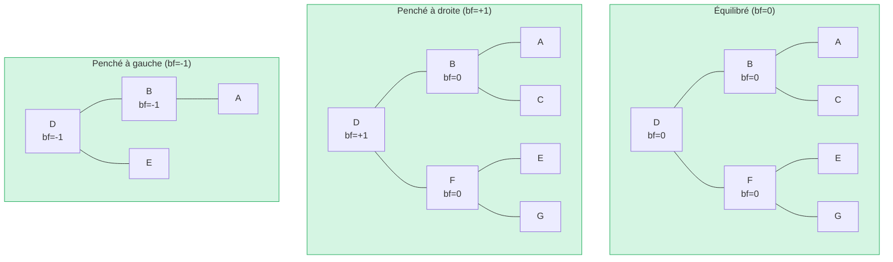

**INVALIDE** — facteur d'équilibre = +2 (nécessite une rotation !) :

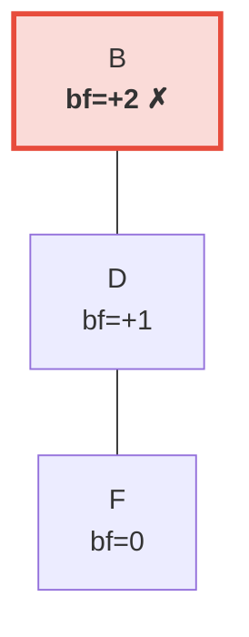

> Le sous-arbre droit est 2 niveaux plus haut que le gauche (qui est vide). Cela déclenche une **rotation à gauche** pour restaurer l'invariant AVL.

## Rotations — Restaurer l'équilibre

Lorsqu'une insertion ou une suppression fait atteindre un facteur d'équilibre de plus ou moins 2, l'arbre doit
être **pivoté** pour restaurer l'invariant AVL. Il existe quatre cas, réductibles à
deux opérations fondamentales.

### Rotation simple à gauche

Utilisée lorsqu'un nœud est **lourd à droite** (bf = +2) et que son enfant droit est
**lourd à droite ou équilibré** (bf >= 0) :

**Avant** (bf=+2) :

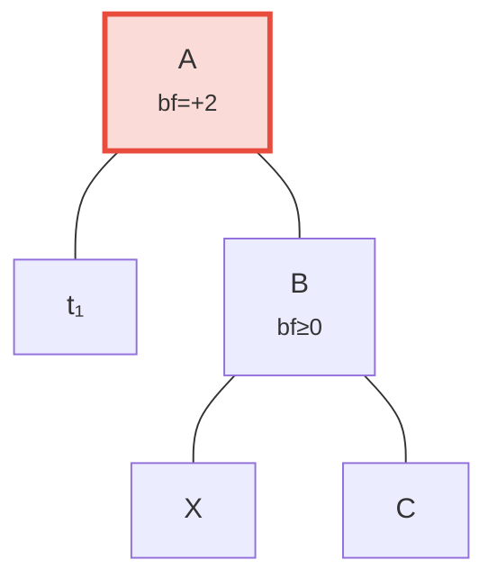

**Après** rotation à gauche — B promu en racine :

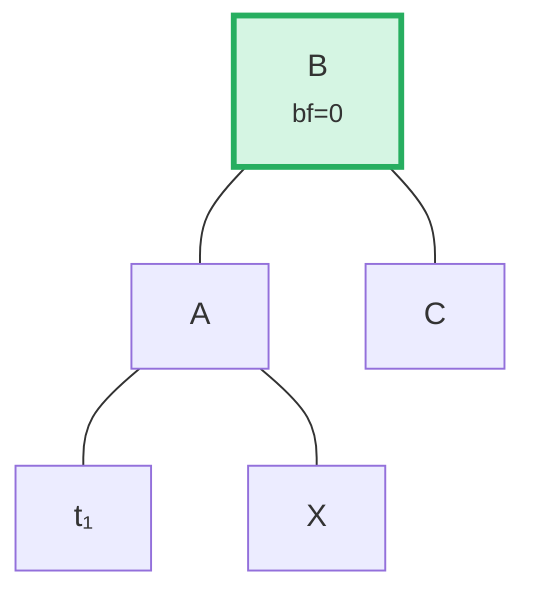

> **Étapes :** (1) Détacher B de A. (2) Détacher X (enfant gauche de B). (3) Attacher X comme enfant droit de A. (4) Attacher A comme enfant gauche de B. Le sous-arbre enraciné en B est maintenant équilibré.

Dans le code (`merk/src/tree/ops.rs`) :

```rust
fn rotate<V>(self, left: bool, ...) -> CostResult<Self, Error> {
    // Detach child on the heavy side
    let (tree, child) = self.detach_expect(left, ...);
    // Detach grandchild from opposite side of child
    let (child, maybe_grandchild) = child.detach(!left, ...);

    // Attach grandchild to original root
    tree.attach(left, maybe_grandchild)
        .maybe_balance(...)
        .flat_map_ok(|tree| {
            // Attach original root as child of promoted node
            child.attach(!left, Some(tree))
                .maybe_balance(...)
        })
}
```

Notez comment `maybe_balance` est appelé récursivement — la rotation elle-même pourrait créer
de nouveaux déséquilibres nécessitant d'autres corrections.

### Double rotation (gauche-droite)

Utilisée lorsqu'un nœud est **lourd à gauche** (bf = -2) mais que son enfant gauche est
**lourd à droite** (bf > 0). Une simple rotation ne résoudrait pas le problème :

**Étape 0 : Avant** — C est lourd à gauche (bf=-2) mais son enfant gauche A penche à droite (bf=+1). Une simple rotation ne résout pas cela :

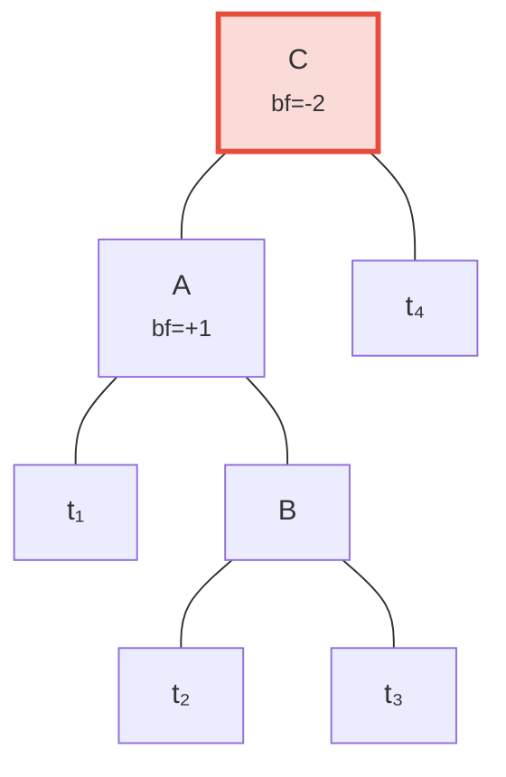

**Étape 1 : Rotation à gauche de l'enfant A** — maintenant C et B penchent tous les deux à gauche, corrigeable par une simple rotation :

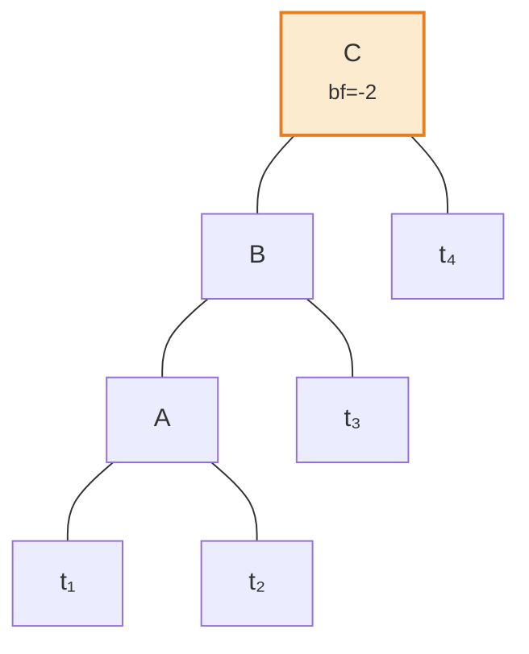

**Étape 2 : Rotation à droite de la racine C** — équilibré !

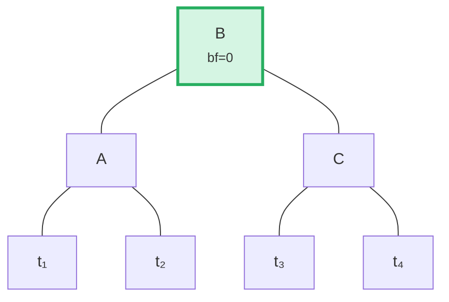

L'algorithme détecte ce cas en comparant la direction d'inclinaison du parent avec le
facteur d'équilibre de l'enfant :

```rust
fn maybe_balance<V>(self, ...) -> CostResult<Self, Error> {
    let balance_factor = self.balance_factor();
    if balance_factor.abs() <= 1 {
        return Ok(self);  // Already balanced
    }

    let left = balance_factor < 0;  // true if left-heavy

    // Double rotation needed when child leans opposite to parent
    let tree = if left == (self.tree().link(left).unwrap().balance_factor() > 0) {
        // First rotation: rotate child in opposite direction
        self.walk_expect(left, |child|
            child.rotate(!left, ...).map_ok(Some), ...
        )
    } else {
        self
    };

    // Second (or only) rotation
    tree.rotate(left, ...)
}
```

## Opérations par lots — Construction et application

Plutôt que d'insérer les éléments un par un, Merk supporte les opérations par lots (batch operations) qui
appliquent plusieurs modifications en un seul passage. C'est crucial pour l'efficacité : un lot
de N opérations sur un arbre de M éléments prend **O((M + N) log(M + N))** temps,
contre O(N log M) pour les insertions séquentielles.

### Le type MerkBatch

```rust
type MerkBatch<K> = [(K, Op)];

enum Op {
    Put(Vec<u8>, TreeFeatureType),  // Insert or update with value and feature type
    PutWithSpecializedCost(...),     // Insert with predefined cost
    PutCombinedReference(...),       // Insert reference with combined hash
    Replace(Vec<u8>, TreeFeatureType),
    Patch { .. },                    // Partial value update
    Delete,                          // Remove key
    DeleteLayered,                   // Remove with layered cost
    DeleteMaybeSpecialized,          // Remove with optional specialized cost
}
```

### Stratégie 1 : build() — Construction à partir de zéro

Lorsque l'arbre est vide, `build()` construit un arbre équilibré directement depuis le
lot trié en utilisant un algorithme de **division par la médiane** :

Lot d'entrée (trié) : `[A, B, C, D, E, F, G]` — choisir le milieu (D) comme racine, récurser sur chaque moitié :

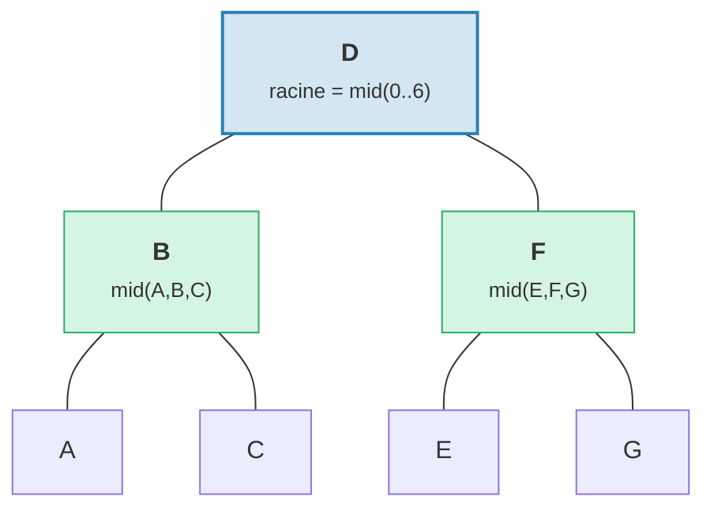

> Résultat : arbre parfaitement équilibré avec hauteur = 3 = plafond de log2(7).

```rust
fn build(batch: &MerkBatch<K>, ...) -> CostResult<Option<TreeNode>, Error> {
    let mid_index = batch.len() / 2;
    let (mid_key, mid_op) = &batch[mid_index];

    // Create root node from middle element
    let mid_tree = TreeNode::new(mid_key.clone(), value.clone(), None, feature_type)?;

    // Recursively build left and right subtrees
    let left = Self::build(&batch[..mid_index], ...);
    let right = Self::build(&batch[mid_index + 1..], ...);

    // Attach children
    mid_tree.attach(true, left).attach(false, right)
}
```

Cela produit un arbre avec une hauteur de plafond de log2(n) — parfaitement équilibré.

### Stratégie 2 : apply_sorted() — Fusion dans un arbre existant

Lorsque l'arbre contient déjà des données, `apply_sorted()` utilise une **recherche binaire** pour trouver
où chaque opération du lot doit se placer, puis applique récursivement les opérations aux
sous-arbres gauche et droit :

Arbre existant avec lot `[(B, Put), (F, Delete)]` :

Recherche binaire : B < D (aller à gauche), F > D (aller à droite).

**Avant :**
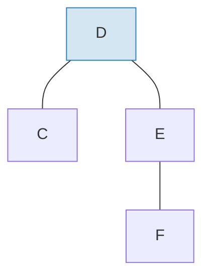

**Après** application du lot et rééquilibrage :
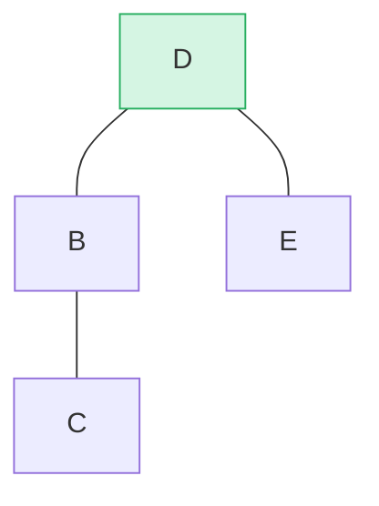

> B inséré comme sous-arbre gauche, F supprimé du sous-arbre droit. `maybe_balance()` confirme bf(D) = 0.

```rust
fn apply_sorted(self, batch: &MerkBatch<K>, ...) -> CostResult<...> {
    let search = batch.binary_search_by(|(key, _)| key.cmp(self.tree().key()));

    match search {
        Ok(index) => {
            // Key matches this node — apply operation directly
            // (Put replaces value, Delete removes node)
        }
        Err(mid) => {
            // Key not found — mid is the split point
            // Recurse on left_batch[..mid] and right_batch[mid..]
        }
    }

    self.recurse(batch, mid, exclusive, ...)
}
```

La méthode `recurse` divise le lot et parcourt la gauche et la droite :

```rust
fn recurse(self, batch: &MerkBatch<K>, mid: usize, ...) {
    let left_batch = &batch[..mid];
    let right_batch = &batch[mid..];  // or mid+1 if exclusive

    // Apply left batch to left subtree
    let tree = self.walk(true, |maybe_left| {
        Self::apply_to(maybe_left, left_batch, ...)
    });

    // Apply right batch to right subtree
    let tree = tree.walk(false, |maybe_right| {
        Self::apply_to(maybe_right, right_batch, ...)
    });

    // Re-balance after modifications
    tree.maybe_balance(...)
}
```

### Suppression de nœud

Lors de la suppression d'un nœud avec deux enfants, Merk promeut le **nœud frontière** du
sous-arbre le plus haut. Cela minimise les chances de nécessiter des rotations supplémentaires :

**Avant** — suppression de D (a deux enfants, hauteur du sous-arbre droit >= gauche) :

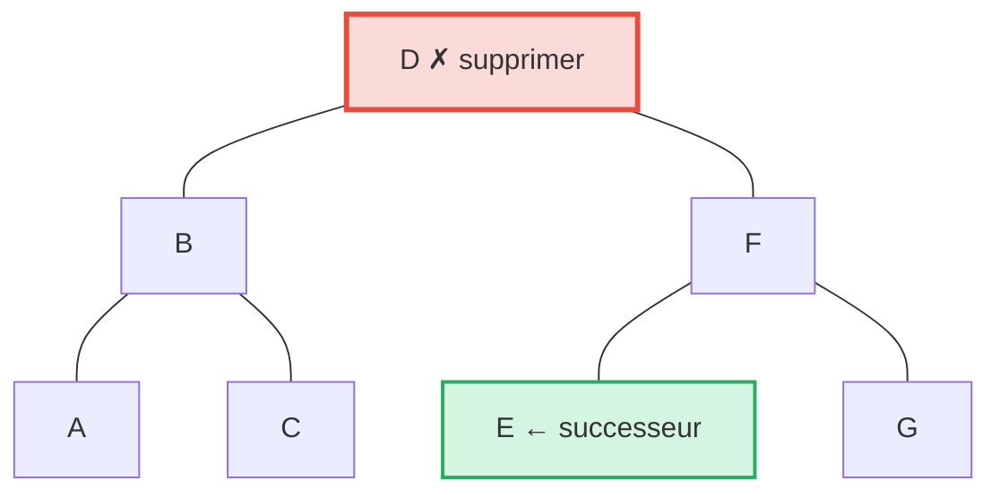

**Après** — E (le plus à gauche dans le sous-arbre droit = successeur en ordre) promu à la position de D :

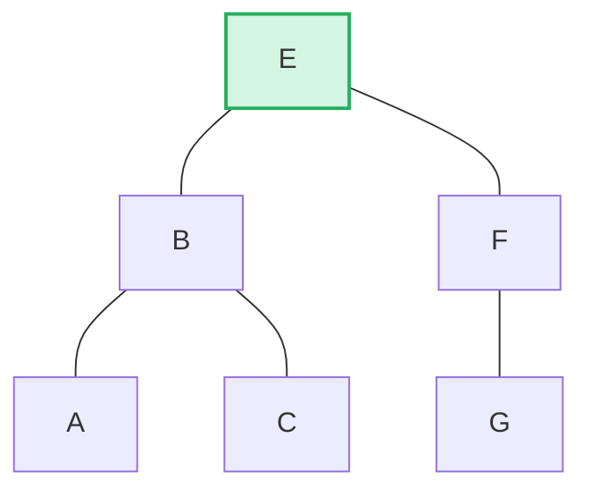

> **Règle :** Si hauteur gauche > droite, promouvoir le bord droit du sous-arbre gauche. Si hauteur droite >= gauche, promouvoir le bord gauche du sous-arbre droit. Cela minimise le rééquilibrage post-suppression.

```rust
pub fn remove(self, ...) -> CostResult<Option<Self>, Error> {
    let has_left = tree.link(true).is_some();
    let has_right = tree.link(false).is_some();
    let left = tree.child_height(true) > tree.child_height(false);

    if has_left && has_right {
        // Two children: promote edge of taller child
        let (tree, tall_child) = self.detach_expect(left, ...);
        let (_, short_child) = tree.detach_expect(!left, ...);
        tall_child.promote_edge(!left, short_child, ...)
    } else if has_left || has_right {
        // One child: promote it directly
        self.detach_expect(left, ...).1
    } else {
        // Leaf node: just remove
        None
    }
}
```

---
