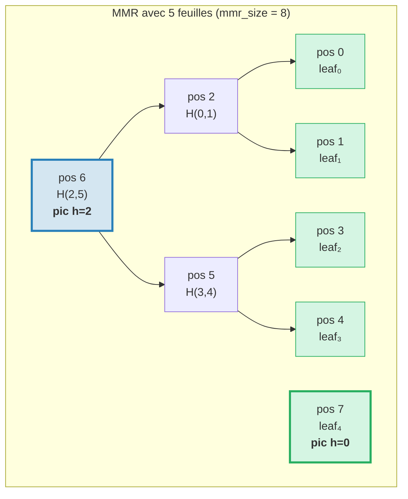
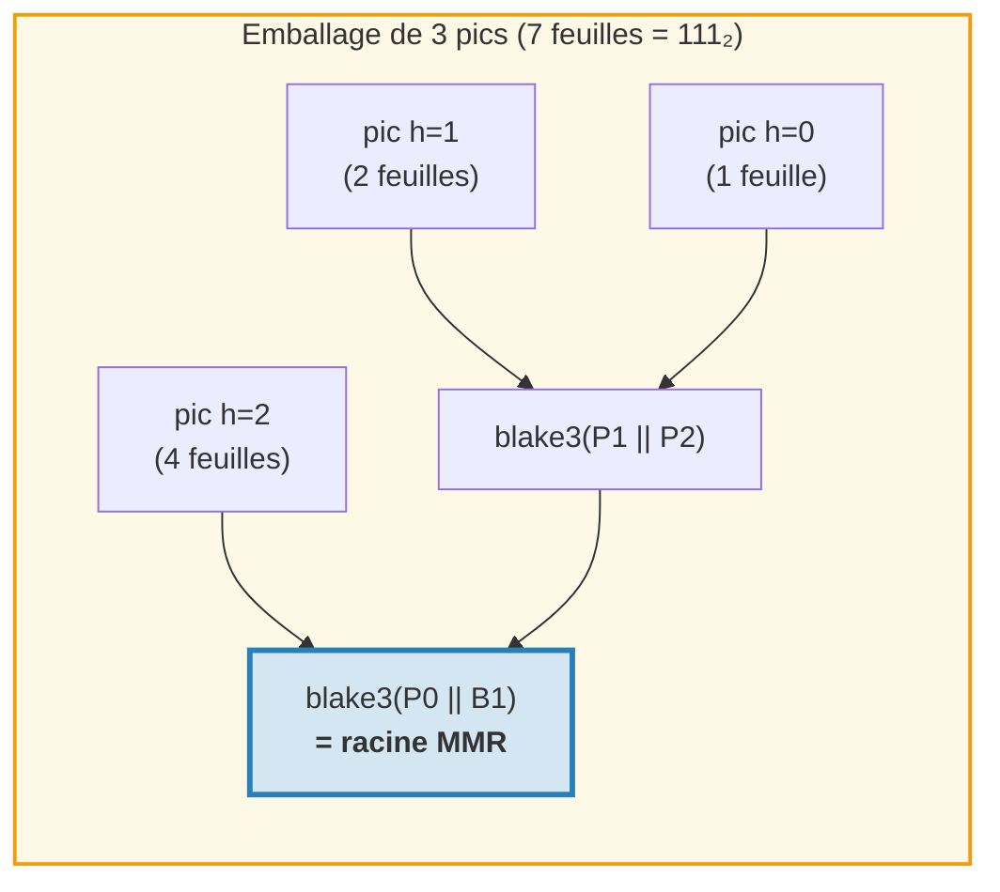
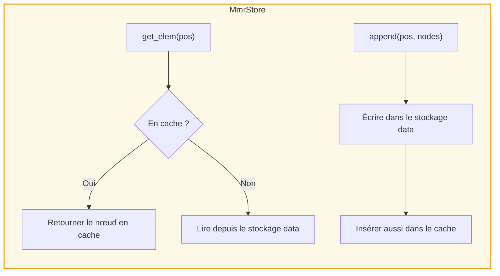
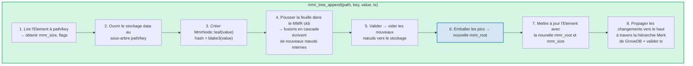
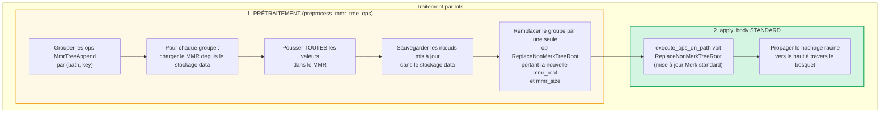
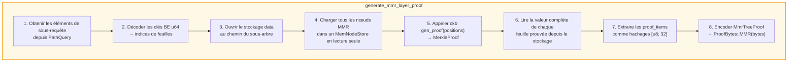
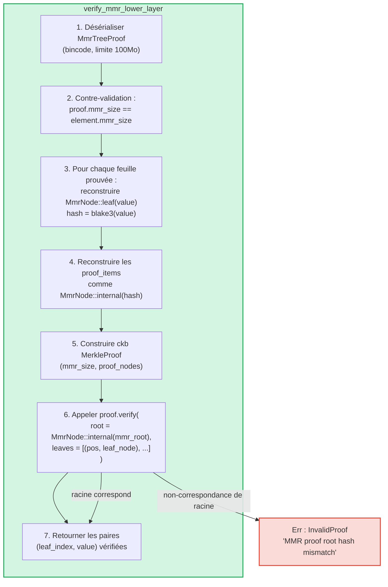

# L'arbre MMR — Journaux authentifiés en ajout seulement

Le **MmrTree** est la structure de données authentifiée en ajout seulement de GroveDB, construite sur
une plage de montagnes de Merkle (Merkle Mountain Range, MMR) avec hachage Blake3. Alors que les arbres Merk AVL
(chapitre 2) excellent dans les opérations clé-valeur aléatoires avec des mises à jour en O(log N), les MMR
sont conçus pour le cas de l'ajout seulement : ils offrent zéro rotation, un coût de hachage amorti en O(1)
par ajout, et des patrons d'E/S séquentiels.

Ce chapitre couvre en profondeur la structure de données MMR — comment elle croît, comment les nœuds
sont stockés, comment les ajouts se propagent en cascade, et comment le système de preuves permet à tout tiers
de vérifier qu'une valeur spécifique a été ajoutée à une position spécifique.

## Pourquoi un type d'arbre séparé ?

Les arbres Merk standard de GroveDB gèrent bien les données clé-valeur ordonnées, mais
les journaux en ajout seulement ont des exigences différentes :

| Propriété | Arbre AVL Merk | MMR |
|----------|--------------|-----|
| Opérations | Insertion, mise à jour, suppression | Ajout seulement |
| Rééquilibrage | O(log N) rotations par écriture | Aucun |
| Patron d'E/S | Aléatoire (le rééquilibrage touche de nombreux nœuds) | Séquentiel (les nouveaux nœuds toujours à la fin) |
| Total de hachages pour N insertions | O(N log N) | O(N) |
| Structure | Déterminée par l'ordre d'insertion | Déterminée uniquement par le nombre de feuilles |
| Preuves | Chemin de la racine à la feuille | Hachages de frères + pics |

Pour des cas d'utilisation comme les journaux de transactions, les flux d'événements, ou toute donnée croissant de manière monotone,
le MMR est strictement meilleur : plus simple, plus rapide et plus prévisible.

## La structure de données MMR

Un MMR est une **forêt d'arbres binaires parfaits** (appelés « pics ») qui croît de gauche
à droite. Chaque pic est un arbre binaire complet de hauteur *h*, contenant
exactement 2^h feuilles.

L'idée clé : **la représentation binaire du nombre de feuilles détermine la
structure des pics**. Chaque bit à 1 dans la forme binaire correspond à un pic :

```text
Nb feuilles   Binaire   Pics
─────────     ──────    ─────
1             1         un pic h=0
2             10        un pic h=1
3             11        pics h=1, h=0
4             100       un pic h=2
5             101       pics h=2, h=0
6             110       pics h=2, h=1
7             111       pics h=2, h=1, h=0
8             1000      un pic h=3
```

Cela signifie que la structure du MMR est entièrement déterminée par un seul nombre — le nombre
de feuilles. Deux MMR avec le même nombre de feuilles ont toujours la même forme,
indépendamment des valeurs ajoutées.

## Comment le MMR se remplit

Chaque nœud dans le MMR a une **position** (indexée à partir de 0). Les feuilles et les nœuds internes
sont entrelacés dans un patron spécifique. Voici la croissance étape par étape :

**Après 1 feuille (mmr_size = 1) :**
```text
pos:  0
      leaf₀        ← un pic à hauteur 0
```

**Après 2 feuilles (mmr_size = 3) :**
```text
pos:     2          ← interne : blake3(leaf₀.hash || leaf₁.hash)
        / \
       0   1        ← feuilles

Un pic à hauteur 1. Les positions 0 et 1 sont des feuilles, la position 2 est interne.
```
Quand leaf₁ a été ajoutée, elle a créé un pic de hauteur 0. Mais il y avait déjà un
pic de hauteur 0 (leaf₀), donc ils ont **fusionné** en un pic de hauteur 1.

**Après 3 feuilles (mmr_size = 4) :**
```text
pos:     2     3    ← pic h=1, pic h=0
        / \
       0   1

Deux pics. Pas de fusion — les hauteurs 1 et 0 sont différentes.
(Binaire : 3 = 11₂ → un pic par bit à 1)
```

**Après 4 feuilles (mmr_size = 7) :**
```text
pos:         6              ← interne : fusion des nœuds 2 et 5
           /   \
         2       5          ← nœuds internes
        / \     / \
       0   1   3   4        ← feuilles

Un pic à hauteur 2.
```
C'est là que ça devient intéressant. L'ajout de leaf₃ (position 4) crée le nœud₅
(fusion des positions 3 et 4). Mais maintenant le nœud₅ (hauteur 1) et le nœud₂ (hauteur 1)
sont des pics adjacents de même hauteur, donc ils fusionnent en nœud₆. **Une cascade de deux
fusions depuis un seul ajout.**

**Après 5 feuilles (mmr_size = 8) :**
```text
pos:         6         7    ← pic h=2, pic h=0
           /   \
         2       5
        / \     / \
       0   1   3   4

Deux pics. (Binaire : 5 = 101₂)
```

**Après 7 feuilles (mmr_size = 11) :**
```text
pos:         6         10    ← pic h=2, pic h=1, pic h=0
           /   \      / \
         2       5   8   9    7
        / \     / \
       0   1   3   4

Trois pics. (Binaire : 7 = 111₂)
```

**Après 8 feuilles (mmr_size = 15) :**
```text
pos:              14                     ← pic unique h=3
               /      \
            6            13
          /   \        /    \
        2       5    9       12
       / \     / \  / \     / \
      0   1   3  4 7   8  10  11

Un pic à hauteur 3. Trois fusions en cascade depuis l'ajout de leaf₇.
```



> **Bleu** = pics (racines des sous-arbres binaires parfaits). **Vert** = nœuds feuilles.

## La cascade de fusions

Quand une nouvelle feuille est ajoutée, elle peut déclencher une chaîne de fusions. Le nombre de
fusions est égal au nombre de **bits à 1 de fin** dans la représentation binaire
du nombre actuel de feuilles :

| Nb feuilles (avant push) | Binaire | 1 de fin | Fusions | Total hachages |
|--------------------------|--------|-------------|--------|--------------|
| 0 | `0` | 0 | 0 | 1 (feuille seule) |
| 1 | `1` | 1 | 1 | 2 |
| 2 | `10` | 0 | 0 | 1 |
| 3 | `11` | 2 | 2 | 3 |
| 4 | `100` | 0 | 0 | 1 |
| 5 | `101` | 1 | 1 | 2 |
| 6 | `110` | 0 | 0 | 1 |
| 7 | `111` | 3 | 3 | 4 |

**Total de hachages par push** = `1 + trailing_ones(leaf_count)` :
- 1 hachage pour la feuille elle-même : `blake3(value)`
- N hachages pour la cascade de fusions : `blake3(left.hash || right.hash)` pour chaque
  fusion

C'est ainsi que GroveDB suit les coûts de hachage pour chaque ajout. L'implémentation :
```rust
pub fn hash_count_for_push(leaf_count: u64) -> u32 {
    1 + leaf_count.trailing_ones()
}
```

## Taille MMR vs nombre de feuilles

Le MMR stocke à la fois les feuilles et les nœuds internes dans un espace de positions plat, donc
`mmr_size` est toujours plus grand que le nombre de feuilles. La relation exacte est :

```text
mmr_size = 2 * leaf_count - popcount(leaf_count)
```

où `popcount` est le nombre de bits à 1 (c.-à-d. le nombre de pics). Chaque
nœud interne fusionne deux sous-arbres, réduisant le nombre de nœuds d'un par fusion.

Le calcul inverse — nombre de feuilles depuis mmr_size — utilise les positions des pics :

```rust
fn mmr_size_to_leaf_count(mmr_size: u64) -> u64 {
    // Each peak at height h contains 2^h leaves
    get_peaks(mmr_size).iter()
        .map(|&peak_pos| 1u64 << pos_height_in_tree(peak_pos))
        .sum()
}
```

| mmr_size | leaf_count | pics |
|----------|-----------|-------|
| 0 | 0 | (vide) |
| 1 | 1 | h=0 |
| 3 | 2 | h=1 |
| 4 | 3 | h=1, h=0 |
| 7 | 4 | h=2 |
| 8 | 5 | h=2, h=0 |
| 10 | 6 | h=2, h=1 |
| 11 | 7 | h=2, h=1, h=0 |
| 15 | 8 | h=3 |

GroveDB stocke `mmr_size` dans l'élément (pas le nombre de feuilles) car la bibliothèque ckb MMR
utilise les positions en interne. L'opération `mmr_tree_leaf_count` dérive
le nombre de feuilles à la volée.

## Hachage racine MMR — Emballer les pics

Un MMR a plusieurs pics (un par bit à 1 dans le nombre de feuilles). Pour produire un
unique hachage racine de 32 octets, les pics sont **« emballés »** de droite à gauche :

```text
root = bag_rhs_peaks(peaks):
    commencer par le pic le plus à droite
    replier vers la gauche : blake3(left_peak || accumulated_right)
```

Avec 1 pic, la racine est simplement le hachage de ce pic. Avec 3 pics :



> Le hachage racine change à **chaque** ajout, même quand aucune fusion ne se produit,
> car le pic le plus à droite change et l'emballage doit être recalculé.

## Structure des nœuds et sérialisation

Chaque nœud MMR est un `MmrNode` :

```rust
struct MmrNode {
    hash: [u8; 32],           // Blake3 hash
    value: Option<Vec<u8>>,   // Some for leaves, None for internal nodes
}
```

**Nœud feuille :** `hash = blake3(value_bytes)`, `value = Some(value_bytes)`
**Nœud interne :** `hash = blake3(left.hash || right.hash)`, `value = None`

La fonction de fusion est directe — concaténer deux hachages de 32 octets et
appliquer Blake3 au résultat :

```rust
fn blake3_merge(left: &[u8; 32], right: &[u8; 32]) -> [u8; 32] {
    let mut input = [0u8; 64];
    input[..32].copy_from_slice(left);
    input[32..].copy_from_slice(right);
    *blake3::hash(&input).as_bytes()
}
```

> **Note sur PartialEq :** `MmrNode` implémente `PartialEq` en comparant **uniquement
> le champ hash**, pas la valeur. C'est critique pour la vérification des preuves : le
> vérificateur ckb compare une racine reconstruite (value = None) contre la racine
> attendue. Si PartialEq comparait le champ value, les preuves MMR à une seule feuille
> échoueraient toujours car la feuille a `value: Some(...)` mais la reconstruction de racine
> produit `value: None`.

**Format de sérialisation :**
```text
Interne : [0x00] [hash: 32 octets]                                = 33 octets
Feuille :  [0x01] [hash: 32 octets] [value_len: 4 BE] [value...]  = 37 + len octets
```

L'octet de drapeau distingue les nœuds internes des feuilles. La désérialisation valide
la longueur exacte — aucun octet de fin n'est autorisé.

## Architecture de stockage

MmrTree stocke ses nœuds dans la colonne **data** (la même famille de colonnes utilisée
par les nœuds Merk), pas dans un sous-arbre Merk enfant. L'élément n'a pas de champ `root_key`
— le hachage racine MMR circule comme le **hachage enfant** Merk via
`insert_subtree(subtree_root_hash)`, authentifiant l'état du MMR.

**Les clés de stockage** sont basées sur la position :
```text
key = 'm' || position_as_be_u64    (9 octets : préfixe + u64 BE)
```

Donc la position 42 est stockée à la clé `[0x6D, 0x00, 0x00, 0x00, 0x00, 0x00, 0x00,
0x00, 0x2A]`.

Rechercher la feuille *i* nécessite d'abord de calculer la position MMR :
`pos = leaf_index_to_pos(i)`, puis de lire la clé data `m{pos}`.

**Cache de lecture après écriture :** Pendant les ajouts, les nœuds nouvellement écrits doivent être
immédiatement lisibles pour les fusions suivantes dans le même push. Comme le stockage
transactionnel de GroveDB diffère les écritures dans un lot (elles ne sont pas visibles aux lectures
jusqu'au commit), un adaptateur `MmrStore` enveloppe le contexte de stockage avec un
cache `HashMap` en mémoire :



Cela garantit que quand l'ajout de leaf₃ déclenche une cascade de fusions (créant
des nœuds internes aux positions 5 et 6), le nœud₅ est immédiatement disponible pour
le calcul du nœud₆, même si le nœud₅ n'a pas encore été validé dans RocksDB.

**Propagation du hachage racine vers la racine d'état de GroveDB :**

```text
combined_value_hash = blake3(
    blake3(varint(len) || element_bytes),   ← value_hash depuis l'Element sérialisé
    mmr_root_hash                           ← child_hash = racine spécifique au type
)
```

Le hachage racine MMR circule comme le hachage enfant Merk via `insert_subtree`. Tout changement
de l'état du MMR produit un `combined_value_hash` différent, qui se propage vers le haut
à travers la hiérarchie Merk parente jusqu'à la racine d'état GroveDB.

## Opérations GroveDB

MmrTree fournit quatre opérations :

```rust
// Append a value — returns (new_mmr_root, leaf_index)
db.mmr_tree_append(path, key, value, tx, version)

// Read the current root hash (from Element, no storage access)
db.mmr_tree_root_hash(path, key, tx, version)

// Get a leaf value by 0-based index
db.mmr_tree_get_value(path, key, leaf_index, tx, version)

// Get the number of leaves appended
db.mmr_tree_leaf_count(path, key, tx, version)
```

### Flux d'ajout

L'opération d'ajout est la plus complexe, effectuant 8 étapes :



L'étape 4 peut écrire 1 nœud (feuille seule) ou 1 + N nœuds (feuille + N nœuds internes de fusion).
L'étape 5 appelle `mmr.commit()` qui vide le MemStore ckb vers le MmrStore.
L'étape 7 appelle `insert_subtree` avec la nouvelle racine MMR comme hachage enfant
(via `subtree_root_hash`), puisque MmrTree n'a pas de Merk enfant.

### Opérations de lecture

`mmr_tree_root_hash` calcule la racine depuis les données MMR en stockage.
`mmr_tree_leaf_count` dérive le nombre de feuilles depuis `mmr_size` dans l'Element.
Aucun accès au stockage data n'est nécessaire.

`mmr_tree_get_value` calcule `pos = leaf_index_to_pos(leaf_index)`, lit
l'unique entrée de stockage data à `m{pos}`, désérialise le `MmrNode`, et
retourne `node.value`.

## Opérations par lots

Plusieurs ajouts MMR peuvent être regroupés en lot en utilisant `GroveOp::MmrTreeAppend { value }`.
Comme la fonction standard de lot `execute_ops_on_path` n'a accès qu'au
Merk (pas au contexte de stockage du MMR), les ajouts MMR utilisent une **phase de prétraitement** :



Exemple : Un lot avec 3 ajouts au même MMR :
```rust
vec![
    QualifiedGroveDbOp { path: p, key: k, op: MmrTreeAppend { value: v1 } },
    QualifiedGroveDbOp { path: p, key: k, op: MmrTreeAppend { value: v2 } },
    QualifiedGroveDbOp { path: p, key: k, op: MmrTreeAppend { value: v3 } },
]
```

Le prétraitement charge le MMR une fois, pousse v1, v2, v3 (créant tous les nœuds
intermédiaires), sauvegarde tout dans le stockage data, puis émet un seul `ReplaceNonMerkTreeRoot`
avec la `mmr_root` et `mmr_size` finales. La machinerie de lots standard gère
le reste.

## Génération de preuves

Les preuves MMR sont des **preuves V1** — elles utilisent la variante `ProofBytes::MMR` dans la
structure de preuve en couches (voir paragraphe 9.6). La preuve démontre que des valeurs de feuilles
spécifiques existent à des positions spécifiques au sein du MMR, et que leurs hachages sont
cohérents avec la `mmr_root` stockée dans l'élément parent.

### Encodage des requêtes

Les clés de requête encodent les positions en **octets u64 gros-boutistes**. Cela préserve
l'ordre de tri lexicographique (puisque l'encodage BE est monotone), permettant à toutes les variantes
standard de `QueryItem` de fonctionner :

```text
QueryItem::Key([0,0,0,0,0,0,0,5])            → index de feuille 5
QueryItem::RangeInclusive([..2]..=[..7])      → indices de feuilles [2, 3, 4, 5, 6, 7]
QueryItem::RangeFrom([..10]..)                → indices de feuilles [10, 11, ..., N-1]
QueryItem::RangeFull                          → toutes les feuilles [0..leaf_count)
```

Un plafond de sécurité de **10 000 000 indices** empêche l'épuisement mémoire des
requêtes de plage non bornées. Un MMR vide (zéro feuille) retourne une preuve vide.

### La structure MmrTreeProof

```rust
struct MmrTreeProof {
    mmr_size: u64,                 // MMR size at proof time
    leaves: Vec<(u64, Vec<u8>)>,   // (leaf_index, value) for each proved leaf
    proof_items: Vec<[u8; 32]>,    // Sibling/peak hashes for verification
}
```

Les `proof_items` contiennent l'ensemble minimal de hachages nécessaires pour reconstruire
les chemins des feuilles prouvées jusqu'à la racine MMR. Ce sont les nœuds frères
à chaque niveau et les hachages des pics non impliqués.

### Flux de génération



L'étape 4 utilise un `MemNodeStore` — un BTreeMap en lecture seule qui pré-charge tous les nœuds
MMR depuis le stockage data. Le générateur de preuves ckb a besoin d'un accès aléatoire, donc tous
les nœuds doivent être en mémoire.

L'étape 5 est celle où la bibliothèque ckb fait le gros du travail : étant donné la taille du MMR et
les positions à prouver, elle détermine quels hachages de frères et de pics sont nécessaires.

### Exemple détaillé

**Preuve de la feuille 2 dans un MMR à 5 feuilles (mmr_size = 8) :**

```text
Structure MMR :
pos:         6         7
           /   \
         2       5
        / \     / \
       0   1   3   4

Index de feuille 2 → position MMR 3

Pour vérifier la feuille à la position 3 :
  1. Hacher la valeur revendiquée : leaf_hash = blake3(value)
  2. Frère à la position 4 :  node₅ = blake3(leaf_hash || proof[pos 4])
  3. Frère à la position 2 :  node₆ = blake3(proof[pos 2] || node₅)
  4. Pic à la position 7 :    root  = bag(node₆, proof[pos 7])
  5. Comparer : root == mmr_root attendue ✓

proof_items = [hash(pos 4), hash(pos 2), hash(pos 7)]
leaves = [(2, original_value_bytes)]
```

La taille de la preuve pour cet exemple est : 3 hachages (96 octets) + 1 valeur de feuille +
métadonnées. En général, prouver K feuilles d'un MMR à N feuilles nécessite
O(K * log N) hachages de frères.

## Vérification des preuves

La vérification est **pure** — elle ne nécessite aucun accès à la base de données. Le vérificateur a besoin
uniquement des octets de la preuve et du hachage racine MMR attendu (qu'il extrait de
l'élément parent prouvé dans la couche Merk au-dessus).

### Étapes de vérification



La fonction `MerkleProof::verify` de ckb reconstruit la racine depuis les feuilles
et les éléments de preuve, puis la compare (en utilisant `PartialEq`, qui vérifie uniquement le
hachage) avec la racine attendue.

### Chaîne de confiance

La chaîne complète de la racine d'état GroveDB à une valeur de feuille vérifiée :

```text
racine_état GroveDB (connue/de confiance)
│
├─ Couche de preuve Merk V0 0 : prouve que le sous-arbre existe à la racine
│   └─ root_hash correspond à state_root ✓
│
├─ Couche de preuve Merk V0 1 : prouve l'élément MmrTree à path/key
│   └─ nœud KVValueHash : element_bytes contient mmr_root
│   └─ combined_hash = combine_hash(H(element_bytes), mmr_root)
│   └─ root_hash correspond à la couche parente ✓
│
└─ Preuve MMR V1 : prouve que les valeurs de feuilles sont dans le MMR
    └─ Reconstruire les chemins des feuilles via les frères jusqu'aux pics
    └─ Emballer les pics → racine reconstruite
    └─ racine reconstruite == mmr_root depuis element_bytes ✓
    └─ Résultat : leaf₂ = [octets de valeur vérifiés]
```

### Propriétés de sécurité

- **Contre-validation mmr_size :** Le `mmr_size` de la preuve doit correspondre au
  `mmr_size` de l'élément. Une non-correspondance indique que la preuve a été générée contre
  un état différent et est rejetée.
- **Limite de taille bincode :** La désérialisation utilise une limite de 100 Mo pour empêcher les en-têtes
  de longueur fabriqués de causer d'énormes allocations.
- **Comptabilité des limites :** Chaque feuille prouvée décrémente la limite globale de la requête de
  1 en utilisant `saturating_sub` pour empêcher le débordement par le bas.
- **Retour du hachage enfant :** Le vérificateur retourne la racine MMR calculée comme hachage
  enfant pour le calcul combine_hash dans la couche parente.
- **Rejet V0 :** Tenter une sous-requête dans un MmrTree avec des preuves V0
  retourne `Error::NotSupported`. Seules les preuves V1 peuvent descendre dans les arbres non-Merk.

## Suivi des coûts

Les opérations MMR suivent les coûts avec précision :

| Opération | Appels de hachage | Opérations de stockage |
|-----------|-----------|-------------------|
| Ajout de 1 feuille | `1 + trailing_ones(leaf_count)` | 1 écriture feuille + N écritures internes |
| Hachage racine | 0 (mis en cache dans l'Element) | 1 lecture d'Element |
| Obtenir une valeur | 0 | 1 lecture d'Element + 1 lecture data |
| Nombre de feuilles | 0 | 1 lecture d'Element |

La formule de nombre de hachages `1 + trailing_ones(N)` donne le nombre exact d'appels Blake3 :
1 pour le hachage de la feuille, plus un hachage de fusion par niveau de cascade.

**Analyse amortie :** Sur N ajouts, le total de hachages est :

```text
Σ (1 + trailing_ones(i)) pour i = 0..N-1
= N + Σ trailing_ones(i) pour i = 0..N-1
= N + (N - popcount(N))
≈ 2N
```

Donc le coût amorti par ajout est d'environ **2 appels de hachage Blake3** —
constant et indépendant de la taille de l'arbre. Comparez cela aux arbres AVL Merk où
chaque insertion nécessite O(log N) hachages pour le chemin plus les hachages potentiels de rotation.

**Coût de stockage :** Chaque ajout écrit 1 nœud feuille (37 + value_len octets) plus
0 à log₂(N) nœuds internes (33 octets chacun). L'écriture de stockage amortie par
ajout est d'environ 33 + 37 + value_len octets, soit environ 70 + value_len octets.

## Fichiers d'implémentation

| Fichier | Objectif |
|------|---------|
| `grovedb-mmr/src/node.rs` | Structure `MmrNode`, fusion Blake3, sérialisation |
| `grovedb-mmr/src/grove_mmr.rs` | Enveloppe `GroveMmr` autour du MMR ckb |
| `grovedb-mmr/src/util.rs` | `mmr_node_key`, `hash_count_for_push`, `mmr_size_to_leaf_count` |
| `grovedb-mmr/src/proof.rs` | Génération et vérification de `MmrTreeProof` |
| `grovedb-mmr/src/dense_merkle.rs` | Racines d'arbre de Merkle dense (utilisé par BulkAppendTree) |
| `grovedb/src/operations/mmr_tree.rs` | Opérations GroveDB + adaptateur `MmrStore` + prétraitement par lots |
| `grovedb/src/operations/proof/generate.rs` | Génération de preuves V1 : `generate_mmr_layer_proof`, `query_items_to_leaf_indices` |
| `grovedb/src/operations/proof/verify.rs` | Vérification de preuves V1 : `verify_mmr_lower_layer` |
| `grovedb/src/tests/mmr_tree_tests.rs` | 28 tests d'intégration |

## Comparaison avec d'autres structures authentifiées

| | MMR (MmrTree) | AVL Merk (Tree) | Sinsemilla (CommitmentTree) |
|---|---|---|---|
| **Cas d'utilisation** | Journaux en ajout seulement | Magasin clé-valeur | Engagements compatibles ZK |
| **Fonction de hachage** | Blake3 | Blake3 | Sinsemilla (courbe Pallas) |
| **Opérations** | Ajouter, lire par index | Insérer, mettre à jour, supprimer, requêter | Ajouter, témoigner |
| **Hachage amorti/écriture** | ~2 | O(log N) | ~33 (32 niveaux + ommers) |
| **Type de preuve** | V1 (hachages frères MMR) | V0 (preuve chemin Merk) | Témoin (chemin auth Merkle) |
| **Compatible ZK** | Non | Non | Oui (circuits Halo 2) |
| **Rééquilibrage** | Aucun | Rotations AVL | Aucun |
| **Support suppression** | Non | Oui | Non |

---
