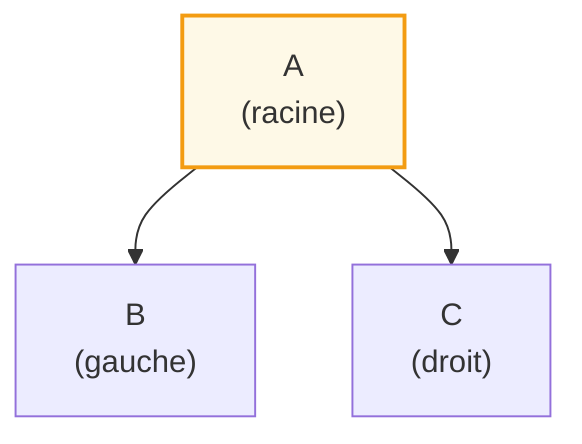
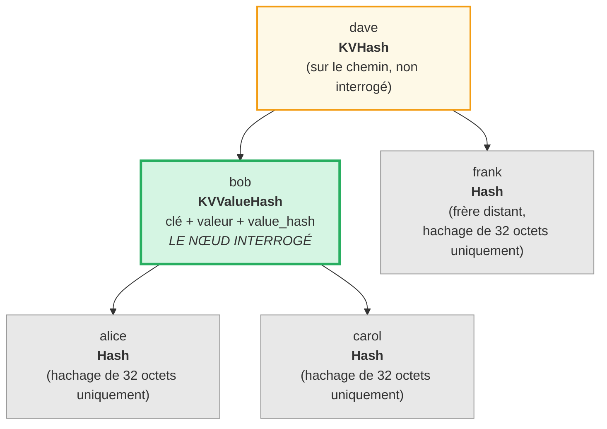
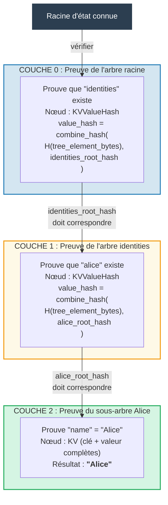
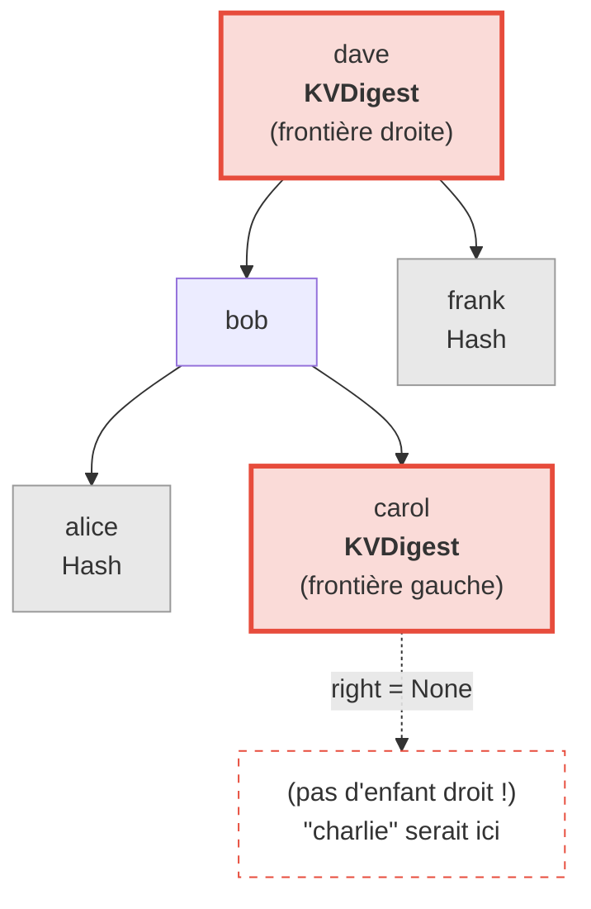
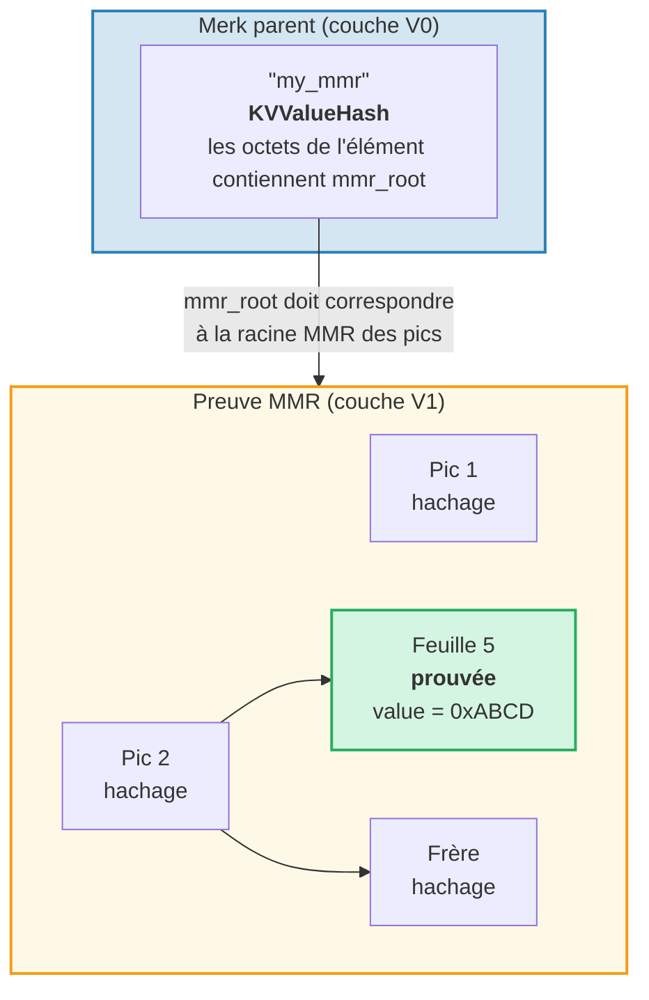
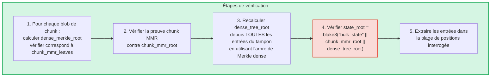
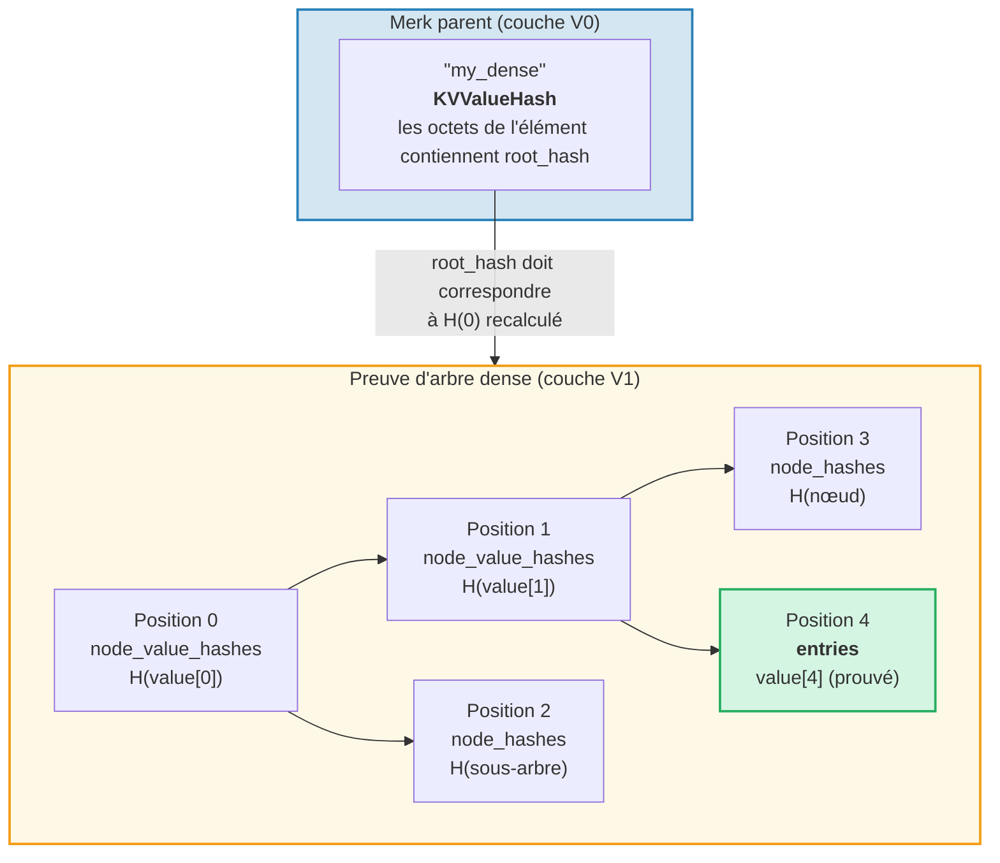

# Le système de preuves

Le système de preuves de GroveDB permet à toute partie de vérifier l'exactitude des résultats de requêtes
sans posséder la base de données complète. Une preuve est une représentation compacte de
la structure d'arbre pertinente qui permet de reconstruire le hachage racine.

## Opérations de preuve basées sur une pile

Les preuves sont encodées comme une séquence d'**opérations** qui reconstruisent un arbre partiel
en utilisant une machine à pile :

```rust
// merk/src/proofs/mod.rs
pub enum Op {
    Push(Node),        // Push a node onto the stack (ascending key order)
    PushInverted(Node),// Push a node (descending key order)
    Parent,            // Pop parent, pop child → attach child as LEFT of parent
    Child,             // Pop child, pop parent → attach child as RIGHT of parent
    ParentInverted,    // Pop parent, pop child → attach child as RIGHT of parent
    ChildInverted,     // Pop child, pop parent → attach child as LEFT of parent
}
```

L'exécution utilise une pile :

Opérations de preuve : `Push(B), Push(A), Parent, Push(C), Child`

| Étape | Opération | Pile (sommet vers la droite) | Action |
|------|-----------|-------------------|--------|
| 1 | Push(B) | [ B ] | Empiler B |
| 2 | Push(A) | [ B , A ] | Empiler A |
| 3 | Parent | [ A{left:B} ] | Dépiler A (parent), dépiler B (enfant), B devient GAUCHE de A |
| 4 | Push(C) | [ A{left:B} , C ] | Empiler C |
| 5 | Child | [ A{left:B, right:C} ] | Dépiler C (enfant), dépiler A (parent), C devient DROIT de A |

Résultat final — un seul arbre sur la pile :



> Le vérificateur calcule `node_hash(A) = Blake3(kv_hash_A || node_hash_B || node_hash_C)` et vérifie qu'il correspond au hachage racine attendu.

Voici la fonction `execute` (`merk/src/proofs/tree.rs`) :

```rust
pub fn execute<I, F>(ops: I, collapse: bool, mut visit_node: F) -> CostResult<Tree, Error>
where
    I: IntoIterator<Item = Result<Op, Error>>,
    F: FnMut(&Node) -> Result<(), Error>,
{
    let mut stack: Vec<Tree> = Vec::with_capacity(32);

    for op in ops {
        match op? {
            Op::Parent => {
                let (mut parent, child) = (try_pop(&mut stack), try_pop(&mut stack));
                parent.left = Some(Child { tree: Box::new(child), hash: child.hash() });
                stack.push(parent);
            }
            Op::Child => {
                let (child, mut parent) = (try_pop(&mut stack), try_pop(&mut stack));
                parent.right = Some(Child { tree: Box::new(child), hash: child.hash() });
                stack.push(parent);
            }
            Op::Push(node) => {
                visit_node(&node)?;
                stack.push(Tree::from(node));
            }
            // ... Inverted variants swap left/right
        }
    }
    // Final item on stack is the root
}
```

## Types de nœuds dans les preuves

Chaque `Push` transporte un `Node` qui contient juste assez d'informations pour la
vérification :

```rust
pub enum Node {
    // Minimum info — just the hash. Used for distant siblings.
    Hash(CryptoHash),

    // KV hash for nodes on the path but not queried.
    KVHash(CryptoHash),

    // Full key-value for queried items.
    KV(Vec<u8>, Vec<u8>),

    // Key, value, and pre-computed value_hash.
    // Used for subtrees where value_hash = combine_hash(...)
    KVValueHash(Vec<u8>, Vec<u8>, CryptoHash),

    // KV with feature type — for ProvableCountTree or chunk restoration.
    KVValueHashFeatureType(Vec<u8>, Vec<u8>, CryptoHash, TreeFeatureType),

    // Reference: key, dereferenced value, hash of reference element.
    KVRefValueHash(Vec<u8>, Vec<u8>, CryptoHash),

    // For items in ProvableCountTree.
    KVCount(Vec<u8>, Vec<u8>, u64),

    // KV hash + count for non-queried ProvableCountTree nodes.
    KVHashCount(CryptoHash, u64),

    // Reference in ProvableCountTree.
    KVRefValueHashCount(Vec<u8>, Vec<u8>, CryptoHash, u64),

    // For boundary/absence proofs in ProvableCountTree.
    KVDigestCount(Vec<u8>, CryptoHash, u64),

    // Key + value_hash for absence proofs (regular trees).
    KVDigest(Vec<u8>, CryptoHash),
}
```

Le choix du type de Node détermine les informations dont le vérificateur a besoin :

**Requête : « Obtenir la valeur pour la clé 'bob' »**



> Vert = nœud interrogé (données complètes révélées). Jaune = sur le chemin (kv_hash uniquement). Gris = frères (juste des hachages de nœud de 32 octets).

Encodé comme opérations de preuve :

| # | Op | Effet |
|---|----|----|
| 1 | Push(Hash(alice_node_hash)) | Empiler le hachage d'alice |
| 2 | Push(KVValueHash("bob", value, value_hash)) | Empiler bob avec données complètes |
| 3 | Parent | alice devient enfant gauche de bob |
| 4 | Push(Hash(carol_node_hash)) | Empiler le hachage de carol |
| 5 | Child | carol devient enfant droit de bob |
| 6 | Push(KVHash(dave_kv_hash)) | Empiler le kv_hash de dave |
| 7 | Parent | le sous-arbre bob devient gauche de dave |
| 8 | Push(Hash(frank_node_hash)) | Empiler le hachage de frank |
| 9 | Child | frank devient enfant droit de dave |

## Génération de preuves multi-couches

Comme GroveDB est un arbre d'arbres, les preuves s'étendent sur plusieurs couches. Chaque couche prouve
la portion pertinente d'un arbre Merk, et les couches sont connectées par le
mécanisme de combined value_hash :

**Requête :** `Get ["identities", "alice", "name"]`



> **Chaîne de confiance :** `racine_état_connue -> vérifier Couche 0 -> vérifier Couche 1 -> vérifier Couche 2 -> "Alice"`. Le hachage racine reconstruit de chaque couche doit correspondre au value_hash de la couche au-dessus.

Le vérificateur vérifie chaque couche, confirmant que :
1. La preuve de la couche se reconstruit vers le hachage racine attendu
2. Le hachage racine correspond au value_hash de la couche parente
3. Le hachage racine de plus haut niveau correspond à la racine d'état connue

## Vérification des preuves

La vérification suit les couches de preuve du bas vers le haut ou du haut vers le bas, en utilisant la fonction `execute`
pour reconstruire l'arbre de chaque couche. La méthode `Tree::hash()` dans l'arbre de preuve
calcule le hachage selon le type de nœud :

```rust
impl Tree {
    pub fn hash(&self) -> CostContext<CryptoHash> {
        match &self.node {
            Node::Hash(hash) => *hash,  // Already a hash, return directly

            Node::KVHash(kv_hash) =>
                node_hash(kv_hash, &self.child_hash(true), &self.child_hash(false)),

            Node::KV(key, value) =>
                kv_hash(key, value)
                    .flat_map(|kv_hash| node_hash(&kv_hash, &left, &right)),

            Node::KVValueHash(key, _, value_hash) =>
                kv_digest_to_kv_hash(key, value_hash)
                    .flat_map(|kv_hash| node_hash(&kv_hash, &left, &right)),

            Node::KVValueHashFeatureType(key, _, value_hash, feature_type) => {
                let kv = kv_digest_to_kv_hash(key, value_hash);
                match feature_type {
                    ProvableCountedMerkNode(count) =>
                        node_hash_with_count(&kv, &left, &right, *count),
                    _ => node_hash(&kv, &left, &right),
                }
            }

            Node::KVRefValueHash(key, referenced_value, ref_element_hash) => {
                let ref_value_hash = value_hash(referenced_value);
                let combined = combine_hash(ref_element_hash, &ref_value_hash);
                let kv = kv_digest_to_kv_hash(key, &combined);
                node_hash(&kv, &left, &right)
            }
            // ... other variants
        }
    }
}
```

## Preuves d'absence

GroveDB peut prouver qu'une clé **n'existe pas**. Cela utilise les nœuds frontières —
les nœuds qui seraient adjacents à la clé manquante si elle existait :

**Prouver :** "charlie" n'existe PAS



> **Recherche binaire :** alice < bob < carol < **"charlie"** < dave < frank. "charlie" serait entre carol et dave. L'enfant droit de carol est `None`, prouvant que rien n'existe entre carol et dave. Par conséquent "charlie" ne peut pas exister dans cet arbre.

Pour les requêtes de plage, les preuves d'absence montrent qu'il n'y a pas de clés dans la plage interrogée
qui n'ont pas été incluses dans l'ensemble de résultats.

## Preuves V1 — Arbres non-Merk

Le système de preuves V0 fonctionne exclusivement avec les sous-arbres Merk, descendant couche par
couche à travers la hiérarchie du bosquet. Cependant, les éléments **CommitmentTree**, **MmrTree**,
**BulkAppendTree** et **DenseAppendOnlyFixedSizeTree** stockent leurs données
en dehors d'un arbre Merk enfant. Ils n'ont pas de Merk enfant dans lequel descendre — leur
hachage racine spécifique au type circule comme le hachage enfant Merk à la place.

Le **format de preuve V1** étend V0 pour gérer ces arbres non-Merk avec des
structures de preuve spécifiques au type :

```rust
/// Which proof format a layer uses.
pub enum ProofBytes {
    Merk(Vec<u8>),            // Standard Merk proof ops
    MMR(Vec<u8>),             // MMR membership proof
    BulkAppendTree(Vec<u8>),  // BulkAppendTree range proof
    DenseTree(Vec<u8>),       // Dense tree inclusion proof
    CommitmentTree(Vec<u8>),  // Sinsemilla root (32 bytes) + BulkAppendTree proof
}

/// One layer of a V1 proof.
pub struct LayerProof {
    pub merk_proof: ProofBytes,
    pub lower_layers: BTreeMap<Vec<u8>, LayerProof>,
}
```

**Règle de sélection V0/V1 :** Si chaque couche de la preuve est un arbre Merk standard,
`prove_query` produit un `GroveDBProof::V0` (rétrocompatible). Si une couche quelconque
implique un MmrTree, BulkAppendTree ou DenseAppendOnlyFixedSizeTree, il produit
`GroveDBProof::V1`.

### Comment les preuves d'arbres non-Merk se lient au hachage racine

L'arbre Merk parent prouve les octets sérialisés de l'élément via un nœud de preuve Merk standard
(`KVValueHash`). La racine spécifique au type (par ex. `mmr_root` ou
`state_root`) circule comme le **hachage enfant** Merk — elle n'est PAS intégrée dans les
octets de l'élément :

```text
combined_value_hash = combine_hash(
    Blake3(varint(len) || element_bytes),   ← contains count, height, etc.
    type_specific_root                      ← mmr_root / state_root / dense_root
)
```

La preuve spécifique au type prouve ensuite que les données interrogées sont cohérentes avec
la racine spécifique au type qui a été utilisée comme hachage enfant.

### Preuves d'arbre MMR

Une preuve MMR démontre que des feuilles spécifiques existent à des positions connues au sein
du MMR, et que le hachage racine du MMR correspond au hachage enfant stocké dans le
nœud Merk parent :

```rust
pub struct MmrProof {
    pub mmr_size: u64,
    pub proof: MerkleProof,  // ckb_merkle_mountain_range::MerkleProof
    pub leaves: Vec<MmrProofLeaf>,
}

pub struct MmrProofLeaf {
    pub position: u64,       // MMR position
    pub leaf_index: u64,     // Logical leaf index
    pub hash: [u8; 32],      // Leaf hash
    pub value: Vec<u8>,      // Leaf value bytes
}
```



**Les clés de requête sont des positions :** Les éléments de requête encodent les positions en octets u64 gros-boutistes
(ce qui préserve l'ordre de tri). `QueryItem::RangeInclusive` avec des positions de
début/fin encodées en BE sélectionne une plage contiguë de feuilles MMR.

**Vérification :**
1. Reconstruire les feuilles `MmrNode` depuis la preuve
2. Vérifier la `MerkleProof` ckb contre la racine MMR attendue du hachage enfant Merk parent
3. Contre-valider que `proof.mmr_size` correspond à la taille stockée de l'élément
4. Retourner les valeurs des feuilles prouvées

### Preuves BulkAppendTree

Les preuves BulkAppendTree sont plus complexes car les données vivent à deux endroits : les
blobs de chunks scellés et le tampon en cours. Une preuve de plage doit retourner :

- **Les blobs de chunks complets** pour tout chunk terminé chevauchant la plage de la requête
- **Les entrées individuelles du tampon** pour les positions encore dans le tampon

```rust
pub struct BulkAppendTreeProof {
    pub chunk_power: u8,
    pub total_count: u64,
    pub chunk_blobs: Vec<(u64, Vec<u8>)>,       // (chunk_index, blob_bytes)
    pub chunk_mmr_size: u64,
    pub chunk_mmr_proof_items: Vec<[u8; 32]>,    // MMR sibling hashes
    pub chunk_mmr_leaves: Vec<(u64, [u8; 32])>,  // (mmr_pos, dense_merkle_root)
    pub buffer_entries: Vec<Vec<u8>>,             // ALL current buffer (dense tree) entries
    pub chunk_mmr_root: [u8; 32],
}
```



> **Pourquoi inclure TOUTES les entrées du tampon ?** Le tampon est un arbre de Merkle dense dont le hachage racine
> engage sur chaque entrée. Pour vérifier le `dense_tree_root`, le vérificateur doit
> reconstruire l'arbre depuis toutes les entrées. Comme le tampon est borné par `capacity`
> entrées (au plus 65 535), c'est acceptable.

**Comptabilité de la limite :** Chaque valeur individuelle (dans un chunk ou le tampon) compte
vers la limite de la requête, pas chaque blob de chunk dans son ensemble. Si une requête a
`limit: 100` et qu'un chunk contient 1024 entrées dont 500 chevauchent la plage,
les 500 entrées comptent vers la limite.

### Preuves DenseAppendOnlyFixedSizeTree

Une preuve d'arbre dense démontre que des positions spécifiques contiennent des valeurs spécifiques,
authentifiées contre le hachage racine de l'arbre (qui circule comme le hachage enfant Merk).
Tous les nœuds utilisent `blake3(H(value) || H(left) || H(right))`, donc les nœuds ancêtres sur le
chemin d'authentification n'ont besoin que de leur **hachage de valeur** de 32 octets — pas la valeur complète.

```rust
pub struct DenseTreeProof {
    pub entries: Vec<(u16, Vec<u8>)>,            // proved (position, value)
    pub node_value_hashes: Vec<(u16, [u8; 32])>, // ancestor value hashes on auth path
    pub node_hashes: Vec<(u16, [u8; 32])>,       // precomputed sibling subtree hashes
}
```

> `height` et `count` proviennent de l'élément parent (authentifié par la hiérarchie Merk), pas de la preuve.



La **vérification** est une fonction pure ne nécessitant aucun stockage :
1. Construire des tables de recherche depuis `entries`, `node_value_hashes` et `node_hashes`
2. Recalculer récursivement le hachage racine depuis la position 0 :
   - La position a un hachage précalculé dans `node_hashes` -> l'utiliser directement
   - La position a une valeur dans `entries` -> `blake3(blake3(value) || H(left) || H(right))`
   - La position a un hachage dans `node_value_hashes` -> `blake3(hash || H(left) || H(right))`
   - Position `>= count` ou `>= capacity` -> `[0u8; 32]`
3. Comparer la racine calculée avec le hachage racine attendu de l'élément parent
4. Retourner les entrées prouvées en cas de succès

Les **preuves multi-positions** fusionnent les chemins d'authentification qui se chevauchent : les ancêtres partagés et leurs
valeurs n'apparaissent qu'une fois, les rendant plus compactes que des preuves indépendantes.

---
