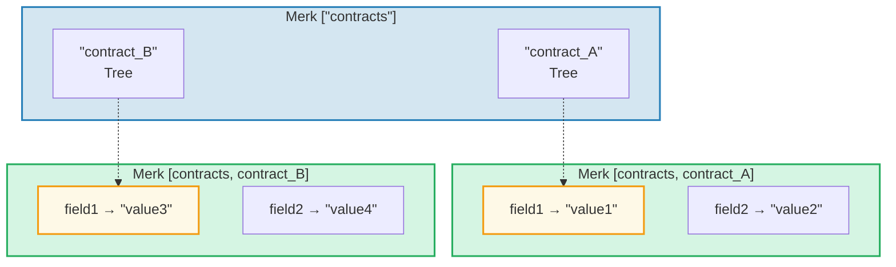
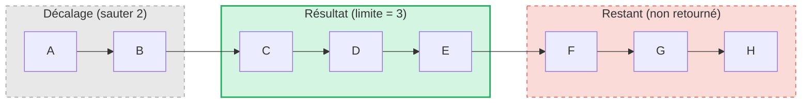

# Le système de requêtes

## Structure PathQuery

Les requêtes GroveDB utilisent le type `PathQuery`, qui combine un chemin (où chercher)
avec une requête (quoi sélectionner) :

```rust
pub struct PathQuery {
    pub path: Vec<Vec<u8>>,         // Starting path in the grove
    pub query: SizedQuery,          // What to select
}

pub struct SizedQuery {
    pub query: Query,               // The selection criteria
    pub limit: Option<u16>,         // Maximum number of results
    pub offset: Option<u16>,        // Skip first N results
}
```

## Le type Query

```rust
pub struct Query {
    pub items: Vec<QueryItem>,              // What to match
    pub default_subquery_branch: SubqueryBranch,
    pub conditional_subquery_branches: Option<IndexMap<QueryItem, SubqueryBranch>>,
    pub left_to_right: bool,                // Iteration direction
    pub add_parent_tree_on_subquery: bool,  // Include parent tree element in results (v2)
}
```

> **`add_parent_tree_on_subquery`** (v2) : Quand c'est `true`, l'élément de l'arbre parent (par ex.
> un CountTree ou SumTree) est inclus dans les résultats de la requête aux côtés des valeurs de ses enfants.
> Cela vous permet de récupérer à la fois les valeurs agrégées et les éléments individuels en une seule requête.

## QueryItems — Quoi sélectionner

Chaque `QueryItem` spécifie une clé ou une plage à matcher :

```rust
pub enum QueryItem {
    Key(Vec<u8>),                           // Exact key match
    Range(Range<Vec<u8>>),                  // Exclusive range [start..end)
    RangeInclusive(RangeInclusive<Vec<u8>>),// Inclusive range [start..=end]
    RangeFull(RangeFull),                   // All keys
    RangeFrom(RangeFrom<Vec<u8>>),          // [start..)
    RangeTo(RangeTo<Vec<u8>>),              // [..end)
    RangeToInclusive(RangeToInclusive<Vec<u8>>), // [..=end]
    RangeAfter(RangeFrom<Vec<u8>>),         // (start..) exclusive start
    RangeAfterTo(Range<Vec<u8>>),           // (start..end) exclusive both
    RangeAfterToInclusive(RangeInclusive<Vec<u8>>), // (start..=end]
}
```

Exemples de requêtes :

Arbre Merk (trié) : `alice  bob  carol  dave  eve  frank`

| Requête | Sélection | Résultat |
|-------|-----------|--------|
| `Key("bob")` | alice **[bob]** carol dave eve frank | bob |
| `RangeInclusive("bob"..="dave")` | alice **[bob carol dave]** eve frank | bob, carol, dave |
| `RangeAfter("carol"..)` | alice bob carol **[dave eve frank]** | dave, eve, frank |
| `RangeFull`, limit=2 | **[alice bob]** carol dave eve frank *(arrêté par la limite)* | alice, bob |
| `RangeFull`, limit=2, droite-à-gauche | alice bob carol dave **[eve frank]** *(arrêté par la limite)* | frank, eve |

## Sous-requêtes et branches conditionnelles

La vraie puissance des requêtes GroveDB réside dans les **sous-requêtes** — quand une requête correspond à un élément Tree,
la requête peut automatiquement descendre dans ce sous-arbre :



> **PathQuery :** `path: ["contracts"], query: RangeFull` avec `default_subquery: Key("field1")`
>
> **Exécution :**
> 1. `RangeFull` sur ["contracts"] -> correspond à contract_A, contract_B
> 2. Les deux sont des éléments Tree -> descendre avec la sous-requête `Key("field1")`
> 3. contract_A -> "value1", contract_B -> "value3"
>
> **Résultat :** `["value1", "value3"]`

Les **sous-requêtes conditionnelles** vous permettent d'appliquer différentes sous-requêtes selon la clé
qui a été matchée :

```rust
conditional_subquery_branches: Some(indexmap! {
    QueryItem::Key(b"contract_A".to_vec()) => SubqueryBranch {
        subquery: Some(Query { items: vec![Key(b"field1".to_vec())] }),
        ..
    },
    QueryItem::Key(b"contract_B".to_vec()) => SubqueryBranch {
        subquery: Some(Query { items: vec![Key(b"field2".to_vec())] }),
        ..
    },
})
```

Cela obtiendrait `field1` de `contract_A` mais `field2` de `contract_B`.

## Requêtes dimensionnées — Limite et décalage

L'enveloppe `SizedQuery` ajoute la pagination :



> `SizedQuery { query: RangeFull, limit: Some(3), offset: Some(2) }` -> Résultat : **[C, D, E]**

Combiné avec `left_to_right: false`, l'itération est inversée :

```text
    SizedQuery {
        query: Query { items: [RangeFull], left_to_right: false, .. },
        limit: Some(3),
        offset: None
    }

    Résultat : [H, G, F]
```

## Fusion de requêtes

Plusieurs PathQueries peuvent être fusionnées en une seule requête pour plus d'efficacité. L'algorithme de fusion
trouve les préfixes de chemin communs et combine les éléments de requête :

```text
    Requête A : path=["users"], query=Key("alice")
    Requête B : path=["users"], query=Key("bob")

    Fusionné : path=["users"], query=items=[Key("alice"), Key("bob")]
```

---
