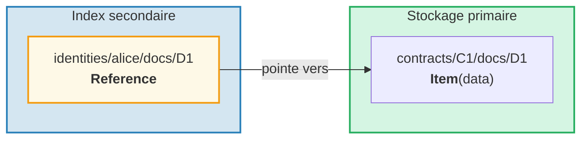
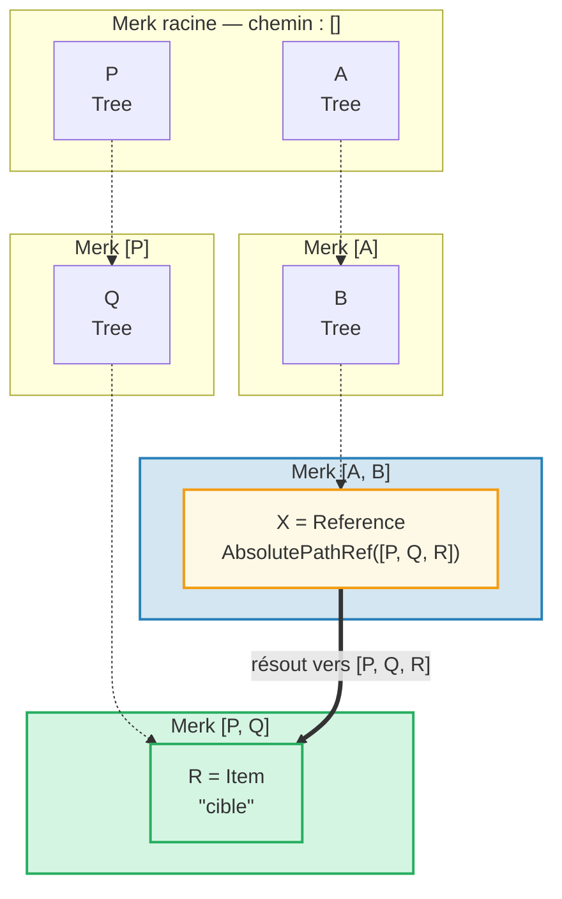
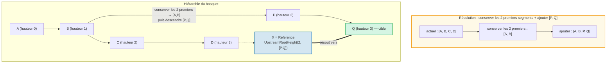
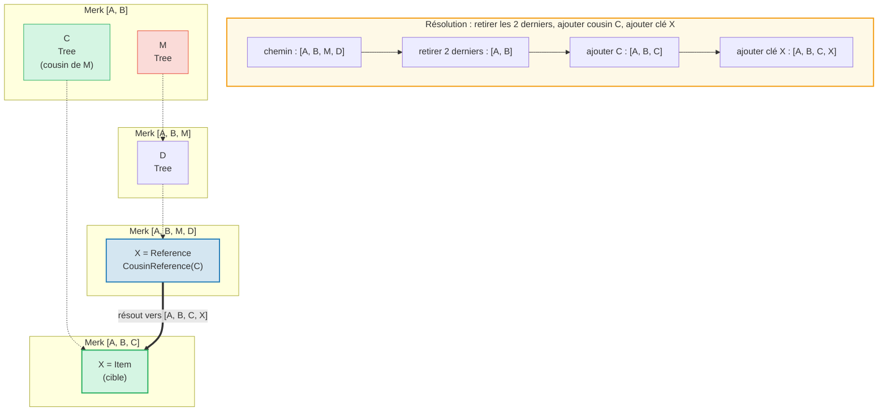
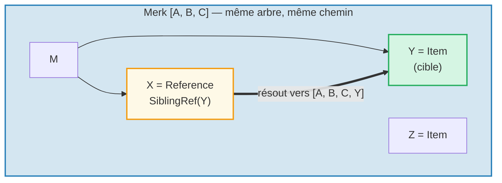
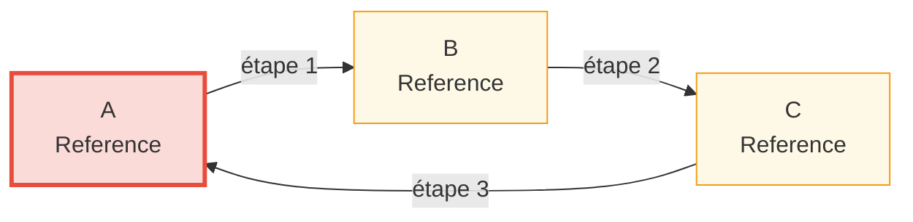

# Le système de références

## Pourquoi les références existent

Dans une base de données hiérarchique, on a souvent besoin que les mêmes données soient accessibles depuis plusieurs
chemins. Par exemple, les documents peuvent être stockés sous leur contrat mais aussi
interrogeables par identité du propriétaire. Les **références** sont la réponse de GroveDB — ce sont des
pointeurs d'un emplacement vers un autre, similaires aux liens symboliques dans un système de fichiers.



Propriétés clés :
- Les références sont **authentifiées** — le value_hash de la référence inclut à la fois la
  référence elle-même et l'élément référencé
- Les références peuvent être **chaînées** — une référence peut pointer vers une autre référence
- La détection de cycles empêche les boucles infinies
- Une limite de sauts configurable empêche l'épuisement des ressources

## Les sept types de références

```rust
// grovedb-element/src/reference_path/mod.rs
pub enum ReferencePathType {
    AbsolutePathReference(Vec<Vec<u8>>),
    UpstreamRootHeightReference(u8, Vec<Vec<u8>>),
    UpstreamRootHeightWithParentPathAdditionReference(u8, Vec<Vec<u8>>),
    UpstreamFromElementHeightReference(u8, Vec<Vec<u8>>),
    CousinReference(Vec<u8>),
    RemovedCousinReference(Vec<Vec<u8>>),
    SiblingReference(Vec<u8>),
}
```

Passons en revue chacun avec des diagrammes.

### AbsolutePathReference

Le type le plus simple. Stocke le chemin complet vers la cible :



> X stocke le chemin absolu complet `[P, Q, R]`. Peu importe où X est situé, il résout toujours vers la même cible.

### UpstreamRootHeightReference

Conserve les N premiers segments du chemin actuel, puis ajoute un nouveau chemin :



### UpstreamRootHeightWithParentPathAdditionReference

Comme UpstreamRootHeight, mais ré-ajoute le dernier segment du chemin actuel :

```text
    Référence au chemin [A, B, C, D, E] clé=X
    UpstreamRootHeightWithParentPathAdditionReference(2, [P, Q])

    Chemin actuel :        [A, B, C, D, E]
    Conserver les 2 premiers : [A, B]
    Ajouter [P, Q] :      [A, B, P, Q]
    Ré-ajouter le dernier :[A, B, P, Q, E]   ← "E" du chemin original rajouté

    Utile pour : les index où la clé du parent doit être préservée
```

### UpstreamFromElementHeightReference

Supprime les N derniers segments, puis ajoute :

```text
    Référence au chemin [A, B, C, D] clé=X
    UpstreamFromElementHeightReference(1, [P, Q])

    Chemin actuel :       [A, B, C, D]
    Supprimer le dernier : [A, B, C]
    Ajouter [P, Q] :     [A, B, C, P, Q]
```

### CousinReference

Remplace uniquement le parent immédiat par une nouvelle clé :



> Le « cousin » est un sous-arbre frère du grand-parent de la référence. La référence navigue vers le haut de deux niveaux, puis descend dans le sous-arbre cousin.

### RemovedCousinReference

Comme CousinReference mais remplace le parent par un chemin multi-segments :

```text
    Référence au chemin [A, B, C, D] clé=X
    RemovedCousinReference([M, N])

    Chemin actuel :   [A, B, C, D]
    Retirer parent C : [A, B]
    Ajouter [M, N] :  [A, B, M, N]
    Ajouter clé X :   [A, B, M, N, X]
```

### SiblingReference

La référence relative la plus simple — change juste la clé au sein du même parent :



> Le type de référence le plus simple. X et Y sont des frères dans le même arbre Merk — la résolution change simplement la clé tout en gardant le même chemin.

## Suivi de référence et limite de sauts

Lorsque GroveDB rencontre un élément Reference, il doit le **suivre** pour trouver la
valeur réelle. Comme les références peuvent pointer vers d'autres références, cela implique une boucle :

```rust
// grovedb/src/reference_path.rs
pub const MAX_REFERENCE_HOPS: usize = 10;

pub fn follow_reference(...) -> CostResult<ResolvedReference, Error> {
    let mut hops_left = MAX_REFERENCE_HOPS;
    let mut visited = HashSet::new();

    while hops_left > 0 {
        // Resolve reference path to absolute path
        let target_path = current_ref.absolute_qualified_path(...);

        // Check for cycles
        if !visited.insert(target_path.clone()) {
            return Err(Error::CyclicReference);
        }

        // Fetch element at target
        let element = Element::get(target_path);

        match element {
            Element::Reference(next_ref, ..) => {
                // Still a reference — keep following
                current_ref = next_ref;
                hops_left -= 1;
            }
            other => {
                // Found the actual element!
                return Ok(ResolvedReference { element: other, ... });
            }
        }
    }

    Err(Error::ReferenceLimit)  // Exceeded 10 hops
}
```

## Détection de cycles

Le `HashSet` `visited` trace tous les chemins déjà vus. Si nous rencontrons un chemin déjà
visité, nous avons un cycle :



> **Trace de détection de cycle :**
>
> | Étape | Suivi | ensemble visited | Résultat |
> |------|--------|-------------|--------|
> | 1 | Début à A | { A } | A est Ref, suivre |
> | 2 | A vers B | { A, B } | B est Ref, suivre |
> | 3 | B vers C | { A, B, C } | C est Ref, suivre |
> | 4 | C vers A | A déjà dans visited ! | **Error::CyclicRef** |
>
> Sans détection de cycle, cela bouclerait indéfiniment. `MAX_REFERENCE_HOPS = 10` limite aussi la profondeur de traversée pour les longues chaînes.

## Références dans Merk — Hachages de valeur combinés

Lorsqu'une Reference est stockée dans un arbre Merk, son `value_hash` doit authentifier
à la fois la structure de la référence et les données référencées :

```rust
// merk/src/tree/kv.rs
pub fn update_hashes_using_reference_value_hash(
    mut self,
    reference_value_hash: CryptoHash,
) -> CostContext<Self> {
    // Hash the reference element's own bytes
    let actual_value_hash = value_hash(self.value_as_slice());

    // Combine: H(reference_bytes) ⊕ H(referenced_data)
    let combined = combine_hash(&actual_value_hash, &reference_value_hash);

    self.value_hash = combined;
    self.hash = kv_digest_to_kv_hash(self.key(), self.value_hash());
    // ...
}
```

Cela signifie que modifier la référence elle-même OU les données qu'elle pointe
changera le hachage racine — les deux sont liés cryptographiquement.

---
