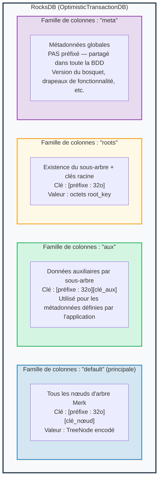
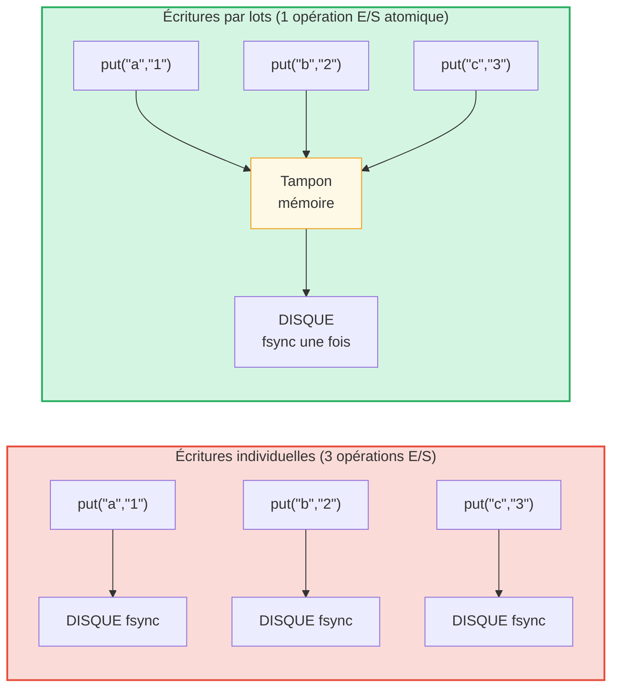

# La couche de stockage

## RocksDB avec OptimisticTransactionDB

GroveDB utilise **RocksDB** comme backend de stockage, plus précisément la
variante `OptimisticTransactionDB` qui supporte les transactions :

```rust
// storage/src/rocksdb_storage/storage.rs
pub(crate) type Db = OptimisticTransactionDB;
pub(crate) type Tx<'db> = Transaction<'db, Db>;

pub struct RocksDbStorage {
    db: OptimisticTransactionDB,
}
```

Les **transactions optimistes** fonctionnent en supposant qu'il n'y aura pas de conflits. Si deux
transactions modifient les mêmes données, la seconde à être validée échouera et pourra être
réessayée. C'est plus efficace que le verrouillage pessimiste pour les charges de travail où
les conflits sont rares.

Les options RocksDB sont ajustées pour la charge de travail de GroveDB :

```rust
lazy_static! {
    static ref DEFAULT_OPTS: rocksdb::Options = {
        let mut opts = rocksdb::Options::default();
        opts.create_if_missing(true);
        opts.increase_parallelism(num_cpus::get() as i32);
        opts.set_allow_mmap_writes(true);
        opts.set_allow_mmap_reads(true);
        opts.create_missing_column_families(true);
        opts.set_atomic_flush(true);
        opts
    };
}
```

## Quatre familles de colonnes

Les familles de colonnes (column families) de RocksDB agissent comme des espaces de noms clé-valeur séparés au sein d'une seule
base de données. GroveDB en utilise quatre :



> **Exemple :** La clé `[ab3fc2...][6e616d65]` dans la FC "default" correspond à `TreeNode{key:"name", val:"Al"}`, où `ab3fc2...` est `Blake3(path)` et `6e616d65` est `"name"` en octets.

```rust
pub(crate) const AUX_CF_NAME: &str = "aux";
pub(crate) const ROOTS_CF_NAME: &str = "roots";
pub(crate) const META_CF_NAME: &str = "meta";
// Main data uses the default column family
```

## Contextes de stockage préfixés

Chaque sous-arbre obtient son propre **contexte de stockage préfixé** — un enveloppe qui
ajoute automatiquement le préfixe Blake3 de 32 octets devant toutes les clés :

```text
    Chemin du sous-arbre : ["identities", "alice"]
    Préfixe : Blake3(chemin) = [0xab, 0x3f, 0xc2, ...]  (32 octets)

    Quand le sous-arbre stocke la clé "name" avec la valeur "Alice" :

    Clé RocksDB :    [0xab 0x3f 0xc2 ... (32 octets) | 0x6e 0x61 0x6d 0x65]
                      \_________préfixe________/       \_____"name"_____/

    Valeur RocksDB : [TreeNode encodé avec valeur "Alice"]
```

Les types de contexte :

```text
    Sans transaction :
    PrefixedRocksDbImmediateStorageContext
    └── Lit/écrit directement dans la BDD avec préfixe

    Avec transaction :
    PrefixedRocksDbTransactionContext
    └── Lit/écrit via une Transaction avec préfixe
```

Les deux implémentent le trait `StorageContext` :

```rust
pub trait StorageContext<'db> {
    fn get(&self, key: &[u8]) -> CostResult<Option<Vec<u8>>, Error>;
    fn get_aux(&self, key: &[u8]) -> CostResult<Option<Vec<u8>>, Error>;
    fn get_root(&self, key: &[u8]) -> CostResult<Option<Vec<u8>>, Error>;
    fn get_meta(&self, key: &[u8]) -> CostResult<Option<Vec<u8>>, Error>;
    fn put(&self, key: &[u8], value: &[u8], ...) -> CostResult<(), Error>;
    fn put_aux(&self, key: &[u8], value: &[u8], ...) -> CostResult<(), Error>;
    fn put_root(&self, key: &[u8], value: &[u8], ...) -> CostResult<(), Error>;
    fn put_meta(&self, key: &[u8], value: &[u8], ...) -> CostResult<(), Error>;
    fn delete(&self, key: &[u8], ...) -> CostResult<(), Error>;
    // ...
}
```

## Lots d'écriture et modèle transactionnel

Pour la performance, GroveDB accumule les écritures en lots (batches) :



> 3 syncs disque contre 1 sync disque = environ 3 fois plus rapide. Les écritures par lots sont aussi **atomiques** (tout ou rien).

Le `StorageBatch` accumule les opérations qui sont vidées ensemble :

```rust
pub struct StorageBatch {
    operations: RefCell<Vec<AbstractBatchOperation>>,
}
```

## Le patron critique commit_local()

Lors de l'utilisation de transactions, il y a un patron critique qui doit être respecté. Les écritures
au sein d'une transaction sont mises en tampon — elles ne sont pas visibles tant qu'elles ne sont pas validées :

```rust
// Patron CORRECT :
{
    let tx = db.start_transaction();
    let storage_ctx = db.get_transactional_storage_context(path, &tx);

    storage_ctx.put(key, value);  // Writes to transaction buffer

    drop(storage_ctx);            // Release borrow on tx
    tx.commit_local();            // Flush transaction to DB
}

// INCORRECT — les données sont perdues :
{
    let tx = db.start_transaction();
    let storage_ctx = db.get_transactional_storage_context(path, &tx);

    storage_ctx.put(key, value);  // Writes to transaction buffer

    // tx est détruit ici sans commit_local() !
    // Toutes les écritures sont ANNULÉES !
}
```

C'est particulièrement important car le `storage_ctx` emprunte la transaction.
Il faut `drop(storage_ctx)` avant de pouvoir appeler `tx.commit_local()`.

---
