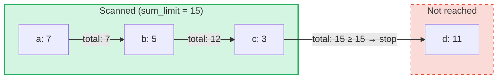

# Query Jumlah Agregat

## Ikhtisar

Query Jumlah Agregat adalah jenis query khusus yang dirancang untuk **SumTrees** di GroveDB.
Sementara query biasa mengambil elemen berdasarkan kunci atau rentang, query jumlah agregat
melakukan iterasi melalui elemen dan mengakumulasi nilai jumlahnya hingga **batas jumlah** tercapai.

Ini berguna untuk pertanyaan seperti:
- "Berikan saya transaksi sampai total berjalan melebihi 1000"
- "Item mana yang berkontribusi pada 500 unit nilai pertama di pohon ini?"
- "Kumpulkan item jumlah hingga anggaran sebesar N"

## Konsep Inti

### Perbedaan dengan Query Biasa

| Fitur | PathQuery | AggregateSumPathQuery |
|-------|-----------|----------------------|
| **Target** | Semua jenis elemen | Elemen SumItem / ItemWithSumItem |
| **Kondisi berhenti** | Limit (jumlah) atau akhir rentang | Batas jumlah (total berjalan) **dan/atau** batas item |
| **Mengembalikan** | Elemen atau kunci | Pasangan kunci-nilai jumlah |
| **Subquery** | Ya (turun ke subtree) | Tidak (satu level pohon) |
| **Referensi** | Diselesaikan oleh lapisan GroveDB | Opsional diikuti atau diabaikan |

### Struktur AggregateSumQuery

```rust
pub struct AggregateSumQuery {
    pub items: Vec<QueryItem>,              // Keys or ranges to scan
    pub left_to_right: bool,                // Iteration direction
    pub sum_limit: u64,                     // Stop when running total reaches this
    pub limit_of_items_to_check: Option<u16>, // Max number of matching items to return
}
```

Query ini dibungkus dalam `AggregateSumPathQuery` untuk menentukan lokasi pencarian di grove:

```rust
pub struct AggregateSumPathQuery {
    pub path: Vec<Vec<u8>>,                 // Path to the SumTree
    pub aggregate_sum_query: AggregateSumQuery,
}
```

### Batas Jumlah — Total Berjalan

`sum_limit` adalah konsep sentral. Saat elemen dipindai, nilai jumlahnya diakumulasi.
Setelah total berjalan mencapai atau melebihi batas jumlah, iterasi berhenti:



> **Hasil:** `[(a, 7), (b, 5), (c, 3)]` — iterasi berhenti karena 7 + 5 + 3 = 15 >= sum_limit

Nilai jumlah negatif didukung. Nilai negatif meningkatkan anggaran yang tersisa:

```text
sum_limit = 12, elements: a(10), b(-3), c(5)

a: total = 10, remaining = 2
b: total =  7, remaining = 5  ← negative value gave us more room
c: total = 12, remaining = 0  ← stop

Result: [(a, 10), (b, -3), (c, 5)]
```

## Opsi Query

Struct `AggregateSumQueryOptions` mengontrol perilaku query:

```rust
pub struct AggregateSumQueryOptions {
    pub allow_cache: bool,                              // Use cached reads (default: true)
    pub error_if_intermediate_path_tree_not_present: bool, // Error on missing path (default: true)
    pub error_if_non_sum_item_found: bool,              // Error on non-sum elements (default: true)
    pub ignore_references: bool,                        // Skip references (default: false)
}
```

### Penanganan Elemen Non-Sum

SumTrees dapat berisi campuran jenis elemen: `SumItem`, `Item`, `Reference`, `ItemWithSumItem`,
dan lainnya. Secara default, menemukan elemen non-sum dan non-referensi akan menghasilkan error.

Ketika `error_if_non_sum_item_found` diatur ke `false`, elemen non-sum **dilewati secara diam-diam**
tanpa mengonsumsi slot batas pengguna:

```text
Tree contents: a(SumItem=7), b(Item), c(SumItem=3)
Query: sum_limit=100, limit_of_items_to_check=2, error_if_non_sum_item_found=false

Scan: a(7) → returned, limit=1
      b(Item) → skipped, limit still 1
      c(3) → returned, limit=0 → stop

Result: [(a, 7), (c, 3)]
```

Catatan: Elemen `ItemWithSumItem` **selalu** diproses (tidak pernah dilewati), karena elemen tersebut
membawa nilai jumlah.

### Penanganan Referensi

Secara default, elemen `Reference` **diikuti** — query menyelesaikan rantai referensi
(hingga 3 lompatan perantara) untuk menemukan nilai jumlah elemen target:

```text
Tree contents: a(SumItem=7), ref_b(Reference → a)
Query: sum_limit=100

ref_b is followed → resolves to a(SumItem=7)

Result: [(a, 7), (ref_b, 7)]
```

Ketika `ignore_references` bernilai `true`, referensi dilewati secara diam-diam tanpa mengonsumsi
slot batas, mirip dengan cara elemen non-sum dilewati.

Rantai referensi yang lebih dalam dari 3 lompatan perantara menghasilkan error `ReferenceLimit`.

## Tipe Hasil

Query mengembalikan `AggregateSumQueryResult`:

```rust
pub struct AggregateSumQueryResult {
    pub results: Vec<(Vec<u8>, i64)>,       // Key-sum value pairs
    pub hard_limit_reached: bool,           // True if system limit truncated results
}
```

Flag `hard_limit_reached` menunjukkan apakah batas pemindaian keras sistem (default: 1024
elemen) tercapai sebelum query selesai secara alami. Ketika bernilai `true`, mungkin ada lebih
banyak hasil di luar yang dikembalikan.

## Tiga Sistem Batas

Query jumlah agregat memiliki **tiga** kondisi berhenti:

| Batas | Sumber | Apa yang dihitung | Efek saat tercapai |
|-------|--------|-------------------|---------------------|
| **sum_limit** | Pengguna (query) | Total berjalan dari nilai jumlah | Menghentikan iterasi |
| **limit_of_items_to_check** | Pengguna (query) | Item yang cocok yang dikembalikan | Menghentikan iterasi |
| **Batas pemindaian keras** | Sistem (GroveVersion, default 1024) | Semua elemen yang dipindai (termasuk yang dilewati) | Menghentikan iterasi, mengatur `hard_limit_reached` |

Batas pemindaian keras mencegah iterasi tanpa batas ketika tidak ada batas pengguna yang ditetapkan.
Elemen yang dilewati (item non-sum dengan `error_if_non_sum_item_found=false`, atau referensi
dengan `ignore_references=true`) dihitung terhadap batas pemindaian keras tetapi **tidak** terhadap
`limit_of_items_to_check` pengguna.

## Penggunaan API

### Query Sederhana

```rust
use grovedb::AggregateSumPathQuery;
use grovedb_merk::proofs::query::AggregateSumQuery;

// "Give me items from this SumTree until the total reaches 1000"
let query = AggregateSumQuery::new(1000, None);
let path_query = AggregateSumPathQuery {
    path: vec![b"my_tree".to_vec()],
    aggregate_sum_query: query,
};

let result = db.query_aggregate_sums(
    &path_query,
    true,   // allow_cache
    true,   // error_if_intermediate_path_tree_not_present
    None,   // transaction
    grove_version,
).unwrap().expect("query failed");

for (key, sum_value) in &result.results {
    println!("{}: {}", String::from_utf8_lossy(key), sum_value);
}
```

### Query dengan Opsi

```rust
use grovedb::{AggregateSumPathQuery, AggregateSumQueryOptions};
use grovedb_merk::proofs::query::AggregateSumQuery;

// Skip non-sum items and ignore references
let query = AggregateSumQuery::new(1000, Some(50));
let path_query = AggregateSumPathQuery {
    path: vec![b"mixed_tree".to_vec()],
    aggregate_sum_query: query,
};

let result = db.query_aggregate_sums_with_options(
    &path_query,
    AggregateSumQueryOptions {
        error_if_non_sum_item_found: false,  // skip Items, Trees, etc.
        ignore_references: true,              // skip References
        ..AggregateSumQueryOptions::default()
    },
    None,
    grove_version,
).unwrap().expect("query failed");

if result.hard_limit_reached {
    println!("Warning: results may be incomplete (hard limit reached)");
}
```

### Query Berbasis Kunci

Alih-alih memindai rentang, Anda dapat melakukan query terhadap kunci tertentu:

```rust
// Check the sum value of specific keys
let query = AggregateSumQuery::new_with_keys(
    vec![b"alice".to_vec(), b"bob".to_vec(), b"carol".to_vec()],
    u64::MAX,  // no sum limit
    None,      // no item limit
);
```

### Query Menurun

Iterasi dari kunci tertinggi ke terendah:

```rust
let query = AggregateSumQuery::new_descending(500, Some(10));
// Or: query.left_to_right = false;
```

## Referensi Konstruktor

| Konstruktor | Deskripsi |
|-------------|-----------|
| `new(sum_limit, limit)` | Rentang penuh, menaik |
| `new_descending(sum_limit, limit)` | Rentang penuh, menurun |
| `new_single_key(key, sum_limit)` | Pencarian kunci tunggal |
| `new_with_keys(keys, sum_limit, limit)` | Beberapa kunci spesifik |
| `new_with_keys_reversed(keys, sum_limit, limit)` | Beberapa kunci, menurun |
| `new_single_query_item(item, sum_limit, limit)` | Satu QueryItem (kunci atau rentang) |
| `new_with_query_items(items, sum_limit, limit)` | Beberapa QueryItem |

---
