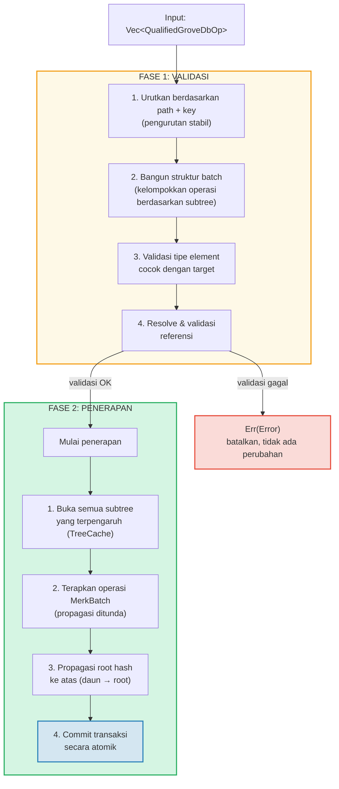
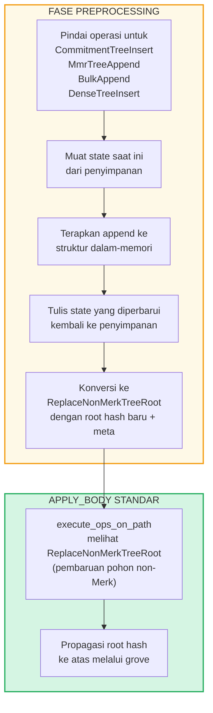

# Operasi Batch pada Tingkat Grove

## Varian GroveOp

Pada tingkat GroveDB, operasi direpresentasikan sebagai `GroveOp`:

```rust
pub enum GroveOp {
    // Operasi yang menghadap pengguna:
    InsertOnly { element: Element },
    InsertOrReplace { element: Element },
    Replace { element: Element },
    Patch { element: Element, change_in_bytes: i32 },
    RefreshReference { reference_path_type, max_reference_hop, flags, trust_refresh_reference },
    Delete,
    DeleteTree(TreeType),                          // Diparameterisasi berdasarkan tipe pohon

    // Operasi append pohon non-Merk (menghadap pengguna):
    CommitmentTreeInsert { cmx: [u8; 32], payload: Vec<u8> },
    MmrTreeAppend { value: Vec<u8> },
    BulkAppend { value: Vec<u8> },
    DenseTreeInsert { value: Vec<u8> },

    // Operasi internal (dibuat oleh preprocessing/propagasi, ditolak oleh from_ops):
    ReplaceTreeRootKey { hash, root_key, aggregate_data },
    InsertTreeWithRootHash { hash, root_key, flags, aggregate_data },
    ReplaceNonMerkTreeRoot { hash: [u8; 32], meta: NonMerkTreeMeta },
    InsertNonMerkTree { hash, root_key, flags, aggregate_data, meta: NonMerkTreeMeta },
}
```

**NonMerkTreeMeta** membawa state spesifik-tipe pohon melalui pemrosesan batch:

```rust
pub enum NonMerkTreeMeta {
    CommitmentTree { total_count: u64, chunk_power: u8 },
    MmrTree { mmr_size: u64 },
    BulkAppendTree { total_count: u64, chunk_power: u8 },
    DenseTree { count: u16, height: u8 },
}
```

Setiap operasi dibungkus dalam `QualifiedGroveDbOp` yang mencakup path:

```rust
pub struct QualifiedGroveDbOp {
    pub path: KeyInfoPath,           // Di mana dalam grove
    pub key: Option<KeyInfo>,        // Key mana (None untuk operasi pohon append-only)
    pub op: GroveOp,                 // Apa yang dilakukan
}
```

> **Catatan:** Field `key` adalah `Option<KeyInfo>` — bernilai `None` untuk operasi
> pohon append-only (`CommitmentTreeInsert`, `MmrTreeAppend`, `BulkAppend`, `DenseTreeInsert`)
> di mana key pohon adalah segmen terakhir dari `path`.

## Pemrosesan Dua Fase

Operasi batch diproses dalam dua fase:



## TreeCache dan Propagasi yang Ditunda

Selama penerapan batch, GroveDB menggunakan **TreeCache** untuk menunda propagasi root hash
sampai semua operasi dalam satu subtree selesai:

```mermaid
graph TD
    subgraph without["TANPA TreeCache (naif)"]
        w1["Op 1: Sisipkan A di X"]
        w1p["Propagasi X → induk → root"]
        w2["Op 2: Sisipkan B di X"]
        w2p["Propagasi X → induk → root"]
        w3["Op 3: Sisipkan C di X"]
        w3p["Propagasi X → induk → root"]
        w1 --> w1p --> w2 --> w2p --> w3 --> w3p
    end

    subgraph with_tc["DENGAN TreeCache (ditunda)"]
        t1["Op 1: Sisipkan A di X<br/>→ di-buffer"]
        t2["Op 2: Sisipkan B di X<br/>→ di-buffer"]
        t3["Op 3: Sisipkan C di X<br/>→ di-buffer"]
        tp["Propagasi X → induk → root<br/>(naik SEKALI)"]
        t1 --> t2 --> t3 --> tp
    end

    style without fill:#fadbd8,stroke:#e74c3c,stroke-width:2px
    style with_tc fill:#d5f5e3,stroke:#27ae60,stroke-width:2px
    style w1p fill:#fadbd8,stroke:#e74c3c
    style w2p fill:#fadbd8,stroke:#e74c3c
    style w3p fill:#fadbd8,stroke:#e74c3c
    style tp fill:#d5f5e3,stroke:#27ae60,stroke-width:2px
```



> **3 propagasi × O(kedalaman)** vs **1 propagasi × O(kedalaman)** = 3x lebih cepat untuk subtree ini.

Ini adalah optimasi signifikan ketika banyak operasi menargetkan subtree yang sama.

## Operasi Atomik Lintas-Subtree

Properti kunci batch GroveDB adalah **atomisitas lintas subtree**. Satu batch
dapat memodifikasi element di beberapa subtree, dan semua perubahan di-commit atau tidak sama sekali:

```text
    Batch:
    1. Hapus ["balances", "alice"]         (hapus saldo)
    2. Sisipkan ["balances", "bob"] = 100  (tambah saldo)
    3. Perbarui ["identities", "bob", "rev"] = 2  (perbarui revisi)

    Tiga subtree terpengaruh: balances, identities, identities/bob

    Jika operasi APA PUN gagal → SEMUA operasi dibatalkan
    Jika SEMUA berhasil → SEMUA di-commit secara atomik
```

Pemroses batch menangani ini dengan:
1. Mengumpulkan semua path yang terpengaruh
2. Membuka semua subtree yang dibutuhkan
3. Menerapkan semua operasi
4. Mempropagasi semua root hash dalam urutan ketergantungan
5. Meng-commit seluruh transaksi

## Preprocessing Batch untuk Pohon Non-Merk

Operasi CommitmentTree, MmrTree, BulkAppendTree, dan DenseAppendOnlyFixedSizeTree
memerlukan akses ke konteks penyimpanan di luar Merk, yang tidak tersedia di dalam
metode `execute_ops_on_path` standar (ia hanya memiliki akses ke Merk). Operasi ini
menggunakan **pola preprocessing**: sebelum fase `apply_body` utama, titik masuk
memindai operasi pohon non-Merk dan mengonversinya menjadi operasi internal standar.

```rust
pub enum GroveOp {
    // ... operasi standar ...

    // Operasi pohon non-Merk (menghadap pengguna):
    CommitmentTreeInsert { cmx: [u8; 32], payload: Vec<u8> },
    MmrTreeAppend { value: Vec<u8> },
    BulkAppend { value: Vec<u8> },
    DenseTreeInsert { value: Vec<u8> },

    // Operasi internal (dihasilkan oleh preprocessing):
    ReplaceNonMerkTreeRoot { hash: [u8; 32], meta: NonMerkTreeMeta },
}
```



**Mengapa preprocessing?** Fungsi `execute_ops_on_path` beroperasi pada satu
subtree Merk dan tidak memiliki akses ke `self.db` atau konteks penyimpanan yang lebih luas.
Preprocessing di titik masuk (`apply_batch_with_element_flags_update`,
`apply_partial_batch_with_element_flags_update`) memiliki akses penuh ke database,
sehingga dapat memuat/menyimpan data dan kemudian menyerahkan `ReplaceNonMerkTreeRoot`
sederhana ke mesin batch standar.

Setiap metode preprocessing mengikuti pola yang sama:
1. **`preprocess_commitment_tree_ops`** — Memuat frontier dan BulkAppendTree dari
   penyimpanan data, menambahkan ke keduanya, menyimpan kembali, mengonversi ke `ReplaceNonMerkTreeRoot`
   dengan root gabungan yang diperbarui dan meta `CommitmentTree { total_count, chunk_power }`
2. **`preprocess_mmr_tree_ops`** — Memuat MMR dari penyimpanan data, menambahkan value,
   menyimpan kembali, mengonversi ke `ReplaceNonMerkTreeRoot` dengan root MMR yang diperbarui
   dan meta `MmrTree { mmr_size }`
3. **`preprocess_bulk_append_ops`** — Memuat BulkAppendTree dari penyimpanan data,
   menambahkan value (mungkin memicu kompaksi chunk), menyimpan kembali, mengonversi ke
   `ReplaceNonMerkTreeRoot` dengan state root yang diperbarui dan meta `BulkAppendTree { total_count, chunk_power }`
4. **`preprocess_dense_tree_ops`** — Memuat DenseFixedSizedMerkleTree dari penyimpanan
   data, menyisipkan value secara berurutan, menghitung ulang root hash, menyimpan kembali,
   mengonversi ke `ReplaceNonMerkTreeRoot` dengan root hash yang diperbarui dan meta `DenseTree { count, height }`

Operasi `ReplaceNonMerkTreeRoot` membawa root hash baru dan enum `NonMerkTreeMeta`
sehingga element dapat direkonstruksi sepenuhnya setelah pemrosesan.

---
