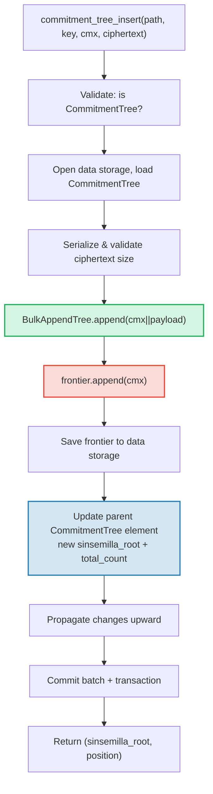

# CommitmentTree — Anchor Komitmen Sinsemilla

**CommitmentTree** adalah jembatan GroveDB antara penyimpanan terotentikasi dan
sistem bukti zero-knowledge (tanpa pengetahuan). Ia menggabungkan **BulkAppendTree** (Bab 14) untuk
penyimpanan data yang dikompaksi chunk secara efisien dengan **frontier Sinsemilla** di
namespace data untuk anchor yang kompatibel dengan ZK. Seperti MmrTree dan BulkAppendTree, ia
**tidak memiliki Merk anak** — root hash gabungan mengalir sebagai Merk child hash.
Baik entri BulkAppendTree maupun frontier Sinsemilla berada di **namespace
data**.

Bab ini mencakup fungsi hash Sinsemilla dan mengapa penting untuk
sirkuit zero-knowledge, struktur data frontier dan serialisasinya yang ringkas,
arsitektur penyimpanan dual-namespace, operasi GroveDB,
preprocessing batch, pembuatan witness sisi-klien, dan cara kerja proof.

## Mengapa Pohon Ramah-ZK?

Pohon standar GroveDB menggunakan hashing Blake3. Blake3 cepat di perangkat lunak, tetapi
**mahal di dalam sirkuit zero-knowledge**. Ketika pembelanja perlu membuktikan
"Saya mengetahui sebuah note di posisi P dalam commitment tree" tanpa mengungkapkan P, mereka
harus mengevaluasi fungsi hash Merkle 32 kali (sekali per level pohon) di dalam
sirkuit ZK.

Sinsemilla (dispesifikasikan dalam ZIP-244 untuk protokol Zcash Orchard) dirancang
tepat untuk kasus penggunaan ini — ia menyediakan **hashing efisien di dalam sirkuit** atas
kurva eliptik Pallas, satu setengah dari siklus kurva Pasta yang digunakan oleh sistem
bukti Halo 2.

| Properti | Blake3 | Sinsemilla |
|----------|--------|------------|
| **Biaya sirkuit** | ~25.000 constraint per hash | ~800 constraint per hash |
| **Kecepatan perangkat lunak** | Sangat cepat (~2 GB/s) | Lambat (~10.000 hash/s) |
| **Struktur aljabar** | Tidak ada (bitwise) | Operasi titik kurva Pallas |
| **Tujuan utama** | Hashing umum, pohon Merkle | Proof Merkle di dalam sirkuit |
| **Digunakan oleh** | Pohon Merk GroveDB, MMR, Bulk | Protokol terlindung Orchard |
| **Ukuran output** | 32 byte | 32 byte (elemen field Pallas) |

CommitmentTree menggunakan Sinsemilla untuk pohon Merkle yang diproses oleh sirkuit ZK,
sementara tetap menggunakan Blake3 untuk hierarki Merk GroveDB di atasnya.
Item yang disisipkan ke pohon disimpan melalui BulkAppendTree di namespace
data (dikompaksi chunk, dapat diambil berdasarkan posisi) dan secara bersamaan ditambahkan
ke frontier Sinsemilla (menghasilkan anchor yang dapat dibuktikan dengan ZK).

## Arsitektur Namespace Data

CommitmentTree menyimpan **semua data di namespace data** pada path
subtree yang sama. Seperti MmrTree dan BulkAppendTree, ia **tidak memiliki Merk anak** (tidak ada field `root_key`
— root spesifik-tipe mengalir sebagai Merk child hash). Entri BulkAppendTree dan frontier Sinsemilla berdampingan
di namespace data menggunakan prefiks key yang berbeda:

```text
┌──────────────────────────────────────────────────────────────┐
│                       CommitmentTree                          │
│                                                               │
│  ┌─────────────────────────────────────────────────────────┐  │
│  │  Data Namespace                                         │  │
│  │                                                         │  │
│  │  BulkAppendTree storage (Chapter 14):                   │  │
│  │    Buffer entries → chunk blobs → chunk MMR             │  │
│  │    value = cmx (32 bytes) || ciphertext (216 bytes)     │  │
│  │                                                         │  │
│  │  Sinsemilla Frontier (~1KB):                            │  │
│  │    key: b"__ct_data__" (COMMITMENT_TREE_DATA_KEY)       │  │
│  │    Depth-32 incremental Merkle tree                     │  │
│  │    Stores only the rightmost path (leaf + ommers)       │  │
│  │    O(1) append, O(1) root computation                   │  │
│  │    Produces Orchard-compatible Anchor for ZK proofs     │  │
│  └─────────────────────────────────────────────────────────┘  │
│                                                               │
│  sinsemilla_root embedded in Element bytes                    │
│    → flows through Merk value_hash → GroveDB state root      │
└──────────────────────────────────────────────────────────────┘
```

**Mengapa dua struktur?** BulkAppendTree menyediakan penyimpanan dan pengambilan
yang efisien dan dikompaksi chunk untuk potensi jutaan note terenkripsi. Frontier
Sinsemilla menyediakan anchor yang kompatibel dengan ZK yang dapat dibuktikan di dalam
sirkuit Halo 2. Keduanya diperbarui secara sinkron pada setiap append.

Bandingkan dengan tipe pohon non-standar lainnya:

| | CommitmentTree | MmrTree | BulkAppendTree |
|---|---|---|---|
| **Merk Anak** | Tidak | Tidak | Tidak |
| **Namespace data** | Entri BulkAppendTree + frontier | Node MMR | Buffer + chunk + MMR |
| **Namespace aux** | — | — | — |
| **Item dapat di-query** | Melalui proof V1 | Melalui proof V1 | Melalui proof V1 |
| **Fungsi hash** | Sinsemilla + Blake3 | Blake3 | Blake3 |

## Frontier Sinsemilla

Frontier adalah pohon Merkle inkremental kedalaman-32 yang diimplementasikan oleh
tipe `Frontier<MerkleHashOrchard, 32>` dari crate `incrementalmerkletree`. Alih-alih
menyimpan semua 2^32 daun yang mungkin, ia hanya menyimpan informasi yang diperlukan untuk
**menambahkan daun berikutnya dan menghitung root saat ini**: daun paling kanan dan
ommer-nya (hash sibling yang diperlukan untuk komputasi root).

```text
                         root (level 32)
                        /               \
                      ...               ...
                     /                     \
                  (level 2)             (level 2)
                  /     \               /     \
              (level 1) (level 1)   (level 1)  ?
              /    \    /    \      /    \
             L0    L1  L2    L3   L4    ?     ← frontier stores L4
                                              + ommers at levels
                                              where left sibling exists
```

Frontier menyimpan:
- **leaf**: nilai yang paling baru ditambahkan (elemen field Pallas)
- **ommers**: hash sibling-kiri di setiap level di mana jalur frontier
  berbelok ke kanan (paling banyak 32 ommer untuk pohon kedalaman-32)
- **position**: posisi 0-indexed dari daun

Properti kunci:
- **O(1) append**: sisipkan daun baru, perbarui ommer, hitung ulang root
- **O(1) root**: traversal ommer yang tersimpan dari daun ke root
- **~1KB ukuran konstan**: terlepas dari berapa banyak daun yang telah ditambahkan
- **Deterministik**: dua frontier dengan urutan append yang sama menghasilkan
  root yang sama

Konstanta `EMPTY_SINSEMILLA_ROOT` adalah root dari pohon kedalaman-32 kosong,
dipra-hitung sebagai `MerkleHashOrchard::empty_root(Level::from(32)).to_bytes()`:

```text
0xae2935f1dfd8a24aed7c70df7de3a668eb7a49b1319880dde2bbd9031ae5d82f
```

## Cara Kerja Penambahan — Kaskade Ommer

Ketika komitmen baru ditambahkan di posisi N, jumlah ommer yang harus
diperbarui sama dengan `trailing_ones(N)` — jumlah bit-1 di belakang dalam
representasi biner N. Ini adalah pola yang sama dengan kaskade penggabungan MMR
(bagian 13.4), tetapi beroperasi pada ommer bukan peak.

**Contoh kerja — menambahkan 4 daun:**

```text
Position 0 (binary: 0, trailing_ones: 0):
  frontier = { leaf: L0, ommers: [], position: 0 }
  Sinsemilla hashes: 32 (root computation) + 0 (no ommer merges) = 32

Position 1 (binary: 1, trailing_ones: 0 of PREVIOUS position 0):
  Before: position 0 has trailing_ones = 0
  frontier = { leaf: L1, ommers: [H(L0,L1) at level 1], position: 1 }
  Sinsemilla hashes: 32 + 0 = 32

Position 2 (binary: 10, trailing_ones: 0 of PREVIOUS position 1):
  Before: position 1 has trailing_ones = 1
  frontier = { leaf: L2, ommers: [level1_hash], position: 2 }
  Sinsemilla hashes: 32 + 1 = 33

Position 3 (binary: 11, trailing_ones: 0 of PREVIOUS position 2):
  Before: position 2 has trailing_ones = 0
  frontier = { leaf: L3, ommers: [level1_hash, level2_hash], position: 3 }
  Sinsemilla hashes: 32 + 0 = 32
```

**Total hash Sinsemilla** per append adalah:

```text
32 (root computation always traverses all 32 levels)
+ trailing_ones(current_position)  (ommer cascade)
```

Rata-rata, `trailing_ones` adalah ~1 (distribusi geometrik), sehingga biaya rata-rata
adalah **~33 hash Sinsemilla per append**. Kasus terburuk (di posisi
2^32 - 1, di mana semua bit adalah 1) adalah **64 hash**.

## Format Serialisasi Frontier

Frontier disimpan di penyimpanan data pada key `b"__ct_data__"`. Format
wire-nya adalah:

```text
┌──────────────────────────────────────────────────────────────────┐
│ has_frontier: u8                                                  │
│   0x00 → empty tree (no more fields)                             │
│   0x01 → non-empty (fields follow)                               │
├──────────────────────────────────────────────────────────────────┤
│ position: u64 BE (8 bytes)      — 0-indexed leaf position        │
├──────────────────────────────────────────────────────────────────┤
│ leaf: [u8; 32]                  — Pallas field element bytes     │
├──────────────────────────────────────────────────────────────────┤
│ ommer_count: u8                 — number of ommers (0..=32)      │
├──────────────────────────────────────────────────────────────────┤
│ ommers: [ommer_count × 32 bytes] — Pallas field elements        │
└──────────────────────────────────────────────────────────────────┘
```

**Analisis ukuran:**

| State | Ukuran | Rincian |
|-------|------|-----------|
| Kosong | 1 byte | Flag `0x00` saja |
| 1 daun, 0 ommer | 42 byte | 1 + 8 + 32 + 1 |
| ~16 ommer (rata-rata) | 554 byte | 1 + 8 + 32 + 1 + 16x32 |
| 32 ommer (maksimum) | 1.066 byte | 1 + 8 + 32 + 1 + 32x32 |

Ukuran frontier dibatasi oleh ~1,1KB terlepas dari berapa juta
komitmen yang telah ditambahkan. Ini membuat siklus muat-modifikasi-simpan sangat
murah (1 seek untuk membaca, 1 seek untuk menulis).

## Representasi Element

```rust
CommitmentTree(
    u64,                  // total_count: number of appended items
    u8,                   // chunk_power: dense tree height for BulkAppendTree buffer
    Option<ElementFlags>, // flags: optional metadata
)
```

Parameter `chunk_power` mengontrol tinggi dense tree buffer BulkAppendTree;
`chunk_power` harus dalam rentang 1..=16 (lihat bagian 14.1 dan 16).

**Pengidentifikasi tipe:**

| Pengidentifikasi | Nilai |
|---|---|
| Diskriminan Element | 11 |
| `TreeType` | `CommitmentTree = 7` |
| `ElementType` | 11 |
| `COMMITMENT_TREE_COST_SIZE` | 12 byte (8 total_count + 1 chunk_power + 1 diskriminan + 2 overhead) |

Root Sinsemilla TIDAK disimpan dalam Element. Ia mengalir sebagai Merk child hash
melalui mekanisme `insert_subtree`. Ketika Merk induk menghitung
`combined_value_hash`-nya, root yang diturunkan dari Sinsemilla disertakan sebagai child hash:

```text
combined_value_hash = blake3(value_hash || child_hash)
                                           ↑ sinsemilla/BulkAppendTree combined root
```

Ini berarti perubahan apa pun pada frontier Sinsemilla secara otomatis merambat
melalui hierarki Merk GroveDB ke state root.

**Metode constructor:**

| Metode | Membuat |
|---|---|
| `Element::empty_commitment_tree(chunk_power)` | Pohon kosong, count=0, tanpa flag |
| `Element::empty_commitment_tree_with_flags(chunk_power, flags)` | Pohon kosong dengan flag |
| `Element::new_commitment_tree(total_count, chunk_power, flags)` | Semua field eksplisit |

## Arsitektur Penyimpanan

CommitmentTree menyimpan semua datanya dalam satu **namespace data** pada
path subtree. Entri BulkAppendTree dan frontier Sinsemilla berdampingan di
kolom yang sama menggunakan prefiks key yang berbeda. Tidak ada namespace aux yang digunakan.

```text
┌──────────────────────────────────────────────────────────────────┐
│  Data Namespace (all CommitmentTree storage)                      │
│                                                                   │
│  BulkAppendTree storage keys (see §14.7):                         │
│    b"m" || pos (u64 BE)  → MMR node blobs                        │
│    b"b" || index (u64 BE)→ buffer entries (cmx || ciphertext)     │
│    b"e" || chunk (u64 BE)→ chunk blobs (compacted buffer)         │
│    b"M"                  → BulkAppendTree metadata                │
│                                                                   │
│  Sinsemilla frontier:                                             │
│    b"__ct_data__"        → serialized CommitmentFrontier (~1KB)   │
│                                                                   │
│  No Merk nodes — this is a non-Merk tree.                         │
│  Data authenticated via BulkAppendTree state_root (Blake3).       │
│  Sinsemilla root authenticates all cmx values via Pallas curve.   │
└──────────────────────────────────────────────────────────────────┘
```

**Pola muat-modifikasi-simpan**: Setiap operasi yang memutasi memuat frontier
dari penyimpanan data, memodifikasinya di memori, dan menulisnya kembali. Karena frontier
berukuran paling banyak ~1KB, ini adalah sepasang operasi I/O yang murah (1 seek untuk membaca,
1 seek untuk menulis). Secara bersamaan, BulkAppendTree dimuat, di-append,
dan disimpan.

**Propagasi root hash**: Ketika item disisipkan, dua hal berubah:
1. State BulkAppendTree berubah (entri baru di buffer atau kompaksi chunk)
2. Root Sinsemilla berubah (komitmen baru di frontier)

Keduanya ditangkap dalam element `CommitmentTree` yang diperbarui. Hash node Merk induk
menjadi:

```text
combined_hash = combine_hash(
    value_hash(element_bytes),    ← includes total_count + chunk_power
    child_hash(combined_root)     ← sinsemilla/BulkAppendTree combined root
)
```

Seperti MmrTree dan BulkAppendTree, root spesifik-tipe mengalir sebagai Merk child
hash. Semua autentikasi data mengalir melalui pengikatan child hash ini.

**Implikasi penyimpanan data non-Merk**: Karena namespace data berisi
key BulkAppendTree (bukan node Merk), operasi yang mengiterasi penyimpanan sebagai
element Merk — seperti `find_subtrees`, `is_empty_tree`, dan
`verify_merk_and_submerks` — harus menangani CommitmentTree sebagai kasus khusus (dan tipe
pohon non-Merk lainnya). Helper `uses_non_merk_data_storage()` pada `Element` dan
`TreeType` mengidentifikasi tipe pohon ini. Operasi hapus membersihkan
namespace data secara langsung alih-alih mengiterasinya, dan verify_grovedb melewatkan
rekursi sub-merk untuk tipe ini.

## Operasi GroveDB

CommitmentTree menyediakan empat operasi. Operasi insert bersifat generik atas
`M: MemoSize` (dari crate `orchard`), yang mengontrol validasi ukuran payload
ciphertext. Default `M = DashMemo` memberikan payload 216 byte
(32 epk + 104 enc + 80 out).

```rust
// Insert a commitment (typed) — returns (sinsemilla_root, position)
// M controls ciphertext size validation
db.commitment_tree_insert::<_, _, M>(path, key, cmx, ciphertext, tx, version)

// Insert a commitment (raw bytes) — validates payload.len() == ciphertext_payload_size::<DashMemo>()
db.commitment_tree_insert_raw(path, key, cmx, payload_vec, tx, version)

// Get the current Orchard Anchor
db.commitment_tree_anchor(path, key, tx, version)

// Retrieve a value by global position
db.commitment_tree_get_value(path, key, position, tx, version)

// Get the current item count
db.commitment_tree_count(path, key, tx, version)
```

Insert bertipe `commitment_tree_insert` menerima `TransmittedNoteCiphertext<M>` dan
menyerialisasinya secara internal. Insert mentah `commitment_tree_insert_raw` (pub(crate))
menerima `Vec<u8>` dan digunakan oleh preprocessing batch di mana payload sudah
diserialisasi.

### commitment_tree_insert

Operasi insert memperbarui baik BulkAppendTree maupun frontier
Sinsemilla dalam satu operasi atomik:

```text
Step 1: Validate element at path/key is a CommitmentTree
        → extract total_count, chunk_power, flags

Step 2: Build ct_path = path ++ [key]

Step 3: Open data storage context at ct_path
        Load CommitmentTree (frontier + BulkAppendTree)
        Serialize ciphertext → validate payload size matches M
        Append cmx||ciphertext to BulkAppendTree
        Append cmx to Sinsemilla frontier → get new sinsemilla_root
        Track Blake3 + Sinsemilla hash costs

Step 4: Save updated frontier to data storage

Step 5: Open parent Merk at path
        Write updated CommitmentTree element:
          new total_count, same chunk_power, same flags
        Child hash = combined_root (sinsemilla + bulk state)

Step 6: Propagate changes from parent upward through Merk hierarchy

Step 7: Commit storage batch and local transaction
        Return (sinsemilla_root, position)
```



> **Merah** = Operasi Sinsemilla. **Hijau** = Operasi BulkAppendTree.
> **Biru** = pembaruan element yang menjembatani keduanya.

### commitment_tree_anchor

Operasi anchor adalah query read-only:

```text
Step 1: Validate element at path/key is a CommitmentTree
Step 2: Build ct_path = path ++ [key]
Step 3: Load frontier from data storage
Step 4: Return frontier.anchor() as orchard::tree::Anchor
```

Tipe `Anchor` adalah representasi native Orchard dari root Sinsemilla,
cocok untuk diteruskan langsung ke `orchard::builder::Builder` saat membuat
proof otorisasi pembelanjaan.

### commitment_tree_get_value

Mengambil nilai yang tersimpan (cmx || payload) berdasarkan posisi globalnya:

```text
Step 1: Validate element at path/key is a CommitmentTree
        → extract total_count, chunk_power
Step 2: Build ct_path = path ++ [key]
Step 3: Open data storage context, wrap in CachedBulkStore
Step 4: Load BulkAppendTree, call get_value(position)
Step 5: Return Option<Vec<u8>>
```

Ini mengikuti pola yang sama seperti `bulk_get_value` (bagian 14.9) — BulkAppendTree
secara transparan mengambil dari buffer atau chunk blob yang dikompaksi tergantung pada
di mana posisi tersebut berada.

### commitment_tree_count

Mengembalikan jumlah total item yang ditambahkan ke pohon:

```text
Step 1: Read element at path/key
Step 2: Verify it is a CommitmentTree
Step 3: Return total_count from element fields
```

Ini adalah pembacaan field element sederhana — tidak ada akses penyimpanan selain Merk induk.

## Operasi Batch

CommitmentTree mendukung penyisipan batch melalui varian `GroveOp::CommitmentTreeInsert`:

```rust
GroveOp::CommitmentTreeInsert {
    cmx: [u8; 32],      // extracted note commitment
    payload: Vec<u8>,    // serialized ciphertext (216 bytes for DashMemo)
}
```

Dua constructor membuat operasi ini:

```rust
// Raw constructor — caller serializes payload manually
QualifiedGroveDbOp::commitment_tree_insert_op(path, cmx, payload_vec)

// Typed constructor — serializes TransmittedNoteCiphertext<M> internally
QualifiedGroveDbOp::commitment_tree_insert_op_typed::<M>(path, cmx, &ciphertext)
```

Beberapa insert yang menargetkan pohon yang sama diizinkan dalam satu batch. Karena
`execute_ops_on_path` tidak memiliki akses ke penyimpanan data, semua operasi CommitmentTree
harus diproses terlebih dahulu sebelum `apply_body`.

**Pipeline preprocessing** (`preprocess_commitment_tree_ops`):

```text
Input: [CTInsert{cmx1}, Insert{...}, CTInsert{cmx2}, CTInsert{cmx3}]
                                       ↑ same (path,key) as cmx1

Step 1: Group CommitmentTreeInsert ops by (path, key)
        group_1: [cmx1, cmx2, cmx3]

Step 2: For each group:
        a. Read existing element → verify CommitmentTree, extract chunk_power
        b. Open transactional storage context at ct_path
        c. Load CommitmentTree from data storage (frontier + BulkAppendTree)
        d. For each (cmx, payload):
           - ct.append_raw(cmx, payload) — validates size, appends to both
        e. Save updated frontier to data storage

Step 3: Replace all CTInsert ops with one ReplaceNonMerkTreeRoot per group
        carrying: hash=bulk_state_root (combined root),
                  meta=NonMerkTreeMeta::CommitmentTree {
                      total_count: new_count,
                      chunk_power,
                  }

Output: [ReplaceNonMerkTreeRoot{...}, Insert{...}]
```

Operasi CommitmentTreeInsert pertama di setiap grup digantikan oleh
`ReplaceNonMerkTreeRoot`; operasi berikutnya untuk (path, key) yang sama dibuang.
Mesin batch standar kemudian menangani pembaruan element dan propagasi
root hash.

## Generik MemoSize dan Penanganan Ciphertext

Struct `CommitmentTree<S, M>` bersifat generik atas `M: MemoSize` (dari crate
`orchard`). Ini mengontrol ukuran ciphertext note terenkripsi yang disimpan
bersama setiap komitmen.

```rust
pub struct CommitmentTree<S, M: MemoSize = DashMemo> {
    frontier: CommitmentFrontier,
    pub bulk_tree: BulkAppendTree<S>,
    _memo: PhantomData<M>,
}
```

Default `M = DashMemo` berarti kode yang tidak peduli tentang ukuran memo
(seperti `verify_grovedb`, `commitment_tree_anchor`, `commitment_tree_count`)
bekerja tanpa menentukan `M`.

**Format entri yang disimpan**: Setiap entri di BulkAppendTree adalah
`cmx (32 byte) || ciphertext_payload`, di mana tata letak payload adalah:

```text
epk_bytes (32) || enc_ciphertext (variable by M) || out_ciphertext (80)
```

Untuk `DashMemo`: `32 + 104 + 80 = 216 byte` payload, sehingga setiap entri adalah
`32 + 216 = 248 byte` total.

**Helper serialisasi** (fungsi bebas publik):

| Fungsi | Deskripsi |
|----------|-------------|
| `ciphertext_payload_size::<M>()` | Ukuran payload yang diharapkan untuk `MemoSize` tertentu |
| `serialize_ciphertext::<M>(ct)` | Serialisasi `TransmittedNoteCiphertext<M>` ke byte |
| `deserialize_ciphertext::<M>(data)` | Deserialisasi byte kembali ke `TransmittedNoteCiphertext<M>` |

**Validasi payload**: Metode `append_raw()` memvalidasi bahwa
`payload.len() == ciphertext_payload_size::<M>()` dan mengembalikan
`CommitmentTreeError::InvalidPayloadSize` pada ketidakcocokan. Metode `append()` bertipe
menyerialisasi secara internal, sehingga ukuran selalu benar secara konstruksi.

## Pembuatan Witness Sisi-Klien

Crate `grovedb-commitment-tree` menyediakan pohon **sisi-klien** untuk wallet
dan test harness yang perlu menghasilkan jalur witness Merkle untuk membelanjakan note.
Aktifkan fitur `client` untuk menggunakannya:

```toml
grovedb-commitment-tree = { version = "4", features = ["client"] }
```

```rust
pub struct ClientMemoryCommitmentTree {
    inner: ShardTree<MemoryShardStore<MerkleHashOrchard, u32>, 32, 4>,
}
```

`ClientMemoryCommitmentTree` membungkus `ShardTree` — pohon komitmen lengkap (bukan hanya
frontier) yang menyimpan riwayat lengkap di memori. Ini memungkinkan pembuatan
jalur autentikasi untuk daun yang ditandai mana pun, yang tidak dapat dilakukan oleh frontier saja.

**API:**

| Metode | Deskripsi |
|---|---|
| `new(max_checkpoints)` | Buat pohon kosong dengan batas retensi checkpoint |
| `append(cmx, retention)` | Tambahkan komitmen dengan kebijakan retensi |
| `checkpoint(id)` | Buat checkpoint pada state saat ini |
| `max_leaf_position()` | Posisi daun yang paling baru ditambahkan |
| `witness(position, depth)` | Hasilkan `MerklePath` untuk membelanjakan note |
| `anchor()` | Root saat ini sebagai `orchard::tree::Anchor` |

**Kebijakan retensi** mengontrol daun mana yang dapat di-witness nantinya:

| Retensi | Arti |
|---|---|
| `Retention::Ephemeral` | Daun tidak dapat di-witness (note orang lain) |
| `Retention::Marked` | Daun dapat di-witness (note Anda sendiri) |
| `Retention::Checkpoint { id, marking }` | Buat checkpoint, opsional tandai |

**Perbandingan Server vs Klien:**

| | `CommitmentFrontier` (server) | `ClientMemoryCommitmentTree` (klien) | `ClientPersistentCommitmentTree` (sqlite) |
|---|---|---|---|
| **Penyimpanan** | ~1KB frontier di penyimpanan data | Pohon lengkap di memori | Pohon lengkap di SQLite |
| **Dapat witness** | Tidak | Ya (hanya daun yang ditandai) | Ya (hanya daun yang ditandai) |
| **Dapat menghitung anchor** | Ya | Ya | Ya |
| **Anchor cocok** | Urutan sama → anchor sama | Urutan sama → anchor sama | Urutan sama → anchor sama |
| **Persisten antar restart** | Ya (penyimpanan data GroveDB) | Tidak (hilang saat drop) | Ya (database SQLite) |
| **Kasus penggunaan** | Pelacakan anchor sisi-server GroveDB | Testing, wallet sementara | Wallet produksi |
| **Flag fitur** | `server` | `client` | `sqlite` |

Ketiganya menghasilkan **anchor yang identik** untuk urutan append yang sama. Ini
diverifikasi oleh tes `test_frontier_and_client_same_root`.

### Klien Persisten — Pembuatan Witness Berbasis SQLite

`ClientMemoryCommitmentTree` dalam-memori kehilangan semua state saat di-drop. Untuk
wallet produksi yang harus bertahan saat restart tanpa memindai ulang seluruh
blockchain, crate menyediakan `ClientPersistentCommitmentTree` yang didukung oleh
SQLite. Aktifkan fitur `sqlite`:

```toml
grovedb-commitment-tree = { version = "4", features = ["sqlite"] }
```

```rust
pub struct ClientPersistentCommitmentTree {
    inner: ShardTree<SqliteShardStore, 32, 4>,
}
```

**Tiga mode constructor:**

| Constructor | Deskripsi |
|---|---|
| `open(conn, max_checkpoints)` | Mengambil kepemilikan `rusqlite::Connection` yang ada |
| `open_on_shared_connection(arc, max_checkpoints)` | Berbagi `Arc<Mutex<Connection>>` dengan komponen lain |
| `open_path(path, max_checkpoints)` | Kemudahan — membuka/membuat DB SQLite di path file yang diberikan |

Constructor bawa-koneksi-sendiri (`open`, `open_on_shared_connection`)
memungkinkan wallet menggunakan **database yang sudah ada** untuk penyimpanan commitment tree.
`SqliteShardStore` membuat tabelnya dengan prefiks `commitment_tree_`, sehingga
berdampingan dengan aman bersama tabel aplikasi lainnya.

**API** identik dengan `ClientMemoryCommitmentTree`:

| Metode | Deskripsi |
|---|---|
| `append(cmx, retention)` | Tambahkan komitmen dengan kebijakan retensi |
| `checkpoint(id)` | Buat checkpoint pada state saat ini |
| `max_leaf_position()` | Posisi daun yang paling baru ditambahkan |
| `witness(position, depth)` | Hasilkan `MerklePath` untuk membelanjakan note |
| `anchor()` | Root saat ini sebagai `orchard::tree::Anchor` |

**Skema SQLite** (4 tabel, dibuat secara otomatis):

```sql
commitment_tree_shards                -- Shard data (serialized prunable trees)
commitment_tree_cap                   -- Tree cap (single-row, top of shard tree)
commitment_tree_checkpoints           -- Checkpoint metadata (position or empty)
commitment_tree_checkpoint_marks_removed  -- Marks removed per checkpoint
```

**Contoh persistensi:**

```rust
use grovedb_commitment_tree::{ClientPersistentCommitmentTree, Retention, Position};

// Sesi pertama: tambahkan note dan tutup
let mut tree = ClientPersistentCommitmentTree::open_path("wallet.db", 100)?;
tree.append(cmx_0, Retention::Marked)?;
tree.append(cmx_1, Retention::Ephemeral)?;
let anchor_before = tree.anchor()?;
drop(tree);

// Sesi kedua: buka kembali, state dipertahankan
let tree = ClientPersistentCommitmentTree::open_path("wallet.db", 100)?;
let anchor_after = tree.anchor()?;
assert_eq!(anchor_before, anchor_after);  // anchor sama, tidak perlu scan ulang
```

**Contoh koneksi bersama** (untuk wallet dengan database SQLite yang sudah ada):

```rust
use std::sync::{Arc, Mutex};
use grovedb_commitment_tree::rusqlite::Connection;

let conn = Arc::new(Mutex::new(Connection::open("wallet.db")?));
// conn juga digunakan oleh komponen wallet lainnya...
let mut tree = ClientPersistentCommitmentTree::open_on_shared_connection(
    conn.clone(), 100
)?;
```

Crate `grovedb-commitment-tree` mengekspor ulang `rusqlite` di bawah flag fitur `sqlite`,
sehingga konsumen downstream tidak perlu menambahkan `rusqlite` sebagai
dependensi terpisah.

**Internal SqliteShardStore:**

`SqliteShardStore` mengimplementasikan semua 18 metode dari trait `ShardStore`.
Shard tree diserialisasi menggunakan format biner ringkas:

```text
Nil:    [0x00]                                     — 1 byte
Leaf:   [0x01][hash: 32][flags: 1]                 — 34 bytes
Parent: [0x02][has_ann: 1][ann?: 32][left][right]  — recursive
```

`LocatedPrunableTree` menambahkan prefiks alamat: `[level: 1][index: 8][tree_bytes]`.

Enum `ConnectionHolder` mengabstraksi koneksi yang dimiliki vs bersama:

```rust
enum ConnectionHolder {
    Owned(Connection),                    // akses eksklusif
    Shared(Arc<Mutex<Connection>>),       // dibagi dengan komponen lain
}
```

Semua operasi database memperoleh koneksi melalui helper `with_conn` yang
secara transparan menangani kedua mode, mengunci mutex hanya saat bersama.

## Integrasi Proof

CommitmentTree mendukung dua jalur proof:

**1. Proof anchor Sinsemilla (jalur ZK):**

```text
GroveDB root hash
  ↓ Merk proof (V0, standard)
Parent Merk node
  ↓ value_hash includes CommitmentTree element bytes
CommitmentTree element bytes
  ↓ contains sinsemilla_root field
Sinsemilla root (Orchard Anchor)
  ↓ ZK proof (Halo 2 circuit, off-chain)
Note commitment at position P
```

1. Proof Merk induk mendemonstrasikan bahwa element `CommitmentTree` ada
   di path/key yang diklaim, dengan byte tertentu.
2. Byte tersebut menyertakan field `sinsemilla_root`.
3. Klien (wallet) secara independen membangun witness Merkle di
   pohon Sinsemilla menggunakan `ClientMemoryCommitmentTree::witness()` (testing) atau
   `ClientPersistentCommitmentTree::witness()` (produksi, didukung SQLite).
4. Sirkuit ZK memverifikasi witness terhadap anchor (sinsemilla_root).

**2. Proof pengambilan item (jalur V1):**

Item individual (cmx || payload) dapat di-query berdasarkan posisi dan dibuktikan menggunakan
proof V1 (bagian 9.6), mekanisme yang sama yang digunakan oleh BulkAppendTree standalone.
Proof V1 menyertakan jalur autentikasi BulkAppendTree untuk posisi yang
diminta, dirantai ke proof Merk induk untuk element CommitmentTree.

## Pelacakan Biaya

CommitmentTree memperkenalkan field biaya khusus untuk operasi Sinsemilla:

```rust
pub struct OperationCost {
    pub seek_count: u32,
    pub storage_cost: StorageCost,
    pub storage_loaded_bytes: u64,
    pub hash_node_calls: u32,
    pub sinsemilla_hash_calls: u32,   // ← field baru untuk CommitmentTree
}
```

Field `sinsemilla_hash_calls` terpisah dari `hash_node_calls` karena
hash Sinsemilla jauh lebih mahal daripada Blake3 baik dalam waktu CPU
maupun biaya sirkuit ZK.

**Rincian biaya per-append:**

| Komponen | Kasus rata-rata | Kasus terburuk |
|---|---|---|
| Hash Sinsemilla | 33 (32 root + 1 ommer rata-rata) | 64 (32 root + 32 ommer) |
| Seek I/O frontier | 2 (get + put) | 2 |
| Byte frontier dimuat | 554 (~16 ommer) | 1.066 (32 ommer) |
| Byte frontier ditulis | 554 | 1.066 |
| Hash BulkAppendTree | ~5 Blake3 (amortisasi, lihat bagian 14.15) | O(chunk_size) pada kompaksi |
| I/O BulkAppendTree | 2-3 seek (metadata + buffer) | +2 pada kompaksi chunk |

**Konstanta estimasi biaya** (dari `average_case_costs.rs` dan
`worst_case_costs.rs`):

```rust
// Average case
const AVG_FRONTIER_SIZE: u32 = 554;    // ~16 ommers
const AVG_SINSEMILLA_HASHES: u32 = 33; // 32 root levels + 1 avg ommer

// Worst case
const MAX_FRONTIER_SIZE: u32 = 1066;   // 32 ommers (max depth)
const MAX_SINSEMILLA_HASHES: u32 = 64; // 32 root levels + 32 ommers
```

Biaya komponen BulkAppendTree dilacak bersama biaya Sinsemilla,
menggabungkan baik hash Blake3 (dari operasi buffer/chunk BulkAppendTree) maupun
hash Sinsemilla (dari append frontier) ke dalam satu `OperationCost`.

## Hierarki Key Orchard dan Re-export

Crate `grovedb-commitment-tree` mengekspor ulang seluruh API Orchard yang diperlukan untuk
membangun dan memverifikasi transaksi terlindung. Ini memungkinkan kode Platform mengimpor
semuanya dari satu crate.

**Tipe manajemen key:**

```text
SpendingKey
  ├── SpendAuthorizingKey → SpendValidatingKey
  └── FullViewingKey
        ├── IncomingViewingKey (decrypt received notes)
        ├── OutgoingViewingKey (decrypt sent notes)
        └── Address (= PaymentAddress, derive recipient addresses)
```

**Tipe note:**

| Tipe | Tujuan |
|---|---|
| `Note` | Note lengkap dengan value, penerima, keacakan |
| `ExtractedNoteCommitment` | `cmx` yang diekstrak dari note (32 byte) |
| `Nullifier` | Tag unik yang menandai note sebagai telah dibelanjakan |
| `Rho` | Input derivasi nullifier (menghubungkan pembelanjaan ke note sebelumnya) |
| `NoteValue` | Nilai note 64-bit |
| `ValueCommitment` | Komitmen Pedersen terhadap nilai note |

**Tipe proof dan bundle:**

| Tipe | Tujuan |
|---|---|
| `ProvingKey` | Key pembuktian Halo 2 untuk sirkuit Orchard |
| `VerifyingKey` | Key verifikasi Halo 2 untuk sirkuit Orchard |
| `BatchValidator` | Verifikasi batch dari beberapa bundle Orchard |
| `Bundle<T, V>` | Koleksi Action yang membentuk transfer terlindung |
| `Action` | Pasangan spend/output tunggal dalam bundle |
| `Authorized` | State otorisasi bundle (tanda tangan + proof ZK) |
| `Flags` | Flag bundle (spend diaktifkan, output diaktifkan) |
| `Proof` | Proof Halo 2 dalam bundle yang diotorisasi |

**Tipe builder:**

| Tipe | Tujuan |
|---|---|
| `Builder` | Membangun bundle Orchard dari spend dan output |
| `BundleType` | Mengkonfigurasi strategi padding untuk bundle |

**Tipe pohon:**

| Tipe | Tujuan |
|---|---|
| `Anchor` | Root Sinsemilla sebagai tipe native Orchard |
| `MerkleHashOrchard` | Node hash Sinsemilla dalam commitment tree |
| `MerklePath` | Jalur autentikasi 32 level untuk pembuatan witness |

## File Implementasi

| File | Tujuan |
|------|---------|
| `grovedb-commitment-tree/src/lib.rs` | Struct `CommitmentFrontier`, serialisasi, `EMPTY_SINSEMILLA_ROOT`, re-export |
| `grovedb-commitment-tree/src/commitment_tree/mod.rs` | Struct `CommitmentTree<S, M>`, append bertipe/mentah, helper ser/de ciphertext |
| `grovedb-commitment-tree/src/commitment_frontier/mod.rs` | `CommitmentFrontier` (frontier Sinsemilla membungkus `Frontier`) |
| `grovedb-commitment-tree/src/error.rs` | `CommitmentTreeError` (termasuk `InvalidPayloadSize`) |
| `grovedb-commitment-tree/src/client/mod.rs` | `ClientMemoryCommitmentTree`, pembuatan witness dalam-memori |
| `grovedb-commitment-tree/src/client/sqlite_store.rs` | `SqliteShardStore`, impl `ShardStore` atas SQLite, serialisasi pohon |
| `grovedb-commitment-tree/src/client/client_persistent_commitment_tree.rs` | `ClientPersistentCommitmentTree`, pembuatan witness berbasis SQLite |
| `grovedb-commitment-tree/Cargo.toml` | Flag fitur: `server`, `client`, `sqlite` |
| `grovedb-element/src/element/mod.rs` | Varian `Element::CommitmentTree` (3 field: `u64, u8, Option<ElementFlags>`) |
| `grovedb-element/src/element/constructor.rs` | `empty_commitment_tree(chunk_power)`, `new_commitment_tree_with_all()` |
| `grovedb-element/src/element/helpers.rs` | Helper `uses_non_merk_data_storage()` |
| `merk/src/tree_type/costs.rs` | `COMMITMENT_TREE_COST_SIZE = 12` |
| `merk/src/tree_type/mod.rs` | `TreeType::CommitmentTree = 7`, `uses_non_merk_data_storage()` |
| `grovedb/src/operations/commitment_tree.rs` | Operasi GroveDB: insert bertipe, insert mentah, anchor, get_value, count, preprocessing batch |
| `grovedb/src/operations/delete/mod.rs` | Penanganan hapus tipe pohon non-Merk |
| `grovedb/src/batch/mod.rs` | `GroveOp::CommitmentTreeInsert`, constructor `commitment_tree_insert_op_typed` |
| `grovedb/src/batch/estimated_costs/average_case_costs.rs` | Model biaya kasus rata-rata |
| `grovedb/src/batch/estimated_costs/worst_case_costs.rs` | Model biaya kasus terburuk |
| `grovedb/src/tests/commitment_tree_tests.rs` | 32 tes integrasi |

## Perbandingan dengan Tipe Pohon Lainnya

| | CommitmentTree | MmrTree | BulkAppendTree | DenseTree |
|---|---|---|---|---|
| **Diskriminan Element** | 11 | 12 | 13 | 14 |
| **TreeType** | 7 | 8 | 9 | 10 |
| **Memiliki Merk anak** | Tidak | Tidak | Tidak | Tidak |
| **Namespace data** | Entri BulkAppendTree + frontier Sinsemilla | Node MMR | Buffer + chunk + MMR | Nilai berdasarkan posisi |
| **Fungsi hash** | Sinsemilla + Blake3 | Blake3 | Blake3 | Blake3 |
| **Tipe proof** | V1 (Bulk) + ZK (Sinsemilla) | V1 (proof MMR) | V1 (proof Bulk) | V1 (proof DenseTree) |
| **Hash per append** | ~33 Sinsemilla + ~5 Blake3 | ~2 Blake3 | ~5 Blake3 (amortisasi) | O(n) Blake3 |
| **Ukuran biaya** | 12 byte | 11 byte | 12 byte | 6 byte |
| **Kapasitas** | Tidak terbatas | Tidak terbatas | Tidak terbatas | Tetap (2^h - 1) |
| **Ramah-ZK** | Ya (Halo 2) | Tidak | Tidak | Tidak |
| **Kompaksi chunk** | Ya (chunk_power dapat dikonfigurasi) | Tidak | Ya | Tidak |
| **Kasus penggunaan** | Komitmen note terlindung | Log event/transaksi | Log massal throughput tinggi | Struktur terbatas kecil |

Pilih CommitmentTree ketika Anda memerlukan anchor yang dapat dibuktikan dengan ZK untuk protokol
terlindung dengan penyimpanan yang dikompaksi chunk secara efisien. Pilih MmrTree ketika Anda memerlukan
log append-only sederhana dengan proof daun individual. Pilih BulkAppendTree ketika Anda
memerlukan query rentang throughput tinggi dengan snapshot berbasis chunk. Pilih
DenseAppendOnlyFixedSizeTree ketika Anda memerlukan struktur ringkas berkapasitas tetap
di mana setiap posisi menyimpan nilai dan root hash selalu dihitung ulang
secara langsung.

---
