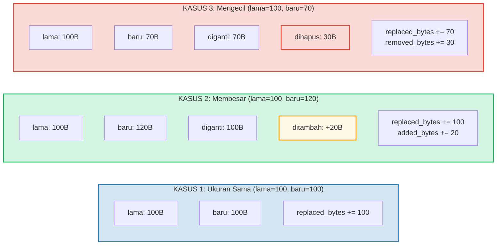

# Pelacakan Biaya

## Struktur OperationCost

Setiap operasi di GroveDB mengakumulasi biaya, diukur dalam sumber daya komputasi:

```rust
// costs/src/lib.rs
pub struct OperationCost {
    pub seek_count: u32,              // Jumlah pencarian penyimpanan
    pub storage_cost: StorageCost,    // Byte yang ditambah/diganti/dihapus
    pub storage_loaded_bytes: u64,    // Byte yang dibaca dari disk
    pub hash_node_calls: u32,         // Jumlah operasi hash Blake3
    pub sinsemilla_hash_calls: u32,   // Jumlah operasi hash Sinsemilla (operasi EC)
}
```

> **Panggilan hash Sinsemilla** melacak operasi hash kurva eliptik untuk anchor
> CommitmentTree. Ini jauh lebih mahal daripada hash node Blake3.

Biaya penyimpanan dirinci lebih lanjut:

```rust
// costs/src/storage_cost/mod.rs
pub struct StorageCost {
    pub added_bytes: u32,                   // Data baru yang ditulis
    pub replaced_bytes: u32,                // Data yang ada yang ditimpa
    pub removed_bytes: StorageRemovedBytes, // Data yang dibebaskan
}
```

## Pola CostContext

Semua operasi mengembalikan hasilnya dibungkus dalam `CostContext`:

```rust
pub struct CostContext<T> {
    pub value: T,               // Hasil operasi
    pub cost: OperationCost,    // Sumber daya yang dikonsumsi
}

pub type CostResult<T, E> = CostContext<Result<T, E>>;
```

Ini menciptakan pola pelacakan biaya **monadik** — biaya mengalir melalui rantai
operasi secara otomatis:

```rust
// Buka hasil, tambahkan biayanya ke akumulator
let result = expensive_operation().unwrap_add_cost(&mut total_cost);

// Rantai operasi, mengakumulasi biaya
let final_result = op1()
    .flat_map(|x| op2(x))      // Biaya dari op1 + op2
    .flat_map(|y| op3(y));      // + biaya dari op3
```

## Makro cost_return_on_error!

Pola paling umum dalam kode GroveDB adalah makro `cost_return_on_error!`,
yang bertindak seperti `?` tapi mempertahankan biaya pada pengembalian awal:

```rust
macro_rules! cost_return_on_error {
    ( &mut $cost:ident, $($body:tt)+ ) => {
        {
            let result_with_cost = { $($body)+ };
            let result = result_with_cost.unwrap_add_cost(&mut $cost);
            match result {
                Ok(x) => x,
                Err(e) => return Err(e).wrap_with_cost($cost),
            }
        }
    };
}
```

Dalam praktik:

```rust
fn insert_element(&self, path: &[&[u8]], key: &[u8], element: Element) -> CostResult<(), Error> {
    let mut cost = OperationCost::default();

    // Setiap pemanggilan makro menambahkan biaya operasi ke `cost`
    // dan mengembalikan nilai Ok (atau pengembalian awal dengan biaya terakumulasi pada Err)
    let merk = cost_return_on_error!(&mut cost, self.open_merk(path));
    cost_return_on_error!(&mut cost, merk.insert(key, element));
    cost_return_on_error!(&mut cost, self.propagate_changes(path));

    Ok(()).wrap_with_cost(cost)
    // `cost` sekarang berisi jumlah biaya ketiga operasi
}
```

## Rincian Biaya Penyimpanan

Ketika sebuah value diperbarui, biaya tergantung pada apakah value baru lebih besar,
lebih kecil, atau berukuran sama:



## Biaya Operasi Hash

Biaya hash diukur dalam "panggilan hash node" — jumlah kompresi blok Blake3:

| Operasi | Ukuran Input | Panggilan Hash |
|-----------|-----------|------------|
| `value_hash(kecil)` | < 64 byte | 1 |
| `value_hash(menengah)` | 64-127 byte | 2 |
| `kv_hash` | key + value_hash | bervariasi |
| `node_hash` | 96 byte (3 × 32) | 2 (selalu) |
| `combine_hash` | 64 byte (2 × 32) | 1 (selalu) |
| `node_hash_with_count` | 104 byte (3 × 32 + 8) | 2 (selalu) |
| Sinsemilla (CommitmentTree) | Operasi EC kurva Pallas | dilacak terpisah via `sinsemilla_hash_calls` |

Rumus umum untuk Blake3:

```text
hash_calls = 1 + (input_bytes - 1) / 64
```

## Estimasi Worst-Case dan Average-Case

GroveDB menyediakan fungsi untuk **mengestimasi** biaya operasi sebelum mengeksekusinya.
Ini krusial untuk kalkulasi biaya blockchain — Anda perlu mengetahui biayanya sebelum
berkomitmen untuk membayarnya.

```rust
// Biaya worst-case untuk membaca node
pub fn add_worst_case_get_merk_node(
    cost: &mut OperationCost,
    not_prefixed_key_len: u32,
    max_element_size: u32,
    node_type: NodeType,
) {
    cost.seek_count += 1;  // Satu pencarian disk
    cost.storage_loaded_bytes +=
        TreeNode::worst_case_encoded_tree_size(
            not_prefixed_key_len, max_element_size, node_type
        ) as u64;
}

// Biaya worst-case propagasi
pub fn add_worst_case_merk_propagate(
    cost: &mut OperationCost,
    input: &WorstCaseLayerInformation,
) {
    let levels = match input {
        MaxElementsNumber(n) => ((*n + 1) as f32).log2().ceil() as u32,
        NumberOfLevels(n) => *n,
    };
    let mut nodes_updated = levels;

    // Rotasi AVL mungkin memperbarui node tambahan
    if levels > 2 {
        nodes_updated += 2;  // Paling banyak 2 node ekstra untuk rotasi
    }

    cost.storage_cost.replaced_bytes += nodes_updated * MERK_BIGGEST_VALUE_SIZE;
    cost.storage_loaded_bytes +=
        nodes_updated as u64 * (MERK_BIGGEST_VALUE_SIZE + MERK_BIGGEST_KEY_SIZE) as u64;
    cost.seek_count += nodes_updated;
    cost.hash_node_calls += nodes_updated * 2;
}
```

Konstanta yang digunakan:

```rust
pub const MERK_BIGGEST_VALUE_SIZE: u32 = u16::MAX as u32;  // 65535
pub const MERK_BIGGEST_KEY_SIZE: u32 = 256;
```

---
